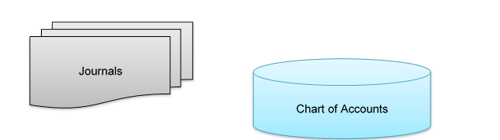

# 一、会计简明指南

计算机开发人员经常被要求创建系统来帮助客户经营他或她的业务。而开发人员拥有工具(如 SQL Server、C#、Visual Studio 等)。)为了生产可靠的应用程序，客户需要了解需要计算机化的业务。

不幸的是，大多数客户不是开发人员。(如果是的话，他们当初为什么会雇佣程序员？)

这两种专业知识的结合往往充满了误解。客户向开发人员解释他或她的需求，开发人员反过来试图将这些需求转化为设计，并最终转化为运行的应用程序。通常，在客户看到完成的程序后，他或她会对他或她希望计算机做什么有一个更清晰的了解，不幸的是，这个了解看起来与开发人员编写的程序完全不同。

这种脱节(客户对其需求的解释与开发中所有其他角色如何看待它们之间的脱节)已经存在很长时间了，如图 1 所示。树木摆动图已经使用了多年，尽管艺术品有所改进，但这一概念直到今天仍然适用:

图 1:树木摆动图，由[单片圆顶研究所](http://www.monolithic.org/)提供

我将在本书中向开发人员介绍他或她可能遇到的一些最常见的业务应用程序。我还将确定一些具有特殊含义的术语，这样，当一个客户解释说维修零件可以是“后进先出”，但新车最好是“特定 id”，而另一个客户希望从“加权平均”转换为“先进先出”时，开发人员就会明白，客户实际上是在谈论库存报告。

在第一章中，我想探讨一些基本的会计概念和定义。虽然让开发人员为注册会计师考试学习不是我的意图或愿望，但我希望允许他们理解客户在讨论诸如借方、贷方和失衡等术语时的含义。

## 基础会计背景

会计从一个简单的概念开始，这个概念对于会计师来说就像 DO WHILE 循环对于程序员一样重要。这个概念是，所有的企业都拥有由两个来源之一提供资金的资产:企业所有者(股权)或公司的债权人(负债)。这个概念的另一个观点是等式:

资产=负债+所有者权益

因此，会计系统提供了一种记录保存方法，允许用户跟踪业务活动并记录每笔交易对上述等式的影响。为了实现这些目标，系统使用两个主要的信息库:会计科目表和日记账。

### 会计科目表

会计科目表是企业中需要系统跟踪的资产、债权票据和所有者权益的明细列表。图表中的每个项目通常都分配有一个帐号和一个描述性名称。此外，每个项目都有一个相关的美元余额。分配的帐号通常指定某种类型的帐户分组。例如，所有资产都可能从第一名开始，而流动资产从 1000 到 1500 不等。例如，如果企业拥有价值 5，000 美元的计算机设置，那么它在会计科目表中的条目可能如下所示:

表 1:会计科目表中的计算机资产

| 账户号码 | 描述 | 类型 | 保持平衡 |
| One thousand seven hundred and fifty | 惠普服务器、路由器和两台工作站计算机 | 资产 | $5,000 |

|  | 注意:为了举例，我们将几个硬件组件组合在一起；然而，在大多数企业中，每个硬件组件在会计科目表中都有自己的条目。 |

如果企业为计算机系统借款(比如 4000 美元)，那么图表中的另一个条目将反映该借款:

表 2:购买电脑贷款

| 账户号码 | 描述 | 类型 | 保持平衡 |
| Two thousand five hundred and fifty | 电脑贷款-惠普服务器和工作站 | 负债 | $4,000 |

业务中的每一项都将以类似的方式在图表中列出。这份账目清单有时被称为总分类账。账户类型字段也很重要，因为我们必须能够确定账户类型，以测试我们的基本等式是否正确。

在上面的例子中，账户类型是图表的一部分。在许多会计系统中，账号定义了账户类型。无论使用哪种方法，我们都可以通过以下构造来测试基本方程:

*   所有资产的总和是否正好等于所有负债的总和+所有所有者权益的总和？

如果等式成立，那么会计账簿是平衡的。资产负债表是一份财务报表，一方面列出资产，另一方面列出负债和权益。两边合计，必须相等。它为企业提供了给定日期企业净值的准确情况(净值是所有资产的总和减去所有负债的总和，恰好等于所有者权益账户的总和)。

### 期刊

日志是已经发生的活动或商业交易的记录。每个日记账分录都会影响分类账中的一个或多个账户——增加或减少该账户的余额。许多会计系统将交易归入专门的日记账，如销售日记账或现金日记账。除了专门的日记账之外，几乎所有的系统都有一个普通日记账，其中记录了不属于任何类别的交易。

用计算机术语来说，会计科目表是一个主文件，而日记账是影响主文件中项目的活动文件。通常，交易在日记账中累计，一段时间后，应用于会计科目表或根据会计科目表过账:

图 2:事务和主机

现在，我们已经简要回顾了系统的两个主要信息源，让我们来看看这两者如何协同工作，以确保关键等式(如下所示)始终保持平衡:

*   资产=负债+权益

## 复式记账

复式记账法是商业交易最常见的记账方法。为了理解这个方法是如何工作的，我们需要引入两个有点难以定义的新术语: ***借方*** 和 ***贷方*** 。

图表中的每个账户都有一个余额，这个余额被认为是借方或贷方。对于资产账户，借方在图表中代表正余额，而贷方代表负余额。如果商业支票账户有 6000 美元，我们会说账户有 6000 美元的借方余额。如果他们开了一张减少余额的支票，那张支票将被记入账户。贷方分录会减少资产账户的余额。

负债账户和权益账户反向运作；贷方被认为是正余额，借方代表负余额。如果一个州的销售税负债是 2，000 美元，我们会说我们在应付销售税中有 2，000 美元的贷方余额。当他们支付销售税时，余额将通过借记该账户而减少。

下图总结了借项和贷项:

表 3:借方/贷方汇总

| 描述 | 借方 | 信用 |
| 现金、存货、电脑、办公用品等资产。 | 提高 | 减少 |
| 诸如电话费、汽车贷款、收取的销售税等负债。 | 减少 | 提高 |
| 所有者出资、普通股等权益。 | 减少 | 提高 |

发生的每笔交易必须至少包含一个借方和一个贷方分录。所有借项和贷项的总额必须相等。只要遵循这条规则，书籍永远不会失去平衡。

### 让我们回顾几个例子

1.  **生意是由业主向商业支票账户中存入 1 万美元开始的。**
2.  **商家购买电脑系统做咨询工作。该系统花费 6000 美元，由 1000 美元的支票和 5000 美元的贷款支付。**
3.  **所有者购买三样必备物品:一份 Visual Studio、Syncfusion 库和一份 Web 开发杂志的订阅。业主用支票付款。**
4.  **第一期 1000 美元在电脑系统上支付。**

为了正确记录上述事件，在会计科目表中输入以下项目:

表 4:会计科目表

| 账户号码 | 描述 | 类型 | 借方 | 信用 |
| --- | --- | --- | --- | --- |
| One thousand | 现金支票账户 | 资产 |  |  |
| One thousand one hundred | 软件 | 资产 |  |  |
| One thousand two hundred | 捐款 | 资产 |  |  |
| One thousand six hundred | 计算机系统 | 资产 |  |  |
| Two thousand | 电脑贷款 | 负债 |  |  |
| Three thousand | 所有者权益 | 股权 |  |  |

此外，下列日志条目被写入普通日志:

表 5:普通日记帐

|  | 账户号码 | 描述 | 借方 | 信用 |
| --- | --- | --- | --- | --- |
| **A** | **1000** | **现金支票账户** | **$1 万** |  |
|  | **3000** | **所有者权益** |  | **$1 万** |
| **B** | **1600** | **计算机系统** | **$6，000** |  |
|  | **1000** | **现金支票账户** |  | **$1，000** |
|  | **2000** | **电脑贷款** |  | **$5，000** |
| **C** | **1100** | **软件** | **$794** |  |
|  | **1200** | **订阅** | **$99** |  |
|  | **1000** | **现金核对** |  | **$893** |
| **D** | **1000** | **现金核对** |  | **$1，000** |
|  | **2000** | **电脑贷款** | **$1，000** |  |

请注意，对于每笔交易，借方和贷方的总额是相等的。否则，交易将被视为失衡，无法应用于主文件。

交易过账后，会计科目表将如下图所示:

表 6:详细会计科目表

| 接受（accept 的缩写） | 描述 | 类型 | 借方 | 信用 |
| --- | --- | --- | --- | --- |
| One thousand | 现金支票账户 | 资产 |  |  |
|  | 期初余额 |  | Zero |  |
| **A** | **业主投资** |  | **$1 万** |  |
| **B** | **电脑系统购买** |  |  | **$1，000** |
| **C** | **软件/订阅购买** |  |  | **$893** |
| **D** | **贷款还款** |  |  | **$1，000** |
|  | 期末余额 |  | $7,107 |  |
| One thousand one hundred | 软件 | 资产 |  |  |
|  | 期初余额 |  | Zero |  |
| **C** | **软件购买** |  | **$794** |  |
|  | 期末余额 |  | $794 |  |
| One thousand two hundred | 捐款 | 资产 |  |  |
|  | 期初余额 |  | Zero |  |
| **C** | **认购购买** |  | **$99** |  |
|  | 期末余额 |  | $99 |  |
| One thousand six hundred | 计算机系统 | 资产 |  |  |
|  | 期初余额 |  | Zero |  |
| **B** | **电脑购买** |  | **$6，000** |  |
|  | 期末余额 |  | $6,000 |  |
| Two thousand | 电脑贷款 | 负债 |  |  |
|  | 期初余额 |  |  | Zero |
| **B** | **电脑购买** |  |  | **$5，000** |
| **D** | **贷款还款** |  | **$1，000** |  |
|  | 期末余额 |  |  | $4,000 |
| Three thousand | 所有者权益 | 股权 |  |  |
|  | 期初余额 |  | Zero | Zero |
| **A** | **业主投资** |  |  | **$1 万** |
|  | 期末余额 |  |  | $10,000 |

为了测试等式是否仍然平衡，将资产账户的所有期末余额相加。现在把负债和权益账户的所有期末余额加起来。

#### 资产:(14 000 美元)

1000—现金(7，107 美元)+1100—软件(794 美元)+1200—杂志(99 美元)+1600—计算机(6，000 美元)

#### 负债+权益(14，000 美元)

2000-计算机贷款(4，000 美元)+3000-所有者权益(10，000 美元)

上述期末余额合计应为 14，000 美元。

会计系统的目标是始终保持主要等式正确。只要遵循复式记账程序(即借方和贷方始终相等)，会计科目表就会保持平衡。这使得企业所有者可以随时看到用于收购企业资产的资金来源。

|  | 注:本章我画了资产、负债等的定义。用大刷子。在大多数会计系统中，账户被进一步分类为流动资产(可能在一年内转为现金的资产)、固定资产(长期属于公司的资产，如汽车、计算机等)。).类似地，负债也可以细分，进一步分类为流动负债(今年到期)或几年内不到期的长期负债(抵押贷款)。等等)。一个好的会计系统提供了将资产分类到任何适合业务的分组的灵活性。 |

现在，让我们快速定义一下我在本章中使用的一些会计术语:

*   **资产**—企业内所有有价值的物品，如现金、车辆、电脑、存货等。
*   **股权**—企业所有者的部分。有多少资产是由公司所有者或股东出资的。
*   **负债**—债权人对企业资产的债权。有多少资产必须用来还债。
*   **会计科目表**—企业中每一项资产、负债和权益科目的明细清单。它用作每个项目当前值的存储库。它有时被称为*总账。*
*   **日记账**—记录业务中各种资产和负债发生的事件的交易文件。
*   **余额**—资产总值等于负债和所有者权益总值的情况。
*   **资产负债表**—列出企业所有资产以及所有债务和企业所有者部分价值的报告。
*   **净值**—从所有资产的总价值中减去所有债务后剩余的价值。
*   **过账**—将每个日记账分录转入会计科目表的过程。
*   **借方**—会计术语，指资产账户价值的增加或负债价值或权益账户价值的减少。
*   **贷方**—会计术语，指资产账户价值的减少或负债或权益账户价值的增加。

## 总结

在本章中，我已经介绍了复式记账的基础知识，并展示了这些信息是如何记录在系统中的。在下一章中，我将详细阐述这些概念，以展示赚钱是如何出现在图表中的，以及记录收入和支出的日记账分录。

|  | 注意:附录包含一些创建表和过程的 SQL 脚本，因此您可以使用 Microsoft SQL Server (2005 或更高版本)尝试会计事务。这些脚本不是为了帮助你设计一个完整的会计系统，而是给你足够的信息让你通过数据库中的表和流来观察交易。如果您需要编写自己的系统，请随意使用这些脚本作为基本的起点。 |