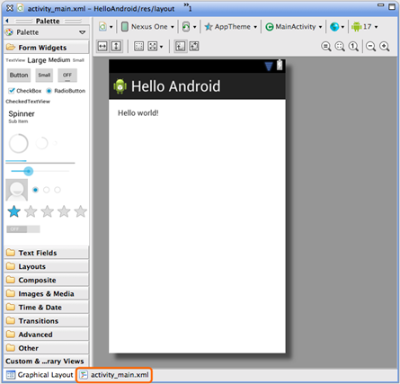
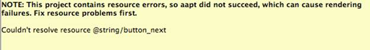
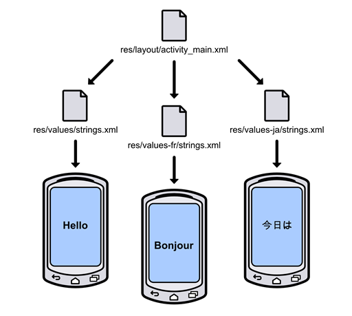
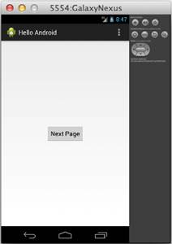
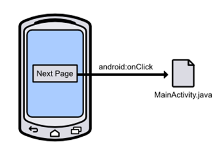
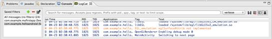
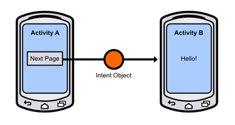
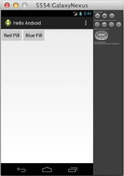
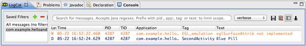
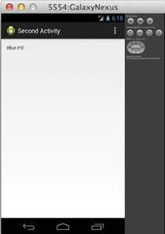

# 第二章你好，安卓

在本章中，我们将发现所有安卓应用程序的基本设计模式。我们将学习如何处理活动，通过编辑 XML 布局文件显示 UI 元素，处理按钮点击，以及使用意图对象在活动之间切换。我们还将了解表示维度和字符串值以实现最大可移植性的最佳实践。

安卓应用程序中的每个屏幕都由[活动](http://developer.android.com/reference/android/app/Activity.html)的自定义子类表示。子类定义了活动的行为，它还负责从 XML 布局文件中加载用户界面。通常，这个 XML 布局文件是定义给定活动的整个接口的地方。要向用户显示文本字段、按钮、图像和其他小部件，您所需要做的就是向布局文件中添加 XML 元素。

[意图](http://developer.android.com/reference/android/content/Intent.html)对象用于在组成应用程序的各种活动之间切换。例如，当用户单击按钮导航到另一个屏幕时，您创建了一个`Intent`对象，并将目标活动传递给它。然后，你“执行”意图告诉安卓切换到下一页。这是构建多屏应用程序的一般模式。

本章通过实际例子解释了所有这些 android 架构组件是如何交互的。您可以跟随您在上一章中创建的空安卓项目，也可以在本书示例代码中包含的 *HelloAndroid* 应用程序中查看完整的代码。

## App 结构概述

让我们先来看看模板项目为我们创建的文件和目录。看起来 Eclipse 的包资源管理器中有很多文件，但是不要不知所措——您只需要担心三个项目:

*   `AndroidManifest.xml`–这个文件声明了安卓操作系统启动它所需要的关于你的应用的一切。这包括组成应用程序的类、应用程序所需的权限、元信息(如应用程序的最低安卓应用编程接口)以及应用程序依赖的库。这必须在项目的根目录中。通常，软件开发工具包会自动为您更新该文件，因此您不必直接编辑它。
*   `src/`–该目录包含您应用程序的所有源文件。这是您所有的 Java 源代码将驻留的地方。
*   `res/`–该文件夹包含应用程序**资源**，这些资源是将向用户显示的图像、视频和字符串。通过从应用程序代码中抽象资源，添加对新屏幕分辨率、方向和语言的支持是微不足道的。

清单和源目录相对简单，但是资源文件夹需要更多的解释。如果你在包浏览器中展开这个文件夹，你会发现三种子目录:`drawable/`、`layout/`和`values/`。`drawable/`文件夹包含应用程序的所有图形，可以是图像文件或定义形状的特殊 XML 文件。`layout/`目录存储应用程序显示的每个屏幕的用户界面，`values/`文件夹包含用户界面使用的字符串列表。

有趣的是连字符后面是什么。文件夹名称的这一部分是一个**限定符**，它告诉系统何时使用包含的资源。例如，当主机设备具有高密度屏幕(~240dpi)时，将显示`drawable-hdpi/`中的图像，而具有低密度屏幕(~120dpi)的设备将使用`drawable-ldpi/`中的图像。

只需将高分辨率图像和低分辨率图像放在适当的文件夹中，这两种类型的设备都可以使用您的应用程序，而无需更改您的代码。同样，您的应用程序可以通过在`values/`子目录后附加`en`、`es`、`fr`、`ar`或任何其他语言代码来移植到其他语言。通过这种方式，`res/`目录使得支持新设备和接触新受众变得非常容易。

## 创建用户界面

安卓应用使用 XML 来定义他们的用户界面。布局文件中的每个 XML 元素代表一个[视图组](http://developer.android.com/reference/android/view/ViewGroup.html)或一个[视图](http://developer.android.com/reference/android/view/View.html)对象。`ViewGroup` s 是其他`View`对象的不可见容器，它们的主要工作是将子视图(或嵌套视图组)排列成令人愉悦的布局。`View`对象是可见的用户界面组件，如文本字段、按钮和表格。要配置视图或视图组的属性，需要编辑相应的 XML 元素的属性。

我们使用的模板项目带有一个名为`activity_main.xml`的默认布局，您应该可以在`res/layout/`目录中找到。双击文件时，默认情况下，ADT 会显示图形用户界面编辑器。虽然您可以使用它来可视化地编辑底层的 XML，但对于本书，我们将直接编辑 XML 标记，以深入了解安卓用户界面是如何工作的。要显示原始的 XML，请单击 Eclipse 编辑区域左下角的 **activity_main.xml** 选项卡，该选项卡以橙色突出显示，如下图所示:



图 9:主布局的原始 XML 标签

单击此选项卡后，您将找到定义当前布局的 XML。它应该如下所示:

```java
    <RelativeLayout xmlns:android="http://schemas.android.com/apk/res/android"
        xmlns:tools="http://schemas.android.com/tools"
        android:layout_width="match_parent"
        android:layout_height="match_parent"
        android:paddingBottom="@dimen/activity_vertical_margin"
        android:paddingLeft="@dimen/activity_horizontal_margin"
        android:paddingRight="@dimen/activity_horizontal_margin"
        android:paddingTop="@dimen/activity_vertical_margin"
        tools:context=".MainActivity" >

        <TextView
            android:layout_width="wrap_content"
            android:layout_height="wrap_content"
            android:text="@string/hello_world" />

    </RelativeLayout>

```

可以看到，这定义了两个元素:`<RelativeLayout>`和`<TextView>`。 [RelativeLayout](http://developer.android.com/reference/android/widget/RelativeLayout.html) 是`ViewGroup`的一个子类，它定义了其子代相对于彼此的位置。[文本视图](http://developer.android.com/reference/android/widget/TextView.html)是`View`的子类，代表标准文本字段组件。我们将调查最常见的用户界面元素，并在本书的后面介绍。

`android`命名空间中的所有属性决定了关联元素的各种属性。例如，`android:layout_width="match_parent"`使`RelativeLayout`伸展到与其父窗口(在本例中，应用程序的主窗口)相同的大小。每种类型元素的可用属性和值在相应类的文档中列出(例如，[视图](http://developer.android.com/reference/android/view/View.html)、[视图组](http://developer.android.com/reference/android/view/ViewGroup.html)、[相对视图](http://developer.android.com/reference/android/widget/RelativeLayout.html)、[文本视图](http://developer.android.com/reference/android/widget/TextView.html))。`android:text`的值是对字符串资源的引用，我们稍后会解释。

## 添加按钮

但首先，我们将简化默认布局一点，并将其更改为单个按钮，以屏幕为中心。将现有的`activity_main.xml`替换为:

```java
    <RelativeLayout xmlns:android="http://schemas.android.com/apk/res/android"
    xmlns:tools="http://schemas.android.com/tools"
    android:layout_width="match_parent"
    android:layout_height="match_parent"
    android:gravity="center"
    tools:context=".MainActivity" >

    <Button
    android:layout_width="wrap_content"
    android:layout_height="wrap_content"
    android:text="@string/button_next" />

    </RelativeLayout>

```

我们在这里做了两件事。首先，我们将`<RelativeLayout>`的填充属性替换为`android:gravity`。这告诉它将所有子视图居中。其次，我们将`<TextView>`元素更改为`<Button>`，并为其`android:text`属性赋予了新的值。

不幸的是，您还不能编译项目来查看按钮。相反，您会在`android:text`属性旁边看到一条错误消息，说明某个资源丢失了，如下图所示:



## 定义字符串资源

在为安卓系统设计布局时，你很少希望将按钮标题、标签和其他文本字段的值硬编码到布局的 XML 文件中。相反，您可以在单独的文件中定义**字符串资源**，并从布局中链接到它。这个额外的抽象层使得使用不同的字符串资源重用相同的布局文件成为可能。例如，在纵向模式和横向模式下，您可以显示较短的指令，或者根据设备的区域设置显示英语、德语、阿拉伯语或中文指令。



图 10:在同一布局中显示不同的字符串资源

每当您想要链接到任何外部资源时，您可以使用以下格式:`@<type>/<identifier>`。例如，`activity_main.xml`中的`android:text="@string/button_text"`属性引用了一个标识符为`button_text`的`string`资源。但是，由于我们还没有创建那个资源，编译器找不到它，所以它给了我们一个错误。我们现在就解决这个问题。

在`**res/values/**`目录中，打开 **strings.xml** 文件。这是定义将向用户显示的字符串的传统位置(文件名实际上是任意的，因为资源完全由包含的 XML 定义)。你会在一个`<resource>`元素中发现一些`<string>`元素。继续添加以下元素:

```java
    <string name="button_next">Next Page</string>

```

`name`属性定义了资源的标识符。Eclipse 应该停止抱怨缺少资源，现在您应该能够成功编译您的项目了。在模拟器中，您应该会看到屏幕中央有一个按钮，标题为*下一页*:



图 11:向用户界面添加按钮

将用户界面字符串从布局构建中分离出来似乎是一个不必要的麻烦，但是一旦您开始使用更复杂的用户界面并希望支持多种语言，您就会真正体会到将所有字符串放在一个地方的便利性。

## 检测按钮输入

因此，我们有一个用户可以与之交互的按钮，当你点击它时，它甚至有标志性的蓝色高亮显示。下一步是检测抽头。这是通过`android:onClick`属性来完成的，该属性告诉系统在点击按钮时调用相关活动的方法。这将布局层与行为层绑定在一起，如下图所示。



图 12:使用 android:onClick 属性检测按钮点击

在`activity_main.xml`中，将`<Button>`元素更改如下。这将把按钮连接到`MainActivity.java`的`nextPage()`方法(我们还需要实现)。

```java
    <Button
    android:layout_width="wrap_content"
    android:layout_height="wrap_content"
    android:text="@string/button_next"
    android:onClick="nextPage" />

```

## 测井输出

为了弄清楚我们的按钮是否工作，让我们在点击按钮时向控制台记录一条消息。我们将使用安卓平台中包含的[日志](http://developer.android.com/reference/android/util/Log.html)类来代替 Java 的常规`System.out.println()`。这是安卓应用程序中向控制台输出消息的首选方式，因为它定义了明确的优先级，可以让您轻松过滤不同类型的消息。最常见的`Log`方法按优先级从高到低排列如下:

*   `Log.e(String tag, String msg)`–记录一条*错误*消息。
*   `Log.w(String tag, String msg)`–记录一条*警告*消息。
*   `Log.i(String tag, String msg)`–记录一条*信息性*消息。
*   `Log.d(String tag, String msg)`–记录一条*调试*消息。

拥有几个级别的消息日志可以根据您的编译目标过滤某些消息。例如，调试消息在运行时从生产应用程序中剥离出来，使它们成为开发期间使用的最佳选择。错误、警告和信息性消息总是被记录下来，即使在生产应用程序中也是如此。

所有这些方法的第一个参数是标识日志消息来源的字符串。您通常希望这是执行日志记录的类的名称，定义该值的传统方法是在类本身中使用私有静态 final 变量。因此，在`MainActivity.java`中，在类定义的开头添加以下一行:

```java
    private static final String TAG = "MainActivity";

```

和其他 Java 类一样，我们需要导入`Log`类才能使用它，所以在`MainActivity.java`的顶部添加以下导入语句(我们也需要`View`类):

```java
    import android.util.Log;
    import android.view.View;

```

然后，实现`nextPage()`方法输出调试消息，如下所示:

```java
    public void nextPage(View view) {
    Log.d(TAG, "Switching to next page");
    }

```

请记住，这是我们在`activity_main.xml`中连接的方法的名称，因此每次用户单击按钮时都应该调用它。任何用作`android:onClick`目标的方法都需要有上面的签名(即必须是`public`，返回`void`，接受单个`View`对象作为参数)。参数是对发起调用的用户界面组件的引用，在本例中是用户按下的按钮。

现在，您应该能够编译您的项目，点击按钮，并在集成开发环境底部的日志面板中看到上面的消息。从 Eclipse 中启动应用程序时，所有日志消息都将显示在这里。要显示日志猫面板，点击**窗口**、**显示视图**、**安卓**，选择**日志猫**。



图 13:Eclipse 中的日志面板

## 创造另一项活动

日志记录是确保 UI 组件正常工作的一种便捷方式，但是您可能希望您的大多数按钮不仅仅是向控制台显示消息。为了扩展我们的示例，我们将在用户按下按钮时切换到另一个活动。

第一步是为第二个活动创建另一个类。在 Eclipse 中，按 **Cmd+N** (如果在 PC 上，则按 Ctrl+N)打开新建文档向导，选择**安卓活动**向当前项目添加新类。选择**空白活动**作为模板。在下一个窗口中，使用**秒活动**作为**活动名称**字段，使用**活动 _ 秒**作为**布局名称**，使用**秒活动**作为**标题**字段。您配置的活动应该如下所示:


图 14:配置新的活动类

单击**完成**将创建`SecondActivity.java`和`activity_second.xml`文件，将它们添加到清单中，并在`res/values/strings.xml`中添加定义活动标题的字符串资源。这是准备使用新活动所需的一切。

## 有目的地联系活动

单个安卓应用程序的用户体验通常由几个不同的活动组成(例如，浏览用户的联系人列表、编辑联系人和查看联系人都是独立的活动，但都是 People 应用程序的一部分)。每个活动都被实现为一个完全独立的组件，即使它们是同一个应用程序的一部分。这使得任何活动都有可能由任何其他活动发起，包括来自其他应用程序的活动。例如，如果您的应用程序需要在用户的联系人列表中添加新联系人，它可以直接跳转到 *People* app 的活动中创建新条目。

为了将所有这些独立的活动粘合到一个连贯的应用程序中，安卓提供了一个[意图](http://developer.android.com/reference/android/content/Intent.html)类，它代表了要执行的任意动作。一般模式是创建一个`Intent`对象，指定目标类，并传入目标类执行动作所需的任何数据。下图显示了意图对象如何链接两个活动。



图 15:使用意图对象从一个活动切换到另一个活动

活动之间的这种松散耦合使得非常模块化的应用程序架构具有灵活的代码重用机会。

在我们的示例中，我们希望在`MainActivity`类中创建一个意图，并将`SecondActivity`用作目的地。我们将担心本章末尾的数据传递部分。首先，将`Intent`类导入`MainActivity.java`:

```java
    import android.content.Intent;

```

然后，将`nextPage()`方法改为如下:

```java
    public void nextPage(View view) {
    Intent intent = new Intent(this, SecondActivity.class);
    startActivity(intent);
    }

```

创建意图后，我们可以将其传递给内置的`startActivity()`函数来执行。当您在第一个活动中单击“下一页”按钮时，结果应该是过渡到第二个活动。现在，第二个活动只是一个静态文本字段，上面写着“你好，世界！”，但我们将在下一节对此进行更改。

## 另一个按钮

在这一部分中，我们将向主活动添加另一个按钮，然后将所选按钮传递给第二个活动进行显示。将`activity_main.xml`更改为以下内容:

```java
    <LinearLayout xmlns:android="http://schemas.android.com/apk/res/android"
    xmlns:tools="http://schemas.android.com/tools"
    android:layout_width="match_parent"
    android:layout_height="match_parent"
    android:orientation="horizontal"
    tools:context=".MainActivity" >

    <Button
    android:layout_width="wrap_content"
    android:layout_height="wrap_content"
    android:text="@string/button_red"
    android:onClick="nextPage" />

    <Button
    android:layout_width="wrap_content"
    android:layout_height="wrap_content"
    android:text="@string/button_blue"
    android:onClick="nextPage" />

    </LinearLayout>

```

请注意，当用户点击这两个按钮时，它们将调用相同的`nextPage()`方法。这需要两个新的字符串资源:`button_red`和`button_blue`。在`strings.xml`中，继续添加这些资源:

```java
    <string name="button_red">Red Pill</string>
    <string name="button_blue">Blue Pill</string>

```

您可以删除`button_next`元素，因为我们将不再使用它。在我们开始用`Intent`对象传递数据之前，让我们确保使用一个简单的`Log`消息就能知道哪个按钮被按下了。在`MainActivity.java`中，将`nextPage()`方法更改如下:

```java
    public void nextPage(View view) {
    Intent intent = new Intent(this, SecondActivity.class);
    Button button = (Button)view;
    String message = button.getText().toString();
    Log.d(TAG, message);
    startActivity(intent);
    }

```

所有这些都是通过`getText()`方法获取按钮的标题，并通过`Log.d()`调用显示它。您还需要导入文件顶部的`Button`类:

```java
    import android.widget.Button;

```

现在，当您编译应用程序时，您应该会在左上角看到两个按钮。



图 16:向主活动添加另一个按钮

当您点击其中一个按钮时，您应该会在 LogCat 面板中看到相应的标题。

## 有目的地传递数据

接下来，我们将使用现有的`Intent`对象将这些信息传递给下一个活动。您可以通过调用其`putExtra()`方法将数据存储在`Intent`实例中，该方法接受两个参数:名称和字符串。你可以认为这是在`Intent`对象上创建一个键值对。例如:

```java
    public void nextPage(View view) {
    Intent intent = new Intent(this, SecondActivity.class);
    Button button = (Button)view;
    String message = button.getText().toString();
    intent.putExtra(EXTRA_MESSAGE, message);
    startActivity(intent);
    }

```

`intent.putExtra(*EXTRA_MESSAGE*`，消息)；line 将按钮的标题添加到`Intent`对象中，稍后我们可以通过`EXTRA_MESSAGE`常量检索该对象。我们仍然需要定义这个常数，所以一定要在`MainActivity`类的顶部包含以下内容:

```java
    public static final String EXTRA_MESSAGE = "com.example.helloandroid.MESSAGE";

```

我们现在已经成功地对一些数据进行了编码，以便从主活动发送到第二个活动。接下来，我们需要允许第二个活动接收这些信息。这需要两个步骤:

1.  获取发送到第二个活动的意图实例。
2.  使用 EXTRA_MESSAGE 键返回相关值。

要做到这两点，请在`SecondActivity.java`中添加以下方法:

```java
    @Override
    protected void onCreate(Bundle savedInstanceState) {
    super.onCreate(savedInstanceState);
    setContentView(R.layout.activity_second);

    Intent intent = getIntent();
    String message = intent.getStringExtra(MainActivity.EXTRA_MESSAGE);
    Log.d(TAG, message);
    }

```

`onCreate()`方法是由`Activity`类定义的特殊方法。每当`Activity`启动时，安卓框架都会调用`onCreate()`，通过在子类中覆盖它，我们可以添加自定义的初始化行为。现在，你可以把它看作是一个`Activity`实例的构造方法，但是我们将在下一章中稍微完善这个概念。

最后三行取我们从`MainActivity.java`发送的`Intent`数据，用`Log.d()`显示。`getIntent()`方法是由`Activity`类定义的另一种方法，它只返回启动活动的`Intent`实例。然后，我们使用[意图](http://developer.android.com/reference/android/content/Intent.html)类的`getStringExtra()`方法来找到与`MainActivity.EXTRA_MESSAGE`键相关联的值。请注意，在`MainActivity.java`中将键定义为常数是最佳实践，因为它可以让编译器确保键键入正确。其他数据类型也有类似的方法(例如，`getFloatExtra()`返回一个`float`值)。

上述方法仍然需要访问`Intent`和`Log`类，因此在`SecondActivity.java`的顶部添加以下行:

```java
    import android.content.Intent;
    import android.util.Log;

```

我们还需要在`SecondActivity.java`中定义另一个`TAG`变量:

```java
    private static final String TAG = "MainActivity";

```

现在，您应该能够编译该项目了。单击任一按钮，并让`SecondActivity`记录所选的按钮标题:



图 17:记录所选按钮的标题

为了完整起见，让我们让`SecondActivity`中的文本字段显示值，而不仅仅是在 LogCat 中显示。首先，在`activity_second.xml`中给`TextView`添加一个`id`属性:

```java
    <TextView
    android:id="@+id/selected_title"
    android:layout_width="wrap_content"
    android:layout_height="wrap_content"
    android:text="@string/hello_world" />

```

当您想要从应用程序的其他地方访问用户界面元素时，`id`属性是必需的。`@+id`中的加号只有在*首先*定义用户界面元素时才有必要(如果你想从另一个用户界面文件中引用它，你就不需要它)。`selected_title`部分定义了元素的唯一标识，可以如下使用(在`SecondActivity.java`中定义):

```java
    protected void onCreate(Bundle savedInstanceState) {
    super.onCreate(savedInstanceState);
    setContentView(R.layout.activity_second);

    Intent intent = getIntent();
    String message = intent.getStringExtra(MainActivity.EXTRA_MESSAGE);
    TextView textField = (TextView)findViewById(R.id.selected_title);
    textField.setText(message);
    }

```

全局`findViewById()`方法由`Activity`类定义，它返回一个具有所提供的标识的`View`实例。请注意，我们必须将返回值转换为`TextView`，这样我们就可以使用`setText()`方法来显示所选按钮。`R.id.selected_title`片段是引用在 XML 文件中定义的用户界面组件的常规方式。当您编译您的项目时，`R`类会自动生成，并且框架会用每个元素的常量和`android:id`属性填充它。这种使用静态常量来引用用户界面元素的方法消除了引用未定义元素的可能性(例如，来自布局文件中拼写错误或省略的标识)。

请注意，您必须导入上述`onCreate()`方法的`TextView`类来编译:

```java
    import android.widget.TextView;

```

安卓初学者一个常见的错误就是在调用`setContentView()`之前先调用`findViewById()`。后者必须先叫*，否则`findViewById()`会退回`null`。*

 *第二个视图现在应该显示“红色药丸”或“蓝色药丸”，这取决于您在主活动页面中点击的按钮。要在按钮之间切换，请使用设备上的“后退”按钮返回主页面，并选择要测试的按钮。如下图所示，选择蓝色药丸按钮将显示其文本。



图 18:在第二个活动中显示选定的按钮标题

## 总结

在本章中，我们学习了安卓应用程序的基本结构，如何使用 XML 文件创建用户界面，定义媒体资源，处理用户输入，以及使用`Intent`对象在活动之间切换。通过简单看一下`Log`课，我们也学到了一些实用的调试技巧。

这几乎是开发基本安卓应用程序所需要知道的一切。下一章将更详细地解释`Activity`的生命周期，这对正确管理应用程序的内存占用非常重要。本书的其余部分探索了使应用程序更具交互性、数据驱动和用户友好性的中间功能。*