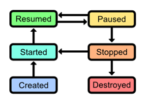

# 三、活动生命周期

一旦你了解了安卓应用的基本结构，下一步就是理解构建和销毁`Activity`对象背后的复杂性。我们已经看到了如何使用`onCreate()`来初始化`Activity`，但这只是管理活动生命周期的一个方面。在本章中，我们将学习如何通过正确实施活动的生命周期来最大限度地减少中央处理器、内存和电池的使用，处理电话中断，保存用户状态，以及在横向和纵向之间切换。这是安卓应用程序开发的一个非常重要的方面，因为不这样做将导致你的应用程序经常崩溃(这是一个非常糟糕的用户体验)。下图显示了应用程序的活动生命周期。



图 19:活动生命周期

活动生命周期由以下六种状态组成:

*   **已创建**:活动已创建，准备显示。
*   **开始**:活动可见，但用户还不能与之交互。该状态之后通常是立即恢复的*状态。*
*   **恢复**:活动在前台运行，用户可以与之交互。
*   **暂停**:活动被电话或对话消息(例如，低电量警报)中断。这往往会导致立即进入*停止*状态。该活动通常在暂停时仍然可见，但被对话框遮挡，因此用户无法与之交互。
*   **停止**:活动已经移到后台，不再可见，但实例仍然存在于内存中。活动可以从此状态重新启动，而无需重新创建。
*   **销毁**:活动已经被系统释放，不再存在。当安卓操作系统认为有必要时，这将自动发生。

当一个活动被创建时，它通过前三个状态，当它被销毁时，它通过后半个状态。然而，这很少以严格的线性方式发生。典型的应用程序会在*启动的*、*恢复的*、*暂停的*和*停止的*状态之间切换，因为用户与应用程序中的其他活动交互，并被重要的警报打断。

为了管理这些状态之间的转换，`Activity`类提供了几种方法。要定义自定义的启动和拆卸行为，您所要做的就是在`Activity`子类中覆盖这些方法。下面列出了所有的`Activity`转换方法，以及应该何时使用它们的常见示例:

*   `onCreate()`–当活动进入*创建的*状态时调用。正如我们在上一章中看到的，这是您想要初始化用户界面元素并准备使用活动的地方。
*   `onStart()`-当活动进入*开始*状态时调用。这是一个加载需要向用户显示的数据的好地方，尽管这也可以在`onResume()`中完成，这取决于数据的类型和您如何使用它。
*   `onResume()`-当活动进入*恢复*状态时调用。这是初始化传感器输入(例如，全球定位系统、相机)和开始用户界面所需的任何动画的最佳位置。
*   `onPause()`-当活动进入*暂停*状态时调用。在这种情况下，您应该停止使用稀缺的系统资源(例如动画、全球定位系统、相机)，以最大限度地延长设备的电池寿命并减少应用程序的内存占用。这是`onResume()`方法的拆卸对应物。
*   `onStop()`–当活动进入*停止*状态时调用。这是在应用程序进入后台之前调用的，所以这是保存需要以后重用的用户数据的好地方(例如，电子邮件草稿)。请注意`onPause()`也可以是这样做的合适时间，因为它总是紧接在`onStop()`之前。您是想使用`onPause()`还是`onStop()`很大程度上取决于您的具体应用需求。`onStop()`是`onStart()`方法的拆卸对应物。
*   `onDestroy()`-当活动进入*破坏*状态时调用。这是最后一次清理资源的机会，否则当您的应用程序被销毁时，这些资源就会泄漏。这是`onCreate()`方法的拆卸对应物；然而，当活动被破坏时，系统会自动释放类引用，所以你通常不需要实现`onDestroy()`，除非你启动了一个后台线程或者在`onCreate()`中创建了一个内存缓冲区。

如你所见，上述过渡方法之间是对称的。在`onStart()`发生的任何事情都应该在`onStop()`撤销，在`onResume()`发生的任何事情都应该在`onPause()`撤销。

当覆盖以上任何一个方法时，记住你*必须*调用超类的版本才能让你的应用程序正常工作。

## 常见活动过渡事件

如果您对所有这些转换感到有些困惑，从用户的角度来讨论它们可能会有所帮助。在这一节中，我们包括了一些最常见的事件，这些事件会触发下面的活动状态转换。同样，所有这些在应用程序的正常使用中经常发生，因此确保相应的转换方法高效地消耗和释放系统资源是非常必要的。

### 按下电源按钮

当用户按下设备电源按钮将其置于待机状态时，当前活动将被移至后台(即*暂停*，然后*停止*)。如你所料，当他们退出待机状态时，会出现相反的过程:当前活动将*启动*，然后*恢复*。

如果你想一想，在一次活动中，你在自己的安卓设备上进入待机状态的次数，你会很快明白正确管理`onPause()`、`onStop()`、`onStart()`和`onResume()`方法有多重要。例如，如果您在设备进入待机状态后让加速计传感器保持运行，当用户重新打开手机时，会发现电池电量意外不足。

### 旋转装置

安卓系统处理设备方向变化的方式可能有些违反直觉，尤其是对新开发人员来说。当屏幕旋转时，前景活动实际上被破坏并从头开始重新创建。这是因为有些布局需要为纵向和横向模式加载不同的资源，使用相同的实例可能会造成浪费。

### 点击后退按钮

当用户点击后退按钮时，操作系统将其解释为不再需要当前活动，因此它会将其销毁，而不仅仅是将其发送到后台。这意味着，如果用户导航回被破坏的活动，它将从头开始创建。如果您试图记录用户在被破坏的活动中的进度，这意味着您需要将该信息存储在活动的之外的*中，并将其重新加载到`onCreate()`、`onStart()`或`onResume()`中。如果您试图将任何数据存储为实例变量，当活动被销毁时，这些数据将会丢失。*

## 重现毁灭活动

当用户点击后退按钮或手动终止时被破坏的活动将永远消失；但是，当一个活动由于系统限制而被破坏时，情况就不是这样了。例如，如果一个活动因为安卓操作系统需要内存而即将被销毁，它首先将`Activity`的**实例状态**存档在 [Bundle](http://developer.android.com/reference/android/os/Bundle.html) 对象中，将其保存到磁盘，并将`Bundle`与`Activity`子类相关联。

这个`Bundle`对象可以用来创建一个新的`Activity`对象，其状态与被破坏的对象相同。本质上，这使得最初的`Activity`实例似乎总是处于*停止的*状态，没有消耗任何资源。

### 恢复实例状态

如果一个`Activity`有一个关联的`Bundle`，它会被传递到它的`onCreate()`方法。例如，如果您正在开发一个电子邮件客户端，并将电子邮件正文存储在名为`message`的实例变量中，您的`onCreate()`方法可能如下所示:

```java
    @Override
    protected void onCreate(Bundle savedInstanceState) {
    super.onCreate(savedInstanceState); setContentView(R.layout.activity_main);

    if(savedInstanceState != null) {
    // Restore the archived instance state
    this.message = savedInstanceState.getString(STATE_MESSAGE);
    } else {
    // Initialize with default values
    this.message = "Hello, World!";
    }
    }

```

这还需要在类的顶部有以下两行:

```java
    private static final String STATE_MESSAGE = "MainActivityMessageState";
    public String message;

```

`STATE_MESSAGE`是一个常数，定义了在包中存档`message`实例变量时要使用的键。这类似于在`Intent`对象中存储信息的键值模式。

### 保存实例状态

要存档自定义实例变量，您所需要做的就是覆盖由`Activity`定义的`onSaveInstanceState()`方法。例如，要保存上面的消息状态，您可以使用类似如下的内容:

```java
    @Override
    public void onSaveInstanceState(Bundle savedInstanceState) {
    savedInstanceState.putString(STATE_MESSAGE, this.message);
    super.onSaveInstanceState(savedInstanceState);
    }

```

与`Activity`状态转换方法一样，在重写时调用`onSaveInstanceState()`的超类版本很重要。

### 观州

安卓框架会自动保存整个视图层次结构的状态，这意味着每个文本字段、按钮和图像看起来都会和被系统破坏之前完全一样。对于许多活动来说，这是唯一真正需要保存的状态——您实际上需要实现自定义`onSaveInstanceState()`的少数情况之一是`Activity`有多个步骤，并且用户的进度记录在实例变量中。

## 示例项目

本书资源包中的`ActivityLifecycle-transitions`项目是一个简单的应用程序，演示了上面讨论的所有转换方法。它有两个你可以切换的活动，两个都用`Log.d()`通知你状态何时改变。当您在模拟器中运行项目并单击按钮时，您应该会在 LogCat 中看到以下消息:

```java
    05-23 12:27:41.178: D/MainActivity(4042): Created Main Activity
    05-23 12:27:41.178: D/MainActivity(4042): Started Main Activity
    05-23 12:27:41.178: D/MainActivity(4042): Resumed Main Activity
    // Click the "Next Activity" button
    05-23 12:27:44.788: D/MainActivity(4042): Paused Main Activity
    05-23 12:27:45.018: D/SecondActivity(4042): Created Second Activity
    05-23 12:27:45.018: D/SecondActivity(4042): Started Second Activity
    05-23 12:27:45.018: D/SecondActivity(4042): Resumed Second Activity
    05-23 12:27:45.728: D/MainActivity(4042): Stopped Main Activity

```

还要注意，如果您按模拟器上的电源按钮(模拟实际设备上的物理电源按钮)，您将看到当前活动暂停，然后停止。当您按下模拟器的后退按钮时，您还可以看到当前活动被破坏。

当然，你通常想要做的不仅仅是在`onCreate()`、`onStart()`和其他活动转换方法中记录一条消息，但是这个项目确实给了你一个方便的地方来开始试验一个`Activity`的各种状态。在我们学习如何创建动画和保存用户数据之后，我们将在本书的后面看到这些方法的一些更实用的版本。

## 总结

在本章中，我们介绍了一个`Activity`对象的生命周期。当用户导航一个应用程序时，每个`Activity`对象都经过一个*创建的*、*启动的*、*恢复的*、*暂停的*、*停止的*、*破坏的*状态，在被破坏之前经常在中间四个状态之间循环几次。由于这些状态转换发生得如此频繁，并且移动设备具有如此稀缺的系统资源，因此在这些状态之间正确转换是获得令人满意的用户体验的重要组成部分。

本章更侧重于`Activity`生命周期的概念方面，因为像`onResume()`这样的转换方法的具体实现是特定于应用程序的。这一章你应该带走的是对安卓框架如何管理其`Activity`对象的高级理解。一旦您理解了这一点，就很容易使这些概念适应您的实际应用需求。

在接下来的两章中，我们将稍微转移一下话题，重点讨论安卓应用程序的前端配置。首先，我们将学习如何将用户界面元素排列成用户友好的布局，然后在下一章中，我们将探索按钮、文本字段、微调器和其他常见输入控件的应用编程接口。