# 第四章用户界面布局

在每个`Activity`中布局 UI 元素是安卓应用开发最重要的方面之一。它定义了应用程序的外观，如何收集和向用户显示信息，以及用户如何在组成应用程序的各种活动之间导航。

*Android 编程中的第一章简洁地*提供了 XML 布局的简要介绍，但是这一章将更深入地研究 Android 的内置布局选项。在这一章中，我们将学习如何以线性、相对和网格布局来排列 UI 元素，这是 Android 维护人员推荐的常见导航模式，我们甚至会简单了解如何开发能够无缝伸缩到不同维度的设备无关布局。

这一章将与下一章齐头并进，在这一章中，我们将了解所有单独的用户界面元素。本章的运行示例使用按钮和文本字段来演示不同的布局功能，但是请记住，您可以用下一章中讨论的任何用户界面元素来替代相同的效果。

## 加载安卓项目

您可以从一个新的安卓项目中继续本章的示例，但是如果您想看到最终结果，您可以加载包含在本书示例代码中的用户界面用户界面项目。要打开一个现有的项目，启动 **Eclipse** (带有 ADT 插件)，并在**文件**菜单中选择**导入**。这将打开一个如下图所示的对话框:

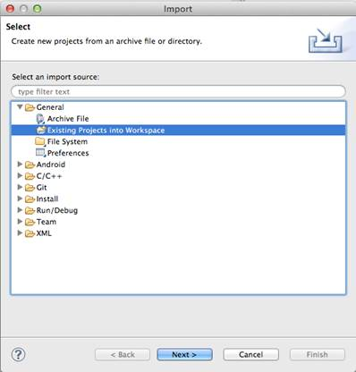

图 20:在 Eclipse 中打开一个项目

打开**常规**文件夹，选择**现有项目进入工作区**，然后点击**下一步。**在下一个对话框中，点击**浏览...**，找到这本书附带的资源文件夹，打开 **UserInterfaceLayouts** 文件夹。单击**完成**后，您应该会在包浏览器中看到该项目。

## 装载布局

在第一章中，我们让模板为我们加载 XML 布局文件，但是了解这是如何工作的很重要。幸运的是，这也是一个相对简单的过程。

当你编译一个项目时，安卓会自动从你的每个 XML 布局文件中生成一个`View`实例。像`String`资源一样，这些资源通过静态`layout`变量下的特殊`R`类来访问。例如，如果您想要访问从名为`activity_main.xml`的文件创建的`View`实例，您可以使用以下内容:

```java
    R.layout.activity_main

```

要在`Activity`中显示这个`View`对象，你所要做的就是调用`setContentView()`方法。空白`Activity`模板的`onCreate()`方法总是包含对`setContentView()`的调用，以将关联视图加载到`Activity`中:

```java
    @Override
    protected void onCreate(Bundle savedInstanceState) {
    super.onCreate(savedInstanceState);
    setContentView(R.layout.activity_main);
    }

```

请注意，您可以将*任何* `View`实例传递给`setContentView()`；使用生成的`R.layout.activity_main`对象只是使用基于 XML 的布局的一个有用的约定。如果你需要动态替换`Activity`的内容，在`onCreate()`之外调用`setContentView()`是完全合法的。

## 基本视图属性

在我们开始讨论安卓的内置布局方案之前，了解如何在特定布局中设置用户界面元素的大小和位置非常重要。接下来的三个部分将向您展示如何使用各种 XML 属性定义用户界面元素的维度、填充和边距。

### 大小

要设置特定用户界面元素的宽度，您只需要在 XML 布局文件中为该元素添加一个`android:layout_width`属性。同样，`android:layout_height`属性定义了元素的高度。这些参数的值必须是下列值之一:

*   `wrap_content`–这个常数使元素尽可能大，以包含其内容。
*   `match_parent`–该常量使元素与父元素的宽度和高度相匹配。
*   显式尺寸–显式尺寸可以用像素(`px`)、与密度无关的像素(`dp`)、基于首选字体大小的缩放像素(`sp`)、英寸(`in`)或毫米(`mm`)来度量。例如，`android:layout_width="120dp"`将使元件 120 与设备无关的像素宽。
*   对资源的引用——维度资源允许您将可重用的值抽象到资源文件中，就像我们在本书第一章中看到的`strings.xml`一样。可以使用`@dimen/resource_id`语法访问维度资源，其中`resource_id`是在`dimens.xml`中定义的资源的唯一标识。

让我们从探索`wrap_content`开始。将`activity_main.xml`更改为以下内容并编译项目(我们将在本章后面讨论`LinearLayout`元素):

```java
    <LinearLayout xmlns:android="http://schemas.android.com/apk/res/android"
    xmlns:tools="http://schemas.android.com/tools"
    android:layout_width="match_parent"
    android:layout_height="match_parent"
    android:orientation="vertical"
    tools:context=".MainActivity"
    >

    <Button
    android:layout_width="wrap_content"
    android:layout_height="wrap_content"
    android:text="Click me!" />

    </LinearLayout>

```

您应该会在屏幕顶部看到一个按钮，由于我们对两个维度都使用了`wrap_content`，所以它应该足够大以适合“`Click me!”`文本(带有一些默认填充)。如果您更改文本，按钮将展开或收缩以匹配。下图显示了您在 activity_main.xml 中创建的按钮。

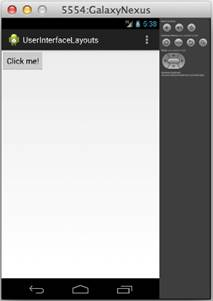

图 21:两个维度都使用 wrap_content 常量的按钮元素

如果您将`android:layout_width`和`android:layout_height`更改为`match_parent`，按钮将充满整个屏幕，因为这就是父级`LinearLayout`的大小:

```java
    <Button
    android:layout_width="match_parent"
    android:layout_height="match_parent"
    android:text="Click me!" />

```

当您运行此程序时，它应该如下所示:


图 22:两个维度都使用 match_parent 常量的 Button 元素

如果您需要对 UI 元素的大小进行更多控制，您可以始终使用显式值手动定义它们的宽度和高度，如下所示:

```java
    <Button
    android:layout_width="200dp"
    android:layout_height="60dp"
    android:text="Click me!" />

```

这使得按钮宽 200 个设备无关像素，高 60 个设备无关像素，如下图所示:

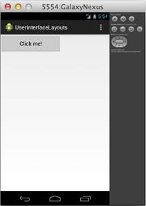

图 23:具有明确宽度和高度的按钮元素

最后一个选项是向`dimens.xml`添加一个显式尺寸，并从`activity_main.xml`引用该尺寸。如果您有许多元素需要共享同一个维度，这非常有用。维度资源引用看起来就像字符串资源引用，除了使用`@dimen`而不是`@string`:

```java
    <Button
    android:layout_width="@dimen/button_width"
    android:layout_height="@dimen/button_height"
    android:text="Click me!" />

```

当然，在编译项目之前，您还必须将这些资源添加到`dimens.xml`中:

```java
    <resources>

    <!-- Default screen margins, per the Android Design guidelines. -->
    <dimen name="activity_horizontal_margin">16dp</dimen>
    <dimen name="activity_vertical_margin">16dp</dimen>
    <dimen name="button_width">200dp</dimen>
    <dimen name="button_height">60dp</dimen>

    </resources>

```

这将具有与前面片段完全相同的效果，但是现在可以在其他布局中重用`button_width`和`button_height`值(或者用于同一布局中的其他元素)。

还值得注意的是，您可以混合匹配不同的宽度和高度值方法。比如宽度用`200dp`，高度用`wrap_content`，完全合法。

### 填充

填充是元素内容与其边框之间的空间。它可以通过以下任何属性来定义，所有这些属性都采用显式维度(例如`120dp`)或对资源的引用(例如`@dimen/button_padding`):

*   `android:padding`–为元素的所有边设置统一的值。
*   `android:paddingTop`–设置元素上边缘的填充。
*   `android:paddingBottom`–设置元素底边的填充。
*   `android:paddingLeft`–设置元素左边缘的填充。
*   `android:paddingRight`–设置元素右边缘的填充。
*   `android:paddingStart`–设置元素开始边缘的填充。
*   `android:paddingEnd`–设置元素结束边缘的填充。

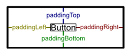

图 24:填充属性

可以在`View`或`ViewGroup`元素中添加填充。对于前者，它定义了元素内容(例如，按钮的标题文本)与其边框之间的空间，对于后者，它定义了组的边缘与其所有子元素之间的空间。例如，以下按钮的标题文本周围将有 60 个独立于设备的像素:

```java
    <Button
    android:layout_width="wrap_content"
    android:layout_height="wrap_content"
    android:padding="60dp"
    android:text="Click me!" />

```

这将导致以下结果:

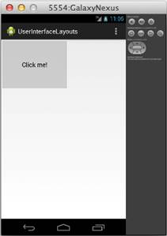

图 25:带有 60dp 填充的按钮

接下来，让我们尝试在包含`ViewGroup`(即`LinearLayout`元素)的顶部和底部添加一些填充，并使按钮与其父元素的大小相匹配，如下所示:

```java
    <LinearLayout xmlns:android="http://schemas.android.com/apk/res/android"
    xmlns:tools="http://schemas.android.com/tools"
    android:layout_width="match_parent"
    android:layout_height="match_parent"
    android:orientation="vertical"
    android:paddingTop="24dp"
    android:paddingBottom="24dp"
    tools:context=".MainActivity"
    >

    <Button
    android:layout_width="match_parent"
    android:layout_height="match_parent"
    android:text="Click me!" />

    </LinearLayout>

```

这表明在子元素上使用`match_parent`考虑了父元素的填充。请注意以下截图顶部和底部的`24dp`填充:


图 26:一个按钮，其宽度和高度为 match_parent，在其父视图组中有 24dp 的顶部和底部填充

### 保证金

元素的边距是其边框与周围元素或父元素边缘之间的空间。可以使用`android:layout_margin`元素为任何`View`或`ViewGroup`指定。像`android:padding`一样，可以使用`android:layout_marginTop`、`android:layout_marginBottom`等单独定义顶部、底部、左侧、右侧、开始和结束边距。

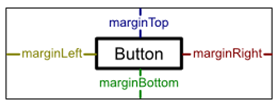

图 27:边距属性

例如，下面的代码通过在`Button`上定义顶部和底部边距，而不是在父级`LinearLayout`上定义顶部和底部填充，创建了与上一节中的示例相同的结果:

```java
    <LinearLayout xmlns:android="http://schemas.android.com/apk/res/android"
    xmlns:tools="http://schemas.android.com/tools"
    android:layout_width="match_parent"
    android:layout_height="match_parent"
    android:orientation="vertical"
    tools:context=".MainActivity"
    >

    <Button
    android:layout_width="match_parent"
    android:layout_height="match_parent"
    android:layout_marginTop="24dp"
    android:layout_marginBottom="24dp"
    android:text="Click me!" />

    </LinearLayout>

```

## 通用布局

安卓提供了三种主要的排列 UI 元素的方式:线性布局、相对布局和网格布局。前两种方法分别使用名为`LinearLayout`和`RelativeLayout`的类。这些是`ViewGroup`的子类，具有设置其子`View`对象的位置和大小的内置功能。网格布局使向用户显示一维和二维数据结构变得容易，并且它们比线性或相对布局稍微复杂一些。下图显示了可用的布局元素:

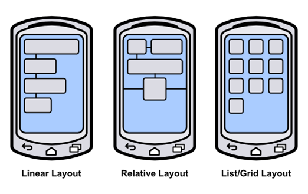

图 28:三种标准的安卓布局

### 线性布局

`LinearLayout`类水平或垂直排列所有包含的用户界面元素。它以在 XML 文件中出现的相同顺序显示每个元素，这使得创建由许多元素组成的复杂布局变得非常简单。

#### 方位

一个`LinearLayout`元素需要知道它应该向哪个方向布局它的子元素。这是通过`android:orientation`属性指定的，该属性的值可以是`horizontal`或`vertical`。水平布局将使每个子元素从左到右堆叠(与它们在源 XML 中出现的顺序相同)。例如，尝试将`activity_main.xml`更改为以下内容:

```java
    <LinearLayout xmlns:android="http://schemas.android.com/apk/res/android"
    xmlns:tools="http://schemas.android.com/tools"
    android:layout_width="match_parent"
    android:layout_height="match_parent"
    android:orientation="horizontal"
    tools:context=".MainActivity"
    >

    <Button
    android:layout_width="wrap_content"
    android:layout_height="wrap_content"
    android:text="Click me!" />
    <Button
    android:layout_width="wrap_content"
    android:layout_height="wrap_content"
    android:text="Click me!" />
    <Button
    android:layout_width="wrap_content"
    android:layout_height="wrap_content"
    android:text="Click me!" />

    </LinearLayout>

```

如果您编译项目并在模拟器中运行它，您应该会看到一行三个按钮，如下所示:

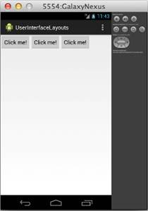

图 29:水平方向的线性布局

但是如果你把方位改成`vertical`，就像这样:

```java
    <LinearLayout xmlns:android="http://schemas.android.com/apk/res/android"
    xmlns:tools="http://schemas.android.com/tools"
    android:layout_width="match_parent"
    android:layout_height="match_parent"
    android:orientation="vertical"
    tools:context=".MainActivity"
    >
    ...
    </LinearLayout>

```

三个按钮将出现在一列中:

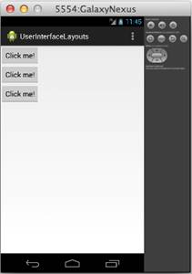

图 30:垂直方向的线性布局

#### 重量

您可以使用本章前面讨论的相同的`android:layout_width`和`android:layout_height`属性来定义每个子元素的大小，但是`LinearLayout`也启用了另一个称为`android:layout_weight`的大小选项。一个元素的权重决定了它相对于它的兄弟元素占据的空间。例如，如果您希望三个按钮均匀分布在父级`LinearLayout`的高度上，您可以使用以下选项:

```java
    <LinearLayout xmlns:android="http://schemas.android.com/apk/res/android"
    xmlns:tools="http://schemas.android.com/tools"
    android:layout_width="match_parent"
    android:layout_height="match_parent"
    android:orientation="vertical"
    tools:context=".MainActivity"
    >

    <Button
    android:layout_width="match_parent"
    android:layout_height="0dp"
    android:layout_weight="1"
    android:text="Click me!" />
    <Button
    android:layout_width="match_parent"
    android:layout_height="0dp"
    android:layout_weight="1"
    android:text="Click me!" />
    <Button
    android:layout_width="match_parent"
    android:layout_height="0dp"
    android:layout_weight="1"
    android:text="Click me!" />

    </LinearLayout>

```

请注意，对于垂直方向，您需要将每个元素的`android:layout_height`属性设置为`0`，以便使用指定的权重自动计算。对于水平方向，您需要将它们的`android:layout_width`设置为`0`。运行上面的代码应该会得到以下结果:

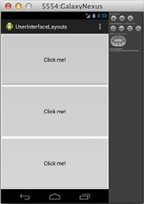

图 31:垂直线性布局中均匀加权的用户界面元素

您可以更改重量比，使按钮占据屏幕的不同比例。例如，将按钮权重更改为 2、1、1 将使第一个按钮占据半个屏幕，另外两个按钮占据四分之一屏幕:


图 32:垂直线性布局中不均匀加权的用户界面元素

为用户界面元素指定权重而不是显式尺寸是配置布局的一种灵活方式，因为它允许它们自动缩放以匹配父元素`ViewGroup`的大小。

### 相对布局

`RelativeLayout`是`LinearLayout`的替代项，允许您指定每个元素相对于界面中其他元素的位置。与`LinearLayout`不同的是，`RelativeLayout`的渲染界面中元素的顺序不一定要匹配底层的 XML 文件。相反，它们的位置是通过指定与另一个元素的关系来定义的(例如，“将按钮放在文本字段的左侧”或“将按钮放在其父元素的底部”)。位置是相对于其他元素定义的，这一事实使得这成为创建基于屏幕大小扩展和收缩的令人愉悦的用户界面的非常强大的方法。

#### 相对于父代

在`RelativeLayout`中，用户界面元素可以相对于其父元素或其同级元素进行定位。无论哪种情况，您都可以使用[相对布局定义的布局属性之一来定义位置。](http://developer.android.com/reference/android/widget/RelativeLayout.LayoutParams.html)。下面列出了相对于其父元素定位元素的属性，所有属性都采用布尔值:

*   `android:layout_alignParentLeft`–如果`true`，将元素的左侧与其父元素的左侧对齐。
*   `android:layout_centerHorizontal`–如果`true`，将元素在其父元素中水平居中。
*   `android:layout_alignParentRight`–如果`true`，将元素的右侧与其父元素的右侧对齐。
*   `android:layout_alignParentTop`–如果`true`，将元素的顶部与其父元素的顶部对齐。
*   `android:layout_centerVertical`–如果`true`，将元素垂直居中于其父元素。
*   `android:layout_alignParentBottom`–如果`true`，将元素的底部与其父元素的底部对齐。
*   `android:layout_alignParentStart`–如果`true`，将元素的起始边与其父元素的起始边对齐。
*   `android:layout_alignParentEnd`–如果`true`，将元素的端边与其父元素的端边对齐。
*   `android:layout_centerInParent`–如果`true`，将元素水平和垂直居中于其父元素。

例如，尝试将`activity_main.xml`更改为以下内容:

```java
    <RelativeLayout xmlns:android="http://schemas.android.com/apk/res/android"
    xmlns:tools="http://schemas.android.com/tools"
    android:layout_width="match_parent"
    android:layout_height="match_parent"
    tools:context=".MainActivity"
    >

    <Button
    android:layout_width="wrap_content"
    android:layout_height="wrap_content"
    android:layout_alignParentRight="true"
    android:layout_alignParentBottom="true"
    android:text="Top Button" />
    <Button
    android:layout_width="wrap_content"
    android:layout_height="wrap_content"
    android:layout_centerHorizontal="true"
    android:layout_centerVertical="true"
    android:text="Middle Button" />
    <Button
    android:layout_width="wrap_content"
    android:layout_height="wrap_content"
    android:layout_alignParentLeft="true"
    android:layout_alignParentTop="true"
    android:text="Bottom Button" />

    </RelativeLayout>

```

这将产生三个按钮的对角线行，如下所示:

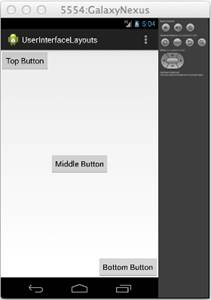

图 33:相对于元素的父元素定位元素的相对布局

请注意，如果您在`activity_main.xml`中更改了 XML 元素的顺序，按钮仍然会出现在相同的位置。这与`LinearLayout`的行为不同，它相对于前一个元素放置每个元素。还要注意，如果您更改按钮尺寸或旋转模拟器(Ctrl+F12)，它们仍然会出现在相对于屏幕的相应位置。

#### 相对于兄弟姐妹

元素也可以相对于彼此定位。下面列出的属性都指定了与周围元素的图形关系，但是它们需要布局中另一个元素的标识，而不是布尔值:

*   `android:layout_above`–将元素的底边放置在具有指定标识的元素上方。
*   `android:layout_below`–将元素的上边缘定位在具有指定标识的元素下方。
*   `android:layout_toLeftOf`–将元素的右边缘定位到具有指定标识的元素的左侧。
*   `android:layout_toRightOf`–将元素的左边缘定位到具有指定标识的元素的右侧。
*   `android:layout_alignBaseline`–将元素的基线与具有指定标识的元素的基线对齐。
*   `android:layout_alignTop`–将元素的上边缘与具有指定标识的元素的顶部对齐。
*   `android:layout_alignBottom`–将元素的底边与具有指定标识的元素的底边对齐。
*   `android:layout_alignLeft`–将元素的左边缘与具有指定标识的元素的左边缘对齐。
*   `android:layout_alignRight`–将元素的右边缘与具有指定标识的元素的右边缘对齐。

例如，考虑以下使用相对于兄弟属性而不是相对于父属性的`RelativeLayout`。第二个和第三个按钮相对于第一个按钮定位，第一个按钮将位于默认的左上角。

```java
    <Button
    android:id="@+id/topButton"
    android:layout_width="wrap_content"
    android:layout_height="wrap_content"
    android:text="Top Button" />
    <Button
    android:id="@+id/middleButton"
    android:layout_width="wrap_content"
    android:layout_height="wrap_content"
    android:layout_below="@id/topButton"
    android:layout_toRightOf="@id/topButton"
    android:text="Middle Button" />
    <Button
    android:layout_width="wrap_content"
    android:layout_height="wrap_content"
    android:layout_below="@id/middleButton"
    android:layout_toRightOf="@id/middleButton"
    android:text="Bottom Button" />

```

该代码不是一条横跨整个屏幕的对角线按钮，而是一条对角线，所有的按钮角都接触:

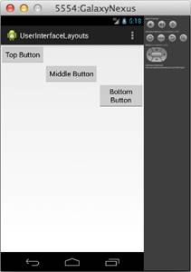

图 34:一个相对布局，它相对于元素的兄弟来定位元素

因为我们是通过 ID 来引用它们的，所以我们需要为顶部和中间的按钮包含一个`android:id`属性。请记住，从第一章开始，第一次使用 XML 元素标识时，需要将其声明为`"@+id/foo"`。这个加号通常出现在`android:id`属性中，但不是必须出现——它应该总是出现在使用 ID 的*第一个*属性中。在下面的代码片段中，`android:layout_toLeftOf`属性是引用`middleButton`和`bottomButton`标识的第一个位置，因此它们需要以加号作为前缀:

```java
    <Button
    android:layout_width="wrap_content"
    android:layout_height="wrap_content"
    android:layout_toLeftOf="@+id/middleButton"
    android:layout_above="@id/middleButton"
    android:text="Top Button" />
    <Button
    android:id="@id/middleButton"
    android:layout_width="wrap_content"
    android:layout_height="wrap_content"
    android:layout_toLeftOf="@+id/bottomButton"
    android:layout_above="@id/bottomButton"
    android:text="Middle Button" />
    <Button
    android:id="@id/bottomButton"
    android:layout_width="wrap_content"
    android:layout_height="wrap_content"
    android:layout_alignParentRight="true"
    android:layout_alignParentBottom="true"
    android:text="Bottom Button" />

```

加号的使用有助于通过确保新的标识被明确标记为错误标识来减少错误标识的数量。例如，如果您无意中试图引用带有`@id/bottumButton`的元素，编译器会让您知道没有这样的元素。

上面的 XML 将顶部和中间的按钮相对于底部的按钮进行定位，然后将底部的按钮放在屏幕的右下角。这为您提供了以下布局:

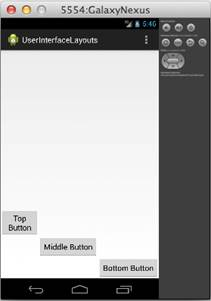

图 35:一个相对布局，它相对于尚未声明的元素来定位按钮

还要注意，您可以将相对于同级的定位方法和相对于父级的定位方法结合起来。底部按钮相对于其父按钮(例如，`android:layout_alignParentRight`)定位，其他按钮相对于同级按钮(例如，`android:layout_toLeftOf`)定位。

### 列表和网格布局

到目前为止，我们已经学会了如何用`LinearLayout`和`RelativeLayout`快速创建用户界面；然而，这些接口的内容是完全静态的——它们的 UI 元素被硬编码到底层的 XML 文件中。当您想要使用动态数据创建用户界面时，事情会变得稍微复杂一些。数据驱动布局需要三个组件:

*   数据集。
*   [适配器](http://developer.android.com/reference/android/widget/Adapter.html)的一个子类，用于将数据项转换成`View`对象。
*   [适配器视图](http://developer.android.com/reference/android/widget/AdapterView.html)的一个子类，用于布局由`Adapter`创建的`View`对象。

在开始配置数据驱动布局之前，您需要一些数据。对于这一部分，我们的数据集将是一个简单的`String`对象数组，但是安卓也提供了许多内置的类，用于从文本文件、数据库或网络服务中获取数据。

接下来，需要一个`Adapter`将数据转换成`View`对象。例如，内置的 [ArrayAdapter](http://developer.android.com/reference/android/widget/ArrayAdapter.html) 获取一个对象数组，为每个对象创建一个`TextView`，并将其文本属性设置为数组中每个对象的`toString()`值。这些`TextView`实例然后被发送到`AdapterView`。

`AdapterView`是一个`ViewGroup`子类，取代了前面章节中的`LinearLayout`和`RelativeLayout`类。其工作是整理`Adapter`提供的`View`物件。本节探讨两个最常见的`AdapterView`子类，[列表视图](http://developer.android.com/reference/android/widget/ListView.html)和[网格视图](http://developer.android.com/reference/android/widget/GridView.html)，它们分别将这些视图定位到列表或网格中。

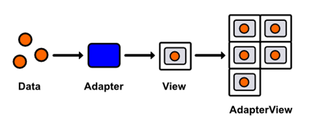

图 36:使用适配器在 GridView 中显示数据集

#### 列表布局

让我们从简单的`ListView`开始运行。由于我们不再硬编码用户界面元素，我们的 XML 布局文件将非常简单——它只需要一个空的`ListView`元素。将`activity_main.xml`改为以下内容:

```java
    <ListView xmlns:android="http://schemas.android.com/apk/res/android"
    android:id="@+id/listView"
    android:layout_width="wrap_content"
    android:layout_height="wrap_content" />

```

这个`ListView`定义了我们的整个 XML 布局——它的所有用户界面元素都将被动态填充。然而，我们确实需要包含一个`android:id`属性，这样我们就可以从我们的活动中访问`ListView`实例。

接下来，我们需要更新我们的`MainActivity`类来定义一个数据集，将该数据集传递给一个`Adapter`，然后将该适配器传递给我们在`activity_main.xml`中定义的`ListView`。所以，将`MainActivity.java`改为如下:

```java
    package com.example.userinterfacelayouts;

    import android.os.Bundle;
    import android.app.Activity;
    import android.widget.ListView;
    import android.widget.ArrayAdapter;

    public class MainActivity extends Activity {

    @Override
    protected void onCreate(Bundle savedInstanceState) {
    super.onCreate(savedInstanceState);
    setContentView(R.layout.activity_main);

    String[] data = new String[] { "Item 1", "Item 2", "Item 3",
    "Item 4" };

    ArrayAdapter<String> adapter = new ArrayAdapter<String>(this, android.R.layout.simple_list_item_1, data);
    ListView listView = (ListView) findViewById(R.id.listView);
    listView.setAdapter(adapter);
    }
    }

```

首先，我们创建一个`String`数组作为我们的数据集，并将其分配给本地`data`变量。然后，我们创建一个`ArrayAdapter`，它从数组中的每个`String`生成一个`TextView`。它的构造器接受一个`Activity`上下文，原型`TextView`的标识和数据数组。`android.R.layout.simple_list_item_1`片段是对安卓方便的内置布局之一的引用。您可以在[布局文档](http://developer.android.com/reference/android/R.layout.html)中找到完整的列表。接下来，我们必须找到我们通过`findViewById()`添加到`activity_main.xml`的`ListView`，然后我们需要将其适配器属性设置为我们刚刚配置的`ArrayAdapter`实例。

现在，您应该能够编译项目，并看到`data`数组中的四个字符串显示为`TextView`元素的列表:

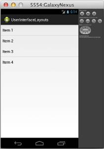

图 37:由列表视图生成的动态布局

列表布局使处理大型数据集变得非常容易，而且您可以用任何*视图来表示每个项目，这一事实使您可以显示具有多个属性的对象(例如，显示图像、姓名和首选电话号码的联系人列表)。*

 *#### 网格布局

网格布局使用与列表布局相同的数据/ `Adapter` / `AdapterView`模式，但是使用[网格视图](http://developer.android.com/reference/android/widget/GridView.html)类代替`ListView`。`GridView`还定义了一些额外的配置选项，用于定义列数和每个网格项之间的间距，其中大部分包含在下面的代码片段中。尝试将`activity_main.xml`更改为:

```java
    <GridView xmlns:android="http://schemas.android.com/apk/res/android"
    android:id="@+id/gridView"
    android:layout_width="fill_parent"
    android:layout_height="fill_parent"
    android:columnWidth="100dp"
    android:numColumns="auto_fit"
    android:verticalSpacing="5dp"
    android:horizontalSpacing="5dp"
    android:stretchMode="columnWidth" />

```

我们在`MainActivity.java`中唯一需要做的改变是更新`ListView`对`GridView`的引用:

```java
    package com.example.userinterfacelayouts;

    import android.os.Bundle;
    import android.app.Activity;
    import android.widget.GridView;
    import android.widget.ArrayAdapter;

    public class MainActivity extends Activity {
    @Override
    protected void onCreate(Bundle savedInstanceState) {
    super.onCreate(savedInstanceState);
    setContentView(R.layout.activity_main);

    String[] data = new String[] { "Item 1", "Item 2", "Item 3",
    "Item 4", "Item 5", "Item 6",
    "Item 7", "Item 8", "Item 9"};

    ArrayAdapter<String> adapter = new ArrayAdapter<String>(this, android.R.layout.simple_list_item_1, data);
    GridView gridView = (GridView) findViewById(R.id.gridView);
    gridView.setAdapter(adapter);
    }
    }

```

这将为您提供 100 个独立于设备的像素宽的文本字段网格，每个字段之间有 5 个独立于设备的像素:


图 38:由 GridView 生成的动态布局

#### 处理点击事件

当然，您可能会希望允许用户与`ListView`或`GridView`中的项目进行交互。但是，因为这两个类中的任何一个生成的接口都是动态的，所以当用户单击其中一个列表项时，我们不能使用`android:onClick` XML 属性来调用方法。相反，我们必须在`MainActivity.java`中定义一个通用的回调函数。这可以通过实现[适配器视图来实现。onimcliclistener](http://developer.android.com/reference/android/widget/AdapterView.OnItemClickListener.html)界面，像这样:

```java
    package com.example.userinterfacelayouts;

    import android.os.Bundle;
    import android.app.Activity;
    import android.widget.GridView;
    import android.widget.ArrayAdapter;

    import android.util.Log;
    import android.view.View;
    import android.widget.TextView;
    import android.widget.AdapterView;
    import android.widget.AdapterView.OnItemClickListener;

    public class MainActivity extends Activity {

    private static final String TAG = "MainActivity";

    @Override
    protected void onCreate(Bundle savedInstanceState) {
    super.onCreate(savedInstanceState);
    setContentView(R.layout.activity_main);

    String[] data = new String[] { "Item 1", "Item 2", "Item 3",
    "Item 4", "Item 5", "Item 6",
    "Item 7", "Item 8", "Item 9"};

    ArrayAdapter<String> adapter = new ArrayAdapter<String>(this, android.R.layout.simple_list_item_1, data);
    GridView gridView = (GridView) findViewById(R.id.gridView);
    gridView.setAdapter(adapter);

    gridView.setOnItemClickListener(new OnItemClickListener() {
    public void onItemClick(AdapterView<?> parent, View v,
    int position, long id) {
                      TextView selectedView = (TextView) v;
    Log.d(TAG, String.format("You clicked: %s",
    selectedView.getText()));
    }
    });
    }
    }

```

现在，每次点击`GridView`的一个项目都会调用`onItemClick()`方法。所有相关参数都作为参数传递给这个函数:父项`AdapterView`、被点击的`View`项、它在数据集中的位置以及它的`row` id。上面的回调只是将点击的`View`转换为`TextView`，并在 LogCat 中显示它包含的任何文本。

点击可以用与`ListView`布局完全相同的方式处理。

#### 编辑数据集

当您想要更改运行时显示给用户的数据时，您所要做的就是编辑底层数据集，内置的 [BaseAdapter](http://developer.android.com/reference/android/widget/BaseAdapter.html) 类负责相应地更新用户界面。在这一部分，我们将在布局中添加一个按钮，以便用户可以向网格中添加新项目，然后我们将重新实现`onItemClick()`功能，从列表中删除选定的项目。

首先，让我们将`activity_main.xml`更改为包含一个按钮。为此，我们将使`LinearLayout`成为根 XML 元素，并给它一个`Button`和一个`GridView`用于儿童:

```java
    <LinearLayout xmlns:android="http://schemas.android.com/apk/res/android"
    xmlns:tools="http://schemas.android.com/tools"
    android:layout_width="fill_parent"
    android:layout_height="fill_parent"
    android:orientation="vertical"
    tools:context=".MainActivity" >

    <Button
    android:layout_width="match_parent"
    android:layout_height="80dp"
    android:text="Add Item"
    android:onClick="addItem"/>

    <GridView android:id="@+id/gridView"
    android:layout_width="fill_parent"
    android:layout_height="fill_parent"
    android:columnWidth="100dp"
    android:numColumns="auto_fit"
    android:verticalSpacing="5dp"
    android:horizontalSpacing="5dp"
    android:stretchMode="columnWidth" />
    </LinearLayout>

```

请注意，将不同的布局方案嵌套在彼此内部是完全合法的(即，将一个`GridView`放在一个`LinearLayout`内部)。这使得用很少的努力创建复杂的动态用户界面成为可能。

接下来，我们需要改变相应的活动来处理添加项目按钮点击，并在`GridView`中选择项目时移除项目。这将需要对`MainActivity.java`进行多项更改:

```java
    package com.example.userinterfacelayouts;

    import android.os.Bundle;
    import android.app.Activity;
    import android.widget.GridView;
    import android.widget.ArrayAdapter;

    import android.view.View;
    import android.widget.AdapterView;
    import android.widget.AdapterView.OnItemClickListener;
    import java.util.ArrayList;

    public class MainActivity extends Activity {

    private ArrayList<String> data;
    private ArrayAdapter<String> adapter;
    private int count;

    @Override
    protected void onCreate(Bundle savedInstanceState) {
    super.onCreate(savedInstanceState);
    setContentView(R.layout.activity_main);

    this.data = new ArrayList<String>();
    this.data.add("Item 1");
    this.data.add("Item 2");
    this.data.add("Item 3");
    this.count = 3;

    adapter = new ArrayAdapter<String>(this, android.R.layout.simple_list_item_1, data);
    GridView gridView = (GridView) findViewById(R.id.gridView);
    gridView.setAdapter(adapter);

    gridView.setOnItemClickListener(new OnItemClickListener() {
    public void onItemClick(AdapterView<?> parent, View v,
    int position, long id) {
    data.remove(position);
    adapter.notifyDataSetChanged();
    }
    });
    }

    public void addItem(View view) {
    count++;
    String newItem = String.format("Item %d", count);
    this.data.add(newItem);
    this.adapter.notifyDataSetChanged();
    }
    }

```

首先，我们必须将表示数据集的静态`String[]`数组更改为可变的`ArrayList`。这将允许我们添加和删除项目。我们还必须将`data`和`adapter`局部变量更改为实例变量，以便我们可以在`onCreate()`之外访问它们。我们还添加了一个`count`变量来跟踪已经创建了多少个项目。

要从`GridView`中移除一个项目，我们所要做的就是用`ArrayList`的`remove()`方法从数据集中移除它，然后调用`adapter.notifyDataSetChanged()`。后一种方法由`BaseAdapter`定义，它告诉`Adapter`它需要同步其关联的`AdapterView`项。只要基础数据集发生了变化，就应该调用它。

只要点击添加项目按钮，就会调用新的`addItem()`方法。首先递增`count`变量，然后使用它为新项目生成标题，将标题添加到数据集中，最后调用`notifyDataSetChanged()`刷新`GridView`。


图 39:在数据集中添加和移除项目

现在，您应该能够编译项目并更改基础数据集。虽然此示例仅演示了在`GridView`中添加和移除项目，但编辑现有项目的方式完全相同。您所要做的就是更改`ArrayList`中的值，并调用适配器上的`notifyDataSetChanged()`。

#### 自定义列表视图(和网格视图)项目

到目前为止，我们一直使用的`R.layout.simple_list_item_1` `TextView`在处理字符串数据时很方便，但是更复杂的数据项通常需要相应复杂的视图。幸运的是，实现自己的`ListView`或`GridView`项目相对容易。在本节中，我们将创建一个显示姓名和电话号码的自定义视图。

自定义`ListView`项需要三个组件:一个表示数据的类，一个为每个项定义`View`的 XML 布局文件，以及一个在视图中显示数据的自定义`Adapter`。这些组件将取代上例中的`String`数据、`android.R.layout.simple_list_item_1`视图和`ArrayAdapter`。我们的目标是这样的结果:

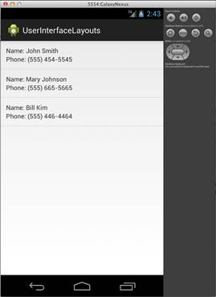

图 40:列表视图，每个项目都有自定义视图对象

首先，我们需要创建一个新的类来表示自定义数据项。我们称之为`DataItem`，它需要存储的只是两个属性，分别叫做`name`和`phoneNumber`。您可以在 Eclipse 中创建一个新的类，方法是按下 **Cmd+N** (或者如果您在电脑上，按下 Ctrl+N)，然后选择 **Java** ，然后选择**类**。在**名称**字段输入`**DataItem**`，其他内容保留默认值。该表单应该如下所示:

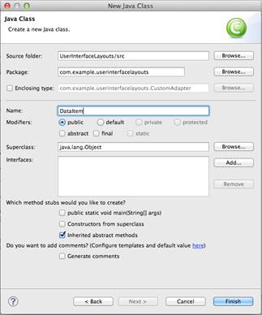

图 41:创建数据项目类

点击**完成**后，在包浏览器中`src/com.example.userinterfacelayouts`下应该会找到一个名为`**DataItem.java**`的新文件。双击文件将其打开，并将其更改为以下内容:

```java
    package com.example.userinterfacelayouts;

    public class DataItem {

    String name;
    String phoneNumber;

    public DataItem(String name, String phoneNumber) {
    this.name = name;
    this.phoneNumber = phoneNumber;
    }

    }

```

这为每个数据项定义了两个属性，以及一个方便的构造函数。这就是我们表示数据所需的全部内容，因此我们可以继续前进到定义与每个数据项相关联的`View`对象的 XML 布局文件。

要创建布局 XML 文件，请按 **Cmd+N** (如果您在电脑上，请按 Ctrl+N)并选择**安卓**，然后选择**安卓 XML 布局文件**。**文件**字段使用`**list_item.xml**`，将**根元素**保留为默认值(我们将通过编辑 XML 进行更改)。单击**完成**会在`res/layout`文件夹中给你一个名为`list_item.xml`的新文件。我们希望每个项目如下所示:

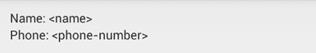

图 42:由列表项创建的视图

我们将使用一个`RelativeLayout`和四个`TextView`元素来创建这个布局。将`list_item.xml`改为以下内容:

```java
    <?xml version="1.0" encoding="utf-8"?>
    <RelativeLayout xmlns:android="http://schemas.android.com/apk/res/android"
    android:layout_width="match_parent"
    android:layout_height="match_parent"
    android:padding="12dp">

    <TextView
    android:id="@+id/nameLabel"
    android:layout_width="wrap_content"
    android:layout_height="wrap_content"
    android:text="@string/nameLabel"/>

    <TextView
    android:id="@+id/nameValue"
    android:layout_toRightOf="@id/nameLabel"
    android:layout_width="wrap_content"
    android:layout_height="wrap_content"/>

    <TextView
    android:id="@+id/phoneLabel"
    android:layout_below="@id/nameLabel"
    android:layout_width="wrap_content"
    android:layout_height="wrap_content"
    android:text="@string/phoneLabel"/>

    <TextView
    android:id="@+id/phoneValue"
    android:layout_below="@id/nameLabel"
    android:layout_toRightOf="@id/phoneLabel"
    android:layout_width="wrap_content"
    android:layout_height="wrap_content"/>

    </RelativeLayout>

```

`id/nameValue`和`id/phoneValue`元素将由我们的自定义`Adapter`动态设置，因此它们不需要`android:text`属性，但是`id/nameLabel`和`id/phoneLabel`元素是静态标签，因此它们可以从`strings.xml`填充。在`strings.xml`增加以下两行:

```java
    <string name="nameLabel">Name:&#160;</string>
    <string name="phoneLabel">Phone:&#160;</string>

```

这里唯一新的部分是`&#160;`实体，这是一个不可打破的空间。这是让我们的标签正确显示所必需的。这处理了 XML 布局文件，所以我们剩下的就是定制的`Adapter`来将其与`DataItem`类连接起来。

创建另一个名为`CustomAdapter`的新类，并使用`BaseAdapter`作为子类。 [BaseAdapter](http://developer.android.com/reference/android/widget/BaseAdapter.html) 是`Adapter`类的最小实现。它为`Adapter`的内部工作提供了一些基本的定义，这让我们能够专注于我们的`CustomAdapter`中更高级别的功能。这将是一个更长的类定义，所以让我们分步骤解决它。

让我们从将`CustomAdapter.java`更改为以下内容开始:

```java
    package com.example.userinterfacelayouts;

    import java.util.ArrayList;

    import android.view.View;
    import android.view.ViewGroup;
    import android.view.LayoutInflater;
    import android.content.Context;
    import android.widget.BaseAdapter;
    import android.widget.TextView;

    public class CustomAdapter extends BaseAdapter {

    ArrayList<DataItem> data;
    Context context;
    private static LayoutInflater inflater = null;

    public CustomAdapter(Context context, ArrayList<DataItem> data) {
    this.context = context;
    this.data = data;
    inflater = (LayoutInflater) context
    .getSystemService(Context.LAYOUT_INFLATER_SERVICE);
    }

    }

```

这从导入我们稍后需要的类开始。然后，它定义了一些属性。`data`变量存储支持适配器的数据，适配器只是`DataItem`对象的一个`ArrayList`。 [Context](http://developer.android.com/reference/android/content/Context.html) 类包含全局应用环境的信息，我们需要在`context`变量中存储对它的引用。最后，我们需要一个`LayoutInflater`将来自`list_item.xml`的 XML 转换成一个`View`层次结构。没有这个`LayoutInflater`，就不可能到达我们在`list_item.xml`中定义的文本字段。

接下来，我们定义一个构造函数，它以`Context`实例和数据集为参数。然后，它使用上下文获取一个`LayoutInflater`。一个`Context`实例的 [getSystemService()](http://developer.android.com/reference/android/content/Context.html#getSystemService(java.lang.String)) 方法是实现这一点的标准方法。

现在我们已经准备好定义适配器的自定义行为。在`CustomAdapter.java`中增加以下方法:

```java
    @Override
    public int getCount() {
    return data.size();
    }

    @Override
    public Object getItem(int position) {
    return data.get(position);
    }

    @Override
    public long getItemId(int position) {
    return position;
    }

    @Override
    public View getView(int position, View convertView, ViewGroup parent) {
    // See if the view needs to be inflated
    View view = convertView;
    if (view == null) {
    view = inflater.inflate(R.layout.list_item, null);
    }
    // Extract the desired views
    TextView nameText = (TextView) view.findViewById(R.id.nameValue);
    TextView phoneText = (TextView) view.findViewById(R.id.phoneValue);

    // Get the data item
    DataItem item = data.get(position);

    // Display the data item's properties
    nameText.setText(item.name);
    phoneText.setText(item.phoneNumber);

    return view;
    }

```

前三种方法提供了所有`Adapter`子类所需的信息。`getCount()`和`getItem()`方法必须分别返回适配器代表的项目数和指定位置的项目数。这两者只需要从底层`ArrayAdapter`转发信息即可。`getItemId()`方法应该在指定位置返回项目的行标识。在这种情况下，我们可以只返回该项在数组中的位置。

我们的`CustomAdapter`类的核心是`getView()`方法，它必须返回一个表示指定位置数据项的`View`对象。这是`list_view.xml`文件转换成`View`的地方，它的`TextView`填充有来自相关`DataItem`的数据。

首先，我们需要查看适配器是否正在使用现有视图，该视图将通过`convertView`参数传入。如果不是，我们需要通过用我们在构造函数中记录的`LayoutInflater`实例膨胀**XML 布局文件来创建一个新的`View`实例。这将解析 XML，将每个元素转换为其对应的视图对象，并将其添加到视图层次结构中。最后，我们需要找到我们在 XML 文件中定义的`TextView`元素，并使用它们来显示所请求的`DataItem``name`和`phoneNumber`属性。下图显示了如何膨胀一个 XML 布局文件来访问包含的视图。**

 **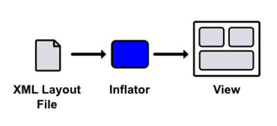

图 43:膨胀一个 XML 布局文件来访问包含的视图

这个过程应该能更好地理解`Adapter`的目的:它的`getView()`方法是将数据集*调整为*以`View`层次显示。返回的`View`实例是父级`ListView` / `GridView`显示的内容。

我们已经设置了定制`ListView`的三个组件，但是我们仍然需要在主活动中把它们放在一起。`activity_main.xml`所需要的只是一个我们可以在`MainActivity.java`中参考的`ListView`:

```java
    <LinearLayout xmlns:android="http://schemas.android.com/apk/res/android"
    xmlns:tools="http://schemas.android.com/tools"
    android:layout_width="fill_parent"
    android:layout_height="fill_parent"
    android:orientation="horizontal"
    tools:context=".MainActivity" >

    <ListView
    android:id="@+id/listView"
    android:layout_width="fill_parent"
    android:layout_height="fill_parent" />

    </LinearLayout>

```

然后，在`MainActivity.java`中，我们需要创建`DataItem`实例的数据集，并将我们的`CustomAdapter`附加到上面的`ListView`中:

```java
    package com.example.userinterfacelayouts;

    import android.os.Bundle;
    import android.app.Activity;
    import android.widget.ListView;
    import java.util.ArrayList;

    public class MainActivity extends Activity {

    private ArrayList<DataItem> data;
    private CustomAdapter adapter;

    @Override
    protected void onCreate(Bundle savedInstanceState) {
    super.onCreate(savedInstanceState);
    setContentView(R.layout.activity_main);

    this.data = new ArrayList<DataItem>();
    this.data.add(new DataItem("John Smith", "(555) 454-5545"));
    this.data.add(new DataItem("Mary Johnson", "(555) 665-5665"));
    this.data.add(new DataItem("Bill Kim", "(555) 446-4464"));

    adapter = new CustomAdapter(this, data);
    ListView listView = (ListView) findViewById(R.id.listView);
    listView.setAdapter(adapter);
    }
    }

```

您现在应该能够编译该应用程序，并看到我们的自定义`list_item.xml`显示为`ListView`中的每个项目。虽然这是一个只使用`TextView`小部件的简单例子，但是很容易扩展这个模式来创建任意复杂的`ListView`或`GridView`带有图像、按钮和其他用户界面小部件的项目。

要带走的概念是列表/网格、自定义视图、数据对象和适配器之间的交互。它们共同提供了一个可重用的模型-视图-控制器框架，使得开发人员可以用最少的努力向用户显示复杂的数据集。

## 嵌套布局

虽然布局优化是本书范围之外的高级主题，但值得注意的是，过深的视图层次结构可能是潜在的性能瓶颈。由于这个原因，你应该尽量保持你的视野组平坦和宽阔，而不是狭窄和深邃。请考虑以下布局:

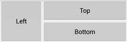

图 44:由三个按钮组成的简单布局

这可以通过两种方式之一来创建。首先，让我们看看如何使用两个`LinearLayouts`来实现:一个水平的将左按钮与其他按钮分开，另一个嵌套的`LinearLayout`渲染顶部和底部按钮。

```java
    <!-- Don't do this (it's not efficient) -->
    <LinearLayout xmlns:android="http://schemas.android.com/apk/res/android"
    xmlns:tools="http://schemas.android.com/tools"
    android:layout_width="match_parent"
    android:layout_height="match_parent"
    android:orientation="horizontal"
    tools:context=".MainActivity" >
    <Button
    android:layout_width="0dp"
    android:layout_height="120dp"
    android:layout_weight="1"
    android:text="Left" />
    <LinearLayout
    android:layout_width="0dp"
    android:layout_height="120dp"
    android:layout_weight="2"
    android:orientation="vertical">
    <Button
                    android:layout_width="match_parent"
                    android:layout_height="0dp"
                    android:layout_weight="1"
                    android:text="Top" />
    <Button
    android:layout_width="match_parent"
    android:layout_height="0dp"
    android:layout_weight="1"
    android:text="Bottom" />
    </LinearLayout>
    </LinearLayout>

```

然而，两个`LinearLayout`元素都包含带有`layout_weight`属性的小部件，这意味着它们的尺寸需要计算两次。不用说，这不是一个最佳布局。

创建该布局的另一种(也是首选的)方法是使用单个`RelativeLayout`。这样做的好处是将视图层次结构展平为一个层，避免了上面显示的嵌套`LinearLayout`的低效率。

```java
    <!-- Do this instead (it's more efficient) -->
    <RelativeLayout xmlns:android="http://schemas.android.com/apk/res/android"
    xmlns:tools="http://schemas.android.com/tools"
    android:layout_width="match_parent"
    android:layout_height="match_parent"
    tools:context=".MainActivity" >
    <Button
    android:id="@+id/leftButton"
    android:layout_width="120dp"
    android:layout_height="120dp"
    android:text="Left" />
    <Button
    android:id="@+id/topButton"
    android:layout_width="match_parent"
    android:layout_height="60dp"
    android:layout_toRightOf="@id/leftButton"
    android:text="Top" />
    <Button
    android:layout_width="match_parent"
    android:layout_height="60dp"
    android:layout_toRightOf="@id/leftButton"
    android:layout_below="@id/topButton"
    android:text="Bottom" />
    </RelativeLayout>

```

所以，一般的经验法则是尽可能避免嵌套`LinearLayout` s。对于定制的`ListView` / `GridView`项目来说尤其如此，因为视图会多次膨胀，因此任何低效率也会成倍增加。然而，这并不是说你应该*永远不要*使用`LinearLayout` s。它们非常容易配置，并且在不嵌套时效率很高。这使得它们适用于更简单的布局(例如，由连续文本字段组成的表单)。

有关创建高效布局的更多信息，请访问[优化您的用户界面](http://developer.android.com/tools/debugging/debugging-ui.html)。

## 总结

在这一章中，我们探讨了布局安卓用户界面的标准机制。首先，我们讨论了定义`View`元素的填充和边距的基本属性。然后，我们学习了如何使用内置的`ViewGroup`子类来定位元素:`LinearLayout`、`RelativeLayout`、`ListView`和`GridView`。这些类使得用最少的编码将 UI 小部件组织成复杂的布局变得非常容易。

虽然知道如何在屏幕上定位元素很重要，但是如果你不知道*有什么*元素可用，这些知识就没有用了。下一章将通过调查最常见的用户界面小部件来充实您对安卓用户界面框架的理解。***