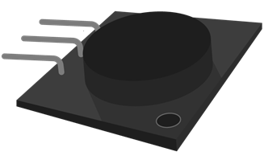
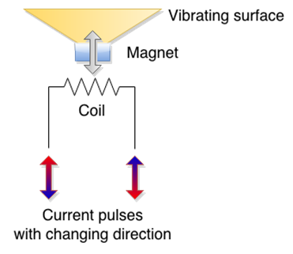

# 第四章使用蜂鸣器

在电子学中，给出视觉反馈总是很重要的。但在某些情况下，光线根本无法切断它。即使蜂鸣器在拐角后面或中间有障碍物，也能听到。我们人类非常重视音频信号，因为相对较弱的音频信号甚至可以毫无问题地将一个人从沉睡中唤醒。也有人说，深度昏迷的病人还能听得很清楚。所以这种感觉在电子产品中非常重要。

音频系统是它自己的一个章节，我在这里不讨论它们。在这个例子中，我将使用相对便宜的组件，称为蜂鸣器。这个组件已经存在了几十年，主要用于通知用户。通过使用蜂鸣器，电子设备可以在一些事件上通知我们，而我们不必不断地观看一些事情(比如在微波炉里爆爆米花，等待顾客进入商店，发出游戏结束的信号，提醒我们最喜欢的节目马上就要开始了，或者只是叫醒我们)。

在本章中，我将介绍蜂鸣器的可能用例。使用蜂鸣器时，请检查附近的其他人是否同意，因为蜂鸣器有时会非常烦人。不要在你的电子项目中滥用蜂鸣器，要时刻记住它们会惹恼生物。简而言之，只有当有重要的事情发生时，才使用蜂鸣器通知用户。

## 计时秒

说到蜂鸣器，这更像是一个 Hello World 的例子。这个例子的最终结果会像时钟一样滴答作响。用例可能有点局限于测量心跳，观察一个现象，或者在短时间内等待适当的时间(比如，热烫蔬菜)。想象一下你数着“一个密西西比，两个密西西比”等等的所有时刻。这是一个帮助你计算秒数的设备。

这个例子中最重要的部件是蜂鸣器。有很多版本；下图描述了本例中使用的方法。但是不管蜂鸣器看起来如何，接线都差不多——只使用了两个引脚。蜂鸣器的中间引脚没有连接，如下所示:



图 31:蜂鸣器

本节零件清单:

*   Arduino 一号
*   USB 电缆
*   1 个 100 欧姆的蜂鸣器电阻器
*   面包板
*   3x 线路板跳线
*   Arduino 兼容无源蜂鸣器

我们将从代码开始这个例子。它类似于我们用来让发光二极管闪烁的那个。唯一有点不同的是，我们需要做一些数学运算。发出声音的脉冲相当短，我们将使它仅持续 10 毫秒长。这大约是感知一个短刻度的正确时间。在我们的循环中必须考虑这种滴答的持续时间，因为在一段时间后，如果我们等待下一个周期整整一秒钟，而不补偿滴答的持续时间，我们会得到一个显著的时间漂移。

我们将得到大约每 100 秒一秒的漂移。所以循环中的延迟是 990 毫秒。在`setup`功能中，我们将注册一个引脚进行输出，然后向该引脚发送短脉冲。在我们设置好硬件后，它听起来会像旧时钟一样。

下面是编程部分:

```c
    // We'll use pin 12 for buzzing
    int buzzPin = 12;

    void setup() {
      // register the pin for output
      pinMode(buzzPin, OUTPUT);    
    }

    void loop() {
      // during ten milliseconds we'll make a tick
      digitalWrite(buzzPin, HIGH);
      delay(10);

      // then we'll wait 990 millis to tick again
      digitalWrite(buzzPin, LOW);
      delay(990);
    }

```

接线时蜂鸣器可能有点棘手。有一次我碰巧把蜂鸣器接线错了，所以我听到了持续的声音。当我触摸蜂鸣器时，它非常热。所以，在你给蜂鸣器接线后，检查蜂鸣器看它是否是热的。它可以为你省下买蜂鸣器的钱，因为如果你不检查它，它可能会烧坏。好消息是蜂鸣器上的正极和负极引脚通常都有很好的标记，所以你在识别引脚时不会有任何问题。如果你的蜂鸣器有两个以上的针脚，只要蜂鸣器上的一个针脚不与所用的蜂鸣器连接就可以了(在本例中，它是中间的一个)。以下是示例的接线:


图 32:蜂鸣器计数秒接线

所有接下来的线路都和这条相似。蜂鸣器的内部电阻因蜂鸣器而异，因此您必须使用蜂鸣器的数据手册来找到蜂鸣器的电阻(然后可能进行一些计算以获得正确的电阻)。大多数情况下，100 欧姆的电阻就可以了。要计算电阻额定值，请使用数据手册，用五伏电压除以元件的额定电流。如果额定电流为 20 mA，那么将 5 除以 0.020。这只是一个示例，让您了解整个电阻额定值确定过程的概况。另外，请注意，这将给出总电阻，您必须从这个数字中减去蜂鸣器的内阻。计算过程总结如下:

|  | 注:电阻= (5V /蜂鸣器电流额定值 A)–蜂鸣器内部电阻 |

如果你不确定，在大多数情况下，100 欧姆的电阻会覆盖你。Arduino 的构建还使得最常见的布线错误相对难以损坏它，因为引脚具有内部上拉电阻，可以限制一个引脚可以汲取的电流。如果您做了以下事情，我不认为我自己或 Syncfusion 有任何责任。我连接了不带电阻的蜂鸣器，它似乎没有任何问题。请记住，这是一种我不同意的做法。我这么做是出于好奇，并向您展示 Arduino 将涵盖初学者的一些错误。现在，你们中的一些人可能会摆弄蜂鸣器，改变之前程序的值。让我们看看下面的代码，并尝试确定它将如何使用蜂鸣器:

```c
    // what do you think this will do?

    // we'll use pin 12 for buzzing
    int buzzPin = 12;

    void setup() {
      // register the pin for output
      pinMode(buzzPin, OUTPUT);    
    }

    void loop() {
      // we'll keep the pin high for 990 ms
      digitalWrite(buzzPin, HIGH);
      delay(990);

      // and then we'll make just a short break
      digitalWrite(buzzPin, LOW);
      delay(10);
    }

```

运行完前面的清单后，您可能会想知道发生了什么，以及您是否以某种方式键入了前面的示例。别担心，这个例子很好。这两个例子做了完全相同的事情。我们必须深入蜂鸣器的内部工作来解释这里到底发生了什么。作为简短的介绍，我将提到声音实际上是通过空气或水等介质传播的振动。如果你仔细观察，你会注意到我们在前面的例子中没有产生任何脉动电流。我们只是在引脚上输出恒定电平的电流。我们听到的滴答声是脉冲开始时的短脉冲，电流从零上升到引脚上的`HIGH`值。我们将在下一节对此进行深入探讨。

## 改变蜂鸣器的频率

本节使用与前一节完全相同的接线。我们将改变代码，演示如何改变蜂鸣器产生的声音频率。让我们回到扬声器的基本原理。

扬声器的工作原理是振动，然后推动周围的空气，从而引起我们可以听到的振动。有很多扬声器设计，所以我不会一一介绍，但我会解释最基本的一个。在基本形式中，扬声器包括磁体、振动表面和线圈。

电流通过线圈，引起磁铁的运动。如果电流开始交替，振动表面开始来回移动。这导致空气振动，形成声波。这是扬声器背后的基本工作原理。请注意，在一些扬声器设计中，线圈被放置在振动表面上，因为它比磁体轻得多。实际上，这是大多数扬声器的构造方式，但这是一个教育示例。这里用基本部分来描述:



图 33:扬声器的基本功能

在前面的例子中，我们没有向扬声器发送任何特定的交流电。我们只需将`HIGH`值写入引脚，然后等待恒定电流流过引脚。有恒定的电流；就在振动表面开始流动时，它吸引或排斥振动表面，然后扬声器稳定下来。这发生得很快，而且由于涉及到机械运动，它不会马上停止。所以我们听到了由振动表面的惯性引起的振动。每秒钟，我们改变一次电流的方向，如此反复，所以我们听到了一个节拍。所以，是的，实际上，前面的例子没有按照预期的方式使用蜂鸣器。让我们快速交替高低。记住，这可能会惹恼你周围的人:

```c
    // we'll use pin 12
    int buzzPin = 12;

    void setup() {
      // register the pin for output
      pinMode(buzzPin, OUTPUT);    
    }

    void loop() {
      // high for a short while
      digitalWrite(buzzPin, HIGH);
      delay(1);

      // low for a short while
      digitalWrite(buzzPin, LOW);
      delay(1);
    }

```

这听起来有点像。比之前的滴答要好；这听起来像是一种语气。让我们看看当前的情况:


图 34:上一个编程示例中的电压电平

在两毫秒内，我们将从高到低。我们每秒可以做 500 次，因此，实际上，前面的例子产生了 500 赫兹的音调。如果你查看蜂鸣器的规格，你可能会发现它支持高达 2500 赫兹甚至更高的频率。500 赫兹的音调大约是毫秒延迟的两倍。Arduino 还有一个`delayMicroseconds`功能，可以将一个循环的执行延迟短于一毫秒。

一微秒实际上比一毫秒小一千倍。再一次，一毫秒有 1000 微秒。所以，如果我们想产生一个 2000 赫兹的音调，这意味着我们必须在一秒钟内做 2000 次改变。一次更改将持续半毫秒，由于我们必须在这段时间内从低到高，我们将进一步将其除以 2。这给我们带来了 250 微秒的延迟。以下代码将在蜂鸣器上产生 2000 赫兹的声音:

```c
    // we'll use pin 12
    int buzzPin = 12;

    void setup() {
      // register the pin for output
      pinMode(buzzPin, OUTPUT);    
    }

    void loop() {
      // high for a short while
      digitalWrite(buzzPin, HIGH);
      delayMicroseconds(250);

      // low for a short while
      digitalWrite(buzzPin, LOW);
      delayMicroseconds(250);
    }

```

现在，我们可以继续进行各种计算，从而得到我们想要的频率。但是，如果我们想用实际的音调做一些事情，并对它们的持续时间进行编程，它会变得非常复杂。Arduino 通过提供音调功能让这一切变得更加容易。我们将在下一节中描述它。

## 使用音调功能

对于前面的例子，我们必须做一些数学运算，并编写多行代码来产生一个音调。为了应对这种情况，Arduino 内置了`tone`功能。这个函数非常简单，它接受将形成波的管脚号、波的频率和持续时间。这里显示了基本示例；我们只播放 2200 赫兹的音调:

```c
    // we'll use pin 12
    int buzzPin = 12;

    void setup() {
      // register the pin for output
      pinMode(buzzPin, OUTPUT);
    }

    void loop() {
      tone(buzzPin, 2200, 100);
    }

```

接线与前面的例子相同。如果你运行这个例子，你会注意到音调是恒定的。原因是循环运行得非常快，并且在音调发出之前，开始发出新的音调。让我们将`tone`调用移到程序的`setup`部分。为了让我们确定发生了什么，我们会让它持续一整秒:

```c
    // we'll use pin 12
    int buzzPin = 12;

    void setup() {
      tone(buzzPin, 2200, 1000);
    }

    void loop() {
      // leave empty
    }

```

音调函数有一个有趣的特性。你认为下面的代码能做什么？：

```c
    // we'll use pin 12
    int buzzPin = 12;

    void setup() {
      tone(buzzPin, 2200, 1000);
      tone(buzzPin, 1000, 1000);
      tone(buzzPin, 440, 1000);
    }

    void loop() {
      // leave empty
    }

```

其实这只是要放最后一个音，所以音 2200 和 1000 根本听不到。这是因为对`tone`函数的调用没有被缓冲，一旦我们调用它，`tone`就会开始发出。我们为之前的调用指定了 1000 毫秒的持续时间并不重要。如果我们想让别人听到我们的语气，我们必须看一下其他说明，或者只是等待。让我们看看如果我们在给`tone`的呼叫之间放一个`delay`会发生什么:

```c
    // we'll use pin 12
    int buzzPin = 12;

    void setup() {
      tone(buzzPin, 2200, 1000);
      delay(2000);
      tone(buzzPin, 1000, 1000);
      delay(2000);
      tone(buzzPin, 440, 1000);
    }

    void loop() {
      // leave empty
    }

```

我们也可以使用`noTone`停止播放大头针上的音调。在下面的例子中，程序上传后，您应该只听到一个小故障:

```c
    // we'll use pin 12
    int buzzPin = 12;

    void setup() {
      tone(buzzPin, 2200, 1000);
      noTone(buzzPin);
    }

    void loop() {
      // leave empty
    }

```

至此，我们涵盖了`tone`函数的用例。通过我之前给你展示的例子，你可以发出很好的警告声或者类似的声音。但这并不是蜂鸣器的全部；很多人都在用 Arduino 和蜂鸣器来演奏旋律。我将在下一节讨论如何在蜂鸣器上演奏旋律。

## 演奏旋律

到目前为止，我们用 Arduino 讲述了发声的理论部分。但是这本书的一些读者会接受某种音乐教育，希望他们会喜欢这一部分。记住，我们将保持简短和中肯。

你不必担心接线，因为它一直都是一样的。正如一个简单的介绍，一个音符有一个频率，音乐结合了频率和持续时间。蜂鸣器实际上不能再现低于 31 Hz 的频率。我们之前提到，那里的大多数蜂鸣器不会超过 2500 赫兹。我们将在下面的代码清单中查看如何播放旋律。清单的开始部分只是向您提供音符及其频率的列表。您可以重复使用它们来演奏自己的旋律:

```c
    #define _SILENCE 0
    // most of the buzzers don't work with very low tones
    #define _B0  31
    #define _C1  33
    #define _CS1 35
    #define _D1  37
    #define _DS1 39
    #define _E1  41
    #define _F1  44
    #define _FS1 46
    #define _G1  49
    #define _GS1 52
    #define _A1  55
    #define _AS1 58
    #define _B1  62
    #define _C2  65
    #define _CS2 69
    #define _D2  73
    #define _DS2 78
    #define _E2  82
    #define _F2  87
    #define _FS2 93
    #define _G2  98
    #define _GS2 104
    #define _A2  110
    #define _AS2 117
    #define _B2  123
    #define _C3  131
    #define _CS3 139
    #define _D3  147
    #define _DS3 156
    #define _E3  165
    #define _F3  175
    #define _FS3 185
    #define _G3  196
    #define _GS3 208
    #define _A3  220
    #define _AS3 233
    #define _B3  247
    #define _C4  262
    #define _CS4 277
    #define _D4  294
    #define _DS4 311
    #define _E4  330
    #define _F4  349
    #define _FS4 370
    #define _G4  392
    #define _GS4 415
    #define _A4  440
    #define _AS4 466
    #define _B4  494
    #define _C5  523
    #define _CS5 554
    #define _D5  587
    #define _DS5 622
    #define _E5  659
    #define _F5  698
    #define _FS5 740
    #define _G5  784
    #define _GS5 831
    #define _A5  880
    #define _AS5 932
    #define _B5  988
    #define _C6  1047
    #define _CS6 1109
    #define _D6  1175
    #define _DS6 1245
    #define _E6  1319
    #define _F6  1397
    // some buzzers don't produce tones before 1500 Hz
    #define _FS6 1480
    #define _G6  1568
    #define _GS6 1661
    #define _A6  1760
    #define _AS6 1865
    #define _B6  1976
    #define _C7  2093
    #define _CS7 2217
    #define _D7  2349
    // only higher quality buzzers after 2500 Hz
    #define _DS7 2489
    #define _E7  2637
    #define _F7  2794
    #define _FS7 2960
    #define _G7  3136
    #define _GS7 3322
    #define _A7  3520
    #define _AS7 3729
    #define _B7  3951
    #define _C8  4186
    #define _CS8 4435
    #define _D8  4699
    #define _DS8 4978

    int buzzPin = 12;

    // predefined melody
    int melody[] = {
      _C4, _G3, _G3, _A3, _G3, _SILENCE, _B3, _C4};

    #define melodySize (sizeof(melody)/sizeof(int *))

    // durations: 4 = quarter, 8 = eighth, etc.:
    int noteDurations[] = {
      4, 8, 8, 4, 4, 4, 4, 4 };

    void setup() {
      // going over the notes in the melody:
      for (int noteIndex = 0; noteIndex < melodySize; noteIndex++) {

        // note duration = one second / duration
        // quarter note = 1000 / 4, eighth note = 1000/8 ...
        int noteDuration = 1000/noteDurations[noteIndex];
        tone(buzzPin, melody[noteIndex], noteDuration);

        // let's wait a little bit longer so that we can hear the tones
        int pauseBetweenNotes = noteDuration * 1.10;
        delay(pauseBetweenNotes);
        // stop the tone and start with the next
        noTone(buzzPin);
      }
    }

    void loop() {
      // leave empty
    }

```

正如前面例子中的旋律一样，我们已经到达了关于蜂鸣器的最后一节。我们从蜂鸣器的基本接线，到从软件方面使用它的方法。有很多应用程序可以向基于 Arduino 的项目的用户提供音频反馈，所提供的示例将帮助您在使用蜂鸣器时入门，无论是通知用户还是播放旋律。在下一章中，我们将介绍如何测量环境条件。