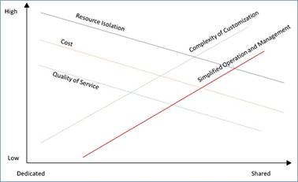

# 第一章引言

## 关于这本书

这是一本关于使用 ASP.NET 构建多租户应用程序的书。我们将讨论多租户对于 web 应用程序的一般意义，然后我们将了解像 Web Forms 和 MVC 这样的 ASP.NET 框架如何帮助我们实现多租户解决方案。

您可以期望在这里找到针对所概述的问题的可行解决方案，其中一些肯定可以得到增强和发展。在适当的时候，我会留下参考资料，以便感兴趣的读者可以改进我所建立的东西，并加深他们对这些问题的理解。

需要一些 ASP.NET 的知识，但你不一定要成为专家。希望初学者和专家都能在这里找到有用的东西。

在整本书中，我们将提到两个假想的租户/域，**ABC.com**和**XYZ.net**，它们都将托管在我们的服务器中。

## 什么是多租户，为什么要关心？

多租户是一个概念，作为多部署的替代方案，它在过去几年中已经获得了一些恶名。这个概念很简单:单个 web 应用程序可以以一种让客户认为他们正在与不同的应用程序对话的方式来响应客户。这个应用程序的不同“面孔”被称为**租户**，因为从概念上来说，它们生活在同一个空间——网络应用程序——并且可以单独寻址。只需扳动配置开关，即可添加或删除租户。

为什么这个有用？首先，它使多台服务器在线变得没有必要，因为它们需要所有的维护和成本。总的来说，除其他外，我们必须考虑以下几点:

*   **资源隔离**:与共享解决方案相比，专用服务器可以更好地屏蔽其他基础架构组件的故障。
*   **成本**:当我们需要每个服务、应用程序或客户都有一台物理服务器时，成本要高于共享服务器。
*   **服务质量**:如果您有单独的服务器，您可以实现更高水平的质量和定制，因为您不关心它可能如何影响不同的服务、应用程序或客户。
*   **定制的复杂性**:我们在定制多租户解决方案时必须格外小心，因为我们通常不希望事情以相同的方式应用于所有租户。
*   **运营管理**:“硬”管理，如备份、监控、物理分配、电源、冷却等。当我们只有一台服务器时，就容易多了。

图 1:专用与共享(多租户)部署的决策标准

一般来说，多租户框架应该有助于我们处理以下问题:

*   **品牌化**:针对不同租户的不同品牌；我所说的品牌是指像标志图像、样式表和总体布局这样的东西。
*   **认证**:不同的租户应该有不同的用户注册；在特定租户中注册的用户不应该能够登录到另一个租户。
*   **工作流程**:不同租户处理相同基本事物的方式(略有)不同是有道理的；多租户框架应该使代码尽可能透明。
*   **数据模型**:不同租户可能有(略有)不同的数据需求；同样，考虑到我们谈论的是同一个共享应用程序，我们应该尽可能满足这种需求。

在整本书中，我们将对这些问题给予一些关注。

## 多重租赁要求

作为高级需求，我们的应用程序框架应该能够:

*   自动加载多个租户及其信息
*   从每一个 HTTP 请求中确定它应该指向的租户，或者使用一个后备值
*   将品牌主题应用于每个租户请求的页面
*   允许用户仅登录到与其关联的租户
*   为所有租户提供不冲突的通用应用服务；例如，存储在一个租户的应用程序缓存中的内容不会被另一个租户覆盖

## 应用服务

应用服务提供通用功能。NET/ASP。NET 提供了现成的，但不是以多租户的方式。这些将在第 9 章“应用服务”中讨论

## 框架

ASP.NET 是不同框架共存的保护伞:虽然古老的 [Web Forms](http://www.asp.net/web-forms) 是微软推出的第一个公开实现， [MVC](http://www.asp.net/mvc) 自推出以来获得了很大的发展势头，现在被一些人认为是更现代的 Web 开发方法。 [SharePoint](http://products.office.com/en-us/sharepoint/collaboration) 也是一个有力的竞争者，而 [Office 365](http://products.office.com/en-us/office-365-home) 产品的一部分 [SharePoint Online](https://products.office.com/en-us/sharepoint/sharepoint-online-collaboration-software) 更是如此。现在看来 [OWIN](http://owin.org/) (和[卡塔纳](http://katanaproject.codeplex.com/))是街区上新的酷小子，雷德蒙最近推出的一些最新框架甚至都依赖于它(以[signal](http://www.asp.net/signalr)为例)。

在数据方面，[实体框架代码优先](https://msdn.microsoft.com/en-us/data/ef.aspx)现在是使用微软的数据访问标准。NET 框架，但是其他同样坚实的——有些人会说甚至更坚固的——替代方案是存在的，比如 [NHibernate](http://nhibernate.info/) ，我们也将介绍这些。

认证也从 ASP.NET 2 中引入的古老但过时的[提供者机制](https://msdn.microsoft.com/en-us/library/aa478948.aspx)发展而来。已经引入了许多微软(或其他)赞助的框架和标准(想想 [OAuth](http://oauth.net/) ，开发者社区当然欢迎它们。这里我们将讨论[身份](http://www.asp.net/identity)框架，这是微软最新的身份验证框架，旨在取代旧的 ASP.NET 2 提供商和在 MVC 4 中引入的[简单成员](http://www.asp.net/web-pages/overview/security/16-adding-security-and-membership) API(未涵盖，因为随着[身份](http://www.asp.net/identity)的引入，它已经变得有些过时)。

最后，将这些东西结合在一起的粘合剂，加上我们将要生产的代码，是 [Unity](http://unity.codeplex.com) 、微软的[控制反转](http://martinfowler.com/bliki/InversionOfControl.html) (IoC)、[依赖注入](http://martinfowler.com/articles/injection.html) (DI)和[面向方面编程](http://en.wikipedia.org/wiki/Aspect-oriented_programming) (AOP)框架。这主要是因为我有使用 Unity 的经验，但是，无论如何，你可以自由使用任何你喜欢的 IoC 框架。Unity 仅用于注册组件；它的检索是通过[公共服务定位器](https://commonservicelocator.codeplex.com/)完成的，这是大多数 IoC 框架都遵守的标准应用编程接口。大部分代码将与您选择的任何其他框架一起工作，只要它提供(或者您推出自己的)与公共服务定位器的集成。除了组件注册代码可以追溯到单个引导方法之外，其余所有代码都依赖于公共服务定位器，而不是特定的 IoC 框架。