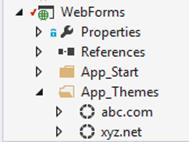
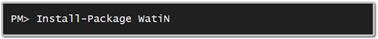

# 第四章 ASP.NET 网页表单

## 简介

[ASP.NET Web Forms](http://www.asp.net/webforms)是用引入的原始框架。NET 进行网络开发。可能它成功的原因在于实现简单的场景有多容易，包括数据绑定、AJAX 功能、在回发之间保持控制状态以及执行用户身份验证和授权。它的批评者指出，所有的魔力都伴随着性能、过度的复杂性、页面的易错性和控制生命周期方面的成本；并且一直在推动更新的技术，比如 MVC。事实上，在我看来，一些复杂的需求，比如 SharePoint(基于网络表单)解决的需求，用 MVC 实现起来太难了，如果不是不可能的话。

在本章中，我们将看到 ASP.NET 网络表单在编写多租户应用程序时必须提供哪些机制，也就是说，在品牌推广方面。

注意:即使看起来 MVC 似乎正在接管，请不要搞错——Web Forms 仍然会存在很长一段时间。诚然，ASP.NET 5 将不会支持 Web Forms，至少在其初始版本中不会，但 4.x 系列将与版本 5 共存，并将继续开发 Web Forms。关于 MVC vs Web Forms 的指针和讨论，请查看这个[微软 Curah](https://curah.microsoft.com/224600/aspnet-mvc-vs-aspnet-webforms) 和[迪诺·埃斯波西托关于这个主题的观点](https://msdn.microsoft.com/en-us/magazine/dd942833.aspx)。

表 5:品牌概念

| 概念 | 应用程序接口 |
| --- | --- |
| 品牌宣传 | 母版页 |
| 主题和皮肤 |
| 证明 | ASP.NET 会员/ASP.NET 身份 |
| 工作流程 | 统一/公共服务定位器 |
| 数据模型 | 实体框架代码优先或 NHibernate |

## 品牌化

ASP.NET 网络表单主要提供两种品牌推广技术:

*   [**主版页面**](https://msdn.microsoft.com/en-us/library/wtxbf3hh%28v=vs.140%29.aspx) :共享布局(可能还有功能)，定义单个页面可以添加内容的整体外观和感觉；它通过定义区域(内容占位符)工作，可能带有默认内容，页面可以覆盖这些内容，同时保持全局布局。
*   [**主题和皮肤**](https://msdn.microsoft.com/en-us/library/ykzx33wh%28v=vs.140%29.aspx) :自动应用于所有页面的控件属性设置和 CSS 样式表文件的命名集合。全部**。 **`App_Themes`** 下主题文件夹中的 css** 文件会自动添加到所有页面；所有控件属性都应用于标记中声明的所有控件，除非在那里被显式重写。

### 母版页

在母版页中，我们可以像在普通页面中一样添加相同的标记——HTML 和 ASP.NET 控件声明，但是我们也可以添加**内容占位符**:

代码示例 35

```cs
          <%@ Master Language="C#" CodeBehind="Site.Master.cs" Inherits="WebForms.Site" %>
          <!DOCTYPE html>
          <html>
          <head runat="server">
               <title>
                     <asp:ContentPlaceHolder ID="title" runat="server"/>
               </title>
               <asp:ContentPlaceHolder ID="head" runat="server">
                     Default Head content
               </asp:ContentPlaceHolder>
          </head>
          <body>
               <form runat="server">
                     <asp:ContentPlaceHolder ID="header" runat="server" />
                     <div>
                           <asp:ContentPlaceHolder ID="body" runat="server"/>
                     </div>
                     <asp:ContentPlaceHolder ID="footer" runat="server" />
               </form>
          </body>
          </html>

```

[内容占位符](https://msdn.microsoft.com/en-us/library/system.web.ui.webcontrols.contentplaceholder.aspx)元素表示母版页中的“可扩展”区域或孔。页面可能包含提供内容的[内容](https://msdn.microsoft.com/en-us/library/system.web.ui.webcontrols.content.aspx)元素，从而覆盖母版页中定义的内容。母版页通常在页面的标记中分配:

代码示例 36

```cs
          <%@ Page Language="C#" MasterPageFile="~/Site.Master" CodeBehind="Default.aspx.cs" Inherits="WebForms.Default" %>
          <asp:Content ContentPlaceHolderID="title" runat="server">
                This is the title
          </asp:Content>
          <asp:Content ContentPlaceHolderID="head" runat="server">
                This is the overridden head
          </asp:Content>
          <asp:Content ContentPlaceHolderID="body" runat="server">
               Body content goes here
          </asp:Content>

```

您可以看到，并非母版页中定义的所有内容占位符都在该页中使用。此外， **`head`** 占位符的内容在页面中被覆盖，这是完全正常的。

内容占位符占用其包含的 HTML 元素的空间，因此，例如，两个母版页可以定义为:

代码示例 37

```cs
          <!-- master page 1 -->
          <table>
                <tr>
                     <td><asp:ContentPlaceHolder ID="first" runat="server" /></td>
                     <td><asp:ContentPlaceHolder ID="second" runat="server" /></td>
               </tr>
         </table>

```

以及:

代码示例 38

```cs
          <!-- master page 2 -->
         <table>
               <tr>
                     <td><asp:ContentPlaceHolder ID="first" runat="server" /></td>
               </tr>
               <tr>
                     <td><asp:ContentPlaceHolder ID="second" runat="server" /></td>
               </tr>
         </table>

```

我不是说布局要用 HTML 表格；这只是为了说明一点:无论使用母版页 1 还是母版页 2，内容都会有所不同。

如果您还记得，我们在第 3 章`ITenantConfiguration`中指定的租户配置界面包含一个`MasterPage`属性。我们将利用这个属性，根据当前的租户，自动设置用于页面的母版页。

有两种方法可以设置母版页:

*   使用 [@Page](https://msdn.microsoft.com/en-us/library/vstudio/ydy4x04a%28v=vs.100%29.aspx) 指令的[主页面文件](https://msdn.microsoft.com/en-us/library/vstudio/ydy4x04a%28v=vs.100%29.aspx)属性，在页面的标记中声明性地
*   通过编程，使用[页面。主页面文件](https://msdn.microsoft.com/en-us/library/system.web.ui.page.masterpagefile.aspx)属性

母版页只能在[页之前或期间以编程方式设置。页面生命周期的 PreInit](https://msdn.microsoft.com/en-us/library/system.web.ui.page.preinit.aspx) 事件；此后，任何更改它的尝试都将导致引发异常。如果我们想自动设置母版页，而不强加一个基页类，我们应该为此编写一个自定义模块:

代码示例 39

```cs
          public sealed class MultiTenancyModule : IHttpModule
         {
               public void Dispose() { }

               public void Init(HttpApplication context)
               {
                     context.PreRequestHandlerExecute += OnPreRequestHandlerExecute;
               }

               public static String MasterPagesPath { get; set; }
                     private void OnPreRequestHandlerExecute(Object sender, EventArgs e)
               {
                     var tenant = TenantsConfiguration.GetCurrentTenant();
                     var app = sender as HttpApplication;
                     if ((app != null) && (app.Context != null))
                     {
                           var page = app.Context.CurrentHandler as Page;
                           if (page != null)
                           {
                                 page.PreInit += (s, args) =>
                                 {
                                      var p = s as Page;     
                                      if (!String.IsNullOrWhiteSpace
                                              (tenant.MasterPage))
                                      {
                                            //set the master page
                                            p.MasterPageFile =
                                            String.Format("{0}/{1}.Master",
                                            MasterPagesPath,
                                            tenant.MasterPage);
                                      }
                                 };
                           }
                     }
               }
         }

```

存在 **`MasterPagesPath`** 静态属性，以便我们可以为母版页指定一个替代位置，以防我们不希望它们位于网站的根目录。如果您的母版页位于此处，将其留空是安全的。

该模块连接到当前页面的 [PreInit](https://msdn.microsoft.com/en-us/library/system.web.ui.page.preinit.aspx) 事件，并在事件处理程序中检查是否设置了当前租户的`MasterPage`属性，如果设置了，则将其设置为当前页面的母版页。

### 主题和皮肤

要应用主题或皮肤，我们需要在`App_Themes`下创建一个文件夹:



图 12:主题文件夹

我们可以有任意数量的文件夹，但只有一个可以设置为当前主题。

#### 主题

一个主题由一个或多个**组成。位于主题文件夹内部的 css** 文件；即使在其他文件夹中，ASP.NET 也确保所有文件夹都被添加到页面中。有三种方法可以设置主题:

*   通过 **Web.config** 的[页面](https://msdn.microsoft.com/en-us/library/950xf363(v=vs.100).aspx)元素的`styleSheetTheme`属性
*   通过设置**的[页面](https://msdn.microsoft.com/en-us/library/vstudio/ydy4x04a(v=vs.100).aspx)指令中的`StyleSheetTheme`属性。aspx** 文件
*   为[页面](https://msdn.microsoft.com/en-us/library/System.Web.UI.Page.aspx)类的[样式表主题](https://msdn.microsoft.com/en-us/library/system.web.ui.page.stylesheettheme.aspx)属性赋值

前两个在动态内容上玩得不太好，但最后一个玩得很好。它也优先于其他两个:

*   `Web.config`设置是将应用于所有页面的第一个设置，除非在其他位置另有规定。
*   然后是`.aspx`属性，只适用于那个特定的页面。
*   最后，`page`属性，如果设置直到[页面。](https://msdn.microsoft.com/en-us/library/system.web.ui.page.preinit.aspx)事件，是利用的一个。

#### 外皮

一个皮肤由一个或多个**组成。皮肤**文件，也在`App_Themes`下面的文件夹下。每个文件包含多个控制声明，比如我们在**中找到的那些。aspx** ，**。ascx** 或**。主**标记文件，带有一些控件属性的值:

代码示例 40

```cs
          <asp:TextBox runat="server" SkinID="Email" placeholder="Email address"/>
         <asp:TextBox runat="server" Text="<enter value>"/>
         <asp:Button runat="server" SkinID="Dark" BackColor="DarkGray" ForeColor="Black"/>
         <asp:Button runat="server" SkinID="Light" BackColor="Cyan" ForeColor="Green"/>
         <asp:Image runat="server" onerror="this.src = 'missing.png'" />

```

只有具有值为 **`true`** 的[功能表属性](https://msdn.microsoft.com/en-us/library/system.web.ui.themeableattribute.aspx)(如果未设置属性，则为默认值)并且位于同样将[功能表属性](https://msdn.microsoft.com/en-us/library/system.web.ui.themeableattribute.aspx)设置为 **`true`** (或根本没有属性)的控件中的属性，或者没有相应属性的普通属性(如代码中第一个 **`TextBox`** 或 **`onerror`** 声明中的 **`Image`** 皮肤文件。

这里我们可以看到一些不同的选项:

*   任何 [SkinID](https://msdn.microsoft.com/en-us/library/system.web.ui.webcontrols.webcontrol.skinid.aspx) 属性设置为 **`Email`** 的[文本框](https://msdn.microsoft.com/en-us/library/system.web.ui.webcontrols.textbox.aspx)将获得一个 HTML5 [占位符](https://developer.mozilla.org/en/docs/Web/HTML/Element/Input#attr-placeholder)属性，这基本上是一个水印；请注意，这不是[文本框](https://msdn.microsoft.com/en-us/library/system.web.ui.webcontrols.textbox.aspx)控件或其任何基类的属性；相反，它将被转换为生成的 HTML 标记中同名的属性。
*   所有没有[皮肤标识](https://msdn.microsoft.com/en-us/library/system.web.ui.webcontrols.webcontrol.skinid.aspx)设置的[文本框](https://msdn.microsoft.com/en-us/library/system.web.ui.webcontrols.textbox.aspx)控件都将有文本 **`“<enter value>”`**
*   使用 **`“Dark”`** 的[皮肤识别号](https://msdn.microsoft.com/en-us/library/system.web.ui.webcontrols.webcontrol.skinid.aspx)的[按钮](https://msdn.microsoft.com/en-us/library/system.web.ui.webcontrols.button.aspx)控件将获得比使用 **`“Light”`** 的[皮肤识别号](https://msdn.microsoft.com/en-us/library/system.web.ui.webcontrols.webcontrol.skinid.aspx)控件更暗的外观
*   任何引发 JavaScript [onerror](https://developer.mozilla.org/en-US/docs/Mozilla/Tech/XUL/image#a-onerror) 事件的[图像](https://msdn.microsoft.com/en-us/library/system.web.ui.webcontrols.image.aspx)控件都将通过 JavaScript 事件处理程序设置一个替代图像。

注意:我选择这些例子是为了清楚主题属性不一定意味着只有用户界面设置。

[SkinID](https://msdn.microsoft.com/en-us/library/system.web.ui.webcontrols.webcontrol.skinid.aspx) 属性是可选的；如果一切就绪，ASP.NET 将尝试寻找任何关于当前主题的宣言**。符合其值的皮肤**文件。否则，它将退回到不包含 [SkinID](https://msdn.microsoft.com/en-us/library/system.web.ui.webcontrols.webcontrol.skinid.aspx) 属性的控件声明。

与主题一样，有三种方法可以设置皮肤文件夹:

*   通过 **Web.config** 的[页面](https://msdn.microsoft.com/en-us/library/950xf363(v=vs.100).aspx)元素的`Theme`属性
*   通过在的[页面](https://msdn.microsoft.com/en-us/library/vstudio/ydy4x04a(v=vs.100).aspx)指令中设置`Theme`属性。ASPX 档案
*   为[页面](https://msdn.microsoft.com/en-us/library/System.Web.UI.Page.aspx)类的[主题](https://msdn.microsoft.com/en-us/library/system.web.ui.page.stylesheettheme.aspx)属性赋值。

皮肤和样式表主题虽然是不同的东西，但却是密切相关的，所以通过设置[主题](https://msdn.microsoft.com/en-us/library/system.web.ui.page.stylesheettheme.aspx)属性，两者使用相同的主题文件夹是一个好主意。如果你这样做了，ASP.NET 将解析所有的**。皮肤**文件，也包括任何**。在主题文件夹内找到的 css** 文件。

#### 自动设置主题

知道这一点，让我们改变我们的`MultiTenancyModule`，这样除了设置母版页，它还为当前页面设置主题。让我们为每个租户在其名称下创建一个主题，并自动设置它:

代码示例 41

```cs
          public sealed class MultiTenancyModule : IHttpModule
         {
               //rest goes here
               private void OnPreRequestHandlerExecute(Object sender, EventArgs e)
               {
                     var tenant = TenantsConfiguration.GetCurrentTenant();
                     var app = sender as HttpApplication;
                     if ((app != null) && (app.Context != null))
                     {
                           var page = app.Context.CurrentHandler as Page;
                           if (page != null)
                           {
                                 page.PreInit += (s, args) =>
                                 {                      
                                      var p = s as Page;     
                                      if (!String.IsNullOrWhiteSpace(tenant))
                                      {
                                            //set the theme
                                            p.Theme = tenant.Theme;
                                            p.MasterPageFile =
                                            String.Format("{0}/{1}.Master",
                                            MasterPagesPath, p.MasterPage);
                                      }
                                 };
                           }
                     }
               }
         }

```

#### 特定于租户的图像

您也可以将其他内容(如图像)保存在主题文件夹中。这是很好的，如果我们想有不同的图像为每个租户相同的名称。问题是你不能在你的页面中直接引用这些图片，因为你事先不知道哪个主题——也就是哪个租户——会访问这个页面。比如，你是把图片指向**~/App _ Themes/ABC . com/logo . png "**还是**" ~/App _ Themes/XYZ . net/logo . png "**？

幸运的是，ASP.NET Web Forms 提供了一个名为[表达式构建器](https://msdn.microsoft.com/en-us/library/d5bd1tad%28v=vs.140%29.aspx)的可扩展性机制，在这里派上了用场。如果您已经在网页表单页面中使用了资源，那么您已经使用了 [**资源**](https://msdn.microsoft.com/en-us/library/system.web.compilation.resourceexpressionbuilder%28v=vs.110%29.aspx) 表达式生成器。简而言之，表达式生成器获取作为参数传递的字符串，尝试理解它，然后向它所绑定的属性返回一些内容(表达式生成器总是在服务器端控件的属性上下文中运行)。如何解析参数以及如何使用它取决于您。

让我们编写一个表达式生成器，它接受一个部分 URL，并使其相对于当前主题。请考虑 **`ThemeFileUrl`** 表达式生成器:

代码示例 42

```cs
          [ExpressionPrefix("ThemeFileUrl")]
          public class ThemeFileUrlExpressionBuilder : ExpressionBuilder
         {          
               public override Object EvaluateExpression(Object target, 
                     BoundPropertyEntry entry, Object parsedData, 
                     ExpressionBuilderContext context)
               {
                     if (String.IsNullOrWhiteSpace(entry.Expression))
                     {
                           return base.EvaluateExpression(target, entry, parsedData,
                                 context);
                     }
                     else
                     {
                           return GetThemeUrl(entry.Expression);
                     }
               }

               public override Boolean SupportsEvaluate { get { return true; } }
                     public override CodeExpression GetCodeExpression(BoundPropertyEntry entry,            Object parsedData, ExpressionBuilderContext context)
               {
                     if (String.IsNullOrWhiteSpace(entry.Expression))
                     {
                           return new CodePrimitiveExpression(String.Empty);
                     }
                     else
                     {
                           return new CodeMethodInvokeExpression(
                                 new CodeMethodReferenceExpression(
                                 new CodeTypeReferenceExpression(this.GetType()), 
                                 "GetThemeUrl"),
                                 new CodePrimitiveExpression(entry.Expression));
                     }
               }

               public static String GetThemeUrl(String fileName)
               {
                     var page = HttpContext.Current.Handler as Page;
                     //we can use the Page.Theme property because, at this point, the MultiTenancyModule has already run, and has set it properly
                     var theme = page.Theme;
                     var path = (page != null) ? String.Concat("/App_Themes/",
                           theme, "/", fileName) : String.Empty;
                     return path;
               }
         }

```

在使用表达式生成器之前，我们需要在[system.web/compilation/expressionBuilders](https://msdn.microsoft.com/en-us/library/ms228120(v=vs.85).aspx)部分的 **Web.config** 文件中注册(请用正确的值替换“**我的命名空间”**和“**我的程序集”**):

代码示例 43

```cs
          <system.web>
                <compilation debug="true" targetFramework="4.5">
                      <expressionBuilders>
                            <add expressionPrefix="ThemeFileUrl" type="MyNamespace
          .ThemeFileUrlExpressionBuilder, MyAssembly"/>
                      </expressionBuilders>
                </compilation>
          </system.web>

```

现在，我们可以在页面中使用它作为:

代码示例 44

```cs
          <asp:Image runat="server" ImageUrl="<%$ ThemeFileUrl:/logo.jpg %>" />

```

**`ThemeFileUrl`** 表达式生成器将确保使用正确的特定主题路径。

### 显示或隐藏租户特定的内容

表达式生成器的另一个用途是显示或隐藏指向特定租户的内容，而无需编写代码。我们创建`MatchTenant`表达式生成器:

代码示例 45

```cs
          [ExpressionPrefix("MatchTenant")]
          public sealed class MatchTenantExpressionBuilder : ExpressionBuilder
         {
               public override Object EvaluateExpression(Object target, 
                     BoundPropertyEntry entry, Object parsedData, 
                     ExpressionBuilderContext context)
               {
                     if (String.IsNullOrWhiteSpace(entry.Expression))
                     {
                           return base.EvaluateExpression(target, entry, parsedData,
                                 context);
                     }
                     else
                     {
                           return MatchTenant(entry.Expression);
                     }
               }

               public override Boolean SupportsEvaluate { get { return true; } }
                     public override CodeExpression GetCodeExpression(BoundPropertyEntry entry,            Object parsedData, ExpressionBuilderContext context)
               {
                     if (String.IsNullOrWhiteSpace(entry.Expression))
                     {
                           return new CodePrimitiveExpression(String.Empty);
                     }
                     else
                     {
                           return new CodeMethodInvokeExpression(
                                 new CodeMethodReferenceExpression(
                                 new CodeTypeReferenceExpression(
                                 this.GetType()), "MatchTenant"), 
                                 new CodePrimitiveExpression(entry.Expression));
                     }
               }

               public static Boolean MatchTenant(String tenant)
               {
                     var currentTenant = TenantsConfiguration.GetCurrentTenant();

                     if (tenant == currentTenant.Name)
                     {
                           return true;
                     }

                     if (tenant.StartsWith("!"))
                     {
                           if (tenant.Substring(1) != currentTenant.Name)
                           {
                                 return false;
                           }
                     }

                     return false;
               }
         }

```

我们在**网络配置**文件中注册它:

代码示例 46

```cs
          <system.web>
                <compilation debug="true" targetFramework="4.5">
                      <expressionBuilders>
                            <add expressionPrefix="ThemeFileUrl" type="MyNamespace
          .ThemeFileUrlExpressionBuilder, MyAssembly"/>
                            <add expressionPrefix="MatchTenant" type="MyNamespace
          .MatchTenantExpressionBuilder, MyAssembly"/>
                      </expressionBuilders>
                </compilation>
          </system.web>

```

两种示例用法:

代码示例 47

```cs
          <asp:Label runat="server" Text="abc.com only" Visible="<%$ MatchTenant:abc.com %>"/>
          <asp:Label runat="server" Text="Anything but abc.com" Visible="<%$ MatchTenant:!abc.com %>"/>

```

通过添加**“！”**符号为租户名称，我们否定这个规则。

## 安全

### 授权

[ASP.NET 网页表单中的授权](https://msdn.microsoft.com/en-us/library/ks310b8y(v=vs.100).aspx)由[文件授权模块](https://msdn.microsoft.com/en-us/library/system.web.security.fileauthorizationmodule%28v=vs.110%29.aspx)和[URL 授权模块](https://msdn.microsoft.com/en-us/library/system.web.security.urlauthorizationmodule%28v=vs.110%29.aspx)模块处理。这些模块在设计时并没有真正考虑到可扩展性，所以让它们做我们想要的事情并不容易。

它基于两个概念:[经过身份验证或未经身份验证的用户](https://msdn.microsoft.com/en-us/library/eeyk640h(v=vs.110).aspx)和[用户角色](https://msdn.microsoft.com/en-us/library/9ab2fxh0(v=vs.110).aspx)。内置的授权机制允许我们在 web 应用程序根目录下为每个路径定义一个页面或一个文件系统文件夹，如果资源可以通过以下方式访问:

*   匿名(未认证)用户
*   特定的用户名(例如，**【彼得·杰克逊】****【约翰多伊】**等。)
*   一组特定角色之一(例如，**“管理员”**、**“开发人员”**等)。)
*   所有人(默认)

如您所见，这些概念和租户之间没有明显的映射，但是我们可以使用角色作为租户的名称来限制对某些资源的访问。我们在 **Web.config** 文件的[位置](https://msdn.microsoft.com/en-us/library/ms178692(v=vs.100).aspx)部分中这样做:

代码示例 48

```cs
          <location path="AbcComFolder">
                <system.webServer>
                      <security>
                            <authorization>
                                  <add accessType="Deny" users="?"/>
                                  <add accessType="Allow" roles="abc.com"/>
                            </authorization>
                      </security>
                </system.webServer>
          </location>

```

这个例子使用了一个角色“**abc.com**，这也是一个租户的名字。但是，如果我们需要在访问规则中同时使用角色和租户，事情就会变得有点棘手。另一种选择是限制当前租户调用某些方法。一个使用[的例子。NET 的内置声明式安全性](https://msdn.microsoft.com/en-US/library/84kh7ht8%28v=vs.80%29.aspx)可能是:

代码示例 49

```cs
          [Serializable]
          public sealed class TenantPermission : IPermission
         {
               public TenantPermission(params String [] tenants)
               {
                     this.Tenants = tenants;
               }

               public IEnumerable<String> Tenants { get; private set; }

               public IPermission Copy()
               {
                     return new TenantPermission(this.Tenants.ToArray());
               }

               public void Demand()
               {
                     var tenant = TenantsConfiguration.GetCurrentTenant();

                     if (!this.Tenants.Any(t => tenant.Name() == t))
                     {    
                           throw new SecurityException
                           ("Current tenant is not allowed to access this resource.");
                     }
               }

               public IPermission Intersect(IPermission target)
               {
                     var other = target as TenantPermission;

                     if (other == null)
                     {
                           throw new ArgumentException
                                  ("Invalid permission.", "target");
                     }

                     return new TenantPermission
                            (this.Tenants.Intersect(other.Tenants).ToArray());
               }

               public Boolean IsSubsetOf(IPermission target)
               {
                     var other = target as TenantPermission;

                     if (other == null)
                     {
                           throw new ArgumentException
                                  ("Invalid permission.", "target");
                     }

                     return this.Tenants.All(t => other.Tenants.Contains(t));
               }

               public IPermission Union(IPermission target)
               {
                     var other = target as TenantPermission;

                     if (other == null)
                     {
                           throw new ArgumentException
                                  ("Invalid permission.", "target");
                     }

                     return new TenantPermission
                            (this.Tenants.Concat(other.Tenants).Distinct()
                                 .ToArray());
               }

               public void FromXml(SecurityElement e)
               {
                     if (e == null)
                     {
                           throw new ArgumentNullException("e");
                     }

                     var tenantTag = e.SearchForChildByTag("Tenants");

                     if (tenantTag == null)
                     {
                           throw new ArgumentException
                                  ("Element does not contain any tenants.", "e");
                     }

                     var tenants = tenantTag.Text.Split(',').Select(t => t.Trim());

                     this.Tenants = tenants;
               }

               public SecurityElement ToXml()
               {
                     var xml = String
                           .Concat("<IPermission class=\"", 
                           this.GetType().AssemblyQualifiedName,
                           "\" version=\"1\" unrestricted=\"false\"><Tenants>",
                           String.Join(", ", this.Tenants),
                           "</Tenants></IPermission>");
                     return SecurityElement.FromString(xml);
               }
         }

         [Serializable]
         [AttributeUsage(AttributeTargets.Method | AttributeTargets.Class, 
               AllowMultiple = true, Inherited = false)]
          public sealed class RequiredTenantPermissionAttribute : CodeAccessSecurityAttribute
         {
               public RequiredTenantPermissionAttribute(SecurityAction action) : 
                     base(action) {}

               public override IPermission CreatePermission()
               {
                     return new TenantPermission(this.Tenants.Split(',')
                           .Select(t => t.Trim()).ToArray());
               }

               public String Tenants { get; set; }
         }

```

当应用于一个方法时，`RequiredTenantPermissionAttribute`属性进行运行时检查，在这种情况下，它根据允许的租户列表(属性`Tenants`)检查当前租户。如果没有匹配，则会引发异常。一个例子:

代码示例 50

```cs
          [RequiredTenantPermission(SecurityAction.Demand, Tenants = "abc.com")]
          public override void OnLoad(EventArgs e)
         {
               //nobody other than abc.com can access this method
               base.OnLoad(e);
         }

```

在第 6 章中，我们将研究另一种也可以用于限制访问的技术。

## 单元测试

Web Forms 的单元测试非常困难，因为很难重现页面和控件使用的事件模型。不过这也不是不可能的，像 [WatiN](http://watin.org/) 这样的工具让这成为可能。WatiN 允许使用我们选择的浏览器检测网站。我在这里不会详细介绍它，但是看一下这个示例代码，我想您会明白:

代码示例 51

```cs
          using (var browser = new IE("http://abc.com"))
          {
                 Assert.IsTrue(browser.ContainsText("ABC"));
                 browser.Button(Find.ByName("btnGo")).Click();
          }

```

为了使用 WatiN，只需使用 NuGet 添加对它的引用:



图 13:添加 WatiN NuGet 包