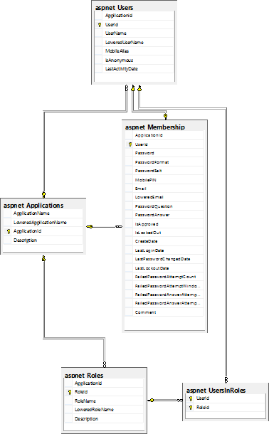
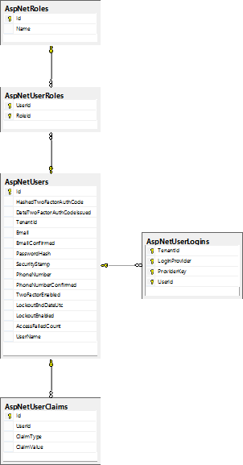
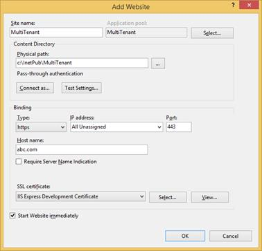
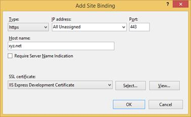

# 第十章安全

## 简介

所有应用程序都需要加强安全性。多租户应用程序有额外的要求，在某种意义上，某些租户允许的东西可能不应该用于其他租户。本章讨论编写多租户应用程序时要考虑的一些安全机制。

## 认证

将要使用的身份验证机制应该能够:

*   登录与当前租户关联的用户
*   拒绝来自与他们没有关联的租户的用户登录

让我们看看如何实现这些需求。

### ASP.NET 会员和角色提供者

古老的[ASP.NET 会员和角色提供者](https://msdn.microsoft.com/en-us/library/aa354509%28v=vs.110%29.aspx)是在 ASP.NET 2.0 中引入的可扩展[提供者模型的一部分。成员资格提供者负责验证和管理用户，角色提供者将这些用户与组相关联。这个框架已经存在多年了，但是因为可能有必要支持它(棕色地带开发)，所以我决定值得一提。](https://msdn.microsoft.com/en-us/library/aa479020.aspx)

该框架包括这些提供程序的两种实现:一种是使用 Windows 工具进行身份验证和组成员身份验证，另一种是使用基于 SQL Server 的对象。

您可以想象，SQL Server 版本更加灵活，因为它们不会强制我们为用户和组使用 Windows(或活动目录)帐户。他们使用的模式是:



图 30:ASP.NET 成员和角色提供者模式

理解这个模式的关键是这些表:

表 7:ASP.NET 成员和角色提供者表及其用途

| 桌子 | 目的 |
| --- | --- |
| 应用程序 | 存储成员资格和角色提供者知道的所有应用程序 |
| aspnet _ Users | 存储与应用程序相关联的所有注册用户 |
| 角色 | 存储所有角色 |
| aspnet _ 成员资格 | 关于注册用户的附加信息 |
| aspnet_UsersInRoles | 用户与角色的关联 |

用户表和角色表都依赖于应用程序表，这意味着不同的应用程序可以有不同的用户和角色。一个数据库可以容纳几个注册用户和角色，可能用于不同的网站，每个都作为一个独立的应用程序；在这种情况下，每个网站将由不同的应用程序名称来标识。该配置通常在全局 ASP.NET 配置文件 **Machine.config** 中静态定义，其相关部分在此显示，略作简化:

代码示例 126

```cs
          <membership defaultProvider="AspNetSqlMembershipProvider">
              <providers>
                  <add name="AspNetSqlMembershipProvider" applicationName="/" 
                      type="System.Web.Security.SqlMembershipProvider" 
                      connectionStringName="LocalSqlServer" />
              </providers>
          </membership>
          <roleManager enabled="true" defaultProvider="AspNetSqlRoleProvider">
              <providers>
                  <add name="AspNetSqlRoleProvider" connectionStringName="LocalSqlServer" 
                      applicationName="/" type="System.Web.Security.SqlRoleProvider" />
                  <add name="AspNetWindowsTokenRoleProvider" applicationName="/" 
                      type="System.Web.Security.WindowsTokenRoleProvider" />
                </providers>
          </roleManager>

```

很容易看出，成员和角色提供者的“应用程序”概念与“租户”的概念非常匹配问题是应用( [applicationName](https://msdn.microsoft.com/en-us/library/vstudio/whae3t94%28v=vs.100%29.aspx) 属性)被硬编码在 **Web.config** 文件中。但是，因为它在提供程序实现类中的关联属性( [ApplicationName](https://msdn.microsoft.com/en-us/library/system.web.security.membershipprovider.applicationname(v=vs.110).aspx) )是虚拟的，所以我们可以让类继承包含的属性( [SqlMembershipProvider](https://msdn.microsoft.com/en-us/library/system.web.security.sqlmembershipprovider(v=vs.110).aspx) 和 [SqlRoleProvider](https://msdn.microsoft.com/en-us/library/system.web.security.sqlroleprovider%28v=vs.110%29.aspx) )并重写该属性，以便它在每次调用时返回正确的值:

代码示例 127

```cs
          //Membership provider
          public class MultitenantSqlMembershipProvider : SqlMembershipProvider
         {
               public override String ApplicationName
               {
                     get { return TenantsConfiguration.GetCurrentTenant().Name; }
                     set { /*nothing to do here*/ }
               }
         }

          //Role provider
          public class MultitenantSqlRoleProvider : SqlRoleProvider
         {
               public override String ApplicationName
               {
                     get { return TenantsConfiguration.GetCurrentTenant().Name; }
                     set { /*nothing to do here*/ }
               }
         }

```

|  | 注意:其他关系数据库也有提供者实现，比如甲骨文和 MySQL。因为实现完全相同，所以我只显示了 SQL Server 版本。 |

现在，我们需要将新的实现注册到 **Machine.config** (用于机器范围的可用性)或 **Web.config** 文件中:

代码示例 128

```cs
          <membership defaultProvider="MultitenantSqlMembershipProvider">
              <providers>
                  <add name="MultitenantSqlMembershipProvider" 
                      type="MyNamespace.MultitenantSqlMembershipProvider, MyAssembly" 
                     connectionStringName="LocalSqlServer" />
              </providers>
          </membership>
          <roleManager enabled="true" defaultProvider="MultitenantSqlRoleProvider">
              <providers>
                  <add name="MultitenantSqlRoleProvider" 
                     connectionStringName="LocalSqlServer" 
                     type="MyNamespace.MultitenantSqlRoleProvider, MyAssembly" />
                </providers>
          </roleManager>

```

|  | 提示:即使我选择谈论会员提供商，我也绝不认为您应该在新的(绿地)开发中使用它。根据微软的说法，未来是[ASP.NET 身份](http://www.asp.net/identity)(至少目前是这样)，我强烈建议你进入其中。这里有一个关于如何从会员提供商迁移到 ASP.NET 身份的好帖子。 |

### ASP.NET 身份

向您的 ASP.NET 应用程序提供身份验证的更好方法是[ASP.NET 身份](http://www.asp.net/identity)框架。微软设计这个框架是为了弥补旧提供商模式的缺点和问题，并为新的认证标准提供支持，如 [OAuth](http://oauth.net/) 。不幸的是，设计它的微软架构师忽略了对多租户的内置支持。然而，一切都没有失去，因为它已经被社区以[詹姆斯撇去](https://github.com/JSkimming)和`AspNet.Identity.EntityFramework.Multitenant`包的形式为我们实施了。ASP.NET 身份是提供者不可知的，这意味着它可以使用，例如，实体框架或 NHibernate 作为它的持久性引擎，但是 James 的实现依赖于实体框架。

|  | 注意:有一个名为 NHibernate 的包。Antonio Bastos 的 AspNet.Identity 提供了一个 NHibernate 的 AspNet 身份的实现。你可以在这里获得 NuGet 包[，在这里](https://www.nuget.org/packages/NHibernate.AspNet.Identity/)获得源代码[。](https://github.com/milesibastos/NHibernate.AspNet.Identity) |

因此，使用 NuGet 添加 ASP.NET 身份包后，您需要添加`AspNet.Identity.EntityFramework.Multitenant`包:


图 31:支持多租户的 ASP.NET 身份实体框架

完成后，我们需要对项目中的 ASP.NET 身份类进行一些更改。我们感兴趣的阶层是`ApplicationUser`，应该改变，从`MultitenantIdentityUser`继承，而不是`IdentityUser`:

代码示例 129

```cs
          public class ApplicationUser : MultitenantIdentityUser
         {
               //rest goes here
         }

```

类`MultitenantIdentityUser`已经提供了一个名为`TenantId`的属性，用来区分不同的租户。该属性被映射到`AspNetUserLogins`表的`TenantId`列。模型如下所示:



图 32:ASP.NET 身份模型

除此之外，我们需要更改我们的[数据库上下文](https://msdn.microsoft.com/en-us/library/system.data.entity.dbcontext%28v=vs.113%29.aspx)派生类，使其也从`MultitenantIdentityDbContext<ApplicationUser>`继承:

代码示例 130

```cs
          public class ApplicationDbContext : MultitenantIdentityDbContext<ApplicationUser>
         {
               //rest goes here
         }

```

最后，我们需要教 ASP.NET 身份如何获得当前租户。为了做到这一点，我们需要像这样改变`ApplicationUserManager`类的`Create`方法:

代码示例 131

```cs
          public static ApplicationUserManager Create(
          IdentityFactoryOptions<ApplicationUserManager> options, IOwinContext context)
         {
               var tenant = TenantsConfiguration.GetCurrentTenant();                  var manager = new ApplicationUserManager(
                     new MultitenantUserStore<ApplicationUser>(
                           context.Get<ApplicationDbContext>())
                                 { TenantId = tenant.Name });
               //rest goes here
         }

```

`ApplicationUserManager.Create`方法注册为我们用户商店的工厂方法。无论何时调用它，它都将使用当前的租户名称。这就是 it—ASP.NET 身份可以使用的全部方式，就像没有多租户支持一样。

|  | 注意:詹姆斯略读提供了他的 AspNet 的源代码。GitHub [中的 identity . entity framework . multi tenant 包在这里](https://github.com/JSkimming/AspNet.Identity.EntityFramework.Multitenant)。概述这些变更的实际提交是这里的。 |

## HTTPS

如果我们要遵循主机头方法，并且我们想要使用 HTTPS，我们将需要为每个指定的租户提供一个证书。现在，我们有两个选择:

*   从根授权机构获取证书
*   在 IIS 管理器中生成我们自己的(虚拟的)证书，如果我们不关心得到关于无效根授权的消息

出于开发目的，我们可以使用虚拟证书。我们需要告诉 IIS 使用它:



图 33:创建一个新站点



图 34:向站点添加绑定

|  | 注意:在不可能的情况下，我们的所有租户将共享至少部分域，我们可以使用通配符证书；否则，我们将需要每个租户一个，这可能会很昂贵。 |

## 应用程序池

正如在第 2 章中提到的，每个租户拥有不同的应用程序池允许我们在不同的帐户下运行应用程序。例如，如果每个用户在服务器上都有不同的默认数据库，并且您没有在连接字符串中指定初始数据库，这可能会很有帮助。根据数据库服务器的配置，每个租户将登陆自己的数据库。然而，更明智的做法是不信任分配给用户的默认数据库，并使用数据库分区或选择策略，这将在下一章中概述。

## 饼干

Cookies 存储在客户端，浏览器自己的存储中。默认情况下，它们被绑定到它们起源的域，如果我们要使用主机头策略，这很好，但是如果我们要使用另一个租户识别策略，就没那么好了。例如，如果我们对此不采取任何措施，如果用户决定浏览另一个租户的网站，那么在租户上下文中发送的 cookie 也将可用。除了路径(网址的相对部分)、域名和非 HTTPS 网站的可用性之外，Cookies 并没有提供很多选项。我们唯一可以玩的是密钥的名称:例如，我们可以添加一个前缀来标识 cookie 适用的租户，类似于:

代码示例 132

```cs
          var tenantCookies = HttpContext.Current.Request.Cookies.OfType<HttpCookie>()
               .Where(x => x.Name.StartsWith(String.Concat(tenant, ":")));

          var cookie = new HttpCookie();
         cookie.Name = String.Concat(tenant, ":", key);
         cookie.Value = value;
          HttpContext.Current.Response.Cookies.Add(cookie);

```