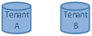
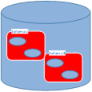
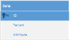

# 十一、数据访问

## 简介

问题:每个租户至少需要部分地拥有独立的数据甚至模式。

在多租户应用程序中访问数据时，有三种主要技术:

*   **单独的数据库**:每个租户的数据都保存在单独的数据库实例中，每个实例都有不同的连接字符串；多租户系统应该自动选择适合当前租户的系统



图 35:独立的数据库

*   **独立模式**:所有租户的数据都使用同一个数据库实例，但是每个租户都有一个独立的模式；并不是所有的关系数据库都正确支持这一点，例如，SQL Server 不支持，但 Oracle 支持。当我说 SQL Server 不支持这一点时，我并不是说它没有模式，只是它们没有像 Oracle 模式那样提供隔离机制，并且不可能为每个查询或每个连接指定默认使用的模式。



图 36:独立的模式

*   **分区数据**:所有租户的数据都保存在同一个物理实例和模式中，用一个分区列来区分租户；由框架来发布适当过滤数据的适当的 SQL 查询。



图 37:分区数据

|  | 注意:如果您有兴趣了解更多信息，本文介绍了 Oracle 和 SQL Server 在模式方面的一些差异。 |

至于实际检索和更新关系数据库中的数据，主要有两种方法:

*   使用 ADO.NET 或一些薄包装，如[企业库数据访问块](https://msdn.microsoft.com/en-us/library/dn440726(v=pandp.60).aspx)
*   使用对象关系映射器(ORM)，例如 [NHibernate](http://nhibernate.info) 或[实体框架](http://entityframework.codeplex.com)(代码优先)

关于这两种方法中哪一种更好的讨论超出了本书的范围，就我个人而言，它对我来说毫无意义:两者都有利弊。然而，表单提供了一些配置机制，允许根据某些条件自动过滤数据，例如租户的名称。因此，我们将讨论如何使用 ORMs NHibernate 和 Entity Framework Code First 进行多租户数据访问，我们将省略基于 SQL 的解决方案。

### 无酒精饮料

#### 不同的数据库

在 NHibernate 架构中，一个连接字符串被绑定到一个**会话工厂**。正是会话工厂构建了**会话**，进而封装了 ADO.NET**连接**。一般来说，拥有一个单一会话工厂是一个很好的做法；在我们的例子中，我们将需要每个租户一个(以及连接字符串)。

为了使会话工厂可被发现，我们将使用与本书前面相同的机制，那就是公共服务定位器。每个租户都有自己名下的`ISessionFactory`注册，每个会话工厂都指向一个同名的连接字符串。考虑下面的引导代码，它再次使用 Unity 作为控制反转(IoC)框架:

代码示例 133

```cs
          protected void Application_BeginRequest()
         {
               var tenant = TenantsConfiguration.GetCurrentTenant().Name;
               var sessionFactory = ServiceLocator.Current
                     .TryResolve<ISessionFactory>(tenant);
               if (sessionFactory == null)
               {
                     this.SetupSessionFactory(tenant);
               }
         }

          private void SetupSessionFactory(String tenant)
         {
               var cfg = new Configuration().DataBaseIntegration(x =>
                     {
                           x.ConnectionStringName = tenant;
                           //rest goes here
                     });
               //etc
               //get the Unity instance from the Common Service Locator – another option would be to encapsulate this in some class or to use a custom connection provider
               var unity = ServiceLocator.Current.GetInstance<IUnityContainer>();
               unity.RegisterInstance<ISessionFactory>(tenant,cfg.BuildSessionFactory());
         }

```

它是这样做的:当收到请求时，它从请求中获取租户名称，并检查公共服务定位器中是否已经有一个以该名称注册的会话工厂。如果没有，它将开始为当前租户构建和注册会话工厂的过程。

这段代码可以放在 **Global.asax.cs** 文件中，作为 [HttpApplication](https://msdn.microsoft.com/en-us/library/system.web.httpapplication.aspx) 派生类的实例方法，或者放在一个模块中，一个实现[ihttpmmodule](https://msdn.microsoft.com/en-us/library/system.web.ihttpmodule.aspx)的类中。推荐后者以允许代码重用和更好的可维护性，但是如果您要遵循这个路径，您将需要自己在 **Web.config** 文件的[system.webServer/modules](http://www.iis.net/configreference/system.webserver/modules)部分注册该模块:

代码示例 134

```cs
          <system.webServer>
                <modules>
                      <add name="MyModule" type="MyNamespace.MyModule, MyAssembly"/>
                </modules>
          </system.webServer>

```

因此，每当您希望打开会话时，首先需要为当前租户检索适当的会话工厂:

代码示例 135

```cs
          var tenant = TenantsConfiguration.GetCurrentTenant().Name;
          //lookup the session factory for the current tenant
          var sessionFactory = ServiceLocator.Current.GetInstance<ISessionFactory>(tenant);
          using (var session = sessionFactory.OpenSession())
         {
               //...
         }

```

|  | 注意:如果你想了解更多关于 NHibernate 架构的知识，我建议阅读 [NHibernate 简洁](http://www.syncfusion.com/resources/techportal/ebooks/nhibernate)，也在简洁系列中。 |

#### 不同的模式

NHibernate 和映射的问题在于，通常我们只有一个会话工厂和一个配置实例。因为是配置实例保存映射，然后将映射传递给会话工厂，最后传递给从中派生的会话，所以我们需要有不同的配置实例，每个租户一个。

下面是我们如何为当前租户配置模式:

代码示例 136

```cs
          public class MyMultitenantEntityClassMapping : ClassMapping<MyMultiTenanEntity>
         {
               public MyMultitenantEntityClassMapping()
               {
                     var tenant = TenantsConfiguration.GetCurrentTenant().Name;
                     this.Schema(tenant);
                     //rest goes here
               }
         }

```

或者，我们可以通过惯例做到这一点:

代码示例 137

```cs
          var mapper = new ConventionModelMapper();
          var tenant = TenantsConfiguration.GetCurrentTenant().Name;
         mapper.BeforeMapClass += (modelInspector, type, classCustomizer) =>
         {
               classCustomizer.Schema(tenant);
         };

```

|  | 提示:不要忘记模式名不能包含所有字符，通常只允许包含字母数字字符，因此您可能需要对租户名进行一些转换。 |

#### 数据分区

NHibernate 有一个名为**过滤器**的不错的特性，可以用来定义实体级别的任意 SQL 限制。过滤器可以启用或禁用，并且可以采用运行时参数，这对于租户名称非常有用。例如，假设我们的表有一个**租户**列，该列保存了它所指的租户的名称。我们会添加一个`“tenant = ’abc.com’”`的 SQL 限制，只是我们不能硬编码租户名称；我们用参数代替。过滤器是在实体的映射中定义的。下面是一个使用代码映射的例子:

代码示例 138

```cs
          public class MyMultitenantEntityClassMapping : ClassMapping<MyMultitenantEntity>
         {
               public MyMultitenantEntityClassMapping()
               {
                     this.Filter("tenant", filter =>
                     {
                           filter.Condition("tenant = :tenant");
                     });
                     //rest goes here
               }
         }

```

注意**`tenant = :tenant”`部分；这是一个伪装的 SQL 限制，其中`tenant`是一个列的名称，`:tenant`是一个命名参数，恰好同名。我省略了大部分映射，因为只有过滤部分与我们的讨论相关。类似的代码应该在所有租户感知实体的所有映射中重复，当然，应该指定正确的列名。**

 **下面是另一个使用传统映射器的例子:

代码示例 139

```cs
          var mapper = new ConventionModelMapper();
          var tenant = TenantsConfiguration.GetCurrentTenant().Name;
         mapper.BeforeMapClass += (modelInspector, type, classCustomizer) =>
         {
               classCustomizer.Filter("tenant", filter =>
               {
                     filter.Condition("tenant = :tenant");
               });
         };

```

现在，每当我们打开一个新的会话，我们需要启用`tenant`过滤器，并为其`tenant`参数赋值:

代码示例 140

```cs
          var tenant = TenantsConfiguration.GetCurrentTenant().Name;
         session
               .EnableFilter("tenant")
               .SetParameter("tenant", tenant);

```

除非明确更改，否则限制和参数值将持续会话的整个生存期。你可以看到我正在求助于第三章中定义的静态辅助方法`GetCurrentTenant`。现在，每当您查询`MyMultitenantEntity`类时，过滤后的 SQL 将被追加到生成的 SQL 中，参数将被其实际值正确替换。

#### 通用存储库

为了让开发人员的生活更轻松，我们可以将会话的创建和过滤器的配置封装在一个[存储库模式](http://martinfowler.com/eaaCatalog/repository.html)(或**通用存储库**)的外观后面。这种模式要求数据访问隐藏在方法和集合之后，这些方法和集合抽象数据库操作，使它们看起来就像内存中的一样。

|  | 注意:我不会讨论存储库/通用存储库模式是不是一件好事。我个人理解它的缺点，但我认为它在某些场景中是有用的，比如这个场景。 |

通用存储库接口的一个可能定义是:

代码示例 141

```cs
          public interface IRepository : IDisposable
         {
               T Find<T>(Object id);
               IQueryable<T> All<T>(params Expression<Func<T, Object>> [] expansions);
               void Delete(Object item);
               void Save(Object item);
               void Update(Object item);
               void Refresh(Object item);
               void SaveChanges();
         }

```

大多数方法应该是读者熟悉的。我们不会深入讨论这个接口；相反，让我们继续讨论 NHibernate 的一个可能实现:

代码示例 142

```cs
          public sealed class SessionRepository : IRepository
         {
               private ISession session;

               public SessionRepository()
               {
                     var tenant = TenantsConfiguration.GetCurrentTenant().Name;
                     //lookup the one and only session factory
                     var sessionFactory = ServiceLocator.Current
                           .GetInstance<ISessionFactory>();
                     this.session = sessionFactory.OpenSession();
                     //enable the filter with the current tenant
                     this.session.EnableFilter("tenant")
                           .SetParameter("tenant", tenant);
                     this.session.BeginTransaction();
               }

               public T Find<T>(params Object[] ids) where T : class
               {
                     return this.session.Get<T>(ids.Single());
               }

               public IQueryable<T> Query<T>(params 
                     Expression<Func<T, Object>>[] expansions) where T : class
               {
                     var all = this.session.Query<T>() as IQueryable<T>;
                     foreach (var expansion in expansions)
                     {
                           all = all.Include(expansion);
                     }          
                     return all;
               }

               public void Delete<T>(T item) where T : class
               {
                     this.session.Delete(item);
               }

               public void Save<T>(T item) where T : class
               {
                     this.session.Save(item);
               }

               public void Update<T>(T item) where T : class
               {
                     this.session.Update(item);
               }

               public void Refresh<T>(T item) where T : class
               {
                     this.session.Refresh(item);
               }

               public void Detach<T>(T item) where T : class
               {
                     this.session.Evict(item);
               }

               public void SaveChanges()
               {
                     this.session.Flush();
                     try
                     {
                           this.session.Transaction.Commit();
                     }
                     catch
                     {
                           this.session.Transaction.Rollback();
                     }          
                     this.session.BeginTransaction();
               }

               public void Dispose()
               {
                     if (this.context != null)
                     {
                           this.session.Dispose();
                           this.session = null;
                     }
               }
         }

```

请记住，现在只有一个会话工厂，因为还有一个数据库。现在，我们所要做的就是向我们的国际奥委会框架注册`IRepository`接口，并始终通过公共服务定位器访问它:

代码示例 143

```cs
          //register our implementation under the IRepository interface
         unity.RegisterType<IRepository, SessionRepository>(
               new PerRequestLifetimeManager());
          //get a reference to a new instance
          using (var repository = ServiceLocator.Current.GetInstance<IRepository>())
         {
               //query some entity
               var items = repository.All<MyEntity>().ToList();
         }

```

|  | 提示:启用过滤器和设置租户参数的过程必须始终完成，因此要么确保使用存储库，要么自己执行初始化，如果可能的话，可能在一些基础结构代码中执行。 |

|  | 注意:我在注册时使用了应用服务一章中介绍的 PerRequestLifetimeManager。 |

### 实体框架代码优先

#### 不同的数据库

实体框架代码优先的体系结构与 NHibernate 的体系结构有很大不同。首先，没有我们可以连接的构建器方法可以用自己的连接字符串返回特定于租户的上下文。我们可以做的是为当前租户构建自己的返回正确连接字符串的工厂方法:

代码示例 144

```cs
          public class MultitenantContext : DbContext
         {
               public MultitenantContext(): base(GetTenantConnection()) { }

               private static String GetTenantConnection()
               {
                     var tenant = TenantsConfiguration.GetCurrentTenant();
                     return String.Format("Name={0}", tenant.Name);
               }

               //rest goes here
         }

```

不允许创建带有任意连接字符串的上下文是很重要的，因为这违背了通过独立数据库实现透明多租户的目的。

#### 不同的模式

使用代码优先，很容易将我们自己的约定应用于模型:

代码示例 145

```cs
          protected override void OnModelCreating(DbModelBuilder modelBuilder)
         {
               var tenant = TenantsConfiguration.GetCurrentTenant();
               //repeat for all multitenant entities   
               modelBuilder.Types().Configure(x => x.ToTable(x.ClrType.Name, tenant.Name);
               //rest goes here
               base.OnModelCreating(modelBuilder);
         }

```

|  | 提示:请确保架构名称有效。 |

#### 数据分区

即使没有那么强大，实体框架代码优先允许我们用一个鉴别器列和值映射一个实体。这基本上是为了允许每个类层次的[表](http://www.martinfowler.com/eaaCatalog/singleTableInheritance.html) / [单表继承](http://www.martinfowler.com/eaaCatalog/singleTableInheritance.html)策略，其中该列用于在由类层次共享的表中告诉记录映射到哪个实体。实现此配置的唯一现成方法是覆盖 [OnModelCreating](https://msdn.microsoft.com/en-us/library/system.data.entity.dbcontext.onmodelcreating.aspx) 方法并指定鉴别器列和值:

代码示例 146

```cs
          protected override void OnModelCreating(DbModelBuilder modelBuilder)
         {
               var tenant = TenantsConfiguration.GetCurrentTenant();
               //repeat for all multitenant entities   
              modelBuilder.Entity<MyMultitenantEntity>().Map(m => m.Requires("Tenant")
                     .HasValue(tenant.Name));
               //rest goes here
              base.OnModelCreating(modelBuilder);
        }

```

这告诉实体框架，每当创建[数据库上下文](https://msdn.microsoft.com/en-us/library/system.data.entity.dbcontext.aspx)时，应该映射一些实体，以便每当插入或检索它们时，实体框架总是自动考虑一个值与当前租户相同的`Tenant`鉴别器列。

|  | 注意:同样，为了更深入地理解实体框架代码优先，我建议简洁地阅读[实体框架代码优先](http://www.syncfusion.com/resources/techportal/ebooks/entityframework)，也在简洁系列中。 |

#### 通用存储库

对于更安全的解决方案，以下是实体框架代码优先数据上下文的通用存储库模式的实现:

代码示例 147

```cs
          public sealed class MultitenantContextRepository : IRepository
         {
               private MultitenantContext context;

               public MultitenantContextRepository()
               {
                     //if you use the code from the previous example, this is not necessary, it is done there
                     var tenant = TenantsConfiguration.GetCurrentTenant();
                     //set the connection string name from the current tenant
                     this.context = new          
                           MultitenantContext(String.Format("Name={0}", 
                                 tenant.Name));
               }

               public T Find<T>(params Object[] ids) where T : class
               {
                     return this.context.Set<T>().Find(ids);
               }

               public IQueryable<T> Query<T>(params 
                     Expression<Func<T, Object>>[] expansions) where T : class
               {
                     var all = this.context.Set<T>() as IQueryable<T>;
                     foreach (var expansion in expansions)
                     {
                           all = all.Include(expansion);
                     }
                     return all;
               }

               public void Delete<T>(T item) where T : class
               {
                     this.context.Set<T>().Remove(item);
               }

               public void Save<T>(T item) where T : class
               {
                     this.context.Set<T>().Add(item);
               }

               public void Update<T>(T item) where T : class
               {
                     this.context.Entry(item).State = EntityState.Modified;
               }

               public void Refresh<T>(T item) where T : class
               {
                     this.context.Entry(item).Reload();
               }

               public void Detach<T>(T item) where T : class
               {
                     this.context.Entry(item).State = EntityState.Detached;
               }

               public void SaveChanges()
               {
                     this.context.SaveChanges();
               }

               public void Dispose()
               {
                     if (this.context != null)
                     {
                           this.context.Dispose();
                           this.context = null;
                     }
               }
         }

```

我觉得很简单。只需将其存储在 Unity(或您选择的任何 IoC 容器)中，您就完成了:

代码示例 148

```cs
          //register our implementation with Unity under the IRepository interface
         unity.RegisterType<IRepository, MultitenantContextRepository>(
               new PerRequestLifetimeManager());
          //get a reference to a new instance using Common Service Locator
          using (var repository = ServiceLocator.Current.GetInstance<IRepository>())
         {
               //query some entity
               var items = repository.All<MyEntity>().ToList();
         }

```

|  | 注意:再次注意 PerRequestLifetimeManager 生存期管理器。 |**