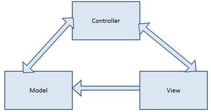

# 一、概念概述

## 设计模式

为了更好地理解框架，我们需要理解它所基于的设计模式。MVC 及其变体模式(MVP、被动视图等)。)将 web 应用程序分成三个不同的区域:模型、视图和控制器。模型是应用程序使用的数据，视图是用户界面，控制器容纳了应用程序的大部分逻辑，这些逻辑将三部分联系在一起。

图 MVC 模式中的组件

* * *

| MVC、MVP、被动视图和其他设计模式之间的区别在于您赋予各种组件多大的责任。这些细微的差别我们现在可以放心地忽略。 |

* * *

为了有效地使用 MVC，请遵循以下最佳实践:

*   该模型应该是一个具有读写属性的简单对象，以支持单个视图。
*   视图应该关注基于标准的标记。
*   视图中的逻辑应该仅限于用户交互，不包括业务逻辑。
*   控制器不应该知道模型中的数据在视图中是如何操作的。
*   控制器不应该知道模型之外的数据是如何持久化的。

遵循这些指导原则将有助于确保我们远离麻烦。

## 浅谈网页形式

这些限制中的许多与 Web Forms 的每一个新版本都变得不那么相关，并且可以通过最佳实践进一步减轻。但是以下仍然是困扰许多网络表单应用程序的常见问题:

*   视图状态
*   臃肿的 HTML
*   页面生命周期
*   尴尬的网址
*   易测性

|  | 注意:您会发现将客户端功能集成到控制器比集成到 Web 窗体的代码隐藏要容易得多。控制器中的动作是 AJAX 调用的自然端点。我们可以很容易地为端点建立网址。我们不必费力地识别和跟踪 HTML 组件的标识。视图模型以及模型绑定器(我们将很快探索)使得来回转换数据变得很容易。 |

MVC 建立在网络无状态的基础上。在许多网络表单应用程序中，应用程序状态在服务器端代码中维护，视图状态需要提醒服务器到目前为止发生的一切。摆脱视图状态消除了很多在服务器和浏览器之间来回传递的内容。仅这一点就能让页面加载更快。

虽然视图状态占了标记膨胀的大部分，但是我们能够通过更加关注符合标准的标记来进一步减少它。由于 Web Forms 专注于服务器控件，开发人员通常无法控制最终发送到浏览器的标记。随着框架的每次发布，情况都有所改善，但是开发人员仍然放弃了对生成的标记的实质性控制。使用 MVC，开发人员可能仍然没有完全的控制权，但是他们现在提供的功能更侧重于生成干净的、符合标准的标记。使用网络表单，开发人员有大量的工作要做，以获得干净的标记。使用 MVC，开发人员必须努力避免产生干净的标记——这是一个颠覆工作流的转变。

|  | 注意:符合标准的标记使它更容易与客户端库集成，如 jQuery、淘汰赛和 AngularJS。 |

在 MVC 中，页面生命周期被完全抛弃了。每个请求都是真正无状态的。状态在页面中比在服务器上更容易维护。每个页面请求都有一个关联的操作；请求期间执行的逻辑可以从这一个方法中追踪。这简化了故障排除和维护。您不必跟踪页面生命周期的事件来跟踪正在运行的逻辑。

对许多人来说，最重要的创新是改进的可测试性。很难针对 Web 表单构建自动化单元测试，但是针对控制器中的逻辑构建测试用例相对简单。网络表单充斥着复杂的用户界面元素，如文本框、`Session`、`HTTPContext`等等。在 MVC 中，控制器处理视图模型和类似的对象，这些对象可以相对容易地被模仿以简化测试。

|  | 提示:您不能从控制器访问文档对象模型，但是您可以访问请求对象中公开的任何内容。不要动心。让框架处理操作查询字符串、表单集合等。您应该只专注于操作模型。 |

## 不仅仅是一种模式

MVC 框架不仅仅是一种模式。MVC 应用程序实现了 MVC 设计模式，因为微软带来的不仅仅是帮助开发人员维护良好的实践。该框架为我们做了很多繁重的工作，使得遵循良好的编码标准和构建健壮的网络应用变得更加容易。

在本书中，我们将探讨:

*   查看引擎
*   模型粘合剂
*   显示和编辑器模板
*   HTML 助手
*   过滤

视图引擎使我们更容易产生我们需要的 HTML。Razor 是 ASP.NET MVC 中的默认视图引擎，它有一个简化的语法注入模型，允许开发人员使用模板驱动的方法，这使得为您的站点创建一致的外观变得更加容易。模型绑定处理用户在视图中输入的数据，并重新填充模型。它们不仅处理从视图中自动提取数据，还将运行与模型相关的任何验证，这将使您能够处理更紧迫的事务，例如业务逻辑。我们将在[第 4 章](4.html#_Chapter_4_)中探讨所有与验证相关的事情。

编辑器模板使关注点的分离更进一步。正如我们将很快看到的，编辑器模板允许我们简单地声明我们想要一个特定属性的编辑器，而不必拘泥于指定编辑器应该采用的形式。

HTML 助手是拖放式设计方法和手工编写所有 HTML 的枯燥之间的一个很好的折衷。任何一个相信拖放方法可以把所有事情都做好的人都被烧伤了，但是必须手工编写所有的标记是乏味的，并且可能容易出错。有了 HTML 助手，我们可以调用简单的方法来处理许多繁重的工作，而不会牺牲任何控制。我们还可以轻松地编写自己的助手来覆盖内置助手遗漏的任何场景。

过滤器是我们可以添加到动作或控制器作为一个整体的属性。过滤器有相关的逻辑。我们需要做的就是给一个动作添加适当的过滤器来获得这个逻辑或者新的行为。

别担心，你可以在理解这些概念之前很久就构建有效的 MVC 应用程序。但是，随着您对这些概念的了解越来越多，您将发现该框架如何为我们做更多的工作。

## 总结

MVC 既是一种设计模式，也是按照这种模式构建网络应用的框架。该框架建立在与其他框架合作良好的基础上，并设法避免了一些困扰其他框架的常见陷阱。