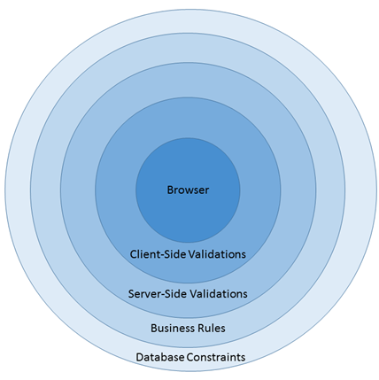

# 第四章不要相信世界说的一切

验证被定义为模型属性的属性。使用一点 JavaScript，这些验证将在用户的浏览器中运行。作为模型绑定的一部分，它们也将在服务器上再次运行。在这两个地方运行验证似乎是多余的，但是在当今时代，验证提供给 web 应用程序的输入不是一件轻而易举的事情。这种方法被称为“深度防御”例如，如果用户跳过我们的客户端验证并尝试直接发布到操作，服务器端验证仍然会捕获错误的输入，从而防止我们的应用受到任何伤害。

|  | 提示:客户端验证对于遵守规则的用户来说确实只是一种便利；它们不应被视为应用安全的唯一部分。 |
|  | 注意:验证很重要。更重要的是不止一次地验证。比多次验证更重要的是不必重复定义验证。这听起来是一个很高的要求，但是 MVC 框架涵盖了我们所有的方面。 |



图 19:纵深防御

## 基本验证器

那么，这些验证属性是什么样子的呢？事实证明，它们看起来类似于我们已经用来选择编辑器模板的属性。让我们回到`ItineraryItem`并添加一些适当的验证器。

```cs
    public class ItineraryItem
    {
       [Required (ErrorMessage =
          "You must specify when the event will occur")]
       public DateTime? When { get; set; }
       [Required(ErrorMessage = "You must enter a description")]
       [MaxLength(140, ErrorMessage =
           "The description must be less than 140 characters.")]
       [DataType(DataType.MultilineText)]
       public string Description { get; set; }
       [Required (ErrorMessage =
           "You must specify how long the event will last")]
       [Range (1, 120, ErrorMessage =
           "Events should last between one minute and 2 hours")]
       public int? Duration { get; set; }
       public bool IsActive { get; set; }
       public bool? Confirmed { get; set; }
    }

```

代码清单 26:带有基本验证属性的巡回项目视图模型

正如您所看到的，我们已经添加了属性来根据需要标记所有属性。添加该属性后，框架将添加 JavaScript 客户端，以确保相应的输入字段不为空。我们还为`Duration`指定了范围，为`Description`设置了`MaxLength`。我们需要担心的是添加这些属性。该框架将确保为我们添加适当的 JavaScript。

这些通常都是要包括的标准验证器。对于数字输入，您应该始终有一个最小和一个最大的期望值，即使您认为用户永远不会超出该范围。检查它们仍然是一件明智的事情。您还应该为字符串输入指定最大长度。

## 用正则表达式验证

正则表达式验证器在验证输入时可以发挥重要作用。详细解释正则表达式超出了本书的范围，因为它们是一项强大而复杂的技术。幸运的是，对于本书中的例子，我们只需要这种力量的一个子集。我们只需要处理短字符串和相当简单的用例，这样我们就可以避免围绕正则表达式的许多复杂性。

|  | 注意:如果你想更深入地了解正则表达式，那么[正则表达式简洁](http://www.syncfusion.com/resources/techportal/ebooks/regularexpressions)是简洁系列的一部分。 |

```cs
    public class ItineraryItem
    {
       [Required (ErrorMessage =
          "You must specify when this event will occur")]
       public DateTime? When { get; set; }
       [Required(ErrorMessage = "You must enter a description")]
       [MaxLength(140, ErrorMessage =
          "The description must be less than 140 characters.")]
       [DataType(DataType.MultilineText)]
       public string Description { get; set; }
       [Required (ErrorMessage =
          "You must specify how long the event will last")]
       [Range (1, 120, ErrorMessage =
          "Events should last between one minute and 2 hours")]
       [RegularExpression (@"\d{1,3}", ErrorMessage =
          "Only numbers are allowed in the duration")]
       public int? Duration { get; set; }
       public bool IsActive { get; set; }
       public bool? Confirmed { get; set; }
    }

```

代码清单 27:带有正则表达式属性的巡回项目视图模型

这里，我们为`Duration`属性定义了一个正则表达式，指定它必须由一到三个数字组成。虽然这种验证不是 100%准确的，但是结合其他属性就足够了。如果总共有两个或更多的数字，我们的正则表达式应该将第一个数字限制为 1，将其他数字限制为 0、1 或 2。我们应该指定第一个数字不能是 0，但是结合其他验证器，这就足够了。

我们还可以为`When`属性添加一个正则表达式验证器，但是正则表达式不太适合验证日期等值。

约会很快会变得棘手。在客户端处理日期的最好方法是使用一个好的编辑器(正如我们在上一章中所看到的)来创建格式良好的日期字符串，然后使用更好的工具将字符串解析为服务器上可用的`Date`。

|  | 提示:正则表达式很强大，但它们并不总是工作的正确工具。用在错误的地方，它们会造成比你试图解决的更多的问题。一定要小心使用。 |

下表提供了一个方便的正则表达式备忘单，它应该涵盖了您在正则表达式验证器中需要的大多数场景。

表 1:正则表达式关键字

| `^` | 匹配字符串的开头。 |
| `$` | 匹配字符串的结尾。 |
| `.` | 匹配除新行以外的任何字符。 |
| `*` | 匹配前一个表达式的零个或多个实例。 |
| `+` | 匹配上一个表达式的一个或多个实例。 |
| `?` | 匹配前一个表达式的零个或一个实例。 |
| `{,}` | 显式范围量词；指定上一个表达式的最小和最大出现次数。 |
| `\w` | 匹配任何单词字符。 |
| `\d` | 匹配任何数字。 |
| `\s` | 匹配任何空格。 |

下表提供了一些正则表达式，这些表达式可能有助于在 MVC 应用程序中验证输入数据。

表 2:常见的正则表达式

| 社会保险号 | `^\d{3}-\d{2}-\d{4}$` |
| 电话号码 | `^(\(\d{3}\))&#124;(\d{3}-?))\d{3}-?\d{4}$` |
| 邮政区码 | `^\d{5}(-\d{4})?$]` |
| 月份名称 | `^(Jan&#124;Feb&#124;Mar&#124;Apr&#124;May&#124;Jun&#124;Jul&#124;Aug&#124;Sep&#124;Oct&#124;Nov&#124;Dec)$` |
| 密码复杂性 | `^(?=.*\d)(?=.*[a-z])(?=.*[A-Z]).{8,}$ // Just add whatever max length is appropriate` |

|  | 提示:根据经验，保持你的正则表达式简单。不要依赖他们自己来覆盖所有场景，因为他们可能会很快失控，变得难以管理。 |

将正则表达式与其他验证器结合使用，以适当地约束您的输入。许多人会犯这样的错误:试图使用正则表达式来覆盖他们在验证任务中看到的所有情况。请始终记住，与所有客户端验证类似，这些只是为了方便遵守规则的用户。多个验证器将共同覆盖用户输入的各种场景。

## 远程验证器

有时，您可能有一些验证逻辑，用我们目前看到的属性无法轻松表达。有时我们甚至可能需要从数据库或其他不容易从客户端访问的来源访问实时数据。有时，验证逻辑已经在业务逻辑中实现，我们不希望在客户端再次实现它。

为了帮助完成这项任务，我们有远程验证器。这个简单的属性允许我们将动作与属性相关联，然后框架将使用该属性异步调用外部动作或调用应用程序中其他地方的业务逻辑。

|  | 提示:与我们在本章中看到的其他属性不同，这个属性位于 System.Web.MVC 中 |

根据前面的例子，让我们返回到我们的`ItineraryItem`视图模型，并添加一个远程验证器来确保`When`属性没有被超额预订。

```cs
    public class ItineraryItem
    {
       [Required (ErrorMessage =
          "You must specify when this event will occur")]
       [Remote("VerifyAvailability", "Itinerary")]
       public DateTime? When { get; set; }
       [Required(ErrorMessage = "You must enter a description")]
       [MaxLength(140, ErrorMessage =
          "The description must be less than 140 characters.")]
       public string Description { get; set; }
       [Required (ErrorMessage =
          "You must specify how long the event will last")]
       [Range (1, 120, ErrorMessage =
           "Events should last between one minute and 2 hours")]
       [RegularExpression (@"\d{1,3}", ErrorMessage =
          "Only numbers are allowed in the duration")]
       public int? Duration { get; set; }
       public bool IsActive { get; set; }
       public bool? Confirmed { get; set; }
    }

```

代码清单 28:带有远程验证器的巡回项目

这个属性有几个微妙的地方值得一提。第一个参数是操作的名称。第二个参数是控制器的名称。当我们指定控制器时，从名称中删除单词`Controller`。即使控制器通常是与视图关联的同一控制器，您仍然必须显式指定它。

|  | 注意:按照惯例，所有控制器的名称中都有“控制器”一词，但在构建路由或引用网址时，该词会被排除在名称之外。例如[代码清单 28](#CodeListing28) 中的远程属性将正确地将巡回控制器称为路线；对它的引用将导致路由错误。 |

现在，让我们看看控制器中的动作。

```cs
    [HttpGet()]
    public JsonResult VerifyAvailability(DateTime When)
    {
       return Json(true, JsonRequestBehavior.AllowGet);
    }

```

代码清单 29:远程验证操作

这里我们已经剥离了所有的业务逻辑。您将检索该特定日期登录用户的旅程项目计数，并将其与某个配置的阈值进行比较。

* * *

| 启用异步回调只需要定义操作和配置属性。如果没有这种支持，我们将不得不添加 JavaScript 来进行远程调用，跟踪返回值，并根据响应隐藏或显示验证消息。 |

* * *

你实际上在行动中做什么完全取决于你。

对返回值`true`进行硬编码可确保该方法将通过所有验证，而返回 false 将使所有验证失败。

有时我们需要多个字段来实现远程验证。也许我们需要`Description`和`When`来处理验证。我们只需要做一些改变。第一个变化是我们的模式。

```cs
    public class ItineraryItem
    {
       [Required (ErrorMessage =
           "You must specify when this event will occur")]
       [Remote("VerifyAvailability", "Itinerary",
                 AdditionalFields = "Description")]
       public DateTime? When { get; set; }
       [Required(ErrorMessage = "You must enter a description")]
       [MaxLength(140, ErrorMessage =
           "The description must be less than 140 characters.")]
       public string Description { get; set; }
       [Required (ErrorMessage =
          "You must specify how long the event will last")]
       [Range (1, 120, ErrorMessage =
           "Events should last between one minute and 2 hours")]
       [RegularExpression (@"\d{1,3}",
                ErrorMessage = "Only numbers are allowed in the duration")]
       public int? Duration { get; set; }
       public bool IsActive { get; set; }
       public bool? Confirmed { get; set; }
    }

```

代码清单 30:带有附加字段的远程验证器

接下来，我们更新控制器。

```cs
    public JsonResult VerifyAvailability(DateTime When, string Description)
    {
       return Json(true, JsonRequestBehavior.AllowGet);
    }

```

代码清单 31:带有多个参数的远程验证操作

|  | 提示:可以指定任意数量的参数；您只需要确保它们与属性的 AdditionalFields 属性中指定的列表相匹配。 |

## 元数据类型属性

看到了可以添加到模型属性中的所有属性后，我们可以想象，过一段时间后，定义会变得混乱，变得难以阅读。所有的属性都会分散你对模型中任何逻辑的注意力。更糟糕的是，如果您使用任何形式的代码生成，如文本模板转换工具包(T4)，这些属性很容易被意外更改。通常，我们可能无法跟踪足够的元数据来再次生成所有必要的属性，因此，如果我们在生成代码时有一种方法来保护这些属性，那就太好了。

这就是`MetadataTypeAttribute`发挥作用的地方。这是添加到类中的单个属性，它告诉框架在哪里可以找到其他属性。如果属性随后被添加到该合作元数据类型中，当模型以任何方式重新生成时，它们将保持安全。

通过使用`MetadataTypeAttribute`，我们的模型可以简化为以下代码。

```cs
    [MetadataType (typeof (ItineraryItemAttributes))]
    public class ItineraryItem
    {
       public DateTime? When { get; set; }
       public string Description { get; set; }
       public int? Duration { get; set; }
       public bool IsActive { get; set; }
       public bool? Confirmed { get; set; }
    }

```

代码清单 32:向视图模型添加元数据类型

合作的`MetadataType`会是这样的:

```cs
    public class ItineraryItemAttributes
    {
       [Required(ErrorMessage =
          "You must specify when this event will occur")]
       [Remote("VerifyAvailability", "Itinerary",
                  AdditionalFields = "Description")]
       public object When { get; set; }
       [Required(ErrorMessage = "You must enter a description")]
       [MaxLength(140,ErrorMessage =
          "The description must be less than 140 characters.")]
       public object Description { get; set; }
       [Required(ErrorMessage =
          "You must specify how long the event will last")]
       [Range(1, 120, ErrorMessage =
          "Events should last between one minute and 2 hours")]
       [RegularExpression(@"\d{1,3}",
       ErrorMessage = "Only numbers are allowed in the duration")]
       public object Duration { get; set; }
    }

```

代码清单 33:设置了属性的元数据类型

`MetadataType`中属性的数据类型不重要；重要的是框架能够匹配名称。另外，要明白`MetadataType`不需要包含所有的属性；它只需要包含与属性相关联的属性。

最后，虽然属性可以在模型中，但不能在合作的`MetadataType`中，但是`MetadataType`中提到的任何属性都必须在关联的模型中。

|  | 提示:如果您自动生成模型，那么在生成的文件中指定一个元数据类型，并将未生成的任何属性放在这个合作类型中，这总是一个很好的做法。 |

## 总结

我们已经看到了如何将验证器轻松地添加到模型的属性中。最常见的验证器包括根据需要标记属性、设置最大长度以及指定可接受的值范围。这些是应该为大多数属性指定的简单验证。

正则表达式可以进行更复杂的验证，尽管我们通常只使用完整正则表达式语法的一小部分。即便如此，我们的正则表达式也可以简化，因为它们很少单独使用，因为一般来说，它们会与其他验证器结合使用，以确保干净的输入。

我们还看到，对于最复杂的验证需求，我们可以轻松地添加远程验证，以指示框架对服务器进行异步回调，从而在我们自己定制的、基于代码的逻辑中处理验证。

最后，我们已经看到了如何将所有这些属性移动到一个单独的类中，该类使用一个合作的`MetadataType`，允许我们保护属性——如果我们使用自动代码生成来生成类，这一点尤其重要。