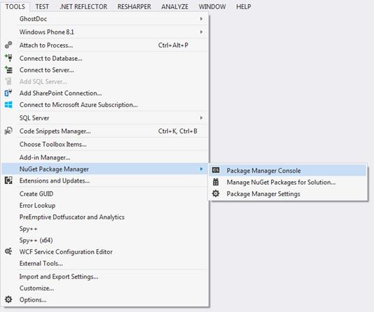
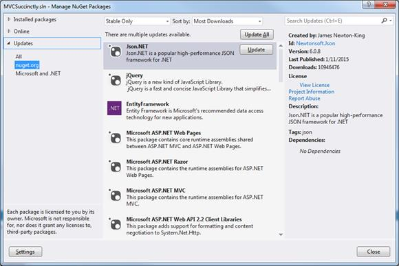
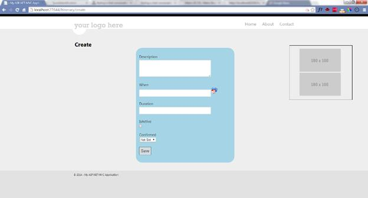
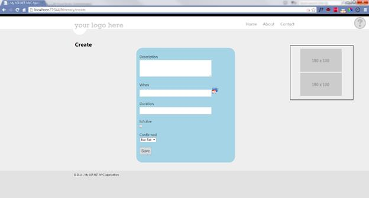
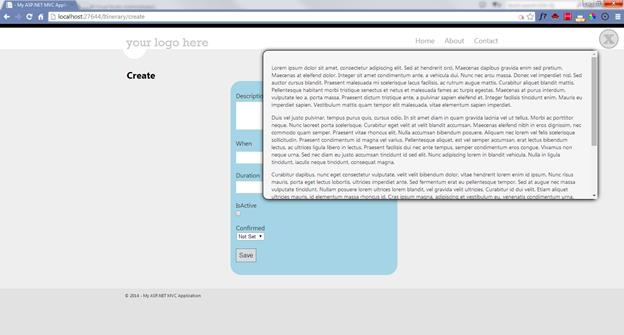
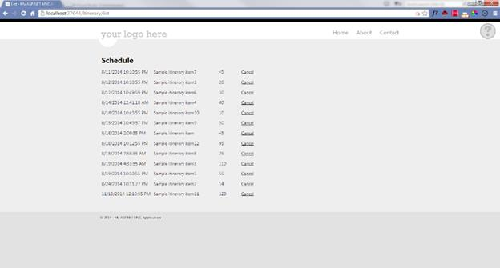

# 第 5 章 MVC 遇到 jQuery

现代网络应用程序应该是快速的、引人入胜的和交互式的。这意味着用于获取数据或处理部分数据的完整回发的旧模式已经不够用了。完整回发的部分问题是我们发送和接收的数据超过了需要的数量。这会分散用户的注意力，增加网络和服务器的负载，并使一切变慢。

MVC 与 jQuery 相结合，很容易避免这些陷阱。我们可以将初始下载限制在立即需要的内容，然后根据需要检索其余内容。我们还可以根据需要异步更新更小的数据集，而不必每次都发回所有数据，或者等到用户编辑完所有数据后再处理任何结果。这使得该应用程序更吸引人，反应更灵敏。

出了大门，内部网应用程序和互联网应用程序的模板都准备好合并 jQuery 了。最多，您可能希望更新到 jQuery 的更高版本。如果您确实升级并需要支持旧版本的 Internet Explorer (IE)，请将自己限制在最新的 1.x 版本。从 2.0 开始，jQuery 在版本 9 之前就放弃了对 IE 的支持。如果你知道你不支持旧版本的 IE，升级到最新的 2.x 版本。文件会小很多。

## 不获取包管理器

NuGet 旨在使管理外部库(如 jQuery)变得更加容易，自 Visual Studio 2010 年以来，它一直在 Visual Studio 中提供。可以从 Visual Studio 中的**工具**菜单访问。



图 20:获取菜单选项

选择**管理解决方案的 NuGet 包**以获取具有可用更新的包列表。



图 21:更新包

只需点击**更新**，即可轻松更新任意包。这很方便，但考虑到之前关于 IE 兼容性的警告，可能会有问题。这里的 update 命令会将您更新到最新版本，这可能不是您想要的。

|  | 提示:要更新到特定版本，请使用包管理器控制台。从控制台输入命令:`Install-Package jQuery -Version 1.11.2`如果在键入版本后按 Tab 键，您将获得可用版本的列表。只需选择您想要的版本。 |

## JavaScript 背景

在这一点上，对 jQuery 和 JavaScript 的一些基本熟悉将会有所帮助。在继续本章的其余部分之前，强烈建议您至少了解什么是 jQuery 以及 JavaScript 是如何工作的。在接下来的部分中，我们将重点关注 jQuery 如何与 MVC 交互；这不是关于 jQuery 如何工作的教程。

|  | 注意:Syncfusion 在简洁系列中有很多书，包括 [jQuery](http://www.syncfusion.com/resources/techportal/ebooks/jquery) 和 [JavaScript](http://www.syncfusion.com/resources/techportal/ebooks/javascript) 上的标题。下载它们并放在手边，作为本章其余部分的参考，会对你有很大帮助。 |

在开始之前，让我们回顾一些最佳实践:

*   AJAX 端点应该是负责视图的控制器中的动作。这将相关的功能保持在一起。这个动作可以自由地做它需要做的任何事情，但是任何开发人员都应该能够回到控制器来跟踪功能是如何实现的。
*   这些操作应该配置为只接受 POSTs。当从 GET 返回 JSON 时，MVC 将抛出一个异常，但是这提供了额外的一层保护，防止敏感信息泄漏。
*   在可行的情况下，操作应该接受模型作为参数，这样模型绑定器将处理转换和验证。
*   动作应该总是努力返回`JsonResult`，即使它们返回单个标量类型。这是推荐的传输类型，jQuery 将在另一端处理转换。

|  | 提示:手边放一份好的 JavaScript 参考资料。 |

考虑到这些最佳实践，让我们探索一些可能性。在本章的剩余部分，我们将介绍几个在典型应用程序中可能会看到的交互:

*   页面初始加载后，下载部分页面。
*   仅当用户触发请求时，才检索帮助消息的文本。
*   从项目列表中删除项目。

## 页面加载后下载部分页面

我们可能经常会发现，当页面第一次加载时，可能不需要页面的一部分，但是我们不一定希望用户必须做任何事情来获得它。我们不想让用户错过它，但也不想让一切都停留在等待内容上。

例如，我们可能会等到页面加载后再下载菜单。我们可能会有广告，希望用户看到，但不必等待。在这两种情况下，我们都希望在适当的时候触发一个 AJAX 调用，以确保这按预期发生。

|  | 注意:这种性质的大多数调用都是从文档就绪事件处理程序启动的。这是 jQuery 提供的一项功能，它允许我们将 MVC 页面的加载与一段 JavaScript 同步，这样一旦我们的 MVC 页面完全下载，提供的代码就会运行。您可以在任何 jQuery 引用中找到关于此事件的更多信息。 |

在这个例子中，我们将在页面下载完成后下载一些广告。为此，我们只需要在页面中添加一点标记。我们需要确保页面包含一个带有`ads`标签的`div`。我们不在乎这个标签在哪里，也不在乎它的样式。就我们的目的而言，我们所需要的是`id`被正确设置。样式完全取决于你的应用程序的样式指南。

我们的 JavaScript 代码看起来像下面的代码清单。

```cs
    <script>
            $(document).ready(function() {
                $.ajax({
                    url: '@Url.Action("GetAdsSimple")',
                    dataType: "json",
                    type: "POST",
                    success: function(result) {
                       $("#ads").append(result);
                    }
                });
            });
    </script>

```

代码清单 34:对 GetAdsSimple 操作的 AJAX 调用

如您所见，这将需要我们的控制器中一个名为`GetAdsSimple`的动作。我们将把这个方法称为 POST，并期待 JSON 回来。在这个简单的实现中，我们将收到一个格式化的 HTML 的原始字符串。

|  | 注意:[代码清单 34](#CodeListing34) 包括一个 Razor 对帮助函数 Url.Action 的调用。这个函数对于创建完整的 Url 很有用。在这种情况下，我们只指定了操作的名称。在假设控制器将是提供视图的同一个控制器之后，这个方法将构建其余的来生成一个完整的 URL。 |

一个简单的实现如下所示:

```cs
    [HttpPost]
    public JsonResult GetAdsSimple()
    {
       var data = new StringBuilder();
       data.Append("<ul>");
       data.Append("<li></li>");
       data.Append("<li></li></ul>");
       return Json(data.ToString( ));
    }

```

代码清单 35: GetAdsSimple action

在这里，我们简单地输出一个图像列表。如何组织你的标记完全取决于你。如果只是一点标记，用简单的字符串返回所有内容可能就是您所需要的。但是，如果标记更复杂，或者如果您希望客户端对生成的 HTML 有更多的控制，我们还有其他选择。

|  | 注意:这很少是一个可以接受的选择。一个好的最佳实践是将所有的标记都放在控制器之外。这保护了可测试性，此外，我们希望将所有外观和感觉方面的考虑保留在视图中。 |

考虑下面稍微复杂一点的 JavaScript 代码。

```cs
    <script>
            $(document).ready(function() {
                $.ajax({
                    url: '@Url.Action("GetAdParts")',
                    dataType: "json",
                    type: "POST",
                    success: function(result) {
                        var content = "<ul>";
                        $.each(result, function (key, value) {
                            content += "<li ><a href = '"
                                   + value.url + "' title='"
                                   + value.caption + "'>"
                                   + value.image + "</a></li>";
                        });
                        content += "</ul>";
                       $("#ads").append(content);
                    }
                });
            });

    </script>

```

代码清单 36:对 GetAdParts 的 AJAX 调用

在这种情况下，我们已经切换到调用一个新的操作，`GetAdParts`，这一次，我们期望该操作返回一个 JSON 对象列表，我们将构建该列表来生成广告。这一点额外的复杂性将生成标记从控制器中拉出，并将其放回视图中。不同的视图可以采用这些部分，并根据广告是显示在桌面、平板电脑还是智能手机上，对广告进行不同的格式化。您只需转移广告部分，让客户端视图决定如何最好地呈现这些部分，就可以获得很大的能力和灵活性。

虽然 JavaScript 可能更复杂一点，但我们的操作会更简单一点，因为我们可以避免生成标记时所有烦人的字符串操作。

```cs
    [HttpPost]
    Public JsonResult GetAdParts()
    {
        var data = new List<AdParts>();
        data.Add(new AdParts
        {
            image = "",
            caption =
               "Lorem ipsum dolor sit amet, consectetur adipiscing elit".
            url = "http://#"
        });
        data.Add(new AdParts
        {
            image = "", url = #",
            caption = "Donec adipiscing eros eget dui aliquet, nec tur."
        });
        return Json(data);
    }

```

代码清单 37: GetAdParts 操作

```cs
        public class AdParts
        {
            public string image { get; set; }
            public string url { get; set; }
            public string caption { get; set; }
        }

```

代码清单 38: AdParts 定义

如下图所示，这两种方法都会给我们一组相当有吸引力的广告。



图 22:广告加载后

## 当用户触发请求时，检索帮助文本

这个场景类似于我们刚刚创建的展示广告的场景；主要区别在于，AJAX 调用现在是由用户触发的，而不是自动触发的。通常，用户会点击一个用于启动操作的触发器。在下面的示例中，我们将使用带有问号的图像来打开帮助，使用 X 来关闭帮助。

为此，我们需要创建两个 HTML 组件。首先，我们需要一个`helpTrigger`的`div``id`。第二，我们需要一个`id`的`div`。如何设置这些组件取决于您的样式指南。在这里，我们将使触发器成为一个`div`标签，该标签将被设计为从一个精灵和一个 CSS 中提取其图像，该 CSS 将确保该图像将始终位于页面的右上角。CSS 看起来像下面的代码清单。

```cs
    .helpTrigger {
       position: fixed;
       top: 1em;
       right: 1em;
       height: 50px;
       width: 50px;
       background: url('HelpClose.png') 0px 0px;
    }

    .closeTrigger {
       position: fixed;
       top: 1em;
       right: 1em;
       height: 50px;
       width: 50px;
       background: url('HelpClose.png') 0px 50px;   
    }    

    #helpContent {
       border: solid 1px black;
       border-right: 3em;
       min-height: 4em;
       border-radius: 1em;
       box-shadow: 1px 1px 15px black;
       position: fixed;
       top: 5em;
       right: 5em;
       height: 25em;
       width: 60em;
       overflow: auto;
       background-color: whitesmoke;
       padding: 1.5em;
    }

```

代码清单 39:设置帮助触发器和帮助内容的样式

在这里，我们有一个精灵，包括两个图像，每个 50px 乘以 50px。


图 23:帮助触发器和关闭触发器的精灵

对于帮助触发器，我们希望显示顶部图像，而要关闭它，我们希望显示底部图像。

要添加触发器，我们只需在页面上的任意位置添加我们的`div`标签。

```cs
    <div id="helpTrigger" class="helpTrigger"></div>

```

代码清单 40:帮助触发器

要添加`helpContent`，我们将添加一个类似的`div`，但请注意，我们从它隐藏开始。

```cs
    <div id="helpContent" style="display:none"></div>

```

代码清单 41:帮助内容

|  | 注意:作为最佳实践，避免使用内联样式。这里这样做只是为了简化教程。 |

一旦`div`就位，我们将使用 jQuery 添加一个不同类型的事件处理程序，称为`click`事件。类似于我们在本章前面使用的`ready`事件，这是由 jQuery 提供的功能，而不是由 MVC 提供的。它允许我们在用户点击我们的`div`元素时得到通知。事件代码不仅会显示我们的帮助文本，还会改变我们放置在`div`中的图像精灵，以传达我们文本的当前打开或关闭状态。

为了简化这种转换，我们将把事件处理程序定义为 JavaScript 中的命名函数，而不是把它们的实现放入行内。

```cs
        function getHelp() {
                    $.ajax({
                        url: '@Url.Action("GetHelp")',
                        dataType: "json",
                        type: "POST",
                        success: function (result) {
                            $("#helpContent").empty().append(result);
                            $("#helpContent").show();
                            $("#helpTrigger").removeClass("helpTrigger")
                               .addClass("closeTrigger");
                            $("#helpTrigger").unbind("click");
                            $("#helpTrigger").click(closeHelp);
                        }
                    });
                }

```

代码清单 42:对 GetHelp 的 AJAX 调用

```cs
    function closeHelp() {
                    $("#helpContent").empty();
                    $("#helpContent").hide();
                    $("#helpTrigger").removeClass("closeTrigger")
                         .addClass("helpTrigger");
                    $("#helpTrigger").unbind("click");
                    $("#helpTrigger").click(getHelp);
                }

```

代码清单 43:关闭帮助内容的 jQuery 逻辑

|  | 注意:这里我们依赖于发回格式化的 HTML 的操作，但是我们在前面例子中探索的关于如何构造和生成标记的所有选项仍然可用。 |

我们的视图，加上方便的帮助触发器，可以给我们带来帮助，看起来像下图。



图 24:显示帮助触发器的简单页面

一旦点击了 sprite 图像，帮助内容及其关闭触发器将如下所示。



图 25:显示帮助内容的视图

|  | 注意:您将基于原始页面或一些类似的上下文返回一些有用的东西。您可能希望在管理部分包含对该帮助消息的维护，并简单地从数据库中检索格式化的 HTML。 |

## 从网格中删除项目

您可能经常显示项目列表，并允许用户单击触发器从列表中删除项目。这可能是要确认的消息列表、购物车中可以移除的项目或可以完成的任务列表。

在每种情况下，我们都需要在控制器中调用一个动作，为被点击的项目传递`id`。控制器将更新后端，以从要显示的项目列表中移除该项目。当 AJAX 调用完成时，我们将使用 jQuery 从显示中移除该项。

同样，我们有几个关于如何构建标记的特殊考虑。

考虑以下旅程项目列表示例。我们希望用户能够根据需要取消任何项目。



图 26:每个项目都有一个取消选项的网格

```cs
    <div id="Itinerary376">
       <div class="span10">8/11/2014 10:10:55 PM</div>
       <div class="span15">Sample itinerary item7</div>
       <div class="span5">45</div>
       <div class="span5 cancel"> Cancel</div>
    </div>
    <div id="Itinerary370">
       <div class="span10">8/12/2014 10:10:55 PM</div>
       <div class="span15">Sample itinerary item1</div>
       <div class="span5">20</div>
       <div class="span5 cancel"> Cancel</div>
    </div>
    <div id="Itinerary375">
       <div class="span10">8/12/2014 10:49:59 PM</div>
       <div class="span15">Sample itinerary item6</div>
       <div class="span5">30</div>
       <div class="span5 cancel"> Cancel</div>
    </div>
       <div id="Itinerary373">
       <div class="span10">8/14/2014 12:41:18 AM</div>
       <div class="span15">Sample itinerary item4</div>
       <div class="span5">60</div>
       <div class="span5 cancel"> Cancel</div>
    </div>
    <div id="Itinerary379">
       <div class="span10">8/14/2014 10:43:55 PM</div>
       <div class="span15">Sample itinerary item10</div>
       <div class="span5">10</div>
       <div class="span5 cancel"> Cancel</div>
    </div>

```

代码清单 44:显示路线项目网格的标记

如果用户点击取消链接(见后面的[提示](#Tip)，我们想在控制器中调用一个动作。在此操作中，我们应该检索用户选择的项目并将其标记为取消。回到网络浏览器，我们需要检索取消链接的父链接并隐藏它。

|  | 提示:即使我将此称为“取消链接”，但从标记中应该可以明显看出这不是链接；我们只是想让它看起来像一个用户。更重要的是，我们想确保它看起来不像一个网络爬虫。对于一个网络爬虫来说，跟踪一堆链接并取消你旅程中的所有活动真的是悲剧。任何可以操作数据的操作都应被视为开机自检，以防止用户或网络爬虫意外“获取”可能导致数据操作的数据。 |

```cs
    .cancel {
       text-decoration: underline;
       cursor: pointer;
    }

```

有了这个标记，我们可以如下添加事件处理程序。

```cs
    $(".cancel").click(function() {
       var id = ($(this).parent().attr("id"))
          .replace("Itinerary", "");
       var parent = $(this).parent();
                $.ajax({
                    url: '@Url.Action("CancelItineraryItem")',
                    dataType: "json",
                    type: "POST",
                    data : {id : id},
                    success: function (result) {
                        parent.hide();
                    }
                });
            });

```

代码清单 45: AJAX 调用 CancelItineraryItem 操作

|  | 注意:JavaScript 中的规则很微妙，但在这种情况下，它指的是触发事件的元素。我们将其包装在一个 jQuery 函数调用中，以将其转换为 jQuery 对象。还值得注意的是，我们必须把它放在一个本地变量中，由 success 事件处理程序使用，因为在这个事件处理程序中，这将有不同的含义。 |

与家长的花式步法，得到`id`，剥离关键词`Itinerary`会给我们`id`，我们会传递回动作。这将是数据库中`ItineraryItem`的唯一标识符。

## 总结

在这一章中，我们已经看到了 MVC 如何与 jQuery 一起创建网页，通过减少最初需要发送的内容量来加快加载速度。我们探索了两个不同的选项来触发下拉其余内容:页面完全加载后自动下载内容，以及当用户明确单击触发器时下载内容。我们还看到了如何利用 jQuery 进行 AJAX 调用来更新页面的一部分，而不必刷新整个页面。控制器中的动作为 AJAX 调用提供了自然的端点，MVC 典型的干净标记使构建有效的选择器和通过 jQuery 控制标记变得更加容易。jQuery 和 MVC 结合得很好，有助于创建动态的、响应迅速的网络应用程序。