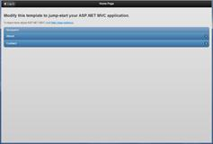
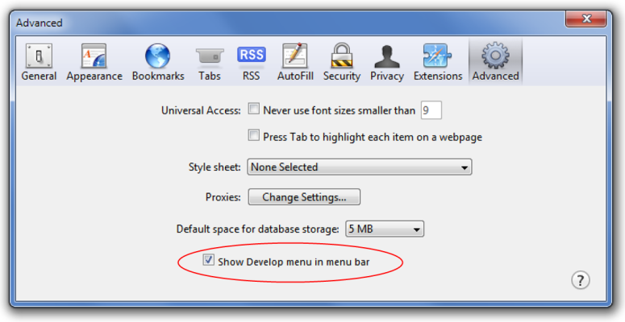
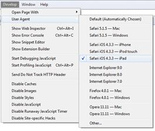
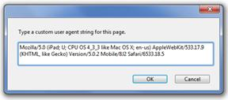
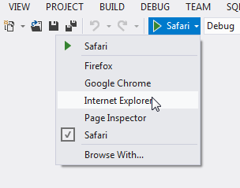
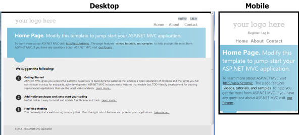
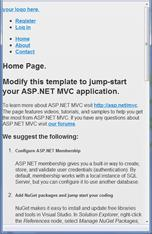
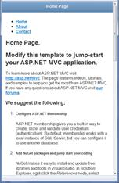

# 四、构建 MVC 移动网站

佛罗多:“回去，山姆。我要一个人去魔多。”山姆:“你当然是。我和你一起去。”
来自*指环王:指环王的友谊*

MVC 3 有能力创建移动友好的代码，但它不是一个内置的特性。您必须编写自己的自定义代码并将其放入项目中，这并不简单。

* * *

我们将在[第 11 章](11.html#heading_id_78)中讨论如何使用 MVC 3 创建一个移动友好的网站，但这里我们主要关注的是 MVC 4。

* * *

MVC 4 附带了在应用程序启动时只需几行代码就能打开移动支持的功能——这真的很简单。让我们开始一段进入 MVC 4 和移动世界的旅程。

## 移动应用模板

当你安装 MVC 4 <sup>[2](MVC4_0016.htm#heading_id_82)</sup> 并创建你的第一个项目时，你会立即被**移动应用程序**模板所吸引。这似乎是你要去的第一件事，你*可能*是对的。让我们看看它产生了什么，看看它是如何工作的。

当您选择此选项时，模板将为您生成一个移动网站，它将包括 jQuery 和 jQueryMobile环境。jQueryMobile是一个关键的组成部分，轻松使您的网站移动友好。jQueryMobile 是建立在 jQuery 之上的框架，旨在帮助您制作移动用户界面。它没有取代 jQuery——它建立在 jQuery 的基础上，并对其进行了增强。花一点时间浏览 jQueryMobile网站<sup>[【3】](MVC4_0016.htm#heading_id_82)</sup>，你会发现他们花了很多时间，让创建在各种设备上都能很好地运行的移动友好网站变得非常容易。微软团队采用这个开源项目是明智的。

* * *

本书中的例子是用 jQuery 设计的。2012 年 4 月发布的移动版 1.1。如果你有一个较新的版本(或者甚至像版本 1.0.1 这样稍微旧一点的版本)，这本书里的概念应该仍然适用，因为大部分的变化是增强，而不是突破性的变化。

* * *

如果您使用这个默认的项目模板并运行它，您将看到如下内容:



使用移动模板创建的网站

这对第一次开始来说还不错。然而，这种方法有一个小问题:没有桌面版本！这个网站为每个来到这个网站的设备提供移动版本。它不便于移动；它是移动的。

如果你回想一下前一章，考虑一下你在构建一个移动友好网站时试图实现什么，你很快就会意识到你需要注意三种不同的形状因素:小型、中型和大型。


移动友好网站需要考虑的外形因素

让我们不要忘记 2013 年将会发生什么！不管你喜不喜欢，你可能不得不比你想象的更快地考虑这个新格式...


玻璃项目，有人吗？

试图创造一个对所有这些都有效的设计通常是徒劳的，并且会产生三分之二都不好用的东西。我们需要一些方法来优化每个不同平台的设计。幸运的是，这对于 MVC 平台来说并不太难。

## 互联网应用模板

让我们重新开始，这次我们来挑选**互联网应用**模板。我们现在得到的是一个主要针对桌面平台优化的网站。我们将对此进行研究，然后对其进行改进，使其更加便于移动使用。

当您构建和运行此网站时，它在您的移动设备上的外观将与在桌面上几乎完全相同，如下图所示。请注意，在移动设备视图中，内容使用了一点响应性网页设计，并对自身进行了一些重新流动，使其在该格式中看起来更好一点。


使用互联网应用程序模板创建的网站

对于某些网站，您的手机只显示缩小到适合移动设备屏幕的网站版本(就像我在第一章中提到的朋友的网站)。那么为什么我们基于**互联网应用**模板的网站不缩小到一个微小的版本呢？这个模板避免了这个问题，在它的主布局页面中包含了一行神奇的代码(查看**\视图\共享\ _ 布局. cshtml** ):

```cs
      <meta name="viewport" content="width=device-width" />

```

就这样！大多数手机(如安卓和苹果手机)中使用的基于 WebKit 的浏览器都会尊重该标签，并会自动尝试调整内容大小和重排内容，以适应当前设备的宽度。这是一个小花絮，你可以申请到任何你正在工作的网站。*(说吧。现在就去你当前的项目中试试吧。这本书可以等。我知道你想。)*

好的——你回来了吗？有用吗？我们将在[第 7 章](07.html#heading_id_44)中讨论其他几个`<meta>`标签，它们可以让你的网站更加移动友好——这是许多标签中的第一个。

我们的目标是将不同的内容返回到不同类型的设备。要做到这一点，我们必须知道是什么类型的设备发出请求，为此，我们将查看用户代理。您可能已经知道，每当浏览器向我们的服务器发送一个请求时，它也会随该请求一起发送一个`User-Agent`字符串，该字符串向服务器标识哪个应用程序正在请求信息。你可能会看到许多不同的字符串。这里有几个例子:

*   Mozilla/5.0(iPhone；u；CPU iPhone OS 4_3_3 像 Mac OS X；en-us)applebwebkit/533 . 17 . 9(KHTML，像 Gecko)版本/5 . 0 . 2 Mobile/8 J2 Safari/6533 . 18 . 5
*   Mozilla/5.0(iPad；u；CPU OS 4_3_3 像 Mac OS X；en-us)applebwebkit/533 . 17 . 9(KHTML，像 Gecko)版本/5 . 0 . 2 Mobile/8 J2 Safari/6533 . 18 . 5
*   Mozilla/5.0(Linux；u；Android 2 . 3 . 5；en-us；HTC 视觉构建/GRI40)applebwebkit/533.1(KHTML，像壁虎)版本/4.0 Mobile Safari/533.1
*   Mozilla/5.0(黑莓；u；黑莓 9850；en-US)applebwebkit/534.11+(KHTML，像 Gecko)版本/7.0.0.115 Mobile Safari/534.11+
*   黑莓 9700/5.0.0.862 配置文件/MIDP-2.1 配置/CLDC-1.1 供应商 ID/167
*   Mozilla/5.0(支持；msie 9.0；windows nt 7.1；三向轴/5.0)
*   Mozilla/5.0(兼容；MSIE 9.0Windows NT 6.1WOW64 三叉戟/5.0；SLCC2 媒体中心 PC 6.0InfoPath.3MS-RTC LM 8；Zune 4.7)

我们可以利用这些信息，让我们的网站以不同的方式响应不同的设备。在下一节中，我将介绍完成这项工作所需的所有代码。

### 模拟移动设备进行测试

在我们开始之前，让我们绕道看看如何在桌面上轻松模拟移动设备。我发现最简单的方法是使用苹果 Safari 浏览器。安装完成后，进入**首选项**设置，选择**高级**选项卡。



Safari 偏好设置下的“高级”标签

确保选择了**显示开发菜单**复选框，并且您几乎准备好了。记得以前讨论过不同的用户代理字符串吗？这里是你使用它们的地方。如果您打开了**开发菜单**设置，Safari 将允许您轻松更改它提供给网站的用户代理。只需进入新启用的**开发**菜单项，选择一个即可。



Safari 中可用的用户代理

如果您有兴趣查看其中一个用户代理字符串的详细信息，只需选择它并让它刷新您的页面，然后回到该菜单并选择**其他…** 选项。将显示您当前选择的用户代理，您可以编辑它。



自定义用户代理字符串

如果你想模仿安卓或黑莓设备，你不会在苹果浏览器的菜单项中找到那些选项，但你可以简单地去找到你想要的用户代理字符串，然后粘贴到这个框中，你就可以做生意了。请记住，这不能代替在实际设备上测试您的网站。它确实提供了一种快速而肮脏的方法来测试您的网站，但是移动设备上的行为存在一些细微的差异，如果您不在实际设备上进行最终测试，这些差异将会再次困扰您。

* * *

Visual Studio 2012 提供了一个方便的工具栏选项，用于选择运行应用程序的浏览器。

* * *



在 Visual Studio 2012 中选择浏览器

### 识别移动设备

让我们回到我们的主题，让我们的代码能够识别不同类型的移动设备。打开 **Global.asax.cs** 文件，转到`Application_Start`方法，然后在`BundleConfig.RegisterRoutes`行后面插入下面显示的`DisplayModeProvider`代码:

```cs
      using System.Web.WebPages;

      protected void Application_Start()
      {
        AreaRegistration.RegisterAllAreas();
        FilterConfig.RegisterGlobalFilters(GlobalFilters.Filters);
        RouteConfig.RegisterRoutes(RouteTable.Routes);
        BundleConfig.RegisterBundles(BundleTable.Bundles);

        DisplayModeProvider.Instance.Modes.Insert(0,
          new DefaultDisplayMode("Phone")
        {
          ContextCondition = (context => (
            (context.GetOverriddenUserAgent() != null) &&
            (
              (context.GetOverriddenUserAgent().IndexOf("iPhone",
                  StringComparison.OrdinalIgnoreCase) >= 0) ||
              (context.GetOverriddenUserAgent().IndexOf("iPod",
                  StringComparison.OrdinalIgnoreCase) >= 0) ||
              (context.GetOverriddenUserAgent().IndexOf("Droid",
                  StringComparison.OrdinalIgnoreCase) >= 0) ||
              (context.GetOverriddenUserAgent().IndexOf("Blackberry",
                  StringComparison.OrdinalIgnoreCase) >= 0) ||
              (context.GetOverriddenUserAgent()
                .StartsWith("Blackberry",
                   StringComparison.OrdinalIgnoreCase))
            )
          ))
        });

        DisplayModeProvider.Instance.Modes.Insert(0,
          new DefaultDisplayMode("Tablet")
        {
          ContextCondition = (context => (
            (context.GetOverriddenUserAgent() != null) &&
            (
              (context.GetOverriddenUserAgent().IndexOf("iPad",
                  StringComparison.OrdinalIgnoreCase) >= 0) ||
              (context.GetOverriddenUserAgent().IndexOf("Playbook",
                  StringComparison.OrdinalIgnoreCase) >= 0) ||
              (context.GetOverriddenUserAgent()
                .IndexOf("Transformer",
                  StringComparison.OrdinalIgnoreCase) >= 0) ||
              (context.GetOverriddenUserAgent().IndexOf("Xoom",
                  StringComparison.OrdinalIgnoreCase) >= 0)
            )
          ))
        });

      }

```

我已经插入了以`DisplayModeProvider`开头的两个代码块(在文件顶部加上一个`using System.Web.WebPages;`语句)。这些行在可用的`DisplayModes`表中为此应用程序设置了一个新条目。每次应用程序收到请求时，都会对其进行评估，以确定在处理该请求时应该如何格式化。在这种情况下，如果条件与这些自定义模式之一相匹配，那么该模式的名称将被注入到文件名中。前面的代码示例中指定的条件查看用户代理字符串并检查是否匹配。

例如，如果客户端是 iPhone，它会发送类似如下的用户代理字符串:

```cs
      Mozilla/5.0 (iPhone; U; CPU iPhone OS 4_3_3 like Mac OS X; en-us) AppleWebKit/533.17.9 (KHTML, like Gecko) Version/5.0.2 Mobile/8J2 Safari/6533.18.5

```

然后，我们的应用程序将匹配它，并确定它应该使用`Phone`显示模式。然后，MVC 引擎会查看它正在创建的视图，并稍微修改它正在寻找的文件:

客户要求的: */YourApp/SomeController/*

个人电脑将获得的视图基于:*/视图/某些控制器/索引*

iPhone 将获得的视图基于:*/视图/某些控制器/索引。Phone.cshtml*

当控制器建立返回手机的 HTML 时，它会根据**索引发出请求。Phone.cshtml** 文件。有了这些信息，我们可以轻松地创建专为浏览我们网站的设备类型设计的独特视图。将**主页/索引. cshtml** 文件复制两份，并将其重命名为**索引。Phone.cshtml** 和**索引。Tablet.cshtml** 。

* * *

一些纯粹主义者肯定会指出，像 WURFL 或 51Degrees 这样的库在准确确定哪个设备正在请求页面以及它具有什么功能方面做得更好，而不是前面列出的用户代理嗅探代码，它们有一个很好的观点。然而，这段代码只花了非常少的开销和非常有限的维护费用就达到了所需的 99%。如果你担心其他 1%，那就去调查其他选择。否则，这段代码将会以少得多的混乱和忙乱完成工作。

* * *

### 含 jQueryMobile的

为每个移动设备创建真正不同的外观和感觉的第一步是包含 **jQuery。我们项目中的移动**包。打开**工具** > **库包管理器** > **包管理器控制台**下的**包管理器控制台**，输入如下一行: *Install-Package jQuery 即可。移动*。

```cs
      PM> Install-Package jQueryMobile
      Attempting to resolve dependency 'jquery (≥ 1.6.4)'.
      Successfully installed 'jQuery 1.6.4'.
      Successfully installed 'jQueryMobile 1.1.0'.
      Successfully removed 'jQuery 1.6.2' from Chapter4.
      Successfully added 'jQuery 1.6.4' to Chapter4.
      Successfully added 'jQueryMobile 1.1.0' to Chapter4.
      Successfully uninstalled 'jQuery 1.6.2'.

```

* * *

如果你不是像我一样的命令行爱好者，你可以使用工具>库包管理器>管理 NuGet Packages for Solution 和搜索 jQueryMobile 下的 GUI。它们都做完全相同的事情。

* * *

这是第一步，但对你来说还没什么用。如果您现在运行您的项目，它将看起来完全一样，只有一个小的区别:当您在页面之间切换时，您应该会看到一个滑动过渡动画。暂时忽略这一点，几分钟后我们会回来解决这个问题。

### 创建移动布局页面

下一步是为那些移动设备设置一个独特的**布局**页面。在你的**\ view \ Shared**文件夹中，你应该会找到一个 **_Layout.cshtml** 文件，这是你所有页面的基础。(*这类似于所有 ASP.NET 网络表单程序员的主页。*)将该文件复制到新的**\视图\共享布局。Phone.cshtml** 文件，这就是我们开始定制的地方。

当你打开它时，你会看到几行类似这样的内容:

```cs
      @Styles.Render("~/Content/themes/base/css", "~/Content/css")
      @Scripts.Render("~/bundles/modernizr")

```

### MVC 4 束

捆绑特性是 MVC 4 的新特性之一，您将真正欣赏它。如果你曾经试图在 MVC 3 和 ASP.NET 的早期版本中优化你的网站性能，你必须关注的事情之一是最小化 web 请求的数量，并减少被请求数据的大小。为了做到这一点，有几个程序可以将任何 JavaScript 或样式表最小化并连接到一个更小的文件中。例如，您可以使用以下脚本: **jquery-1.6.4.min.js** 、 **jquery-ui.js** 、 **jquery.validate.js** 和**jquery . validate .un 唐突. js** 。您可以使用每个文件的最小化版本( ***.min.js** )，并大大减少下载到设备的数据量，但它仍然会对这四个文件发出四个 HTTP 请求。通过将这些文件连接在一起，您可以将其简化为一个 HTTP 请求。如果您在本地网络上运行电脑，例如开发人员使用他或她的桌面或对本地服务器进行测试，您将永远不会注意到加载这四个文件所花费的时间。在运行在 3G(或 1G)网络上的移动设备上，这可能会大大增加页面的加载时间。

MVC 4 试图通过使用**包**为您提供一种简单的内置方式来组合和缩小文件，从而缓解这个问题。通过使用`BundleUrl`选项，您可以简单地指向一个目录，并告诉页面您希望该目录中的所有内容集中到一个文件中，MVC 将自动为您完成。

太棒了——我喜欢新的功能，这些功能为我做了以前必须手动做的事情！然而…

### 创建自定义捆绑包

有时候，那些对你的生产站点有帮助的东西会让你更难开发。在我们的项目中，我们刚刚包含了 jQuery。手机套餐。我提到过，一旦我们包含了 jQueryMobile在我们的项目中，桌面视图会有滑动过渡，我们可能不希望这样。我们希望这些脚本应用于我们的移动页面，而不是改变我们的桌面页面。所以问题是，我们如何将这些文件分离成桌面和移动版本，并只加载我们想要的文件？

让我们看看如何通过在位于 **App_Start** 文件夹中的新 MVC 4 **BundleConfig.cs** 文件中添加一点自定义代码来在我们的应用程序中创建一些自定义包。我们将修改`RegisterBundles`函数来处理这个问题。我们将为我们的移动版本创建几个定制包，并且只指定我们感兴趣的文件。

下面是代码:

```cs
      public static void RegisterBundles(BundleCollection bundles)
      {
        [… existing bundle code goes here… ]

        bundles.Add(new ScriptBundle("~/bundles/MobileJS").Include(
          "~/Scripts/jQueryMobile-1.*",
          "~/Scripts/jquery-1.*"));

        bundles.Add(new StyleBundle("~/Content/MobileCSS").Include(
          "~/Content/jQueryMobile.structure-1.1.0.min.css",
          "~/Content/jQueryMobile-1.1.0.css"));
      #if DEBUG
        BundleTable.EnableOptimizations = false;
      #else
        BundleTable.EnableOptimizations = true;
      #endif
      }

```

如果您正在编写和调试自己的 JavaScript 并将这些文件包含在您的包中，您可能希望控制代码何时被缩小，以便更容易调试。如果您的**网页配置**中的`compilation`标签设置为`debug=true`，则不会发生缩小。或者，您可以在`RegisterBundles`中显式设置代码中的`BundleTable.EnableOptimizations`标签，这也将控制它，并将覆盖 **Web.config** 设置。

Web .配置设置

```cs
      <system.web>
          <compilation debug="true" /> </system.web>

```

现在我们已经创建了包，让我们将它们放入布局文件中。打开你的**_ 布局。Phone.cshtml** 文件，用新的`MobileJS`标签替换`bundles/jquery`标签，用新的`MobileCSS`标签替换`css`包，如下所示:

以前

```cs
      <!DOCTYPE html>
      <html lang="en">
          <head>
              <meta charset="utf-8" />
             …
             …
              @Styles.Render("~/Content/css")
              @Scripts.Render("~/bundles/modernizr")
          </head>
          <body>
             …
             …
              @Scripts.Render("~/bundles/jquery")
              @RenderSection("scripts", required: false)
          </body>
      </html>

```

在...之后

```cs
      <!DOCTYPE html>
      <html lang="en">
          <head>
              <meta charset="utf-8" />
                    …
             …

             @Styles.Render("~/Content/MobileCSS")
              @Scripts.Render("~/bundles/modernizr")
              @Scripts.Render("~/bundles/MobileJS")
          </head>
          <body>      
             …
             …
              @RenderSection("scripts", required: false)
          </body>
      </html>

```

保存这些更改，然后复制**_ 布局。Phone.cshtml** 文件并重命名副本 **_Layout。Tablet.cshtml** 。我们稍后会用更多的特性来更新它，以区分这两种类型的布局，但这将暂时起作用。让我们运行我们的应用程序，看看我们到目前为止有什么。



桌面和移动应用视图

### 使用我们的新布局文件

为什么我们的网站没有改变？它没有改变，因为虽然我们已经创建了新的布局文件，但我们还没有在任何页面中使用它们。要为任何视图使用自定义布局，需要在视图顶部添加一行代码。在这种情况下，编辑**索引。Phone.cshtml** 文件并在顶部添加这一行:

```cs
      @{ Layout = "../Shared/_Layout.Phone.cshtml"; }

```

然后编辑**索引。Tablet.cshtml** 文件并在顶部添加这一行:

```cs
      @{ Layout = "../Shared/_Layout.Tablet.cshtml"; }

```

现在尝试使用手机或平板电脑用户代理再次运行它，您应该会看到类似以下内容:



带有新布局文件的应用程序

你仍然可以看到我们之前看到的文本，但是格式已经消失了，我们仍然没有一个看起来非常像移动友好网站的页面。这是因为我们仍在处理以桌面为目标的网站布局。

让我们替换移动布局页面正文中的 HTML(**_ Layout)。Phone.cshtml** )，其中一些代码要简单得多，是为移动设备和 jQuery 设计的。手机:

```cs
        <body>
          <div data-role="page" data-theme="b">
            <div data-role="header" data-theme="b">
              <h1>@ViewBag.Title</h1>
            </div>
            <div data-role="content" data-theme="d">
              <nav>
                <ul id="menu">
                  <li>@Html.ActionLink("Home", "Index", "Home")</li>
                  <li>@Html.ActionLink("About", "About", "Home")</li>
                  <li>@Html.ActionLink("Contact", "Contact", "Home")</li>
                </ul>
              </nav>
      @RenderSection("featured", false)
      @RenderBody()
            </div>
          </div>
        </body>

```

该页面的大部分内容与 **_Layout.cshtml** 页面相同，但格式完全不同。特别注意`page`、`header`和`content divs`上的`data`标签。这些是 jQueryMobile 的特殊标签，它们给了 jQueryMobile更多关于如何处理这些部分的信息。将会有许多`data`标签，你可以用来定制你的页面，我们很快就会看到其中一些。

有了这个新的布局，让我们再试一次，看看我们的网站是否开始成形:



改进外观的移动设备应用程序

好多了。它还没有 100%到达那里，但是它已经开始到达那里了。我们可以从这个快速的例子中看到，我们得到的页面开始看起来不同于我们的桌面版本。在下一节中，我们将继续定制这个页面，以进一步增强外观。

综上所述，这里有一个简短的清单，列出了我们迄今为止为完成所有这些工作所做的工作:

1.  基于**互联网模板**创建了一个 MVC 4 项目。
2.  将`DisplayModeProvider`代码添加到 **Global.asax** 中，以检测手机或平板电脑用户代理。
3.  包含 **jQuery。项目中的移动**。
4.  创建了一个自定义捆绑包，这样移动脚本就不会影响桌面页面。
5.  在**共享的**文件夹中为手机和平板电脑创建了自定义**布局**页面。
6.  创建了手机和平板电脑版本的每一页，并改变他们使用新的布局。
7.  使用 Safari 和自定义用户代理测试了该网站。

名单很长，不是吗？我打赌你在想这并不像我承诺的那么容易。在这一章中，你一直在学习走路，这样以后你就可以跑步了。如果你理解需要进行的步骤，这样在你开始跑步时就不会绊倒，这个过程会更好。

MVC 4 引入的 Visual Studio 中的一个很好的新特性是增加了菜谱，这可以帮助您自动执行其中的许多步骤。通过使用像莱尔的 MVC 4 FoodTruck 食谱(可在[http://nuget.org/packages/LCI.FoodTruck.MVC4/](http://nuget.org/packages/LCI.FoodTruck.MVC4/)获得)这样的食谱，您可以自动化这些步骤中的大部分，并使整个过程无痛。我用这个方法做了演示，我创建了一个 SQL Server 数据库，添加了一个表和数据(通过运行一个 SQL 脚本)，然后在大约 10 分钟内创建了一个具有桌面和移动视图的完整网站。但是，在这样做之前，您需要先了解所有涉及的步骤。