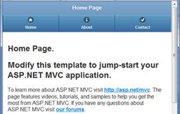
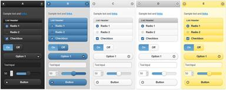
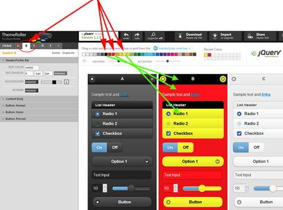

# 第六章让它好看

马蒂:“等一下，医生。啊...你是说你造了一台时间机器...出了一个德洛尔？”
Doc:“在我看来，如果你要把时间机器造成汽车，为什么不做得有风格一点呢？”
从*回到未来*

## jQuery。流动科

jQuery。Mobile 使用相当简单的结构来定义它的页面元素。通过使用`<div>`上的`data-role`标签，他们定义了这些基本区域:`page`、`header`、`content`、`footer`和`navbar`。

还有其他定义的领域，我们将在[第 9 章](09.html#heading_id_61)中讨论，但这些是您将经常使用的基本领域。

### 页面部分

```cs
      <div data-role="page" data-theme="b">

```

这是 jQuery 提供的文档的主要部分。Mobile 用于包装以下所有部分。通常包括`header`、`content`和`footer`部分，但只需要`content`部分。`page`元素本身实际上并不是必需的。但是，如果您不提供一个，框架会添加一个，所以最好的做法是继续定义它。

### 表头部分

```cs
      <div data-role="header" data-position="fixed" data-theme="b">
        <h1>@ViewBag.Title</h1>
      </div>

```

本节包含应在页面标题中显示的信息。可选的`data-position`元素可以让这个元素在用户滚动页面时贴在顶部。您可以在这里看到，我已经展示了典型的 MVC `Title`标签，因此它将自动在标题中显示页面标题。空间有限，如果标题不合适，就会被裁剪。我们可以在这里插入任何我们想要的 HTML，但是最好的做法是使用一个`<h1>`作为标题(如果你想要更高级的东西，你也可以用一个图像来代替它)。如果在`header div`中增加一个按钮，它会自动移动到左侧。如果您添加第二个按钮，它将自动移动到右侧。你可能不想要两个以上的按钮，因为任何其他按钮都会移到第二行，使标题变大(使用`navbar`代替)。

### 内容部分

```cs
      <div data-role="content" data-theme="d">
        @RenderBody()
      </div>

```

这是您将放置大部分内容的部分。在代码示例中，我展示了将呈现视图内容的典型 MVC 标签。

### 页脚部分

```cs
      <div data-role="footer" data-position="fixed" data-theme="b">

```

`footer`与`header`非常相似，只是可能更灵活一点。我们可以在这里放置两个以上的按钮，它们将被内联添加，一个接一个(不像标题那样左对齐和右对齐)。默认情况下，页脚的格式不太好，所以您可能需要添加一些其他标签来使它看起来更好。

### 酒吧区

```cs
      <div data-role="navbar">

```

这是放置导航项目的好地方。如果您考虑正常的桌面或 Windows 应用程序设计，我们倾向于使用大量选项卡控件将相关选项卡页面组合在一起。本节为您提供了一种将这些页面轻松链接在一起的类似方法。如果您将它放入部分视图文件中，您可以轻松地将它包含在任何需要它的页面上。我们将在下一节更详细地讨论这一点。

## 将菜单放入标签栏

让我们将开始时的菜单转换成一个固定的标签栏，就像您在大多数移动应用程序底部看到的那样，带有图标。目前，我们的菜单项在移动应用程序的主页上有以下代码:

```cs
      <ul data-role="listview" data-inset="true">
        <li data-role="list-divider">Menu Items</li>
        <li>@Html.ActionLink("Home", "Index", "Home")</li>
        <li>@Html.ActionLink("About", "About", "Home")</li>
        <li>@Html.ActionLink("Contact", "Contact", "Home")</li>
      </ul>

```

将该代码复制到我们的**共享**文件夹中的一个新文件中，并将其命名为 **_NavBar.cshtml** 。去掉花哨的`<ul>`标签属性和`list-divider`行，然后用我们刚刚看到的`navbar`标签把它包装在一个`div`中。

```cs
      <div data-role="navbar" data-theme="b">
        <ul>
          <li>@Html.ActionLink("Home", "Index", "Home")</li>
          <li>@Html.ActionLink("About", "About", "Home")</li>
          <li>@Html.ActionLink("Contact", "Contact", "Home")</li>
        </ul>
      </div>

```

从**_ 布局中删除原始菜单代码。Phone.cshtml** 和**_ 布局。平板电脑. cshtml** 并添加您的新部分视图，以插入我们刚刚在标题中创建的新`navbar`。

```cs
      <div data-role="header" data-position="fixed" data-theme="b">
        <h1>@ViewBag.Title</h1>
        @Html.Partial("_NavBar")
      </div>

```

因为我们已经在标题标签上有`data-position=fixed`了，这个标题和导航栏将一直保持在页面的顶部。

如果你想给你的导航添加图标，只需给每个链接添加一个`data-icon`标签。jQuery。Mobile 包含几个可以使用的内置图标:`arrow-l` *、* `arrow-r` *、* `arrow-u` *、* `arrow-d` *、* `delete` *、* `plus` *、**、*【T80】、 `gear` *、* `refresh` *、* `forward` *、*您可以在`navbar div`上添加一个`data-iconpos`标签，以确定在哪里显示图标。`iconpos`标签的有效值包括`top` *、* `bottom` *、* `left` *、*或`right`。

为了使这个例子在将这个额外的标签放入我们的链接时更容易阅读，我们将使用`@URL.Action`标签将它们从`@Html.ActionLinks`更改为`hrefs`，如下所示:

```cs
      <div data-role="navbar" data-theme="b" data-iconpos="top">
        <ul>
          <li><a href="@Url.Action("Index", "Home")"
            data-icon="home">Home</a></li>
          <li><a href="@Url.Action("About", "Home")"
            data-icon="info">About Us</a></li>
          <li><a href="@Url.Action("Contact", "Home")"
            data-icon="check">Contact Us</a></li>
        </ul>
      </div>

```

就这样——我们都准备好运行这个应用程序，看看它是如何工作的。



标签栏中添加的菜单

如果您希望将标签栏放在页面底部，可以将其放在`footer`部分，如以下代码示例所示:

```cs
      <div data-role=“footer" data-position="fixed" data-theme="b">
        @Html.Partial("_NavBar")
      </div>

```

无论哪种方式都很好——它更像是你网站的风格偏好。

### 其他标签栏注意事项

您需要了解标签栏的一些限制。如果您最多指定五个按钮，应该没问题(尽管您的文本可能会在电话上被切断，所以请保持文本简短)。如果您有六个以上的按钮，navbar 将切换到多行模式，每行有两个按钮。将标签栏保持在五个按钮或更少通常是个好主意。

如果您想使用标准 jQuery 中没有的自定义图标。移动设备，这实际上相当容易做到。我们将在[第 9 章](09.html#heading_id_70)中讨论如何做到这一点。

如果你想让其中一个图标在你在那个页面时点亮，你可以使用那个链接上的标签`class="ui-btn-active"`。

* * *

如果您正在使用共享的局部视图导航栏，这将变得有点困难，但是可以通过查询`Model.GetType()`属性来完成。使用它，您可以确定什么类型的模型被传递到页面，因此您在哪个页面上，哪个按钮应该被突出显示。

* * *

### 导航栏链接的替代语法

在我们前面的例子中，我们使用了`@Url.Action`动词而不是`@HTML.ActionLink`，因为它使第一眼理解这个例子变得简单了一点。两个动词都可以用，但是`ActionLink`最后会更复杂一点。让我们来看一个实际应用的例子:

```cs
      <div data-role="navbar" data-theme="b" data-iconpos="top">
        <ul>
          <li>@Html.ActionLink("Home", "Index", "Home", null,
            new Dictionary<string, object> {{ "data-icon", "home" }})</li>
          <li>@Html.ActionLink("About Us", "About", "Home", null,
            new Dictionary<string, object> {{ "data-icon", "info" }})</li>
          <li>@Html.ActionLink("Contact Us", "Contact", "Home", null,
            new Dictionary<string, object> {{ "data-icon", "check" }})</li>
        </ul>
      </div>

```

如果您以前使用过 MVC，您可能想知道为什么我们不使用下面代码示例中显示的更简单的符号:

```cs
      <li>@Html.ActionLink("About", "Home", null,
          new { data-icon = "home" })</li>

```

这是 MVC 程序员经常用来将一个标识值传递给一个动作的符号。但是，如果您尝试使用类似`data-icon`的名称来执行此操作，您会得到错误“无效的匿名类型成员声明符。”如果你把它翻译成英语，那就意味着，“你不能用带连字符的名字。”在幕后，我们的快捷方式`"new {}"`代码实际上为`ActionLink`方法创建了一个字典。因此，在这种情况下，我们可以自己创建一个字典，然后一切都很好。这两种方法都会产生相同的最终产品，所以这实际上是个人偏好的问题。

### 又一种替代导航条语法

在关于如何格式化这些链接的讨论中，还有一种可能性值得考虑。

```cs
      <div data-role="navbar" data-theme="b" data-iconpos="top">
        <ul>
          <li>@Html.ActionLink("Home", "Index", "Home", null,
            new { data_icon = "home" })</li>
          <li>@Html.ActionLink("About Us", "About", "Home", null,
            new { data_icon = "info" })</li>
          <li>@Html.ActionLink("Contact Us", "Contact", "Home", null,
            new { data_icon = "check" })</li>
        </ul>
      </div>

```

在 MVC 3 和 MVC 4 中，有一个特性会在 HTML 属性属性中指定下划线字符(`_`)时自动将其转换为连字符(`-`)，因为下划线在 HTML 属性中是不合法的。因此，在这个例子中，它会在最终的 HTML 中将我们的`data_icon`更改为`data-icon`。与最后一个例子一样，这两种方法都创建了相同的最终产品，因此这是个人偏好的问题。

* * *

我个人的观点是下划线的技巧很有效，但是有点误导。当使用它时，你假设其他程序员知道这个小知识；否则他们看这段代码会有点困惑。实际上，它们都生成完全相同的 HTML，所以这归结于个人偏好。

* * *

## 创建自定义主题和颜色

jQuery 中非常好的特性之一。移动是对主题的支持。您可以通过添加标签`data-theme="x"`来为页面的几乎任何部分设置主题，其中`x`是您想要使用的样式，从 A-E 开始。默认主题如下图所示。



默认 jQuery。移动主题

这些主题使用级联系统。如果为容器指定了主题，则该容器中的项目将使用指定的配色方案，除非为它们选择了另一个主题。

即使您只使用默认的主题集，您也有一组好看的选项和几个选择。但是，如果你想用自己的颜色来搭配你的图形或公司标志呢？幸运的是，jQuery。移动已经与 Adobe 合作创建了 jQuery。移动主题滚动网站。如果你想看一些你能做什么的好例子，看看 http://jqmgallery.com。

要开始使用主题滚轮，请将您的浏览器导航到[http://jquerymobile.com/themeroller/](http://jquerymobile.com/themeroller/)，您将看到主题编辑器，但带有一个非常平淡的灰色调色板。然而，解决这个问题很容易。单击工具栏中的**导入**按钮，在弹出的窗口中单击**导入默认主题**链接，然后单击**导入**按钮，瞧，现在您有了标准的 jQuery。要使用的移动主题。

现在你可以开始定制你的调色板来匹配你完美的网站。确保在左侧面板中选择了适当的样本，然后使用颜色选择器来调整和微调它们。如果您没有确保在面板中选择了正确的样本，您可能会改变全局颜色，不得不重新开始。

这是我对古老的“热狗摊”主题的致敬(你们中那些年龄足够大还记得视窗 3.1 的人可能会理解这个参考，你们年轻人可以谷歌一下！):



“热狗摊”主题的再创造

* * *

如果你在 Kindle e Ink 设备上阅读这篇文章，它不会很明显，但这是一个可怕的红色和黄色。

* * *

当您对您的颜色选择感到满意时，您可以将其下载到您的计算机上使用。点击顶部的**下载主题**链接并给它命名——在这种情况下，我们将使用*hotdogtoard*。下载会给你一个包含样式表和一些额外文件的 zip 文件，但是我们真的只对两个文件感兴趣:**hotdogtoard . CSS**和**hotdogtoard . min . CSS**。将这两个文件提取到您的**内容**文件夹中，然后将它们包含在您的项目中。

如果您之前一直关注的话，我们创建了一个自定义捆绑包，它将在 **BundleConfig.cs** 文件中为我们的移动页面最小化。回到代码中，注释掉现有的 **jquery.mobile-1.1.0.css** 文件，用您刚刚下载的文件替换它，同时将 **jquery.mobile.structure** 文件保留在包中:

```cs
      public static void RegisterBundles(BundleCollection bundles)
      {
        [… existing bundle code goes here… ]

        bundles.Add(new StyleBundle("~/Content/MobileCSS").Include(
          "~/Content/HotDogStand.css",
          "~/Content/jquery.mobile.structure-1.1.0.min.css",
          //"~/Content/jquery.mobile-1.1.0.css"
        ));

```

有了这些小变化，你应该准备好出发了。

* * *

如果您没有进行自定义捆绑，那么您将不得不编辑移动布局文件，并在其中放入对新文件的引用。

如果您仍然使用项目默认的标准捆绑包，您将不得不从目录中删除 jquery.mobile-1.1.0.css 文件(或者将其重命名为. css 以外的文件)

* * *

和任何锋利的工具一样，滚轮在没有受过训练的人手里是很危险的，所以一定要咨询你的平面设计师。向你的图形设计师展示如何使用这个工具，你可以直接导入他或她制作的样式表。