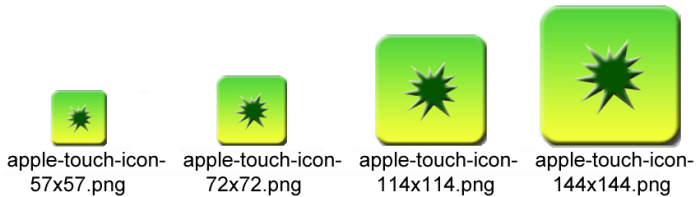
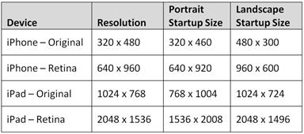

# 第七章使用移动设备元标签

“正确的单词和几乎正确的单词之间的区别就是闪电和闪电虫之间的区别。”马克·吐温

有几个简单的选项可以增强你的网站，使其功能更像一个移动应用程序。之前我们简单看了一下`viewport`标签。我们将在本章中详细介绍它，以及下面代码示例中显示的其他特殊标签:

```cs
      <meta name="viewport" content="width=device-width" />
      <meta name="apple-touch-fullscreen" content="no" />
      <meta name="apple-mobile-web-app-capable" content="no" />
      <link rel="apple-touch-icon"
        href="~/Conteimg/apple-touch-icon.png" />
      <link rel="apple-touch-startup-image"
        href="~/Conteimg/iPhone_Startup.png" />

```

## 视口标签

我们之前简单看了一下`viewport`标签，看起来是这样的:

```cs
      <meta name="viewport" content="width=device-width" />

```

这个标签相当简单。它告诉网页总是尝试使用请求页面的设备的宽度。例如，iPhone 的分辨率可以是 320 × 480 像素，也可以是 640 × 960 像素(取决于您使用的型号——请参阅本章后面的图表，了解更详细的 iOS 屏幕分辨率)。因此，来自 iPhone 的请求将使用 320 或 640 的宽度，并且它将尝试不超过该宽度。如果您的内容结构正确，那么它将重新格式化以适合该维度。如果你去一个没有这个标签的普通网站，网站被格式化为 900 像素或 1024 像素宽(就像大多数以桌面为目标的网站一样)，它在手机上看起来会很小。除非它有这个标签，否则它将继续缩小，直到内容适合屏幕。

如果您使用的标题图像比设备宽，那么您可能有问题。如果你在你的图像上指定一个`style`标签，比如``，你应该没问题。如果您没有那种类型的`style`标签，您的页面大小将扩展到图像的大小(即使您有一个`viewport`标签)，用户可能会向左和向右滚动。

如果需要，您可以使用`viewport`标签上的一些其他属性:

```cs
      <meta name="viewport" content="width=device-width, initial-scale=1.0, maximum-scale=1.0, user-scalable=no"/> 

```

`user-scalable`标签决定了你是否允许用户进行缩放。`initial-scale`设置页面加载时的大小，`maximum-scale`定义用户可以放大多少。这两个标签都设置为从 0 到 10.0 的范围。通常，您要么将它们设置为 1.0，要么将`maximum-scale`设置为类似 3.0 的值。

更多信息，请搜索苹果开发者网站 <sup>[4](MVC4_0016.htm#heading_id_82)</sup> 中的`viewport`，那里有这个标签的完整说明。

## 网络应用标签

接下来的两个标签`apple-mobile-web-app-capable`和`apple-touch-fullscreen`在一起，应该一起设置:

```cs
      <meta name="apple-mobile-web-app-capable" content="no" />
      <meta name="apple-touch-fullscreen" content="no" />

```

通常情况下，您可以根据您的应用将两者都设置为`yes`或`no`。在您在浏览器中正常浏览时，这些标签对您的帮助很小。一旦用户在使用苹果设备(如 iPhone 或 iPad)时在主页上设置了快捷方式，它们就会发挥作用。当使用这样的快捷方式时，如果您将这些标签设置为`yes`，您的网页将在网络应用模式下运行。像地址栏和后退按钮这样的浏览器闪亮将会消失，你的应用将会占据整个屏幕，就像一个原生应用一样(太好了！).

* * *

为什么有两个这样的标签？你可能只需要为 iOS 设备设置“支持苹果手机网络应用”的标签就可以了，因为这是苹果开发者网站上记录的唯一一个标签。apple-touch-fullscreen 似乎来自该框架的早期版本。在大多数情况下可能不需要它，但是包含它并没有什么坏处。

* * *

与`apple-mobile-web-app-capable`标签密切相关的是`apple-mobile-web-app-status-bar-style`标签。如果将`apple-mobile-web-app-capable`设置为`yes`，可以更改状态栏的颜色。

```cs
      <meta name="apple-mobile-web-app-status-bar-style" content="black" />

```

您可以将该标签设置为`default`(变为灰色)、`black`或`black-translucent`。这个标签完全是可选的，你不会看到它经常被使用。

* * *

警告:如果您选择黑色半透明，标题将在您的普通 jQuery 之上溢出。移动标题栏，所以你必须考虑到这一点，把 20 像素的死空间放在你的标题，所以不建议这样设置。

* * *

通过设置这两个简单的值，您已经制作了一个外观和功能几乎像本机应用程序的网页。您仍然在运行网页和浏览器，但是所有使它看起来像浏览器的东西都被隐藏了。

### 使用网络应用模式时要小心

当你第一次看到这些标签时，你可能会想在你的所有网站上一直使用它们——毕竟，它们让你的网页看起来像一个本地应用程序，而没有创建本地应用程序的任何问题。然而，在使用 web 应用程序模式时，需要注意几个问题。最大的问题是当你试图链接到一个外部项目，如 PDF 文件或外部网站。当您这样做时，链接将在 Safari 浏览器中打开，因此用户将看到一个新窗口打开，并将失去他们在应用程序中的上下文。更糟糕的是，当用户返回到你的应用时，它会从头开始:闪屏、登录、主页等。在桌面上的 Safari 中测试时，您不会注意到这种行为，但在移动设备上肯定会很明显。在您承诺在应用程序中使用此标签之前，请确保您已经测试了所有链接。

### 在桌面上创建漂亮的图标

作为一名 web 开发人员，您可能以前使用过此标签在浏览器中为桌面网站创建图标:

```cs
      <link rel="shortcut icon" href="~/favicon.ico" type="image/x-icon" />
      <link rel="icon" href="~/favicon.ico" type="image/x-icon" />

```

您可以使用`icon`标签让您的浏览器快捷方式、标签栏和标题使用您的图标。创建一个好的 **favicon.ico** 文件在过去是有点棘手的，但是微软有一个非常好的网站来帮助你创建一个。转到[http://www.xiconeditor.com/](http://www.xiconeditor.com/)可以轻松上传任意图片(最好是 64 × 64 像素)，编辑器会为你创建一个格式完美的 favicon.ico 文件。完成后，您可以保存文件并将其放在网站的根目录下。

尽管`icon`标签在桌面上很好用，但在移动设备上却没有同样的效果。以下标签本质上是等同于快捷图标标签的移动浏览器:

```cs
      <link rel="apple-touch-icon" href="~/Conteimg/apple-touch-icon.png"/> 

```

这个标签将允许用户创建一个快捷方式，并让你漂亮的图标作为他们的桌面快捷方式显示到你的应用程序。如果您不提供此标签，当用户创建桌面快捷方式时，iOS 设备将拍摄应用程序屏幕的缩略图快照并使用它。安卓设备将使用系统定义的书签图标。

乍一看，这个标签似乎很简单，但是您需要使用这个标签的许多排列。它在大多数情况下都可以工作，但是不会给你基本版本的最佳结果。在 iOS 设备上，使用此标签的基本版本将在图像的上半部分添加高光阴影。如果你不想在你的图像上有那个白色的阴影，你可以通过使用稍微修改的标签(在名称中添加`-precomposed`)来去除它:

```cs
      <link rel="apple-touch-icon-precomposed"
        href="~/Conteimg/apple-touch-icon.png"/> 

```

这个标签的欺骗性在于，每个移动操作系统都有自己的规格，说明图标*应该有多大。这个标签支持一个属性，该属性为不同的大小指定不同的图标。*

首先将应用程序图标图像的副本保存为以下各种大小，将它们放入您的**内容/图像**文件夹中，并使用如下命名方案:

```cs
      apple-touch-icon-57x57.png
      apple-touch-icon-72x72.png
      apple-touch-icon-114x114.png
      apple-touch-icon-144x144.png

```



多种尺寸的图标

手机和平板电脑使用不同大小的图标，因此我们必须为每个布局文件添加独特的线条。将以下标签添加到您的**_ 布局中。Phone.cshtml** 文件:

```cs
      <!-- iPhone Low-Res -->
      <link rel="apple-touch-icon-precomposed" sizes="57x57"  
        href="~/Conteimg/apple-touch-icon-57x57.png" />
      <!-- iPhone Hi-Res -->
      <link rel="apple-touch-icon-precomposed" sizes="114x114"
        href="~/Conteimg/apple-touch-icon-114x114.png" />
      <!-- Android -->
      <link rel="apple-touch-icon-precomposed" sizes="android-only"
        href="~/Conteimg/apple-touch-icon-57x57.png" />  
      <!-- default -->
      <link rel="apple-touch-icon-precomposed"
        href="~/Conteimg/apple-touch-icon-57x57.png" />  

```

安卓浏览器不支持`size`标签，所以我们会在一个标签中放入`android-only`的值，这样其他浏览器就不会尝试使用这个了。4.2 之前的 iOS 版本也不支持`size`标签，所以他们会使用列表中指定的最后一个，这就是为什么你会看到一个默认版本，代码末尾没有列出大小。

在你的**_ 布局中做同样的事情。Tablet.cshtml** 文件，方法是添加以下代码(请注意，这些标签与我们在 **_Layout 中使用的标签相似，但不同。电话**页面):

```cs
      <!-- iPad Low-Res -->
      <link rel="apple-touch-icon-precomposed" sizes="72x72"
        href="~/Conteimg/apple-touch-icon-72x72.png" />  
      <!-- iPad Hi-Res -->
      <link rel="apple-touch-icon-precomposed" sizes="144x144"
        href="~/Conteimg/apple-touch-icon-144x144.png" />
      <!-- Android -->
      <link rel="apple-touch-icon-precomposed" sizes="android-only"
        href="~/Conteimg/apple-touch-icon-57x57.png" />  
      <!-- default -->
      <link rel="apple-touch-icon-precomposed"
        href="~/Conteimg/apple-touch-icon-57x57.png" />  

```

有了这些设置，您应该能够在各种 iOS 和安卓设备上创建快捷方式，并在桌面上显示一个格式和大小正确的图标。

### 提示用户创建快捷方式

即使我们现在有了正确格式化的 HTML 来创建漂亮的桌面快捷方式和图标，这并不意味着用户会花时间创建快捷方式——它不会自动发生！让我们看看一种方法，我们可以在用户第一次启动我们的应用程序时提示他们创建桌面快捷方式。使用 iOS 设备时，`navigator.standalone`属性会告诉我们页面是否在全屏模式下运行。

* * *

安卓设备并不真正需要这项检查，因为它们并不完全支持全屏应用模式。他们仍然可以创建一个主屏幕书签，但这并不重要，因为它仍然打开浏览器，看起来完全一样。

* * *

下面是一些我们可以用来执行这个检查的 JavaScript。将此 JavaScript 保存在**/Scripts/promptfookmark . js**文件中:

```cs
      // Contents of file "/Scripts/PromptForBookmark.js"
      $(document).ready(function () {
        // This script should only be enabled if you are using the
        // apple-mobile-web-app-capable=yes option.
        var cookie_name = "PromptForBookmarkCookie";
        var cookie_exists = false;
        documentCookies = document.cookie;
        if (documentCookies.length > 0) {
          cookie_exists = (documentCookies.indexOf(cookie_name + "=")
           != -1);
        }
        if (cookie_exists == false) {
          // If it's an iOS device, then we check if we are in a
          // full-screen mode, otherwise just move on.
          if ((navigator.userAgent.indexOf("iPhone") > 0 ||
               navigator.userAgent.indexOf("iPad") > 0 ||
               navigator.userAgent.indexOf("iPod") > 0)) {
            if (!navigator.standalone) {
              window.alert('This app is designed to be used in full screen mode. For best results, click on the Create Bookmark icon in your toolbar and select the Add to Home Screen option and start this app from the resulting icon.');
            }
          }
          //Now that we've warned the user, set a cookie so that
          //the user won't be asked again.
          document.cookie = cookie_name +
             "=Told You So;expires=Monday, 31-Dec-2029 05:00:00 GMT";
        }
      });

```

该脚本通过检查 cookie 的存在来检查用户是否已经收到警告。如果用户之前没有被警告，脚本将首先通过查看用户代理来确定这是一个 iOS 设备，然后它将打开一个警报，通知用户他或她应该真正使用桌面快捷方式来启动这个应用程序。最后，它会存储一个过期时间很长的 cookie，这样用户就不会再为此烦恼了。

* * *

除了弹出消息之外，您可能想出一个看起来更优雅的解决方案。我将把实现细节留给你！

* * *

要启用此功能，请启用`apple-mobile-web-app-capable`选项，然后在您的 **_Layout 中添加以下脚本行。Phone.cshtml** 和**_ 布局。**文件:

```cs
      <meta name="apple-touch-fullscreen" content="yes" />
      <meta name="apple-mobile-web-app-capable" content="yes" />
      <script type="text/javascript"
        src="@Url.Content("~/Scripts/PromptForBookmark.js")" ></script>

```

这些标签将告诉 iOS 设备以全屏模式运行应用程序。他们还将启用脚本，通知用户他或她应该在应用程序第一次运行时为该应用程序创建快捷方式。

## 创建闪屏

当您加载应用程序时，大多数应用程序都会显示漂亮的启动屏幕。如果您想在应用程序以全屏模式运行时有一个漂亮的闪屏，您需要添加以下标签:

```cs
      <link rel="apple-touch-startup-image" href="startup.png"> 

```

乍一看，这个标签似乎也很简单，但再一次，看起来可能具有欺骗性。在第一个非常简单的示例中，这个标签指定了当您从桌面快捷方式启动应用程序并将其设置为使用 web 应用程序模式时将显示的启动图像。不幸的是，大多数时候这个标签根本没有任何作用。您的图像需要完全适合您的特定设备，因此有许多可能的选择。如果条件不完全正确，那么图像就不会出现。您甚至可以让图像正好处于纵向模式，然后如果用户将设备更改为横向模式，图像将不会出现。

让事情变得更加复杂的是，有两个版本的显示器你不得不担心:最初的 iPhone 和 iPad，以及更新的用于 iPhone 和 iPad 的 Retina 显示器。下表列出了启动映像的大小:



从图表中可以看出，在原始设备上，我们必须从一侧减去 20 个像素来计算标题栏，在视网膜设备上，我们必须减去 40 个像素。你可能想让你的图片大小不同，但不要屈服于这种诱惑。这些设备非常繁琐，如果你不把你的图像精确地做成这些尺寸，它们就不会出现。为了解决所有这些可能的情况，您需要创建以下每个图像，并将它们放入您的**内容\图像**文件夹中:

```cs
      startup_image_320x460.png (iPhone Low-Res)
      startup_image_640x920.png (iPhone Retina)

      startup_image_480x300.png (iPhone Low-Res Landscape)
      startup_image_960x600.png (iPhone Retina Landscape)

      startup_image_768x1004.png (iPad Low-Res)
      startup_image_1536x2008.png (iPad Retina)

      startup_image_1024x748.png (iPad Low-Res Landscape)
      startup_image_2048x1496.png (iPad Retina Landscape)

```

* * *

你可以给它们起任何你想要的名字，但是这些名字是在接下来的 HTML 示例中使用的。

* * *

为了让您的图像在正确的时间出现在所有不同的设备上，您将需要页面中各种不同版本的`apple-touch-startup-image`标签。添加 CSS 媒体规则将有助于确定在每种情况下使用哪个图像。

最好将这些代码放在布局页面中。将以下标签添加到您的**_ 布局中。Phone.cshtml** :

```cs
      <!-- iPhone Low-Res -->
      <link rel="apple-touch-startup-image"
        href="~/Conteimg/startup_image_320x460.png"
        media="(device-width: 320px)" />
      <!-- iPhone Retina -->
      <link rel="apple-touch-startup-image"
        href="~/Conteimg/startup_image_640x920.png"
        media="(device-width: 640px) and
       (-webkit-device-pixel-ratio: 2)" />
      <!-- iPhone Low-Res Landscape -->
      <link rel="apple-touch-startup-image"
        href="~/Conteimg/startup_image_480x300.png"
        media="(device-width: 320px) and (orientation: landscape)" />
      <!-- iPhone Retina Landscape -->
      <link rel="apple-touch-startup-image"
        href="~/Conteimg/startup_image_960x600.png"
        media="(device-width: 640px) and (orientation: landscape) and
        (-webkit-device-pixel-ratio: 2)" />
      <!-- (iPhone default) -->
      <link rel="apple-touch-startup-image"
        href="~/Conteimg/startup_image_320x460.png" />

```

通过创建以下标签，为您的平板电脑布局页面执行相同的操作(请注意，这些标签与我们在电话页面中使用的标签相似，但有所不同):

```cs
      <!-- iPad Low-Res -->
      <link rel="apple-touch-startup-image"
        href="~/Conteimg/startup_image_768x1004.png"
        media="(device-width: 768px) and (orientation: portrait)" />
      <!-- iPad Retina -->
      <link rel="apple-touch-startup-image"
        href="~/Conteimg/startup_image_1536x2008.png"
        media="(device-width: 1536px) and (orientation: portrait)
        and (-webkit-device-pixel-ratio: 2)" />
      <!-- iPad Low-Res Landscape -->
      <link rel="apple-touch-startup-image"
        href="~/Conteimg/startup_image_1024x748.png"
        media="(device-width: 768px) and (orientation: landscape)" />
      <!-- iPad Retina Landscape -->
      <link rel="apple-touch-startup-image"
        href="~/Conteimg/startup_image_2048x1496.png"
        media="(device-width: 1536px) and (orientation: landscape)
        and (-webkit-device-pixel-ratio: 2)" />
      <!-- (iPad default) -->
      <link rel="apple-touch-startup-image"
        href="~/Conteimg/startup_image_768x1004.png" />

```

有了这些标签，您*应该*有一个启动图像，将显示当前市场上所有的 iOS 设备。虽然您可以在安卓设备上使用网络应用模式并创建桌面图标，但这些启动图像将在安卓设备上被忽略。

* * *

注意:我仍然无法让启动图像在新的 iPad Retina 显示器上完美工作，当它处于横向模式时。图像确实会显示，但显示在屏幕的下四分之一，而屏幕的其他四分之三显示为白色。我希望这是一个将在未来更新中解决的 bug。

* * *