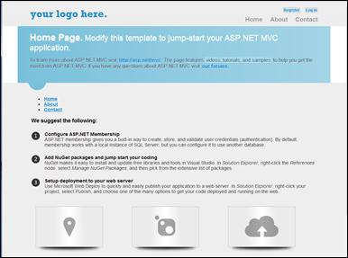
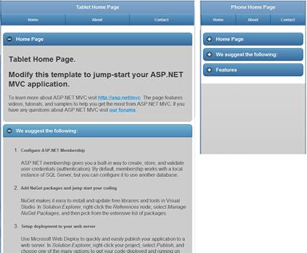
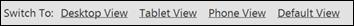
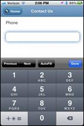
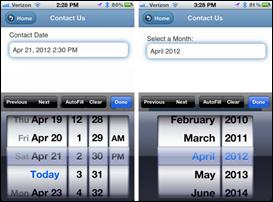
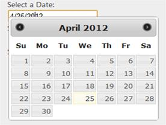
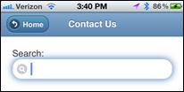
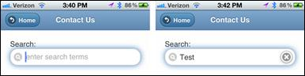

# 八、技巧

“不要试图弯曲勺子。那是不可能的。代替...只有努力去了解真相。没有勺子。然后你会发现，弯曲的不是勺子，而是你自己。”
T2 的小男孩

## 使用部分视图减少重复

到目前为止，我们创建的网站类型的一个主要问题是，我们在网站中复制页面，随之而来的是重复内容的诅咒。避免复制内容的一种方法是创建在不同设备页面之间共享的部分视图。以下三个截图是完全相同的网址，内容完全相同，但每个截图都是针对其目标平台进行组织和优化的，并且每个截图都共享相同的内容文件。



桌面视图



平板电脑和手机视图

让我们看看这些页面的源代码，从桌面视图开始:

```cs
      @{ ViewBag.Title = "Home Page"; }
      @section featured {
        @Html.Partial("_Index_SubPage1")
      }
      <ul >
        @Html.Partial("_Index_SubPage2")
      </ul>
      <h3>We suggest the following:</h3>
      @Html.Partial("_Index_SubPage3")
      <section class="features">
        @Html.Partial("_Index_SubPage4")
      </section>

```

就这样——这是整页。对于页面上的每个主要区域，您可以看到内容已经移动到了部分视图文件中，因此实际页面上所剩无几。

让我们从创建布局非常相似的移动视图开始。这是电话页面:

```cs
      @{ Layout = "../Shared/_Layout.Phone.cshtml"; }
      @{ ViewBag.Title = "Phone Home Page"; }

      <h2>Home Page</h2>
      @Html.Partial("_Index_SubPage1")

      @* -- Moved to the Shared/_Layout.Phone.cshtml *@
      @*    @Html.Partial("_Index_SubPage2")*@

      <h2>We suggest the following:</h2>
      @Html.Partial("_Index_SubPage3")

      <h2>Features</h2>
      @Html.Partial("_Index_SubPage4")

```

这是平板电脑页面:

```cs
      @{ Layout = "../Shared/_Layout.Tablet.cshtml"; }
      @{ ViewBag.Title = "Tablet Home Page"; }
      <h2>Home Page</h2>
      @Html.Partial("_Index_SubPage1")

      @* -- Moved to the Shared/_Layout.Tablet.cshtml *@
      @*    @Html.Partial("_Index_SubPage2")*@

      <h2>We suggest the following:</h2>
      @Html.Partial("_Index_SubPage3")

      <h2>Features</h2>
      @Html.Partial("_Index_SubPage4")

```

请注意，我们删除了`_Index_SubPage2`，因为这是我们在基本布局页面中已经有的菜单。这段代码还不会产生上一个截图中显示的漂亮页面，但是它会包含页面上的所有内容。我们将在一分钟内看到添加可折叠容器。

使用这种类型的编码模式极大地增加了您成功的机会，因为您可以优化页面的设计以匹配设备，但同时也使您不必同时在三个不同的地方维护内容。有了这个模型，当你在一个地方改变内容时，它在所有三个平台上同时改变！

## 可折叠容器和可重复使用的内容

让我们回到我们在[第 3 章](03.html#heading_id_15)中简要提到的可折叠容器。jQueryMobile使创建这些变得非常容易。让我们来看一个实际的例子。

让我们修改刚刚创建的移动视图，将部分视图内容放入角色为`collapsible`的`div`中。如果你使用那种类型的`div`容器，并且你必须在你的内容的顶部添加一个标题标签，你将会在容器的顶部有一个好看的带加号或减号的栏。您可以看到，我们已经将电话容器设置为折叠，平板电脑容器默认为展开，因为我们有不同的设备规格。

这是电话页面的最终代码:

```cs
      @{ Layout = "../Shared/_Layout.Phone.cshtml"; }
      @{ ViewBag.Title = "Phone Home Page"; }

      <div data-role="collapsible" data-theme="b" data-content-theme="b"
        data-collapsed="true">
        <h2>Home Page</h2>
        @Html.Partial("_Index_SubPage1")
      </div>

      @* -- Moved to the Shared/_Layout.Phone.cshtml *@
      @*    @Html.Partial("_Index_SubPage2")*@

      <div data-role="collapsible" data-theme="b"
        data-content-theme="b" data-collapsed="true">
        <h2>We suggest the following:</h2>
        @Html.Partial("_Index_SubPage3")
      </div>

      <div data-role="collapsible" data-theme="b"
        data-content-theme="b" data-collapsed="true">
        <h2>Features</h2>
        @Html.Partial("_Index_SubPage4")
      </div>

```

以下是成品平板电脑页面的代码:

```cs
      @{ Layout = "../Shared/_Layout.Tablet.cshtml"; }
      @{ ViewBag.Title = "Tablet Home Page"; }
      <div data-role="collapsible" data-theme="b"
        data-content-theme="b" data-collapsed="false">
        <h2>Home Page</h2>
        @Html.Partial("_Index_SubPage1")
      </div>

      @* -- Moved to the Shared/_Layout.Tablet.cshtml *@
      @*    @Html.Partial("_Index_SubPage2")*@

      <div data-role="collapsible" data-theme="b"
        data-content-theme="b" data-collapsed="false">
        <h2>We suggest the following:</h2>
        @Html.Partial("_Index_SubPage3")
      </div>

      <div data-role="collapsible" data-theme="b"
        data-content-theme="b" data-collapsed="false">
        <h2>Features</h2>
        @Html.Partial("_Index_SubPage4")
      </div>

```

该源代码现在将生成类似本章开头截图的页面。有了这段代码，您现在有了三个看起来明显不同、行为不同的页面，但是它们都共享完全相同的 URL 和内容。唯一的区别在于请求页面的设备。

## 桌面/移动视图切换器

MVC 4 有一个新的功能叫做浏览器覆盖，它允许用户覆盖他们的普通用户代理字符串，并像使用不同的浏览器一样查看您的页面。利用这一点，你可以允许用户通过手机访问你的网站，获得你的移动优化视图，然后他们可以请求查看它在桌面或平板电脑上的样子。

* * *

注意:这个特性只影响 MVC 中的视图和布局，不影响任何其他查看请求的 ASP.NET 特性。浏览器对象。

* * *

这个功能有几个选项可供您选择。实际上，您可以下载一个 NuGet 包来实现这一点，但是下面的代码已经被定制为与我们在本书中开发的移动框架概念一起工作。

启用此功能需要两个组件:视图和相应的控制器。让我们先来看看视图:

```cs
      <span style="font-size: 0.7em;">
      Switch To:
      @Html.ActionLink("Desktop View", "SwitchView", "ViewSwitcher",
        new { mobile = false, mobileType = "Desktop",
        returnUrl = Request.Url.PathAndQuery },
        new { rel = "external" })
      @Html.ActionLink("Tablet View", "SwitchView", "ViewSwitcher",
        new { mobile = true, mobileType = "Tablet",
        returnUrl = Request.Url.PathAndQuery },
        new { rel = "external" })
      @Html.ActionLink("Phone View", "SwitchView", "ViewSwitcher",
        new { mobile = true, mobileType = "Phone",
        returnUrl = Request.Url.PathAndQuery },
        new { rel = "external" })
      @Html.ActionLink("Default View", "SwitchView", "ViewSwitcher",
        new { mobile = false, mobileType = "Default",
        returnUrl = Request.Url.PathAndQuery },
        new { rel = "external" })
      </span>

```



查看选项

到目前为止，我们一直致力于为我们的网站开发三种不同的视图:桌面版、平板电脑版和手机版。上一张截图中显示的链接允许用户选择三个显示选项中的任何一个，或者重置为他们的设备通常会请求的默认视图。

捕捉该链接并对其进行处理的控制器如下所示:

```cs
      using System.Web.Mvc;
      using System.Web.WebPages;

      namespace Demo.Controllers
      {
        public class ViewSwitcherController : Controller
        {
          public RedirectResult SwitchView(bool mobile, string mobileType,
            string returnUrl)
          {
            mobileType = (mobileType == null) ?
              string.Empty : mobileType.Trim().ToLower();
            if (mobileType == "default")
            {
              HttpContext.ClearOverriddenBrowser();
            }
            else
            {
              if (mobileType == string.Empty) mobileType = "mobile";
              switch (mobileType)
              {
                case "desktop":
                  HttpContext.SetOverriddenBrowser("Mozilla/5.0 (Macintosh; U; Intel Mac OS X 10_6_8; en-us) AppleWebKit/534.55.3 (KHTML, like Gecko) Version/5.1.5 Safari/534.55.3");
                  break;
                case "tablet":
                case "ipad":
                  HttpContext.SetOverriddenBrowser("Mozilla/5.0 (iPad; U; CPU OS 4_3_3 like Mac OS X; en-us) AppleWebKit/533.17.9 (KHTML, like Gecko) Version/5.0.2 Mobile/8J2 Safari/6533.18.5");
                  break;
                case "phone":
                case "iphone":
                  HttpContext.SetOverriddenBrowser("Mozilla/5.0 (iPhone; U; CPU iPhone OS 4_3_3 like Mac OS X; en-us) AppleWebKit/533.17.9 (KHTML, like Gecko) Version/5.0.2 Mobile/8J2 Safari/6533.18.5");
                  break;
                default:
                  HttpContext.SetOverriddenBrowser(BrowserOverride.Mobile);
                  break;
              }
            }
            return Redirect(returnUrl);
          }
        }
      }

```

这个控制器使用的 MVC 4 提供的新功能是`SetOverriddenBrowser`和`ClearOverriddenBrowser`。在这种情况下，如果用户请求桌面视图，用户代理将被设置为模拟麦金塔桌面，但是您可以轻松地将其设置为您想要的任何用户代理。在我们的框架中，您指定什么桌面用户代理并没有太大的区别，因为它们中的任何一个都会返回默认的桌面视图。

有了这些代码，您所要做的就是在您的布局页面中添加以下一行来包含`ViewSwitcher`代码:

```cs
      @Html.Partial("_ViewSwitcher")

```

一些设计师认为这应该放在你的移动视图上方的页面顶部，还有一些人喜欢放在底部，但你在哪里显示这些链接确实是个人偏好的问题。

有了这个链接，如果移动页面由于某种原因无法正常运行，用户就可以使用桌面网站，从而获得以前没有的控制力。

## HTML 5 标签

有许多新的 HTML 5 标签在移动设备上非常有用。通过设置`<input type=`参数，可以在你的应用中指定 HTML 5 标签。这些标签包括(但不限于):`email`、`tel`、`url`、`number`、`search`、`time`、`date`、`month`、`datetime`和`datetime-local`。其中许多在移动浏览器上的支持非常有限(尤其是在安卓浏览器上)，并且有一些，例如`week`和`color`，在某些移动平台上根本不起作用，例如 iOS，还有一些在当前版本的 iOS (5.x)上起作用，但在早期版本(4.x)上不起作用。我们将在这里讨论其中的一些，并看看如何在您的 MVC 项目中轻松使用它们。

### 编辑器模板

这里有一个创建**电话**字段的 HTML 示例:

```cs
      <input class="text-box single-line" name="Phone" type="tel" value="" />

```

这段代码将在 iOS 手机上生成一个如下所示的屏幕:



电话屏幕

请注意，标准键盘已被仅由数字组成的键盘所取代，这为用户提供了更大的按钮和输入正确信息的更大机会。以类似的方式，`email`和`url`属性将显示一个包含字母和常见网址字符的键盘，如@符号，它不会出现在普通文本字段的默认键盘上。

* * *

还记得我在[第 4 章](04.html#heading_id_19)中说的当你使用 Safari 作为移动模拟器时，有些东西不工作吗？电子邮件和 url 标签(以及其他一些标签)就是其中之一。这些特殊键盘不会在桌面版 Safari 中弹出。

此外，本节中的大多数数字和日期选择器标签目前在安卓设备上不起作用。

* * *

您可以手动创建 HTML 来放入那个特殊的`input type`属性，但是在 MVC 中有一个更好的方法:数据注释。让我们从修改模型定义开始:

```cs
      public class SampleModel
      {
        // -- Other fields omitted here for brevity.
        [DataType(DataType.PhoneNumber)]
        [Display(Name = "Phone", Prompt = "Phone:")]
        public string Phone { get; set; }
      }

```

当我们添加`DataType`注释时，这将告诉 MVC 这是一种特殊类型的字符串，在组成视图时会有不同的处理。但是，如果您所做的只是添加这个数据注释，您将看不到任何不同；你还需要一个拼图:编辑器模板。

这些模板不是随标准的 MVC 项目模板一起提供的，所以您必须自己去获取它们并将它们添加到您的项目中。这些模板必须位于**共享的**文件夹下名为**编辑模板**的文件夹中。可以通过获取一个 NuGet 包(`Install-Package MvcHtml5Templates`)来找到模板。

在我们的模型定义中，我们已经指定我们的**电话**字段有一个`PhoneNumber`的`DataType`，所以 MVC 将在创建用于编辑该字段的 HTML 时寻找并使用**电话号码**模板。 **PhoneNumber.cshtml** 文件非常简单，只包含以下代码:

```cs
      @Html.TextBox("", ViewData.TemplateInfo.FormattedModelValue,
        new { @class = "text-box single-line", type = "tel" })

```

在你的视图文件中，你所需要做的就是在你的字段中使用`EditorFor`助手，它现在会自动生成更新的 HTML。(注意，如果使用`TextBoxFor`助手时没有任何特殊参数，它不会自动工作。)

```cs
      @Html.EditorFor(m => m.Phone)

```

模型数据注释、编辑器模板和`EditorFor`助手的这种组合将生成我们之前开始的代码。MVC 为我们做了所有艰难的事情——相当甜蜜，是吧？

```cs
      <input class="text-box single-line" name="Phone" type="tel" value="" />

```

我们再来看一个例子:`DateTime`帮手。让我们再次编辑我们的模型，并添加一个`DateTime`字段:

```cs
      public class SampleModel
      {
        // -- Other fields omitted here.
        [DataType(DataType.DateTime)]
        public DateTime ContactDateTime { get; set; }
      }

```

接下来我们将在**共享的**文件夹中添加一个 **DateTime.cshtml** 编辑器模板:

```cs
      @Html.TextBox("", ViewData.TemplateInfo.FormattedModelValue,
        new { @class = "text-box single-line", type = "datetime" })

```

在此过程中，让我们也创建一个 **Month.cshtml** 编辑器模板:

```cs
      @Html.TextBox("", ViewData.TemplateInfo.FormattedModelValue,
        new { @class = "text-box single-line", type = "month" })

```

将该字段添加到我们的视图后，我们可以使用以下任何`EditorFor`语句:

```cs
      @Html.EditorFor(m => m.ContactDateTime)
      @Html.EditorFor(m => m.ContactDateTime, "DateTime")
      @Html.EditorFor(m => m.ContactDateTime, "Month")

```

当您在 iOS 手机上运行此代码时，您将获得以下编辑器之一:



iOS 中的日期选择器

它看起来像一个原生应用，行为像一个原生应用，但都是 HTML！

* * *

如果你现在想让这个在所有的移动平台上运行，你将不得不尝试使用第三方工具，比如 Mobiscroll，它可以在[http://mobiscroll.com/](http://mobiscroll.com/)找到。

* * *

在你的桌面上，你还不会注意到任何不同。如果你想在桌面上有一个不错的日期选择器，你需要安装 jQuery。用户界面组件，如果它们还没有在您的项目中。如果您已经在模型中添加了`DateType.Date`数据标注，并且包含了 **Date.cshtml** 编辑器模板，那么您只需要做一些小的更改。在您的 **_Layout.cshtml** 页面中(或者在您的桌面包中的 **Global.asax** 中，如果您正在使用缩小功能)，您需要包含 **jquery-ui.min.js** 和 **jquery-ui.min.css** 文件，并且您需要在 **_Layout** 文件的标题中添加以下脚本来启用字段:

```cs
      <script type="text/javascript">
        $(document).ready(function () {
          $('.date').datepicker({ dateFormat: "mm/dd/yy" });
        });
      </script>

```

就是这样——现在您的应用程序中会有一个漂亮的日期选择器弹出窗口，看起来像这样(您几乎没有做任何工作！):



日期选择器

在您承诺使用这些功能之前，您应该确保它们在您想要定位的设备上受到支持。需要检查的一些好的资源有:

*   [http://mobilehtml5.org/](http://mobilehtml5.org/):这个网站列出了很多 HTML 5 的特性，以及支持哪些浏览器和操作系统。
*   [http://www.quirksmode.org/html5/inputs_mobile.html](http://www.quirksmode.org/html5/inputs_mobile.html):这个网站列出了一些特定的 HTML 标签和属性(就像本章中展示的)，并详细说明了哪些移动操作系统支持这些标签。

### 搜索字段

另一种有用的字段类型是`search`类型。如果您想要一个看起来像搜索字段的字段，只需在字符串字段上添加**搜索**模板类型。在下面的代码示例中，我们没有可以添加到模型中的`Search`数据注释，因此我们将告诉`EditorFor`助手使用特定的模板:

```cs
      @Html.EditorFor(m => m.SearchTxt, "Search")

```

搜索编辑器模板中的代码如下所示:

```cs
      @Html.TextBox("", ViewData.TemplateInfo.FormattedModelValue,
        new { @class = "text-box single-line", type = "search" })

```



搜索字段

请注意，字段角如何比普通文本框更圆，以及它如何在文本字段中有放大镜？这些只是对用户的微妙暗示，表明这是一个特殊的领域。

我们不会在这里讨论所有的编辑器模板，因为每个模板都有几个选项。有些使用`EditorFor`和数据注释，有些需要更多的手动调整。

### 特殊 HTML 5 属性

还有一些你会欣赏的特殊属性。`Required`属性是一个很好的 HTML 5 属性，但是这应该由您的模型中的`Required`数据注释来处理，所以我们在这里不讨论它。

一个非常有用的属性是`placeholder`属性。这将在文本框字段中放置浅灰色文本，以提示用户输入内容，然后当用户单击文本框时，文本会消失。让我们使用`TextBoxFor`助手返回并增强我们的**搜索**框，这样我们就可以轻松地添加一个额外的属性。还记得我提到的默认`TextBoxFor`助手不会使用来自数据标注的模板吗？您可以通过编辑`HtmlAttributes`来指定一个。由于这是我们需要指定`placeholder`标签的方式，我们将使用`TextBoxFor`命令指定编辑器模板和`placeholder`属性。

```cs
      @Html.TextBoxFor(m => m.SearchTxt,
        new { type= "search", placeholder = "enter search terms" })

```



搜索字段中的占位符

现在您已经在搜索栏中获得了*输入搜索词*占位符文本。当您在字段内单击并开始键入时，占位符将消失。此外，用户在文本框的右边得到一个漂亮的小清除按钮。对一个简单的小属性来说还不错！

您可能想研究添加到文本框中的其他属性有`autocorrect="off"`、`autocomplete="off"`和`autocapitalize="off"`。

## MVC 4 Tilde 花絮

这是 MVC 4 的一个很棒的特性，到目前为止，我们一直在使用它，但是你可能没有注意到。看看这段代码:

```cs
      

```

如果您在 MVC 3 中编码，您将会看到这样一个标签:

```cs
      

```

这是 MVC 4 中一个被忽略的小特性，它非常有用。如果您查看生成的 HTML，这两个语句都将生成完全相同的 HTML，但是第一个要干净得多。看起来不多，但任何能让你的代码更易读的东西都是我书中很好的特性。