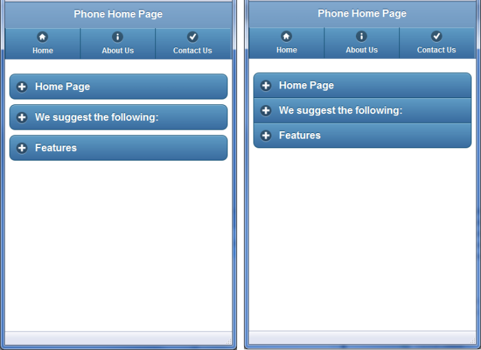
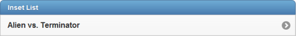
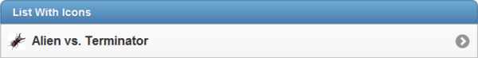
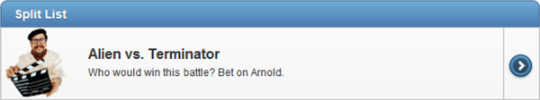
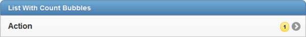
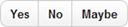
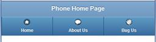

# 第九章更多 jQuery。移动功能

“你什么都不知道，除了你什么都不知道。”约翰·肯尼迪

这些年我学到的一件事是，我学得越多，我就越意识到还有很多东西要学。在这一章中，我们将了解一些关于 jQuery.Mobile 的重要知识。还有其他书籍更深入地探讨了其中的许多概念，如果这里讨论的概念引起了您的兴趣，我会鼓励您阅读它们。本章旨在让您对 jQuery.Mobile 的一些更重要的主题有一个很好的概述

## jQuery。移动容器对象

在[第 6 章](06.html#heading_id_33)中，我们讨论了主 jQuery。移动部分:`page`、`header`、`content`、`footer`和`navbar`。还有许多其他部分可供使用，我们将在这里简要讨论。

### 嵌套可折叠容器

我们已经在[技巧和诀窍](08.html#heading_id_51)部分讨论了可折叠容器对象，但是有一点我们没有讨论，那就是嵌套容器。您可以将可折叠容器嵌套在其他可折叠容器中。但是，由于随之而来的复杂性，不建议使用两个以上的级别。

除了嵌套，您可以使用可折叠容器做的另一件事是使用`data-role="collapsible-set"`属性创建手风琴式效果。如果您将一组可折叠的容器包装在这个属性中，您会得到一个很好的节省空间的效果。一次只能打开集合中的一个容器，因此当您单击任何加号时，所有其他容器都将自动关闭。

```cs
      <div data-role="collapsible-set">
        <div data-role="collapsible" data-collapsed="false">
          <h2>Section 1 Title</h2>
          Section 1 Content
        </div>
        <div data-role="collapsible" data-collapsed="false">
          <h2>Section 2 Title</h2>
          Section 2 Content
        </div>
        <div data-role="collapsible" data-collapsed="false">
          <h2>Section 3 Title</h2>
          Section 3 Content
        </div>
      </div>

```

下面是一个例子，左边是普通的可折叠容器，右边是使用手风琴效果的容器。



普通可折叠容器(左)和带有手风琴效果的容器(右)

### 字段容器

如果要创建表单，您可能希望将字段包装在字段容器中，如下面的代码示例所示:

```cs
      <div data-role="fieldcontain">
        @Html.LabelFor(m => m.UserName)
        @Html.TextBoxFor(m => m.UserName)<br />
        <span style="Color: Red;">@Html.ValidationMessageFor(m =>
          m.UserName)</span>
      </div>

```

当您使用更宽的屏幕时，此标签最有帮助。如果屏幕宽度大于 480 像素，框架将并排对齐输入和标签，如果小于 480 像素，框架将垂直堆叠它们。该标签还将在每个字段下方添加一条细底线，以帮助在视觉上分割屏幕。

### 列表视图

您可能已经在项目中多次使用了列表组件。jQuery。手机有许多功能可以增强列表，我们可以有整整一章专门讨论这个话题。但是，我们将只介绍这里最常用的，并将创建一个简短的选项备忘单，您将经常看到。

简单无序列表:全屏宽度

```cs
      <ul data-role="listview">

```

这个例子创建了一个简单的使用全屏宽度的无序列表。

插入列表

```cs
      <ul data-role="listview" data-inset="true">

```

这个例子创建了一个简单的无序列表，它在一个圆角的气泡中，从边框插入一点。

有序列表

```cs
      <ol data-role="listview">

```

本示例创建一个简单的有序列表，每个列表项都有一个编号。

带有搜索标题的列表

```cs
      <ul data-role="listview" data-filter="true">

```

这个例子创建了一个无序列表，在屏幕顶部有一个搜索栏，用户可以很容易地过滤列表的内容。

列表标题或分隔线

```cs
      <li data-role="list-divider">@ViewBag.Title</li>

```

本示例在您的列表中创建一个标题项，以可视方式分隔内容。

简单列表项目

```cs
      <li>Home</li>

```

本示例创建一个简单的列表项。

粗体列表项目

```cs
      <li><h1>Home</h1></li>

```

本示例创建一个在列表中显得更大的项目。您可以使用不同的标题级别标签来调整大小，甚至使用`<p>`标签来减小行的大小。

带链接的列表项



```cs
      <li>@Html.ActionLink(Movie.MovieName, "Details",
          new { id = Movie.MovieId })</li>

```

本示例创建一个交互式列表项。用户可以单击行中的任何位置来激活链接。

带有链接和图标的列表项



```cs
      <li>
        <a href="@Url.Action("Details",
          new { id = Movie.MovieId })" >
          @Movie.MovieName</a>
      </li>

```

本示例创建一个左侧带有图标的项目，该图标是该项目的可点击区域的一部分。您可以指定任何您想要的图标或使其数据驱动。

复杂拆分按钮列表项目



```cs
      <li>
        <a href="@Url.Action("Details",
          new { id = Movie.MovieId })" >
          
          <h3>@Movie.MovieName</h3>
          <p>@Movie.MovieDscr</p>
        </a>
        <a href="@Url.Action("Purchase",
          new { id = Movie.MovieId })">Purchase Movie</a>
      </li>

```

本示例创建了一个稍微复杂的拆分按钮视图。第一个链接控制项目的左边部分，包含图标、标题和描述。第二个链接会自动在右侧创建一个带有图标的小部分，并忽略您在其中输入的任何文本。默认情况下使用带边框的箭头图标，但是您可以指定任何 jQuery。通过将`data-split-icon`标签放在定义列表的部分顶部的`<ul>`标签上来移动图标。

带计数气泡的列表项



```cs
      <li>
        <a href="@Url.Action("GenreDetails",
          new { id = Genre.GenreId })" >@Genre.GenreName
        <span class="ui-li-count">@Genre.MovieCount</span>
        </a>
      </li>

```

这个标签创建了一个列表项，右边有一个计数气泡。通常，这将向您显示如果单击此行您将看到的项目数。在这个特殊的例子中，我们展示了单一类型的电影数量。

### 列

jQuery。Mobile 提供了一种便捷的方式，通过基于网格的两列、三列、四列或五列系统来布局屏幕。但是，正如我们在前几章中所讨论的，尽量多以单栏格式(或两栏)来思考移动设备，所以不要因此而得意忘形，回到过去多年的表格驱动的 HTML 设计心态！有一个放置桌子的地方，比如当试图并排放置一些物品时，尤其是当它们放在像页脚这样的容器中时，但是要使用克制。下面是一个简单的两列网格示例:

```cs
      <div class="ui-grid-a">
        <div class="ui-block-a"><strong>I'm Block A</strong>
          and text inside will wrap</div>
        <div class="ui-block-b"><strong>I'm Block B</strong>
          and text inside will wrap</div>
      </div>

```

类名将决定创建多少列。在本例中，我们使用了`ui-grid-a`类，它表示我们想要两列，这些列被标记为`ui-block-a`和`ui-block-b`。如果您想要三列，使用`ui-grid-b`标签并添加一个`ui-block-c div`。对于四列，使用`ui-grid-c`标记并添加一个`ui-block-d div`。最后，对于五列，使用`ui-grid-d`标记并添加一个`ui-block-e div`；然而，对于大多数屏幕来说，你最好避开这个。

### 按钮

按钮看起来相对简单，但是在 jQuery.Mobile 中有几种方法来呈现它们。通常任何类型`button`的元素都会呈现为 jQuery。移动按钮，具有`type=button`、`type=submit`、`type=reset`或`type=image`属性的`input`元素也是如此。要将任何`<a href>`链接变成按钮，您所要做的就是将`data-role="button"`标签添加到该链接中。请注意，无论您是否添加了`data-role=button`标签，页眉或页脚中的任何链接都将得到同样的处理。默认情况下，按钮呈现为页面的整个宽度。要使按钮自动调整大小以适合其内容，请在按钮上添加标签`data-inline="true"`。正如我们在前几章中提到的，您也可以使用`data-icon`属性向按钮添加图标，并且可以使用`data-iconpos`属性设置该图标的位置。

如果要将几个按钮组合成一个紧凑的容器，可以使用`controlgroup`容器。默认情况下，容器垂直列出按钮，但您可以通过设置`data-type`属性来更改。从 jQuery 开始。移动版本 1.1，你也可以添加`data-mini`属性，这样你的按钮会以更小的格式呈现。



控制组

```cs
      <div data-role="controlgroup" data-type="horizontal"
        data-mini="true">
        <a href="index.html" data-role="button">Yes</a>
        <a href="index.html" data-role="button">No</a>
        <a href="index.html" data-role="button">Maybe</a>
      </div>

```

### 对话框

jQuery。Mobile 支持以模态方式操作的弹出对话框项目(也就是说，您必须在继续其他操作之前关闭对话框)。当要求用户确认时(您确定要删除吗)，要求用户在几个选项中进行选择(“黑色还是蓝色？”)，或给出用户信息(“您的订单已提交！”).

创建对话框非常简单。只需像创建其他视图一样将页面创建为视图，然后当您链接到该视图时，将`data-rel="dialog"`标记添加到链接中，如以下代码示例所示:

```cs
      <a href="@Url.Action("Delete", new { id = Movie.MovieId })" 
        data-rel="dialog">Delete @Movie.MovieName</a>

```

您也可以在页面中添加`data-role="dialog"`标签，而不是使用`data-role="page"`标签，这样您就不必在引用您页面的每个链接上包含它。在我们的例子中，由于我们使用的是共享布局页面，这意味着您将设置一个 **LayoutDialog。Phone.cshtml** 文件和一个 **LayoutDialog。Tablet.cshtml** 文件。

当用户单击对话框页面中的链接时，对话框页面会自动关闭，链接会打开。如果想回到上一页，只需在链接上包含`data-rel="back"`属性即可。

### NoJS

jQuery。Mobile 对其浏览器支持的评级从 A 到 C，A 表示完全支持，B 表示完全支持减去 AJAX，C 表示仅支持基本 HTML。如果您想为不支持 A 级的浏览器提供内容，您可以添加一个专门针对它们的特殊部分，如下面的代码示例所示:

```cs
      <div data-role="nojs">
        Please upgrade your phone!
      </div>

```

## 多页文档

到目前为止，我们在 MVC 项目中看到的所有例子都使用了单页模板。换句话说，一个页面上只有一个**<****div****`data-role`=【页面】>** 元素。jQuery。Mobile 支持多页文档的概念，可以定义多个**<****div****`data-role`=【页面】>** 元素，每个元素都有不同的页面。每个页面元素必须有一个唯一的标识，如**<******`id`=【潜例】>** 。切换页面时，必须指定一个带有该 ID 的链接**<****a****`href`= " # diversiexample ">**，这将导致浏览器查找该内部页面，然后将其转换到视图中。**

 **这种想法非常有吸引力，因为它使您的网站在页面之间切换时速度极快。然而，一个缺点是，如果您将您的主页制作成一个包含所有页面的多页文档，那么用户第一次访问该页面时，整个站点都会被加载，包括所有子页面上的所有图像和内容。这可能会使你的页面加载非常慢，也很难在页面级别跟踪任何类型的网站分析。

此外，如果从单页文档开始，然后链接到多页文档，则必须在链接上使用`data-ajax="false"`属性。如果没有，框架只会在发出 AJAX 请求时加载第一个页面节点。

如果您正在考虑使用多页文档，请确保在实际设备上进行彻底测试。当调试你的应用程序时，把它和`"apple-mobile-web-app-capable"`标签混在一起会导致很多挫折。

* * *

我已经使用多页文档开发了完整的网站，但已经将其中一些转换回单页网站。其中一些网站仍然采用多页设计，但我可能会在下次必须进行重大更改时将这些网站切换回单页。

* * *

## 自定义图标

在前一节中，我们讨论了如何使用标准内置图标在按钮上放置图标。然而，选择是有限的，用不了多久，你就会发现自己在说，“我希望他们有一个看起来像冰淇淋三明治的图标，”或者一些同样荒谬的话。

jQuery。Mobile 使您可以轻松创建自己的自定义图标，以便在项目中使用。标准的 jQuery。移动图标使用 CSS sprite 技术将所有图像组合成一个图像，然后使用 CSS 样式表标签显示该图像的一部分。看一下**/内容/图像/图标-36-white.png** 文件，可以看到这个文件中有所有的标准图标。

您可以在类似的文件中创建自己的图标，然后在代码中以相同的方式引用它。我们来看一个例子。以下是一个带有五个自定义图标的图像文件(显示在黑色背景上):


自定义图标精灵

请注意这个精灵中的间距。它有 36 像素内容和 36 像素透明背景的交替部分，这使得它在 CSS 中更干净、更容易使用。

要使用这些自定义图标，您需要创建以下 CSS 样式:

```cs
      /* create multiple icons using a sprite with multiple images */
      .ui-icon-custom-bell,
      .ui-icon-custom-donot,
      .ui-icon-custom-asterick,
      .ui-icon-custom-thought,
      .ui-icon-custom-bug {
        background-image: url(images/CustomIcons-36-white.png);
        -moz-background-size: 180px 18px;
        -o-background-size: 180px 18px;
        -webkit-background-size: 180px 18px;
        background-size: 180px 18px;
      }

      .ui-icon-custom-bell {
        background-position:   -0 50%;
      }
      .ui-icon-custom-donot {
        background-position:   -36px 50%;
      }
      .ui-icon-custom-asterick {
        background-position:   -72px 50%;
      }
      .ui-icon-custom-thought {
        background-position:   -108px 50%;
      }
      .ui-icon-custom-bug {
        background-position:   -144px 50%;
      }
      /* Create an icon using a single image without sprites. */
      .ui-icon-custom-bugimage {
        background-image: url(images/Bug18.png);
      }
      /* Hi-res version. */
      @media only screen and (-webkit-min-device-pixel-ratio: 2)
      {
        .ui-icon-custom-bugimage {
          background-image: url(images/Bug36.png) !important;
          background-size: 18px 18px;
        }
      }

```

我们将背景位置显示为负数，这似乎有点违反直觉。我们正在做的是告诉我们的页面向左移动许多像素的图像。换句话说，对于**定制思想的**图标，我们让页面从图像左侧砍掉前 108 个像素，然后显示结果。

最后两种样式演示了如何在不使用 sprite 技术的情况下引用单个图像，以及当您使用高分辨率苹果屏幕时，如何通过将`pixel-ratio`属性设置为 2 来以高分辨率图像作为 Retina 显示器的目标。

应该在布局页面中保存和引用此样式表。如果您愿意，您可以在页面中嵌入这些样式标签，但是我建议您创建一个特定于站点的样式表。默认情况下，MVC 会在您的**内容**文件夹中创建一个 **Site.css** 文件。最佳做法是创建一个**网站。移动. css** 文件在**内容**文件夹中，将您的自定义移动样式放在那里，然后将该样式表包含在您的每个移动布局页面中(或者如果您正在使用该技术，则包含在您的自定义移动捆绑包中)。

现在我们已经创建了图像和定义标签的样式表，我们现在可以在页面中引用这些新的图标标签，就像引用标准图标一样。下面代码示例中的第一项使用股票图标，第二项使用自定义精灵图标，第三项使用自定义图像。

```cs
      <div data-role="navbar" data-theme="b" data-iconpos="top">
        <ul>
          <li>@Html.ActionLink("Home", "Index", "Home", null,
            new { data_icon = "home" })</li>
          <li>@Html.ActionLink("About Us", "About", "Home", null,
            new { data_icon = "custom-thought" })</li>
          <li>@Html.ActionLink("Bug Us", "Contact", "Home", null,
            new { data_icon = "custom-bugimage" })</li>
        </ul>
      </div>

```



带有库存和自定义图标的标题

现在你知道如何创建自己的图标文件并使用它们，你只受到你想象力的限制。让你的平面设计师为你绘制一些自定义图像，让你的网站看起来独特！

* * *

用于创建精灵的示例图像和 Photoshop 文件包含在示例代码文件中。好好享受！

* * *

## 迷你用户界面元素

jQuery 中漂亮的新特性之一。移动 1.1 是创造迷你元素的能力。所有表单元素都接受一个新的`data-mini="true"`标签。你也可以把这个标签放在`controlgroup`上，让一组按钮变小。除了使元素变小之外，此标记对元素没有任何影响，但是如果您试图将多个项目放入页眉或页脚中，它会非常有用。

## jQuery。移动启动选项

在 jQuery.Mobile 的默认行为中，有几件事您可能想要更改。最简单的方法是更改启动选项。如果你以前用 jQuery 创建过 JavaScript，你可能对`ready`事件很熟悉。在 jQuery 中。Mobile 中，有一个类似的名为`mobileinit`的事件，在框架加载时和呈现 UI 之前都会被激发，所以我们可以在这里进行更改，这会影响 UI 的创建方式。需要注意的一点是，在包含 **jQuery 之前，这需要包含在您的标题中。Mobile.js** 文件，在包含 **jQuery.js** 文件之后，您的布局文件应该是这样的:

```cs
      <script src="http://code.jquery.com/jquery-1.6.4.min.js" type="text/javascript"></script>
      <script src="@Url.Content("~/Scripts/CustomJQMobileInit.js")"
        type="text/javascript"></script>
      <script src="http://code.jquery.com/mobile/1.1.0/jquery.mobile-1.1.0.min.js" type="text/javascript"></script>

```

那么，你想在这里改变什么样的事情呢？假设我们想把每一页的默认页面动画从默认的`"fade"`改成`"flip"`，因为我们喜欢看东西翻转。为此，您可以在您的**/Scripts/customjqmobileinit . js**文件中插入以下代码:

```cs
      $(document).bind('mobileinit', function() {
        $.mobile.defaultPageTransition = "flip";
      });

```

如果我们必须创建一个多语言的本地化网站，我们也可以使用它。有些事情，比如**后退**按钮中的文字，是框架内默认设置的。我们可以通过在这个初始化脚本中设置一个内部值来覆盖它。

还有很多其他你应该调查的事件，比如`pagebeforechange`、`pagebeforeload`、`pagebeforecreate`、`pagecreate`、`pageinit`、`pageload`、`pagebeforehide`、`pagebeforeshow`、`pagehide`、`pageshow`、`pagechange`。jQuery 中的所有这些事件。您可以在页面上的 JavaScript 中访问移动事件模型。

这里有太多的细节要讲。有几个不错的 jQuery。更详细的移动书籍。这只是一个简短的介绍，为您的研究提供一个起点，让您知道使用 jQuery.Mobile 做这些事情是可能的**