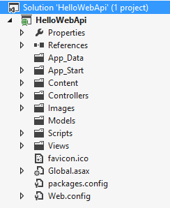
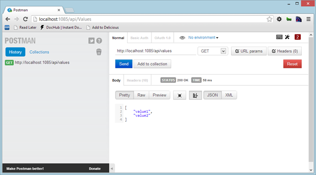
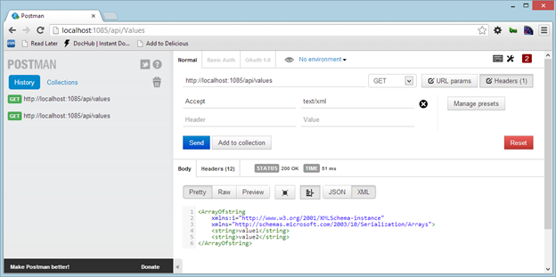

# 二、HelloWeb API

## 你好世界

让我们从创建我们的第一个网络应用编程接口项目开始，看看它看起来怎么样，看看里面有什么。

默认情况下，在 Visual Studio 2012 中，网络应用编程接口模板是 ASP.NET MVC 4 项目模板的一部分。对于旧版本的 Visual Studio，您必须通过从[http://asp.net](http://asp.net)网站下载来安装模板。

因此，让我们创建一个新的 ASP.NET MVC 4 网络应用程序，并在第二步中选择网络应用编程接口模板。一旦创建，网络应用编程接口项目几乎等同于一个经典的 ASP.NET MVC 项目，事实上，它保留了这类项目的许多概念。

这是:创建项目后出现的解决方案结构。



图 1:网络应用编程接口项目结构

需要注意的最重要的事情是:

*   控制器、模型和视图文件夹取自 ASP.NET MVC。正如我们将在后面看到的，网络应用编程接口使用相同的 MVC 模式，所以我们将有控制器和模型。还有一个视图文件夹，但是它在应用编程接口上下文中不是很有用，即使我们可以向调用者返回视图。
*   除了“视图”文件夹，还有“图像”、“脚本”和“内容”文件夹。这些并不常用，因为 API 通常用于返回数据，而不是用户界面。
*   App_Start 文件夹用于配置应用编程接口。它包含各种配置器来设置应用编程接口的行为。该文件夹还包含 ASP.NET MVC 部分的一些配置。

如您所见，使用这个项目模板，我们可以构建 ASP.NET MVC 应用程序以及 Web API 应用程序，因为两者有很多共同点。

让我们通过打开**控制器**文件夹并查看`ValuesController`类来更深入地了解一下:

```cs
  using System.Collections.Generic;
  using System.Web.Http;

  namespace HelloWebApi.Controllers
  {
      public class ValuesController : ApiController
      {
          // GET api/values
          public IEnumerable<string> Get()
          {
              return new string[] { "value1", "value2" };
          }

          // GET api/values/5
          public string Get(int
  id)
          {
              return "value";
          }

          // POST api/values
          public void Post([FromBody]string value)
          {
          }

          // PUT api/values/5
          public void Put(int
  id, [FromBody]string value)
          {
          }

          // DELETE api/values/5
          public void Delete(int id)
          {
          }
      }
  }

```

在`using`和`namespace`之后，我们找到一个类声明。`ValuesController`类继承自`ApiController`。这个类与 ASP.NET MVC 中使用的控制器基类无关，尽管它有很多相似之处。它充当我们决定通过应用编程接口公开的所有资源的基类。

在这个类中，我们找到了所有操纵`Value`资源的默认动词:`GET`、`POST`、`PUT`和`DELETE`。这里方法的名称很重要，因为 ASP.NET 网络应用编程接口运行时使用约定来查找针对 HTTP 请求调用的操作。所以这两个`Get(…)`方法被用来获取一组值，并在给定其 ID 的情况下获取单个值。`Post(…)`和`Put(…)`用于插入和修改值资源，而`Delete(…)`方法用于删除给定标识的资源。

如您所见，这五个方法是针对`GET`、`POST`、`PUT`或`DELETE` HTTP 请求调用的操作。

在接下来的章节中，我们将更深入地探讨关于前面代码的约定和其他细节。现在，我们将重点关注 ASP.NET 网络应用编程接口项目的概述。

像 ASP.NET MVC 网络应用程序一样，网络应用编程接口项目使用路由系统。路线的配置保存在 **App_Start** 文件夹中名为**的文件中。以下是该文件的内容:**

```cs
  using System.Web.Http;

  namespace HelloWebApi
  {
      public static class WebApiConfig
      {

  public static void Register(HttpConfiguration config)

  {

  config.Routes.MapHttpRoute(

  name: "DefaultApi",

  routeTemplate: "api/{controller}/{id}",

  defaults: new { id = RouteParameter.Optional }

  );

  }
      }
  }

```

这个类有一个从`global.asax`中的`WebApiApplication`类调用的方法。此方法注册应用程序所需的路由。默认情况下，之前定义的`ValuesController`响应 URI `/api/Values`，正如我们在前面的代码中看到的。请注意，尽管这些路由与 ASP.NET MVC 路由非常相似，但它们是完全不同的堆栈。在这种情况下，路线类型为`IHttpRoute`，实施包含在`System.Web.Http`组件中，因此是全新的，不依赖于`System.Web`。

即使它们不同，它们也是以几乎相同的方式实现的:每条路由都有一个名称和一个模板，该模板被标记化以匹配输入模式。

所以到目前为止，我们已经看到了负责管理`Values`资源的`Values`控制器，以及将请求路由到匹配控制器的简单路由系统。让我们运行网络应用编程接口来看看它是如何工作的。

一旦执行，它会将本地 web 服务器打开到特定的端口。我们可以使用像[邮差](http://www.getpostman.com/)这样的工具，这是一个类似 HTTP 客户端的 Chrome 扩展。



图 2:执行一个获取请求

当我们调用 http://localhost:1085/API/values 时，应用程序会用一个包含控制器中定义的两个值的`JSON`数组进行响应。

我们可以尝试的最后一件事是改变`Accept`标题，看看会发生什么。在 Postman 中，添加一个表头，要求服务器给我们`text/xml`:



图 3:执行指定接受头的获取请求

我们得到的是包含相同两个值的`XML`响应。我们不需要为这两种类型的响应更改代码，因为它们是 ASP.NET 网络应用编程接口中的本地代码。

## 总结

我们只是快速浏览了一下网络应用编程接口项目模板的各个部分，并尝试运行它来查看客户端发生了什么。现在是时候深入了解这个 ASP.NET 网络应用编程接口给我们的过程模型、路线和所有设施了。