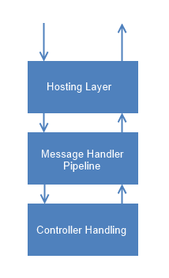

# 第三章请求的生活

## 处理请求

当客户端向 ASP.NET 网络应用程序接口应用程序发送请求时，有三层处理该请求。下图显示了在这条路线中发挥积极作用的主要组件:

图 4:请求处理的步骤

让我们看看每个阶段会发生什么。

## 下兔洞

考虑一个从客户端发出并到达第一层的请求。

### 托管层

第一层是宿主层，它直接从客户端接收 HTTP 请求。托管层可以是使用 ASP.NET 管道的经典互联网信息服务器，也可以是自托管应用程序(我们将在[第 11 章](11.html#_Chapter_11_)中详细讨论自托管)。

宿主层的作用是接收请求并将它们转换成`HttpRequestMessage`的实例，这是一个表示请求的类。该请求消息被传递到消息处理程序管道。如何构建这个请求取决于托管类型，但目前我们不会更进一步。

### 消息处理程序管道

消息处理程序管道代表了我们架构的中间件。它由一系列可插入的处理程序组成，以满足应用程序的需求。每个处理程序都是从`HttpMessageHandler`派生的类的一个实例，该类有一个方法`SendAsync`，该方法接收一个`HttpRequestMessage`的实例并返回一个`HttpResponseMessage`。

这些处理程序中的每一个都有一个对`InnerHandler`的引用，T0 是链中的下一个将被顺序调用的处理程序。

使用这种架构，每个请求都可以由做不同事情的多个处理程序进行预处理或后处理。

消息处理程序的例子有基于路由分派请求的`HttpRoutingDispatcher`和向控制器发送请求的`HttpControllerDispatcher`。

这些处理程序已经在链上，因为它们在集合`HttpConfiguration` `.`MessageHandlers`` 中。在配置网络应用编程接口应用程序的过程中，可以将其他内容添加到集合中。

我们前面提到的两个处理程序是链末端的两个特殊处理程序。

### 控制器处理

我们现在在路线的底部。控制器处理层从它上面的层接收请求消息，并调用控制器上的动作，传递所需的参数。任务由链中的最后一个处理者`HttpControllerDispatcher`完成。在`HttpControllerDescriptor`的帮助下，获得一个实现`IHttpInterface`的类的实例，并在这个实例上调用方法`ExecuteAsync`。选择要执行的正确动作是`ApiController.ExecuteAsync`方法的工作，该方法绑定参数，执行动作过滤器(如果存在的话)，并执行动作本身。

一个`IActionResultConverter`将动作的结果转换为一个`HttpResponseMessage`的实例。响应消息沿着与请求相同的路径到达客户端。

## 总结

在本章中，我们快速查看了组成 ASP.NET 网络应用编程接口的主要组件以及这些组件的作用。在接下来的章节中，我们将深入每个模块，了解它们是如何实现的，以及我们如何使用它们来构建我们的应用程序。