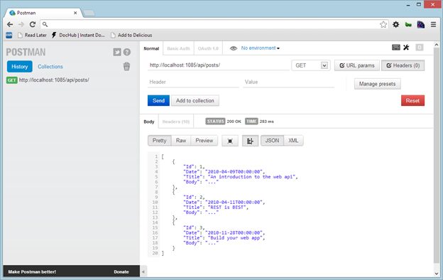
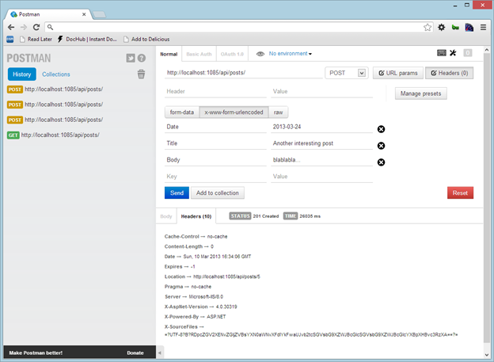
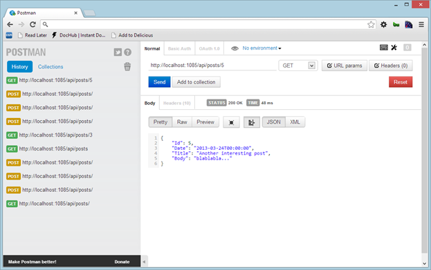
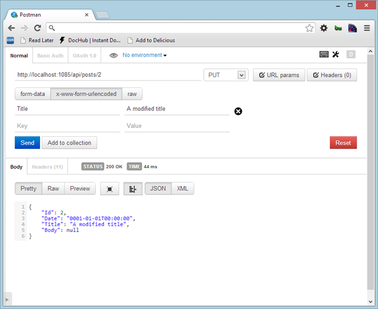

# 五、控制器

## 控制器基础

控制器是资源管理中的主要元素，因为它代表对客户端公开的资源的操作。所有的网络应用编程接口控制器都必须实现`IHttpController`接口，一般来说，它们继承自`ApiController`。`ApiController`是一个抽象类，向所有控制器公开一些基本功能，并实现`IHttpController`。

`ApiController`界面报告如下:

```cs
  public class ApiController
  {
      HttpRequestMessage Request { /* */ }
      HttpConfiguration Configuration { /* */ }
      HttpControllerContext ControllerContext
  { /*
  */}
      ModelStateDictionary ModelState { /* */}
      UrlHelper Url { /* */}
      IPrincipal User { /* */ }
      Task<HttpResponseMessage> ExecuteAsync(HttpControllerContext controllerContext,
  CancellationToken
  cancellationToken){ /* */ }
      void Dispose() {/* */ }
  }

```

如前所述，控制器的入口点是`ExecuteAsync`方法，负责选择动作并执行。动作选择基于 HTTP 方法，因此如果有`GET`请求，控制器将搜索以`Get`开头的公共实例方法，或者搜索具有`HttpGet`属性的方法。

当执行所选择的动作时，控制器执行过滤器流水线；如果有任何筛选器，它将在操作本身之前执行。

考虑到一个博客文章资源，管理它的控制器应该是这样的:

```cs
  public class PostsController : ApiController
  {
      private readonly IPostRepository _repository;

      public PostsController(IPostRepository repository)
      {

  _repository = repository;
      }

      public IQueryable<Post> Get()
      {

  return
  _repository.GetAll();
      }

      public Post Get(int id)
      {

  return
  _repository.Get(id);
      }

      public HttpResponseMessage Post(Post post)
      {

  _repository.Create(post);

  var response = Request.CreateResponse(HttpStatusCode.Created);

  response.StatusCode = HttpStatusCode.Created;
          string uri = Url.Link("DefaultApi", new { id = post.Id });
          response.Headers.Location
  = new Uri(uri);

          return response;
      }

      public HttpResponseMessage Put(int id, Post post)
      {

  post.Id = id;
          _repository.Update(post);
          var response =
  Request.CreateResponse(HttpStatusCode.NoContent);
          string uri = Url.Link("DefaultApi", new { id = post.Id });
          response.Headers.Location
  = new Uri(uri);
          return response;
      }

      public HttpResponseMessage Delete(int id)
      {
          _repository.Delete(id);

  var response =
  Request.CreateResponse(HttpStatusCode.NoContent);

  return response;        
      }
   }

```

它展示了用于进行 CRUD 操作的五种典型方法。每个方法都有自己的签名，除了使用存储库读取和保存数据之外，它还在必要的地方用头和其他东西来丰富响应。

在前面的例子中，我们省略了错误检查，以保持代码集中在 REST API 上。我们将在本章后面看到如何管理错误。

让我们深入每一种方法来了解发生了什么。

## 行动

### Get()

实际上`Get`有两个重载:一个返回整个帖子集合，一个返回单个帖子。第一个将简单地建立一个`IQueryable`帖子集合(我们稍后将回到`IQueryable`的意思)。

```cs
  public IQueryable<Post> Get()
  {
      return
  _repository.GetAll();
  }

```

这种方法相当容易；它只是要求存储库返回一个没有过滤器或其他选择子句的可用集合`Posts`，然后将集合(`IQueryable<Post>`)返回给调用者。

前面我们说过，控制器的结果应该是一个`HttpResponseMessage`。当动作返回类似`Post`的模型对象时会发生什么？

调用`Get`方法的基础`ApiController`中的方法将结果包装在一个`HttpResponseMessage`中，将`Post`对象放入内容中。因此，我们有两种方法向客户返回结果:

*   直接构建`HttpResponseMessage`。
*   返回一个对象，让 ASP.NET 网络应用编程接口为我们创建`HttpResponseMessage`响应。

通常，如果不需要处理响应(标题、状态等)。)，返回结果最简单的方法是直接返回对象，就像我们在前面的代码示例中所做的那样。

要调用这个方法，我们必须在没有任何其他参数的情况下向 URI 发出`GET`请求。



图 5:简单的 get

在邮递员的帮助下，我们可以检查反应。状态为`200 OK`。如果一切正常，ASP.NET Web API 管道会为我们添加 HTTP 状态，在这种情况下`200 OK`就是我们所期望的。在正文中，我们可以看到控制器返回的`Post`对象列表。我们可以看到，格式是`JSON`；如果请求中没有指定标题，这是默认格式。

* * *

邮递员

Postman 是一个 Chrome 扩展，可以帮助你在使用 API 时更高效。它帮助您构建带有参数、头、身份验证等的 HTTP 请求。它发送请求并读取响应。这是一个开源项目。更多信息可以在官方网站上找到:[http://www.getpostman.com](http://www.getpostman.com)

* * *

### Get(int id)

这是第二种类型的`GET`，在这里我们指定我们想要的资源的`Id`。

```cs
  public Post Get(int id)
  {
      return 
  _repository.Get(id);
  }

```

代码与前面的情况非常相似，唯一的区别是这里的动作返回的是单个`Post`而不是集合。这里又是`ApiController`，它将返回的帖子包装成一个`HttpResponseMessage`，并设置标题和状态代码(在这种情况下，与前面的情况一样为`200 OK`)。

### 员额(员额)

这里是事情变得有趣的地方。`Post()`方法的目的是在存储器中创建一个新的`Post`，并将正确的状态代码返回给调用者。

```cs
  public HttpResponseMessage Post(Post post)
  {
      _repository.Create(post);
      HttpResponseMessage response = Request.CreateResponse(HttpStatusCode.Created);
      response.StatusCode
  = HttpStatusCode.Created;
      string uri = Url.Link("DefaultApi", new { id = post.Id });

  response.Headers.Location = new URI(uri);

      return response;
  }

```

要存储`Post`，我们使用`PostRepository`的`Create()`方法，将帖子保存到定义的存储中。在这种情况下，必须手动创建响应消息，以便能够设置一些属性，并从 REST 的角度构建正确的响应。

为了创建响应消息，我们使用方法`CreateResponse()`，传递这种请求的状态代码(`201 Created`)。

然后我们添加位置头，它将包含新创建的资源的 URI。为此，我们只需要用新的`Post`的 URI 设置`response.Headers.Location`属性的值。为了构建 URI，我们不用手动编写它，而是使用 URL 助手，并将路线名称(`DefaultApi`)和`Post.Id`传递给`Link`方法。这个方法会返回类似`/api/Posts/42`的东西，其中`42`是新创建的`Post`的`id`。

使用 Postman，我们创建了一个新的`HTTP` `POST`请求，在请求正文中指定了关于`Post`对象的信息。

响应体将为空，因为我们不返回任何值，只返回对象的状态(`201 Created`)和新位置。有趣的是标题。



图 6:开机自检

在图 6 中，我们可以看到标题位置指向新创建的`Post`，其`id`等于 5。通过指定新位置，客户端应用程序将被自动告知新对象的位置，而不是猜测和手动构建 URI；这正是我们构建一个真正的超媒体 API 所需要的。

如果我们想看看新创建的`Post`看起来如何，我们只需要向位置 URI / `api/posts/5`发出`GET`请求:



图 7:对新创建的资源的 GET 请求

### Put(内部 id，发布帖子)

`Put()`动作用于改变资源。该方法采用两个参数:一个来自 URI(T1)，另一个在请求主体(T2)对象本身中指定。由于`Put()`方法对资源起作用，我们需要在 URI 拥有`Id`(就像我们使用`GET`方法`/api/posts/5`时一样)。`Id`将代表要修改的资源，请求体将包含要存储的`Post`的新内容。

```cs
  public HttpResponseMessage Put(int id, Post post)
  {
      post.Id = id;

  _repository.Update(post);
      var response = Request.CreateResponse(HttpStatusCode.OK, post);
      string uri = Url.Link("DefaultApi", new { id = post.Id });

  response.Headers.Location = new URI(uri);
      return response;
  }

```

`Put()`方法的实现类似于`Post()`方法。区别在于回复状态码:是`200 OK`，回复包含更新后的帖子(对`CreateResponse`的调用取状态和内容)。

将更新后的`Post`对象放入响应中是一个偏好问题。有时`PUT`有一个空的主体，只包含更新资源的位置头。在这种情况下，我们决定包括更新的`Post`即使不是严格必要的。

为了将帖子包含在响应中，我们使用了`CreateResponse()`方法的重载，除了状态代码之外，还传递了`Post`的实例。

当我们试图用`PUT`调用资源时，按照 HTTP 标准，我们需要传递需要修改的资源的全部内容。如果我们要做部分更新，首选的方法是使用`PATCH`(更多关于补丁的信息可以在[http://www.rfc-editor.org/rfc/rfc5789.txt](http://www.rfc-editor.org/rfc/rfc5789.txt)或`POST`动词中找到)。

因此，如果我们在正文中传递新标题，响应将包含带有新标题的完整帖子，并且我们在操作中指定的位置标题将在标题中。



图 8:一个 PUT

### 删除(int id)

最后一个动作是`DELETE`法。

```cs
  public HttpResponseMessage Delete(int id)
  {
   _repository.Delete(id);
   HttpResponseMessage response =
  Request.CreateResponse(HttpStatusCode.NoContent);
   return response;        
  }

```

我们只需使用存储库删除给定的帖子，并向客户端返回一个空响应。不需要指定特定的标题。我们使用`203 No Content` HTTP 状态来指定响应没有正文。

## 自定义操作

到目前为止，我们已经看到了执行 CRUD 操作的五个经典操作，每个方法都以 HTTP 方法名开始。如果我们需要其他方法呢？

我们可以使用动作属性来指定与请求匹配的 HTTP 方法。

考虑以下示例:我们希望添加一个操作来使用日期查看帖子，我们希望有一组像这样的 URIs:

表 4:网址和描述

| /API/post/archive/2010/04/11 | 返回 2010 年 4 月 11 日的所有帖子 |
| /API/post/archive/2010/04 | 返回 2010 年 4 月的所有帖子 |
| /API/post/archive/2010 | 返回 2010 年的所有帖子 |

我们首先需要为归档操作定义一个新的路径:

```cs
  config.Routes.MapHttpRoute(
      name: "Archive",
      routeTemplate: "api/posts/archive/{year}/{month}/{day}",
      defaults: new { 
                       controller
  = "Posts", 
                       month
  = RouteParameter.Optional, 
                       day
  = RouteParameter.Optional 
                    },
      constraints: new { month = @"\d{0,2}", day = @"\d{0,2}"}
  );

```

这段代码用三个参数定义了一条新路线:年、月和日。分配给`PostsController`，月和日必须是数字。

有了这条路线，我们可以在`PostsController`类中定义一个响应这条路线的新方法:

```cs
  [HttpGet]
  public IQueryable<Post> Archive(int year, int month =
  0, int day = 0)
  {
      return _repository.Search(year, month, year);
  }

```

该操作只需接受这三个参数，并使用存储库发出查询。请注意，月和日具有默认值，因为它们在请求中不是必需的。

这个动作用路由请求所需的`HttpGetAttribute`修饰，因为方法名不以`Get`开头。

|  | 注意:另一个解决方案是将方法重命名为 GetArchive，这样它就符合默认约定。 |

## 模型绑定

在前面的例子中，我们看到了这样一个动作:

```cs
  public HttpResponseMessage Post(Post post)
  {
    /*
  ...some code here... */
  }

```

`Post`参数是如何建立的？

如果我们分析该请求，我们将看到如下内容:

```cs
  POST http://localhost:1085/api/posts
  HTTP/1.1
  Host: localhost:1085
  Connection: keep-alive
  Content-Length: 51
  Cache-Control: no-cache
  User-Agent: Mozilla/5.0 (Windows NT
  6.2; WOW64) AppleWebKit/537.22 (KHTML, like Gecko) Chrome/25.0.1364.152
  Safari/537.22
  Content-Type:
  application/x-www-form-urlencoded
  Accept: */*
  Accept-Encoding: gzip,deflate,sdch
  Accept-Language:
  en-US,en;q=0.8,it;q=0.6
  Accept-Charset:
  ISO-8859-1,utf-8;q=0.7,*;q=0.3

  Title=Hello+again&Date=2013-04-20&Body=hi+everybody!

```

我们可以在 post 请求的末尾看到值的集合(请求的主体):

```cs
  Title=Hello+again&Date=2013-04-20&Body=hi+everybody!

```

参数的所谓*模型绑定器*将该实体转换为`Post`对象。模型绑定器的任务是解析请求并从中提取操作所需的值。默认情况下，有两个模型绑定器以不同的方式运行:`ModelBinderParameterBinding`和`FormatterParameterBinding`。

这些类继承自抽象类`HttpParameterBinding`，并在方法`ExecuteBindingAsync`中实现它们的行为。`ModelBinderParameterBinding`是首选方法，因为它从 URI(路线参数或查询字符串)中提取值，而`FormatterParameterBinding`使用`MediaTypeFormatter`(在下一章中有更多关于这方面的内容)来解析主体和构建复杂对象。

班级`ModelBinderParameterBinding`里面是`ValueProviders`。这些对象从传入请求的各种元素(标头、查询字符串、正文等)中聚合值。`ModelBinder`使用这些`ValueProviders`来构建模型。

为了更好地理解这一切是如何工作的，让我们看一个例子。假设我们需要从头部提取一个动作参数。为此，我们需要实现一个`IValueProvider`:

```cs
  public class HeaderValueProvider : IValueProvider
  {
      public HttpRequestHeaders Headers { get; set; }
      public HeaderValueProvider(HttpRequestHeaders headers)
      {
          Headers =
  headers;
      }

      public bool ContainsPrefix(string prefix)
      {
          return Headers.Any(s => s.Key.StartsWith(prefix));
      }

      public ValueProviderResult GetValue(string key)
      {
          KeyValuePair<string, IEnumerable<string>> header = Headers.FirstOrDefault(s =>
  s.Key.StartsWith(key));
          string headerValue = string.Join(",", header.Value);
          return new ValueProviderResult(headerValue, headerValue, CultureInfo.InvariantCulture);
      }
  }

```

这个类有两个值得一提的方法。调用`ContainsPrefix`方法来验证头部包含我们需要的信息，其中前缀字符串通常是动作参数的名称。调用`GetValue`方法从报头中提取信息，并以`ValueProviderResult`的形式返回。

要将此提供程序链接到我们的操作，我们需要使用一个属性:

```cs
  public HttpResponseMessage Post([ValueProvider(typeof(HeaderValueFactory))] String username)
  {
    //...
  }

```

既然`ValueProviderAttribute`需要一个`ValueProviderFactory`，我们的最后一个任务就是实施一个工厂来建设我们的`HeaderValueProvider`:

```cs
  public class HeaderValueFactory : ValueProviderFactory
  {
      public override IValueProvider GetValueProvider(HttpActionContext actionContext)
      {
          return new HeaderValueProvider(actionContext.Request.Headers);
      }
  }

```

这就完成了构建从标头中提取值的绑定器所需的类。正如我们所看到的，这并不容易，它需要很多任务；幸运的是，默认绑定通常足够聪明，可以反序列化请求并为您的操作创建正确的参数。

请记住，默认情况下，对于基本类型和`DateTime`、`TimeSpan`、`Guid`、`Decimal`和`String`，ASP.NET 网络应用编程接口使用模型绑定并从 URI 提取值。如果需要，我们可以使用属性`FromBody`覆盖默认行为，以指定值来自主体:

```cs
  public HttpResponseMessage Post([FromBody] String username)

```

在其他特殊情况下，我们可以使用`ModelBinder`属性来指定我们需要`ModelBinder`的特定实现:

```cs
  public HttpResponseMessage Post([ModelBinder(typeof(UserModelBinder))] User username)

```

通过`ModelBinder`属性，我们可以指定构建`User`参数的`IModelBinder`的实现:

```cs
  public interface IModelBinder
  {
      object BindModel(ControllerContext cc, ModelBindingContext mbc);
  }

```

构建`User`实例的方法`BindModel`将被传递给`Post`动作。

让我们看看参数与我们的行动之间的不同联系。默认情况下，ASP.NET 网络应用编程接口试图从查询字符串或路由参数中获取简单的值。例如，如果请求网址是这样的:

`/?tag=web&date=20130409`

`tag`和`date`均取自 URI，因此无需指定自定义绑定或属性。

如果我们强制使用参数的属性，那么参数将从主体中读取:

`void Action([FromBody] string name);`

相反，如果我们不指定其他属性，并且我们有一个包含一个简单类型和一个复杂类型的操作，则第一个从 URI 读取，而复杂类型将从正文中获取:

`void Action(int id, Post p)`

`id`取自 URI，而`Post`取自身体，因为它是一个复杂的类型。

如果我们有一个动作需要两个复杂的类型，一个必须来自身体，而另一个必须来自另一个来源:

`void Action([FromUri] Customer c1, Customer c2)`

`c1`来自 URI，`c2`来自身体

在任何情况下，我们都可以定义一个自定义模型绑定器，并使用一个属性来指定我们想要使用它:

`void Action([ModelBinder(PostCustomBinder)] Post p)`

`PostCustomModelBinder`将用于构建帖子实例。

|  | 注意:需要记住的一件重要的事情是，Web API 最多读取一次响应体，所以一个动作只有一个参数可以来自请求体。如果需要从请求正文中获取多个值，请定义一个复杂类型。如果你的动作需要多个复杂类型，那么应该只有一个来自身体。 |

这意味着这个动作:

```cs
    public HttpResponseMessage Post(Post post, User user)

```

`InvalidOperationException` `: `Can't bind multiple parameters ('post' and 'user') to the request's content.`` 将会升起一个

为了确保此操作有效，我们需要使用一个属性来指定`Post`(或`User`)来自 URI:

```cs
  public HttpResponseMessage Post(Post
  post, [FromUri]User user)

```

`FromUri`属性强制用户从 URI 而不是身体进行解析。

## 总结

控制器是 ASP.NET 网络应用编程接口的核心。这是程序员花费大部分时间的地方，也是输入、模型和服务之间合作的地方。

在本章中，我们看到了什么是控制器，以及它公开了什么类型的操作，从默认操作到自定义操作。然后我们看到了模型绑定如何将请求数据转换成动作参数。