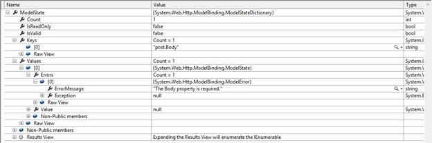

# 六、模型验证

## 属性

就像在 ASP.NET 一样，当 MVC 模型进入 Web API 管道时，它们可以被验证。为了定义验证，我们的模型必须用来自命名空间`System.ComponenModel.DataAnnotations`的属性来修饰。考虑到我们的`Post`模型，我们可以像这样添加指定属性的验证:

```cs
  public class Post
  {
      public int Id { get;
  set; }
      public DateTime Date { get; set; }
      [Required]
      public string Title { get; set; }
      [Required]
      public string Body { get; set; }
  }

```

在本例中，我们将属性`Required`添加到`Title`和`Body`中，以指定一个`Post`必须始终有一个`Title`和一个`Body`。

## 模型状态

这些属性影响`Controller`类的`ModelState`属性。

```cs
  public HttpResponseMessage Post(Post
  post)
  {
      if (ModelState.IsValid)
      {
          // ...normal
  execution...
      }
      else
      {
          return new HttpResponseMessage(HttpStatusCode.BadRequest);
      }
  }

```

`ModelState`对象是一个包含错误列表的`Dictionary`，如果包含错误，该列表可用于检查模型。

在`Post`模型像以前一样修饰的情况下，如果我们发布一个打破所需属性的帖子，`ModelState`将包含错误列表，属性`IsValid`设置为`false`。

例如，如果我们发布一个没有身体属性的`Post`，那么`ModelState`将是这样的:



图 9:模型状态无效

包含未通过验证的`Keys`和`Values`列表。这些错误是包含错误信息和其他信息的`ModelError`列表。我们可以使用错误消息来构建响应，以便客户端知道哪些属性与验证不匹配。在验证错误的情况下，我们应该返回一个 HTTP 状态`400 Bad request`。

下表显示了实际的内置属性:

表 5:当前内置的验证属性

| 属性 | 描述 |
| CompareAttribute | 提供比较两个属性的属性。 |
| CustomValidationAttribute | 指定用于验证属性或类实例的自定义验证方法。 |
| 数据类型属性 | 指定要与数据字段关联的附加类型的名称。 |
| maxlengtheattribute | 指定属性中允许的数组或字符串数据的最大长度。 |
| 最小长度属性 | 指定属性中允许的数组或字符串数据的最小长度。 |
| RangeAttribute | 指定数据字段值的数值范围约束。 |
| 正则表达式属性 | 指定 ASP.NET 动态数据中的数据字段值必须与指定的正则表达式匹配。 |
| 需要属性 | 指定需要数据字段值。 |
| stringlengthtattribute | 指定数据字段中允许的最小和最大字符长度。 |

这是继承自`ValidationAttribute`的验证器的基本列表。随着。NET Framework 4.0 中，其他的被添加为`DataValidator`，一个`ValidationAttribute`的子类，用于派生一种类型验证器。下表列出了这些内容:

表 6:数据类型属性

| 属性 | 描述 |
| CreditCardAttribute | 指定数据字段值是信用卡号。 |
| emailaddressaytribute | 验证电子邮件地址。 |
| EnumDataTypeAttribute | 允许将. NET Framework 枚举映射到数据列。 |
| 文件扩展属性 | 验证文件扩展名。 |
| phonest attribute | 指定数据字段值是使用电话号码正则表达式的格式良好的电话号码。 |
| UrlAttribute | 提供网址验证。 |

属性可以通过从现有的属性中派生来定制和个性化，或者我们可以构建包含强逻辑的新属性来验证数据。我们必须从中派生的基类是`ValidationAttribute`。

## 总结

在本章中，我们看到了如何在不修改现有代码的情况下使用验证机制来验证我们的模型。这只是我们图书馆保存的另一个工具。