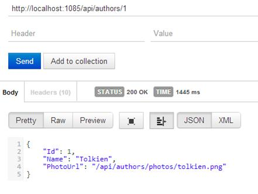

# 七、内容协商

## 格式化资源

从[第 1 章](01.html#_Chapter_1_)中我们已经知道，客户端可以使用`Accept`头以特定的格式请求资源。这样，服务器将尝试服务请求以匹配特定的格式，如果不支持该格式，它将返回一个`406 Not Acceptable`。

网络应用编程接口使用内容协商机制来支持这一功能。上一章我们看到所有的回复都是作为`JSON`的，但是我们也可以要求`XML`的格式。

考虑`Post`示例，并构建如下请求:


图 10:指定接受类型的 GET

我们只需添加`Accept`标题并将其设置为`text/xml`。这意味着客户要求的`Post`的`Id`等于`XML`格式的`1`。事实上，服务器用一个`XML`响应来响应，其中的元素与`Post`对象的属性相匹配。

这是因为 ASP.NET 网络应用编程接口将`XmlFormatter`包含在可用格式化程序的列表中。

格式化程序是继承自`MediaTypeFormatter`的对象，T0 是一个抽象类，具有以下接口:

```cs
  public abstract class MediaTypeFormatter
  {
      Collection<MediaTypeHeaderValue> SupportedMediaTypes { get; }
      Collection<Encoding> SupportedEncodings { get; }
      Collection<MediaTypeMapping> MediaTypeMappings { get; }
      IRequiredMemberSelector RequiredMemberSelector { get; set; }
      Task<object>
  ReadFromStreamAsync(Type type, Stream readStream, HttpContent content, IFormatterLogger formatterLogger);
      Task WriteToStreamAsync(Type type, object value, Stream writeStream, HttpContent content, TransportContext transportContext);
      Encoding SelectCharacterEncoding(HttpContentHeaders contentHeaders);
      void SetDefaultContentHeaders(Type type, HttpContentHeaders headers, MediaTypeHeaderValue mediaType);
      MediaTypeFormatter GetPerRequestFormatterInstance(Type type, HttpRequestMessage request, MediaTypeHeaderValue mediaType);
      bool CanReadType(Type
  type);
      bool CanWriteType(Type
  type);
  }

```

乍一看，我们可以看到格式化程序可以读写数据。这很有意义，因为格式化程序可以解析特定格式的请求，为操作构建参数，另一方面可以将操作的结果转换为另一种特定格式。

鉴于最重要的成员是:

*   `SupportedMediaType`:该格式化程序支持的类型的集合。这些对应于请求的 MIME 类型。
*   `CanReadType`:如果格式化程序能够从请求中读取类型，则为真的布尔值。
*   `CanWriteType`:布尔值，如果格式化程序能够将类型写入响应，则该值为真。
*   `ReadFromStreamAsync`:这是将被调用来从输入流中读取的方法。它应该返回资源的实例。
*   `WriteToStreamAsync`:这是将被调用来将资源写入输出流的方法。

在 ASP.NET 网络应用编程接口中，已经有四种现成的媒体类型格式化程序:

*   `JsonMediaTypeFormatter`:将请求的资源格式化为`JSON`格式(这是默认的格式化程序)。
*   `XmlMediaTypeFormatter`:将请求的资源格式化为`XML`格式。
*   `FormUrlEncodedMediaTypeFormatter`:用于管理应用/x-www-form-urlencoded 请求。
*   `JQueryMvcFormUrlEncodedFormatter`:源自`FormURLEncodedMediaTypeFormatter`，增加了对 JQuerySchema 的支持。

如果我们愿意，我们可以添加自己的格式化程序来匹配 API 规范。

让我们看一个例子，看看我们可以用媒体类型格式化程序做什么。考虑以下控制器:

```cs
  public class AuthorsController :  ApiController
  {
      // ...
      public IQueryable<Author> Get()
      {
          return _repository.GetAll();
      }

      public Author Get(int
  id)
      {
          return _repository.Get(id);
      }
  }

```

这是一个简单的控制器，有两种方法来获得一个列表或一个作者。作者类是这样的:

```cs
  public class Author
  {
      public int
  Id { get; set;
  }
      public string Name { get; set; }
      public string PhotoUrl { get; set; }
  }

```

所以如果我们要求一个作者，我们看到:



图 11:获得一个作者

我们现在想要的是作者的照片，但是我们想用我们用来获取作者信息的同一个 URI`(`/api/authors/1``)。

因此，我们创建了一个新的`GET`请求，其`Accept`头指定了我们想要的格式(例如，`image/png`)。


图 12:指定接受类型的获取请求

作为回应，我们想要一个代表托尔金(作者用`id 1`)的 PNG 图像。

为了获得这一点，我们需要一个`MediaTypeFormatter`的帮助，它从控制器中取出`Author`对象，并用他的照片替换它。

这是完整的实现:

```cs
  public class ImageFormatter : MediaTypeFormatter
  {
      public ImageFormatter()
      {
          SupportedMediaTypes.Add(new MediaTypeHeaderValue("image/png")); 
      }

      public override bool
  CanReadType(Type type)
      {
          return false;
      }

      public override bool
  CanWriteType(Type type)
      {
          return type == typeof(Author);
      }

      public override Task WriteToStreamAsync(Type
  type, object value, Stream writeStream, HttpContent content, TransportContext transportContext)
      {
          return Task.Factory.StartNew(() =>
  WriteToStream(type, value, writeStream, content));
      }

      public void WriteToStream(Type type, object
  value, Stream stream, HttpContent content)
      {
          Author author = (Author)value;
          Image image = Image.FromFile(@".\Photos\" + author.Name + ".png");

  image.Save(stream, ImageFormat.Png);
          image.Dispose();
      }
  }

```

这个类继承自`MediaTypeFormatter`，一个所有格式化程序的基类。如前所述，运行时调用`WriteToStreamAsync`。在这种方法中，由于它是异步的，我们创建一个新的`Task`，并从实际从文件系统读取文件并将其写入输出流的方法开始。

要将新创建的`ImageFormatter`媒体类型格式化程序添加到网络应用编程接口管道，我们需要在应用程序启动时使用`HttpConfiguration`对象上的`Formatters`属性注册它:

```cs
  public static class WebApiConfig
  {
      public static void Register(HttpConfiguration config)
      {
          config.Formatters.Add(new ImageFormatter());
      }
  }

```

调用服务的结果如下:


图 13:巴布亚新几内亚格式的响应

好的一点是，使用相同的 URI(记住 URI 代表资源的标识)，我们有两种不同的表示，我们可以使用不同的头来决定我们想要哪一种。

## 总结

内容协商是真正的 REST API 的重要组成部分。它使得以各种格式公开资源并让客户端决定哪种是最好的成为可能。我们看到了如何实现一个自定义的格式化程序来转换一个 PNG 格式的资源，以便将资源的图像表示提供给客户端。