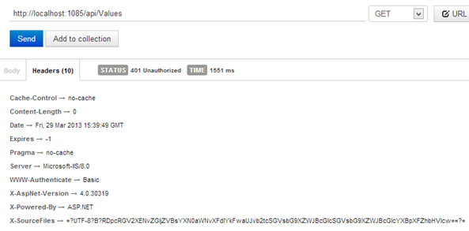
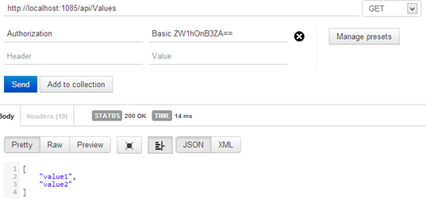

# 九、安全

即使我们的 API 是公开的，我们几乎肯定需要某种机制来检查谁在使用我们的应用程序。

安全性有两个方面需要考虑:身份验证和授权。

**认证**是识别谁是使用我们的 API 的用户的过程。通常，身份验证是通过使用用户名和密码、个人令牌或在复杂情况下使用 OpenID 提供程序来实现的。

因为 REST 服务的约束之一是它必须是无状态的，所以服务器永远不应该存储请求之间的客户端上下文(服务器不应该使用 Session 变量或类似的机制)。因此，客户端被迫在每次请求时提供凭据。

这也意味着凭据以 HTTP 头的形式传递给服务器，为了保证请求的安全性，我们需要使用像 HTTPS 这样的安全传输。使用 HTTPS 是每个需要保护的 REST API 的基础。

**授权**是指定用户是否具有在资源上执行特定任务的权限(访问权限)的功能。一旦用户通过身份验证，框架必须知道用户是否可以查看请求的数据或保存正在发布的信息。

有各种方法来验证用户，从简单的用户名和密码，到更复杂的令牌，再到 OpenID。

有了 ASP.NET 网络应用编程接口，我们可以选择我们更喜欢的一个，但是我们必须实现它，因为没有现成的东西。

让我们从大多数情况下需要的基本身份验证开始。

## 基本认证

保护我们的应用编程接口的第一个也是最简单的方法是实现基本的身份验证。基本身份验证是 RFC 2617 中定义的标准。使用此模式，客户端必须向服务器提供凭据，服务器会验证匹配。凭据、用户名和密码使用`Authorization`头发送到服务器，它们以关键字`Basic`为前缀，并用 Base64 编码。

用户名和密码应采用`username:password`格式，使用冒号作为分隔符。

例如，使用基本身份验证的请求如下所示:

```cs
  GET
  http://localhost:1085/api/Values HTTP/1.1
  Host: localhost:1085
  Proxy-Connection:
  keep-alive
  User-Agent: Mozilla/5.0
  (Windows NT 6.2; WOW64) AppleWebKit/537.31 (KHTML, like Gecko)
  Chrome/26.0.1410.43 Safari/537.31
  Cache-Control: no-cache
  Authorization: Basic
  ZW1hOnB3ZA==
  Accept: */*
  Accept-Encoding:
  gzip,deflate,sdch
  Accept-Language:
  en-US,en;q=0.8,it;q=0.6
  Accept-Charset:
  ISO-8859-1,utf-8;q=0.7,*;q=0.3

```

我们可以看到粗体的`Authorization`标题，带有以 Base64 编码的用户名和密码。

然后，服务器接收请求并提取`Authorization`头来验证凭证。它解码字符串并验证用户名和密码是否正确。如果它们是正确的，它将继续执行请求。否则，返回`HTTP 401 Unauthorized`响应。在本例中，响应包含标题`WWW-Authenticate: Basic`，指示客户端使用基本方案提供正确的凭据。这个标题是浏览器用来向用户显示用户名和密码对话框的标题。

这就是基本身份验证的工作原理。现在让我们看看这对我们的 ASP.NET 网络应用编程接口意味着什么。

为了管理认证请求，我们需要实现一个`Message Handler`，它在请求到达控制器之前接收请求，并决定用户是否有权访问资源。

要实现一个`MessageHandler`我们必须实现`DelegatingHandler`抽象类，正如我们在前面的章节中已经看到的。

```cs
  public class BasicAuthenticationHandler : DelegatingHandler
  {
      private readonly IAuthenticationService _service;

      public BasicAuthenticationHandler(IAuthenticationService service)
      {
          _service = service;
      }

      protected override Task<HttpResponseMessage> SendAsync(
                                      HttpRequestMessage request,
                                      CancellationToken cancellationToken)
      {
         AuthenticationHeaderValue authHeader = request.Headers.Authorization;
         if (authHeader == null || authHeader.Scheme != "Basic")
         {
             return Unauthorized(request);
         }

         string encodedCredentials = authHeader.Parameter;
         byte[] credentialBytes = Convert.FromBase64String(encodedCredentials);
         string[] credentials = Encoding.ASCII

  .GetString(credentialBytes).Split(':');

          if (!_service.Authenticate(credentials[0], credentials[1]))
          {
              return Unauthorized(request);
          }

          string[] roles = null; // TODO
          IIdentity identity = new GenericIdentity(credentials[0], "Basic");
          IPrincipal user = new GenericPrincipal(identity, roles);
          HttpContext.Current.User = user;

          return base.SendAsync(request, cancellationToken);
      }

     private Task<HttpResponseMessage> Unauthorized(HttpRequestMessage request)
     {
         var response = request.CreateResponse(HttpStatusCode.Unauthorized);
         response.Headers.Add("WWW-Authenticate", "Basic");

         TaskCompletionSource<HttpResponseMessage> task = new TaskCompletionSource<HttpResponseMessage>();
         task.SetResult(response);
         return task.Task;
      }
  }

```

让我们看看会发生什么。当请求到达处理器时，它通过搜索`Authentication`值来分析头部。如果不存在，则向客户端发送`401 Unauthorized`消息。

如果`Authentication`头存在，它将从 Base64 解码其值，并提取用户名和密码的值:

```cs
  AuthenticationHeaderValue authHeader =
  request.Headers.Authorization;
  if (authHeader == null || authHeader.Scheme != "Basic")
  {
       return Unauthorized(request);
  }

  string encodedCredentials =
  authHeader.Parameter;
  byte[] credentialBytes = Convert.FromBase64String(encodedCredentials);
  string[] credentials = Encoding.ASCII.GetString(credentialBytes).split(':');

```

现在在凭证中我们有两个字符串，用户名和密码。我们现在可以使用服务(使用数据库或其他存储的服务)来验证凭据是否正确:

```cs
  if
  (!_service.Authenticate(credentials[0], credentials[1]))
  {
       return Unauthorized(request);
  }

```

`IAuthenticationService.Authenticate`方法的实现如下:

```cs
  public interface IAuthenticationService
  {
      bool Authenticate(string user, string password);
  }

  public class AuthenticationService: IAuthenticationService
  {
      public bool Authenticate(string user, string password)
      {
          //Do database calls and check if
          //the user and password matches.
          return true;
      }
  }

```

如果服务响应为真，则表示用户可以访问资源，如果不是，则向客户端发送`Unauthorized`消息。该方法的最后一部分旨在构建需要与 ASP.NET 会员一起使用的`Principal`和`Identity`信息。

```cs
  string[] roles = null; //
  TODO
  IIdentity identity = new GenericIdentity(credentials[0], "Basic");
  IPrincipal user = new GenericPrincipal(identity, roles);
  HttpContext.Current.User = user;

  return base.SendAsync(request,
  cancellationToken);

```

产生`Unauthorized`响应的部分非常简单:

```cs
  private Task<HttpResponseMessage> Unauthorized(HttpRequestMessage request)
  {
      var response = request.CreateResponse(HttpStatusCode.Unauthorized);

  response.Headers.Add("WWW-Authenticate", "Basic");

      var task = new TaskCompletionSource<HttpResponseMessage>();
      task.SetResult(response);
      return task.Task;
  }

```

它只是用状态代码`401 Unauthorized`构建正确的`HttpResponseMessage`，并添加标题`WWW-Authenticate: basic`向客户端请求凭证。

一旦实现，这个处理器必须在 API 配置中注册:

```cs
  GlobalConfiguration.Configuration.MessageHandlers.Add(new BasicAuthenticationHandler(new
  AuthenticationService()));

```

这可以在`WebApiConfig`类中完成。它只是将处理器添加到已经配置的处理器集合中。

现在一切都连接好了，我们可以尝试使用 Postman 调用我们的 API:



图 14:在不提供用户名和密码的情况下调用安全 API

如果我们不提供头，服务器会以`401 Unauthorized`状态响应，但是如果我们用正确的凭证添加头，服务器会返回请求的资源。



图 15:发出带有基本身份验证的请求

由于基本身份验证以明文形式将凭据放在标头中(即使它是以 Base64 编码的)，因此我们需要使用像 HTTPS 这样的安全协议来公开 API。

## 令牌认证

令牌认证不是一个标准模型，尽管它在 API 实现中被广泛使用。客户端通常不是用户，而是另一个应用程序，在这种情况下，用户名和密码是不相关的。在这些情况下，应用编程接口提供者给需要访问的应用程序一个令牌。根据实施情况，此令牌可能有到期日期，也可能没有到期日期。从技术上讲，这个过程的工作方式与基本身份验证相同；它基于标题`Authorization`，一般使用另一个模式(而不是 Basic)。

实际上，由于没有标准，也可以使用其他定制的头。报头中的令牌可以用私有/公共密钥对加密，以获得更好的安全级别。

## OpenID 和 OAuth

OpenID 和 OAuth 是管理应用安全的两种不同方法。

OpenID 是一个开放、分散、免费的框架，用于以用户为中心的数字身份。它利用现有的互联网技术，并认识到人们已经在为自己创建身份，无论是通过他们的博客、照片流、个人资料页面等。有了 OpenID，我们可以轻松地将这些现有的 URIs 之一转换成一个帐户，该帐户可以在支持 OpenID 登录的网站上使用。在这种情况下，OpenID 提供程序对用户进行身份验证，并将凭据令牌传递给需要知道用户身份的应用编程接口。为了更好的理解 OpenID 的工作原理，来看看[http://openid.net/](http://openid.net/)的基础站点，尤其是“[入门](http://openid.net/add-openid/add-getting-started/)部分。

OAuth 有一点不同，它不是用来认证用户的，而是让 API 像用户一样工作。使用 OAuth，应用程序可以代表用户调用其他应用程序，这样调用应用程序就不必存储用户凭据。

我们可以使用 OAuth 身份验证访问的应用程序也可以撤销该权限。

更多关于 OAuth 的信息可以在网站[http://oauth.net/](http://oauth.net/)上找到。

|  | 注意:ASP.NET Web API 没有内置的 OpenID 和 OAuth 支持，所以要靠我们来实现。幸运的是，有各种各样的 NuGet 包为我们的应用编程接口增加了支持。其中之一就是 DotNetOpenAuth([http://www.dotnetopenauth.net/](http://www.dotnetopenauth.net/))。 |

## 总结

安全是一个复杂的话题，单个章节太短，不可能面面俱到。我们刚刚检查了保护我们的 API 的两种基本技术，基本身份验证和令牌身份验证。两者都基于自定义消息处理器，该程序请求提取包含安全信息的标头。