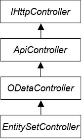
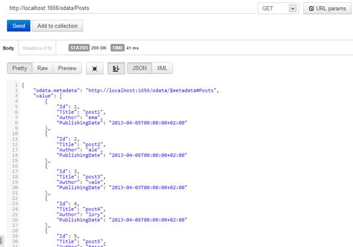
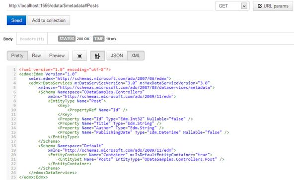

# 第十章奥达塔

## OData 基础知识

开放数据协议是微软设计的一个网络协议，旨在创建一个新的协议来通过 HTTP 查询和更新数据。OData 是一个 Open 协议，这意味着它有多种实现方法。

ASP.NET 网络应用编程接口内置了对 OData 的支持，因此您可以使用 HTTP 协议和 OData 语法查询您的资源。Visual Studio 2012 更新 2 或微软 ASP.NET 网络应用编程接口 OData NuGet 包添加了对网络应用编程接口的完整支持。

我们现在将构建一个支持 OData 的简单 API。

考虑这个控制器:

```cs
  public class PostsController : EntitySetController<Post,int>
  {
      private readonly IPostRepository _repository;

      public PostsController(IPostRepository repository)
      {
          _repository =
  repository;
      }

      public override IQueryable<Post> Get()
      {
          IEnumerable<Post> posts= _repository.GetPosts();
          return posts.AsQueryable();
      }
  }

```

这个控制器不是继承自通常的`ApiController`，而是一个`EntitySetController`。`EntitySetController`是继承自`ODataController`的抽象类，而`ODataController`继承自`ApiController`。

完整的层次结构是:



图 16:实体控制器层次结构

`EntitySetController`只是一个专门的`ApiController`，它有内置的工具来管理 OData 请求和构建 OData 响应。

在前面的例子中，控制器被声明为`EntitySetController<Post, int>`。这两个通用参数表示该端点公开的实体类型和实体标识的类型。因此，邮政类可能是这样的:

```cs
  public class Post
  {
      public int
  Id { get; set;
  }
      public string Title { get; set; }
      public string Author { get; set; }
      public DateTime PublishingDate { get; set; }
  }

```

然后我们覆盖`EntitySetController`的`Get`方法并实现它，这样它返回的列表就是`IQueryable<Post>`。`IQueryable`是 OData 控制器所需要的，OData 控制器使用它来添加最终在`GET`请求中提供的查询。

这不足以使 OData 协议与 Web API 一起工作；我们需要更多的配置。在`WebApiConfig`类中，我们必须添加以下代码:

```cs
  ODataModelBuilder modelBuilder = new ODataConventionModelBuilder();
  modelBuilder.EntitySet<Post>("Posts");

  Microsoft.Data.Edm.IEdmModel model =
  modelBuilder.GetEdmModel();
  config.Routes.MapODataRoute("ODataRoute", "odata", model);

  config.EnableQuerySupport();

```

这段代码创建并配置了 OData 端点，并为 OData 请求定义了新的路由。请注意，新路线不会使用`/api`路线，而是从`MapODataRoute`中定义的`odata`开始。另外需要注意的是，前面案例中的 URI 是区分大小写的，所以正确的 URI 会变成`/odata/Posts`。

如果我们想启用 OData 的查询协议，则`EnableQuerySupport`命令是必需的。

现在，我们准备启动应用程序并测试 OData 协议:



图 17:获取 OData 端点的简单方法

结果和默认的`ApiController`没有太大区别。唯一真正的区别是属性`odata.metadata`，它指定了一个网址，我们可以向它询问关于`Post`资源的信息。如果我们援引 URI，我们获得:



图 18:资源元数据

该`XML`描述了`Post`资源，该资源显示属性及其类型，而不是实体的一般信息。

然而，OData 的真正强大之处在于，您可以使用特殊的语法生成请求，该语法使您能够创建复杂的查询来过滤、排序和聚合结果。

让我们从给 URI 增加一个订单条款开始:

`/odata/Posts?$orderby=PublishingDate`

`orderby`选项指示 OData 引擎我们想要按发布日期排序的结果。我们不必修改代码，因为 ASP.NET 网络应用编程接口的 OData 模块解析查询字符串，过滤器应用于`IQueryable`结果。

目前支持的选项有:`top`、`orderby`、`filter`、`inlinecount`和`skip`。

### 排序依据

`orderby`用于指定结果必须如何排序。默认排序是升序，但是我们可以使用以下语法指定排序类型:

`/odata/Posts?$orderby=Author desc`

我们还可以组合不同的属性:

`/odata/Posts?$orderby=Author,PublishingDate`

### 顶端

`/odata/Posts?$top=2`

`top`用于指定要退回的物品数量。对于`$top=2`，我们是说我们只想要两个元素。

### 过滤器

`/odata/Posts?$filter=Author%20eq%20'ema'`

`filter`用于限制结果(类似于 SQL 中的“where”子句)。在这个例子中，我们请求了作者“ema”的帖子。

`filter`也可以与布尔和比较运算符一起使用。

表 7: OData 布尔运算符

| 操作员 | 描述 | C#等效 |
| 情商 | 平等的 | == |
| -不知道 | 不平等 | ！= |
| 大型旅行车的 | 大于 | > |
| 通用电气公司 | 大于或等于 | >= |
| 它 | 不到 | < |
| 务实贸易(Labor Exchange)ˌ低爆速炸药(Low Explosive)ˌ职业介绍所(Labour Exchange) | 小于或等于 | <= |
| 和 | 和 | && |
| 或者 | 或者 | &#124;&#124; |

使用这些运算符，我们可以创建更复杂的查询:

`/odata/Posts?$filter=Author%20eq%20'ema'%20and%20Title%20eq%20'post2'`

`/odata/Posts?$filter=Author%20eq%20'ema'%20or%20Author%20eq%20'tessa'`

### Inlinecount

`inlinecount`用于添加集合中项目数量的信息:

`/odata/Posts?$inlinecount=allpages`

`allpages`值在 OData 规范中定义，必须包括 URI 标识的集合中实体数量的计数(在应用 URI 上存在的任何`$filter`系统查询选项后)。

### 跳跃

`Skip`用于跳过第一个 *n 个*值，只返回下一个:

`/odata/Posts?$skip=2`

在本例中，`skip`只返回列表中从第三个元素开始的元素。

OData 的能力远不止这些；该协议还规定了修改资源的方式，但细节超出了本书的范围。

## 总结

OData 是一种有趣的技术，可以用来查询我们的 API。OData 端点不是用各种参数创建许多端点来匹配整个可能的请求，而是用几行代码就解决了大多数问题。在本章中，我们看到了它是如何工作的，以及用于构建查询的基本语法。