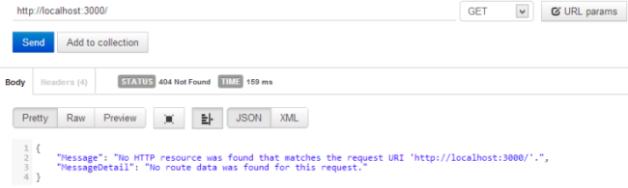
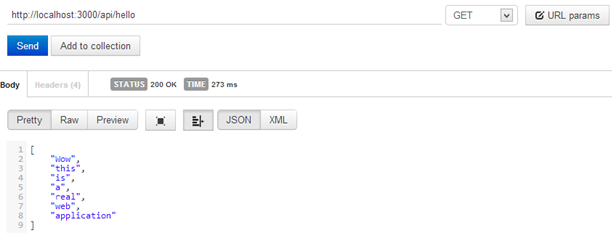

# 第十一章托管

现在我们已经构建了我们的网络应用编程接口应用程序，它需要被托管。我们的第一个选择叫做网络主机。它使用互联网信息服务器(IIS)，就像 ASP.NET MVC 应用程序一样。我们在本书中不讨论这种托管的细节，因为它是众所周知的在微软生态系统中托管 web 应用程序的方式。

## 自办

另一种选择是自托管，这是一种托管 web 应用程序的新方式。实际上，这意味着实现一个控制台应用程序(或一个窗口服务，或任何其他可运行的应用程序)，它是我们的应用编程接口的宿主。

代码很简单:我们只需要创建一个新的控制台应用程序，使用 NuGet 添加对`Microsoft.AspNet.WebApi.SelfHost`包的引用，并在`Main()`中编写以下代码:

```cs
  static void Main()
  {
      var config = new HttpSelfHostConfiguration("http://localhost:3000");

  config.Routes.MapHttpRoute("default", 

  "api/{controller}/{id}", 

  new { id = RouteParameter.Optional });

      var server = new HttpSelfHostServer(config);

  server.OpenAsync().Wait();
      Console.ReadLine();
  }

```

我们在这里所做的是创建一个新的配置，并定义应用编程接口响应的基本网址。我们选择`localhost`和`3000`端口。

在配置上，我们用通常的模式(`api/controller/id`)设置路线图；我们可以在这张地图上添加所有需要的条目，如[第 4 章](04.html#_Chapter_4_)所示。

接下来，我们用新的配置创建`HttpSelfHostServer`的新实例，最后，我们启动服务器并等待传入的请求。

现在，我们可以编译和运行应用程序，并使用我们的客户端进行测试:



图 19:对配置错误的自主机应用程序的调用

```cs
  No HTTP resource was found that
  matches the request URI 'http://localhost:3000/'.

```

我们得到的是一个完全合理的错误，因为我们还没有创建任何控制器。

* * *

address accessdeniedeexception

当我们运行应用程序时，可能会出现以下错误:

*HTTP 无法注册 URL http://+:3000/。您的进程没有访问此命名空间的权限(有关详细信息，请参见 http://go.microsoft.com/fwlink/?LinkId=70353)。*

这是因为要打开一个端口(在本例中是端口 3000)，我们需要拥有管理员权限。要解决这个问题，我们可以以管理员身份运行 Visual Studio，或者更好的方法是，从提示符运行以下命令，将当前用户添加到可以打开指定端口的用户中。

`netsh http add urlacl url=http://+:3000/ user=machine\username`

如果运行应用程序的用户不是管理员，请记住也要在部署计算机上运行该命令。

* * *

我们现在可以做的是添加一个`ApiControllers`实现，使我们的应用程序变得有用。这意味着应用程序不必是网络应用编程接口应用程序模板；控制台应用程序也可以成为主机。

我们添加了一个简单的控制器:

```cs
  public class HelloController : ApiController
  {
      public string[] Get()
      {
          return new[]{"Wow", "this", "is", "a", "real", "web", "app"};
      } 
  }

```

实现这个控制器后，我们可以重新运行控制台应用程序，并从客户端调用它:



图 20:对自主机控制器的调用

我们所拥有的是一个真正的 ASP.NET 网络应用编程接口应用程序，它不需要像 IIS 这样的完整的网络服务器。例如，这对于通过 Windows 服务公开应用编程接口非常有用，或者对于将应用编程接口安装到没有安装 IIS 的电脑非常有用。

如果我们想使用一个现有的 Web API 项目并以自宿主模式托管它，我们只需要引用该项目并更改`WebApiConfig`类中的代码以使用控制台应用程序创建的`HttpConfiguration`。

## 内存托管

托管网络应用编程接口应用程序的最后一个选项是使用内存中的主机。之所以称之为内存中，是因为客户端和服务器之间没有任何真正的 HTTP 远程连接，而是客户端(通常是`HttpClient`)直接连接到`HttpServer`实例。

由于`HttpServer`类继承自`HttpMessageHandler`，因此可以用来创建`HttpClient`类的一个实例，使两个实例直接相连。

这种配置在现实场景中并不有用，但它非常适合测试，我们将在下一章中看到。由于客户端和服务器在同一个进程中，并且它们在内存中连接，因此通信的性能非常高，并且我们的测试执行得很快。

对于内存托管，代码与自托管选项非常相似:

```cs
  public static void
  Main()
  {
      var config = new HttpConfiguration();

  config.Routes.MapHttpRoute("default", 

  "api/{controller}/{id}", 

  new { id = RouteParameter.Optional });

      HttpServer server = new HttpServer(config);

      HttpClient client = new HttpClient(server);

      var response = client.GetAsync("http://localhost/api/hello").Result;
      String content =
  response.Content.ReadAsStringAsync().Result;
  }

```

前面的代码取自控制台应用程序。我们像往常一样创建配置，并创建`HttpServer`的实例(在自托管场景中，我们使用了`HttpSelfHostingServer`)。

接下来，我们创建一个`HttpClient`来发出请求。`HttpClient`需要在它的构造函数中有一个`HttpMessageHandler`的实例，就像我们已经说过的，`HttpServer`实现了这个类，所以它非常适合。

通过客户端，我们可以使用`GetAsync`方法并指定 URI 来构建请求。结果是一个`HttpResponseMessage`，我们从中获得内容，在内容中，我们将得到字符串格式的结果。

客户机和服务器如此紧密耦合的事实有助于我们编写集成测试来验证我们的 API 是否如预期那样工作。

## 总结

托管是一个重要的主题，新的自托管场景为分发我们的网络应用编程接口应用程序打开了新的可能性。在我们需要为其他应用程序公开一个行为的所有情况下，一个窗口服务可以成为一个 HTTP 端点的事实都是有帮助的。在这些情况之外，我们不需要像互联网信息服务器这样的完整网络服务器来托管我们的应用编程接口，部署就变成了`xcopy`安装。