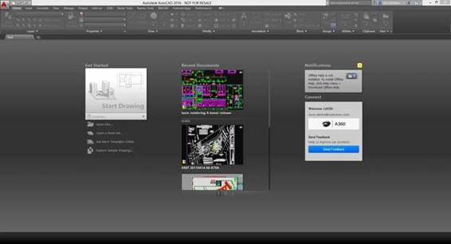
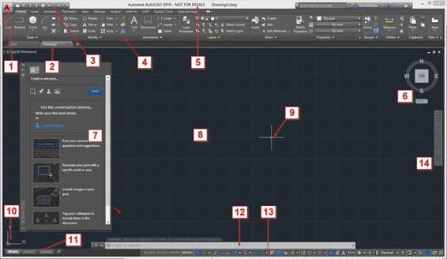
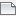
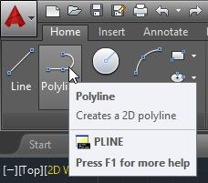
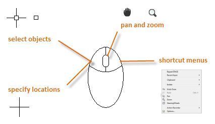
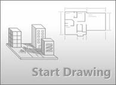
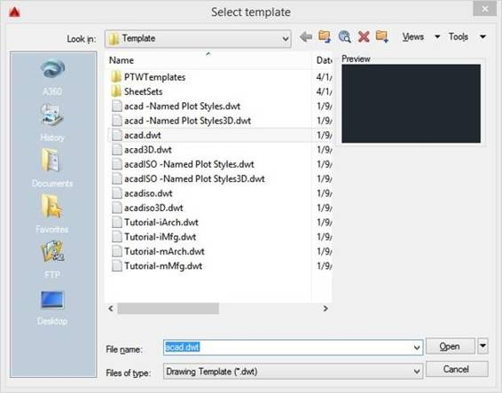
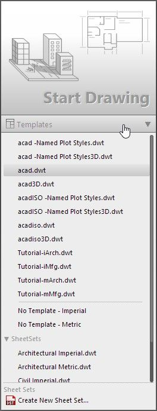
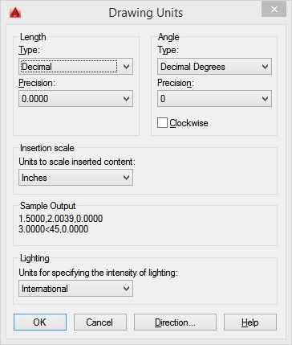
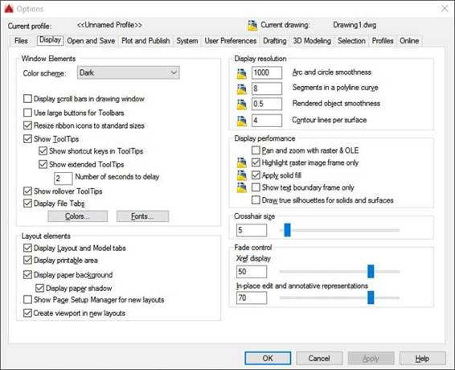

# 一、打开盒子

启动 AutoCAD 后，它会显示启动窗口(图 1)，您可以从该窗口使用模板启动新图形、打开最后一个图形、获取通知或连接到 Autodesk A360(面向个人、团队和组织的基于项目的协作服务)，或者发送关于产品的反馈。

图 1: AutoCAD 启动屏幕

AutoCAD 标准界面由许多项目组成。下图为第一次启动 AutoCAD 并开始绘图后的标准 AutoCAD 界面。大多数界面组件在绘图区域周围浮动或停靠，最新的界面布局将在 AutoCAD 关闭后保持不变。

图 AutoCAD 界面

标准接口项目如下:

1.  `Menu Browser`:在开始菜单中，可以找到文件管理、发布和实用程序的命令。
2.  `Drawing tabs`:显示所有打开的图纸，点击一下就可以快速切换图纸。
3.  `Quick Access Toolbar`:包括新建、打开、保存、打印、撤销等有用的命令。
4.  `The Ribbon` : AutoCAD 包含一个横跨绘图区域顶部的功能区，包括几个选项卡。您可以从“主页”选项卡访问本书涵盖的几乎所有命令。
5.  `Title bar`:显示产品名称和活动图形名称。
6.  `View Cube`:广泛用于 3D 建模。
7.  `Tool Palette` : AutoCAD 包含多个不同的工具选项板。图 2 中显示的浮动调色板是“设计提要”若要关闭工具选项板，请单击位于选项板左上角的`X`图标(它也可以位于右上角，具体取决于上次放置的位置。)如果您当前打开了工具选项板，您可以将其关闭，因为我们暂时不会使用它。
8.  `Drawing Area`:大面积，默认为深灰色，是你设计发生的地方。最初，绘图区域显示一个网格，可以根据需要隐藏。
9.  `Crosshair Cursor`:创建并选择您在整个设计过程中创建的实体。
10.  `User Coordinate System (UCS) Icon`:显示坐标系 x、y 向量的当前方位。你输入的每一点距离都是一致的。
11.  `Layout Tabs`:由模型空间和图纸空间布局组成。模型空间是创建设计的地方，图纸空间是打印/绘图空间。虽然可以创建许多图纸空间布局，但只能有一个模型空间布局。
12.  `Command Window`:这是你与 AutoCAD 沟通的地方，也是 AutoCAD 响应你请求的地方。接下来，您将了解有关命令窗口的更多信息。
13.  `Status Bar`:包含大量快速访问读数、切换和选择工具，可帮助您处理绘图。

当您熟悉 AutoCAD 命令时，您将通过键入命令和命令别名而不是在功能区或工具栏上进行选择来完成更多工作。键盘还有几个快捷命令，可以帮助您处理绘图。

最常见的键盘用途有:

*   `Enter`:执行或结束命令以确认输入。在空白命令窗口按回车键将调用您运行的最后一个命令。
*   `Spacebar`:功能与回车键相同，但根据您运行的命令，尝试完成命令时可能会有不同的结果。
*   `Escape (Esc) key`:完成或取消命令。
*   `F1 key`:打开帮助窗口
*   `F2 key`:如果命令窗口浮动，则显示扩展命令历史；否则将打开 AutoCAD 文本历史窗口。要在命令窗口浮动时显示 AutoCAD 文本历史窗口，请按`Ctrl` + `F2`。
*   `F3 key`:打开/关闭对象捕捉(osnap)
*   `F7 key`:切换网格
*   `F8 key`:切换正交(正交)模式
*   `F9 key`:切换网格捕捉
*   `F10 key`:切换极坐标模式
*   `F11 key`:切换对象跟踪
*   `F12 key`:切换动态输入

默认情况下，快速访问工具栏位于应用程序的左上角。它是完全可定制的，默认工具是:

 `New`:从绘图模板开始新绘图

 `Open`:打开现有图形

 `Save`:保存当前图形

 `Save As`:用新名称保存当前图形

 `Plot`:绘制(打印)当前图形

 `Undo`:撤销最后一个命令。AutoCAD 可以撤消创建图形时的所有操作。当图形关闭时，撤消历史将被删除，当图形重新打开时，新的历史将开始。

 `Redo`:重做最后一个撤消的命令，但前提是在使用撤消命令后立即重做。

默认情况下，功能区停靠在绘图区域的顶部。它由几个选项卡组成，这些选项卡由几个面板组成，如图 3 所示。功能区也可以停靠在侧面，以便在绘图区域内或另一个监视器上浮动(取消停靠)。

有一个指向下方的小三角形的面板是可展开的面板，您可以通过单击面板标题来展开这些面板。

图 3:色带

一些功能区面板允许访问与该面板相关的对话框。要显示该对话框，请单击面板右下角的小箭头图标(参见图 4)。

图 4:对话框启动器

当您将鼠标悬停在面板工具上时，会显示一个工具提示，如果您再按住几秒钟，则会弹出一个快速帮助窗口，其中包含有关各个命令的信息。

图 5:工具提示

图 6:快速帮助

#### 上下文功能区选项卡

上下文功能区选项卡是一种相关的功能区选项卡，当您选择某些对象或执行某些命令时，它会显示为工具栏或对话框的替代项，当您结束命令或取消选择对象时，它会自动关闭。

图 7:图案填充的上下文功能区选项卡

命令窗口是 AutoCAD 的核心，默认情况下，它浮动在图形的底部。您可以通过单击窗口左侧的栏并拖动来将其放置在您选择的任何位置(图 8)。当您靠近绘图区域的顶部或底部时，命令窗口将尝试停靠在该位置。该特性类似于工具选项板，可以浮动或停靠到侧面。

图 8:命令窗口

当您开始键入命令时，有几种可能性可供选择，如图 9 所示。您可以通过单击它或使用键盘箭头选择适当的命令来选择您的选项，然后按下`Enter`或`Spacebar`。

图 9:命令自动完成

有一个带左右按钮和滚轮的鼠标是个好主意。一个好的鼠标可以在项目结束时为你节省很多时间。

下面的列表描述了如何使用鼠标键:

*   `Left button`:用于实体选择以及标记坐标点。
*   `Right button`:打开与当前所选实体匹配的上下文菜单(如果有)。
*   `Wheel`:

图 10:鼠标

有几种方法可以开始绘制新图。如果您刚刚启动了 AutoCAD，您可以从开始页面开始一个新的绘图，如图 1 所示。点击`Start Drawing`(图 2)开始新的绘图。这将基于 AutoCAD 标准模板开始一个新的空白图形。

图 11:在起始页开始绘图

另一种开始绘图的方法是单击快速访问工具栏中的`New`，如下图所示。

图 12:快速访问工具栏

单击`New`打开新建绘图对话框窗口(图 12)，从中可以选择您想要用来开始绘图的模板。

图 13:新建绘图对话框

如果您在英制图形上工作，假设您以英寸为单位工作，则应使用`acad.dwt`(如果您在 AutoCAD LT 中工作，则应使用`acadlt.dwt`)。

对于公制单位，假设单位是毫米；可以使用`acadiso.dwt`(或者 AutoCAD LT 中的`acadltiso.dwt`)。

|  | 注:为了简化和概括，本书中的所有图纸都基于 acad.dwt 模板。 |

您也可以从开始页面选择一个模板来开始一个新的绘图，如图 14 所示。

图 14:使用自定义模板创建新图形

在`Model Space`中创建的所有对象都应该以真实世界的全尺寸单位(1:1 比例)创建。输入 10 个单位作为距离意味着它可以是 10 英寸、10 毫米或您指定的任何其他单位，如米或英尺。重要的是要记住，一旦开始绘图，就不能混合单位。如果开始绘图时假设 1 个单位= 1 毫米，则不能输入 5 厘米。作为距离；相反，你必须输入 50。除非使用建筑测量类型，否则不输入实际单位；然后您可以输入值，如 6'-6 "，AutoCAD 会将其解释为 78 个绘图单位。

您可以通过运行`UNITS`命令来选择您想要使用的长度单位。从`Menu Browser`中，选择`Drawing Utilities`，并选择`Units`选项。或者，在命令窗口中，输入`UNITS`并按下`Enter`或`Spacebar`。“绘图单位”对话框窗口打开，如图 15 所示:

图 15:绘图单位对话框

“绘图单位”对话框组件包括:

*   `Length Type (or Format)`:决定长度如何显示。例如，可以将 6.5 的十进制长度设置为 6-1/2 的小数长度。
*   `Precision`:确定长度的小数精度。例如，6.5 的十进制长度可以设置为显示为 6.50、6.500 或 6.5000。
*   `Angle Type`:确定角度的单位。您可以选择度、分、秒(度/分/秒)、梯度、弧度或测量员单位(例如北纬 10 度 25'10 "东经)。默认值为十进制度数。
*   `Clockwise`:默认逆时针测量角度；如果需要恢复，请选中此框。
*   `Insertion Scale Units`:自动将插入的材料与其他单位换算成正确的单位。例如，如果您在单位设置为毫米的图形中工作，并插入设置为英寸的图形，则生成的插入对象将自动调整大小，比例因子为 25.4 (1 英寸= 25.4 毫米)。
*   `Sample Output`:显示单位和角度的当前设置示例。
*   `Lighting`:在真实感渲染中，它控制当前图形中光度学灯光强度的测量单位。

如果您计划以英尺和英寸为单位工作，请将`Length`类型设置为`Architectural`，然后在创建对象时，以英尺和英寸为单位指定其长度(例如 3'5-3/4”)。如果您计划使用公制单位，请将`Length`类型设置为`Decimal`。更改单位格式和精度不会影响图形的内部精度。它只影响长度、角度和坐标在用户界面中的显示方式。

图 16:显示选项卡处于活动状态的选项对话框

默认的 AutoCAD 显示设置是暗用户界面、模型空间中的暗绘图区域和白纸空间。AutoCAD 是完全可自定义的，因此您可以根据自己的喜好更改颜色。

要更改显示设置，通过单击菜单浏览器底部的`Options`按钮或在命令窗口键入`OP`并按下`Enter`或`Spacebar`来运行`OPTION`命令。

这将打开选项对话框窗口，其中包含标准 AutoCAD 上的一些选项卡(参见图 16)。点击`Display`选项卡查看显示设置选项。我没有涵盖“选项”对话框或“显示”选项卡中的所有可用项目，因为它们不会影响本书的内容。此时，我们只需更改如何调整颜色和十字光标设置。

在`Window Elements`区域下，你会发现配色方案有两个选项:深色和浅色。这将改变用户界面的元素，如功能区、调色板和菜单颜色。AutoCAD 默认为深色，如果喜欢浅灰色界面，在下拉列表中选择`Light`。

要更改绘图环境颜色，点击位于`Window Elements`区域底部的`Colors…`按钮，打开`Drawing Window Colors`菜单，如图 17 所示。要更改空间颜色，在`Context`列表中选择`2D model space`，在`Interface element`列表中选择`Uniform background`，在`Color`列表中选择您选择的颜色。通过单击以下按钮，您可以安全地更改颜色并轻松重置它们:

*   `Restore current element`:重置`Interface Element`列表中所选项的默认颜色。
*   `Restore current context`:恢复`Context`列表中选中项目的默认颜色。这将重置`Interface Element`列表中的所有项目。
*   `Restore all contexts`:恢复所有`Contexts`和`Elements`的默认颜色。
*   `Restore classic colors`:该按钮将所有颜色设置为旧版`AutoCAD`颜色。

图 17:绘制窗口颜色

单击`Apply & Close`应用您的更改并关闭对话框，或单击`Cancel`关闭对话框而不应用任何更改，并返回选项对话框。

|  | 注意:将统一背景颜色更改为白色会自动将白色对象的显示颜色更改为黑色，反之亦然。实际上，默认情况下，白色物体以黑色打印和绘图。十字光标会自动调整其颜色。 |

`Crosshair size`滑块改变绘图区域中十字光标的大小。它从 1 到 100，其中 100 使十字准线轴覆盖 100%的绘图区域。默认值为 5。

单击`OK`关闭对话框并应用更改，或单击`Cancel`关闭而不进行更改。