# 四、为报告和部署准备数据模型

一旦我们完成了数据模型的设计，并使用 DAX 添加了所需的计算列和度量，我们接下来就可以计划和准备用于报告和部署的数据模型。在本章中，我们将学习一些技巧，通过隐藏不需要的列、创建透视图和改善最终用户体验来准备用于报告的数据模型。在本章的后半部分，我们将学习定义角色、分区以及将数据模型部署到 SSAS 实例。

## 隐藏数据模型中不需要的列和表

在我们的数据模型中，我们导入了一些键列，因为它们用于定义与模型中其他表的关系。除了键列之外，我们还导入了一些最终用户可能不会直接使用的列，但用于定义计算列。这些称为中间列的键列不需要向最终用户公开。如果这些列不用于报告，它们应该从报告视图中隐藏，以增强用户体验。

|  | 注意:如果数据模型中根本没有使用该列，则不应该导入它，因为数据模型中的任何冗余列都会增加处理时间和存储空间，并影响系统的整体性能。 |

在我们的数据模型中，我们有键列和一些未使用的列，用于定义关系或中间计算；我们将隐藏这些列。

为了从数据模型中隐藏一列，我们选择该表并右键单击该列，如下图所示。

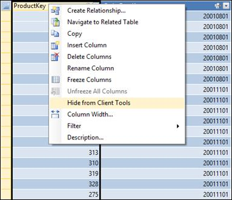

图 79:选择要隐藏的列

点击**隐藏客户端工具**，该列将出现不可用，如下图所示。

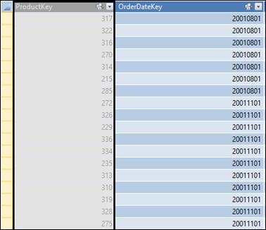

图 80:隐藏的列

同样，如果报告不需要表，我们可以对客户端工具隐藏它。要对客户端工具隐藏表格，右键单击表格的选项卡并选择**对客户端工具隐藏**。

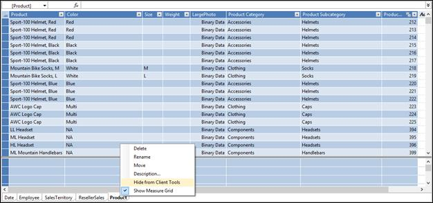

图 81:隐藏表格

一旦在客户端工具中隐藏了表或列，当用户使用 Excel、Power View 或 PPS 仪表板与数据模型交互时，该表或列就不可见了。

## 设置默认字段集和表行为属性

表格数据模型支持几个表属性、默认字段集和表行为，它们是专门为增强 Power View 报告客户端的用户交互性和体验而设计的。

默认字段集

默认字段集属性用于定义表的字段集或列集，以便最终用户在“超级视图”报告中单击表时，会自动报告定义的列集。

为了设置给定表的默认字段集，我们需要在网格视图中选择底部的表选项卡，然后按 F4 打开属性窗口。在销售区域表的**属性**窗口中，我们看到如下图所示的表属性**默认字段集**。

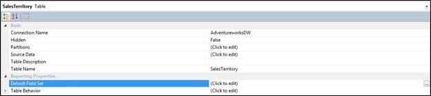

图 82:销售区域表属性

当我们点击默认字段集单元格旁边的**点击编辑**单元格时，我们可以选择默认字段集，如下图所示。

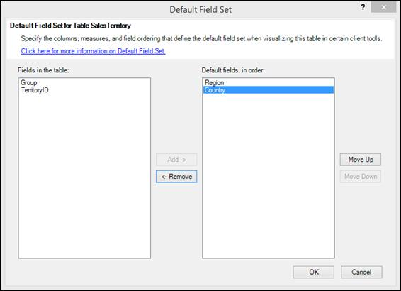

图 83:为销售区域表设置默认字段

然后我们选择**地区**和**国家**作为销售区域的默认字段。现在，当用户单击超级视图中的销售区域表时，报告会自动填充区域和国家字段。


图 84:带有默认字段的电源视图

表格行为

表行为属性是专门为增强高级视图用户的交互性而设计的另一组属性。

对于主要关注单个行的表，例如员工或客户记录，建议设置表行为属性。相比之下，不能从这些属性中获益的表包括那些充当查找表的表(例如，日期表、产品类别表或部门表，其中表由相对少量的行和列组成)，或者包含仅在汇总时才相关的行的汇总表(例如，按性别、年龄或地理位置汇总的普查数据)。对于查找表和汇总表，默认分组行为会产生最佳结果。

表行为属性包括以下内容:

*   **行标识符**:指定只包含唯一值的列，允许该列用作内部分组键。
*   **保留唯一行**:指定哪些列提供了即使重复也应视为唯一的值(例如，两个或更多员工同名时的员工名和姓)。
*   **默认标签**:指定哪一列提供显示名称来表示行数据(例如，员工记录中的员工姓名)。
*   **默认图像**:指定哪一列提供代表行数据的图像(例如，员工记录中的照片标识)。

在我们的数据模型中，我们有一个“产品”表，该表通常被报告为单独的记录，因此是使用表行为属性的一个很好的候选对象。

在网格视图(也称为数据视图)中，我们单击底部的**产品**表格选项卡，然后按 F4。我们在默认字段集属性的正下方看到表行为属性。在**产品表**的表行为属性中，我们设置了以下值:

**行标识符:**产品密钥
**保持唯一行:**产品
**默认标签:**产品
**默认图像:**大图

## 设置列的数据类别属性

在表格数据模型中，我们可以将一些列数据分类到一组预定义的类别中。这些属性对于像 Power View 这样的客户端工具非常有用，它们可以使用这些属性以尽可能好的可视化方式报告数据。

在我们的数据模型中，我们有一个带有国家列的销售区域表；我们可以将国家列的数据类别设置为**国家**。要更改“国家/地区”列的“数据类别”属性，请选择该列，然后按 F4 打开“属性”窗口，如下图所示:

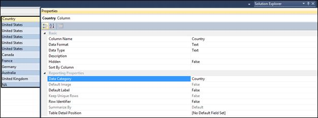

图 85:国家/地区列属性

为国家/地区列设置数据类别后，当我们在超级视图中浏览数据模型时，我们会看到国家/地区列旁边的地图图标。

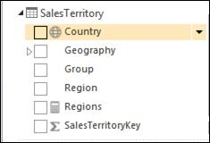

图 86:国家/地区列旁边的地图图标

“超级视图”使用这些数据类别值将数据映射到该类型数据的最佳可视化效果。

同样，如果列中的数据与可用的预定义数据类别集匹配，我们可以对其他列进行分类。

## 设置度量的格式属性

在前一章中，我们定义了各种计算方法(销售、成本、利润、利润等)。).当这些计算的度量在 Excel 或 Power View 报告中按原样使用时，它们对最终用户没有多大意义，因为这些度量将以普通数字格式报告。对于我们来说，为度量设置 Format 属性是很重要的，该属性指定度量的格式应该是货币还是百分比。

在我们的数据模型中，我们使用以下 DAX 公式定义了销售度量。

```
    Sales:=SUM(ResellerSales[SalesAmount])

```

当这种 DAX 度量在 Power View 或 Excel 报告中使用时，我们将看到以下报告。

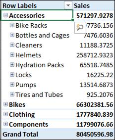

图 87:没有数据格式的销售度量

要设置销售度量的“格式”属性，请在度量网格中选择**销售度量**单元格，然后按 F4 打开“属性”窗口。在属性窗口中，我们将**格式**属性设置为**货币**，如下图所示。


图 88:设置格式属性

我们可以进一步指定小数位数，默认设置为 **2** ，为了本地化的目的还可以指定**货币符号**。

同样，在部署数据模型之前，我们可以定义其他度量的属性来适当地格式化值。

## 设置列的汇总属性

在表格数据模型中，我们可以设置列的默认聚合，以便每当在“超级视图”报告中选中该列时，它都会自动聚合数据。

但是，如果列是数字数据类型，则该列的默认聚合设置为 **Sum** ，这有时可能是不希望的。例如，当我们在电源视图中浏览数据模型并展开日期表时，我们会看到以下内容:


图 89:带有求和列的日期表

为了确保这些列旁边没有求和符号，按 F4 打开该列的属性窗口，并选择**不汇总**作为**汇总依据**属性，如下图所示。

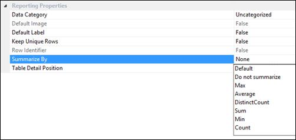

图 90:更改汇总依据属性

我们需要选择**不汇总**为所有我们不想汇总的整数数据类型的列。对于要聚合的列，我们可以在属性窗口中为每个列选择默认聚合。

## 添加列、表和度量的描述

在表格数据模型中，我们可以向列、表和计算度量添加描述。这些描述对于最终用户或分析师来说可能是一个有用的提示，告诉他们列、表或度量的目的以及它将显示什么数据。该描述在“电源视图”报告中显示为工具提示。

在我们的数据模型中，我们可以通过右键单击表、列或字段并单击**描述**来为其添加描述，如下图所示。


图 91:向表中添加描述


图 92:向列添加描述

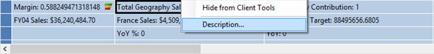

图 93:向字段添加描述

我们编写的描述将作为最终用户的工具提示出现在“超级视图”报告中:

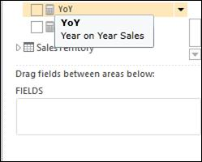

图 94:字段描述

通过提供有关列、表或计算字段的附加信息，描述非常有用，这可以增强用户的报告体验。

## 定义视角

表格数据模型可以在单个数据库中包含多个数据集市，以避免共享维度表的冗余。因此，单个数据模型可以定义大量的表、列和度量。如果所有这些列和度量都通过报表客户端(如 Excel 或 Power View)向最终用户公开，那么最终用户将不堪重负。为了改善用户体验，使用户只能看到与他们相关的表、列和度量来进行分析，我们可以定义透视图。

透视图类似于关系数据库管理系统中的视图，它充当数据模型的窗口，显示与分析相关的字段。我们可以根据最终用户的分析需求，在数据模型中定义多个视角。

在我们的数据模型中，为了定义透视图，我们点击工具栏上的**透视图**按钮，如下图所示:

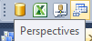

图 95:透视图选项

将出现“透视”向导。当我们点击**新透视图**时，我们可以为定义的新透视图提供一个名称，并使用复选框来包含所需的列、层次结构、度量和表。在我们的数据模型中，我们定义了“经销商销售”视角，如下图所示。

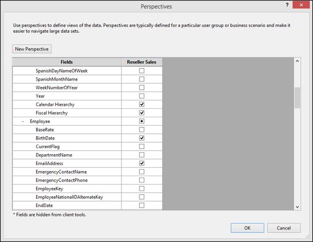

图 96:定义一个新的视角

为了创建“经销商销售”透视图，我们从每个表中选择以下列和字段。

| 桌子 | 经销商销售视角中包含的字段 |
| --- | --- |
| 日期 | 日历层次结构，会计层次结构 |
| 雇员 | 姓名、出生日期、电子邮件地址、性别、婚姻状况 |
| 产品 | 产品，颜色，尺寸，大照片 |
| ResellerSales | 销售，订单数量，%地理贡献，利润，修订销售目标，同比，同比% |
| 销售区域 | 地理 |

对于“日期”、“产品”和“销售区域”表，我们在透视图中包含了前面定义的层次结构，而不是选择单独的列来避免冗余。

为了连接到透视，最终用户需要在定义数据模型的连接字符串时指定透视名称。

在 Excel 中部署模型后，我们将在数据连接向导中定义数据连接。向导为我们提供了一个选择透视图的选项，如下图所示。


图 97:连接到透视图

当最终用户连接到经销商销售透视图时，我们在定义透视图时包含的字段会显示如下图所示。

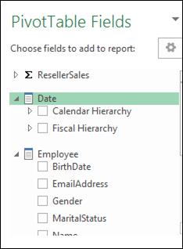

图 98:经销商销售视角字段

对于大型数据模型或多维数据集，始终建议定义多个视角，以便仅向最终用户提供其分析所需的字段。

## 定义角色和安全性

SSAS 表格模型使用基于角色的安全性，根据用户所属的角色，有效的经过身份验证的用户可以看到数据。像多维模型一样，SSAS 表格模型支持 Windows 身份验证(唯一支持的身份验证)。与用于分别在单元级和维度成员上限制用户的多维模型(具有单元安全性和维度安全性)不同，表格模型具有行级安全性，我们可以将用户限制在他们可以查看的表行中。行筛选器也适用于相关的表；例如，如果一行在“产品”表中受到限制，则“经销商销售”表中与“产品”表中受限制行对应的行也将受到限制。

角色在 Microsoft SQL Server 分析服务中用于管理分析服务和数据的安全性。分析服务中有两种类型的角色:

*   服务器角色:提供对分析服务实例的管理员访问的固定角色。
*   数据库角色:由模型作者和管理员定义的角色，用于控制非管理员用户对模型数据库和数据的访问。

为表格模型定义的角色是数据库角色。也就是说，角色包含由具有特定权限的 Windows 用户或组组成的成员，这些权限定义了这些成员可以在模型数据库中执行的操作。数据库角色是作为数据库中的独立对象创建的，并且仅适用于创建该角色的数据库。模型作者将 Windows 用户、Windows 组或两者都包括在角色中，默认情况下，模型作者拥有工作区数据库服务器的管理员权限。在部署的模型中，角色由管理员管理。

表格模型中的角色可以通过行过滤器进一步定义。行筛选器使用 DAX 表达式来定义表中的行，以及用户可以查询的任何相关行。使用 DAX 表达式的行筛选器只能为“读取”和“读取”以及“处理”权限定义。

默认情况下，创建新的表格模型项目时，该项目没有任何角色。您可以使用 SQL Server 数据工具中的角色管理器来定义角色。当在模型创作期间定义角色时，它们将应用于模型工作空间数据库。部署模型时，相同的角色会应用到已部署的模型。部署模型后，服务器角色的成员(分析服务管理员)和数据库管理员可以使用 SQL Server Management Studio 管理与模型关联的角色以及与每个角色关联的成员。

在我们的数据模型中，我们需要定义安全性，这样每个国家的用户都应该看到特定于他们地区的销售数据，而高层管理人员应该可以不受限制地访问所有数据。换句话说，我们需要为每个国家定义角色，以将数据限制在该国家，并根据用户所属的国家为其进一步分配角色。

要在我们的数据模型中定义角色，点击工具栏中的**角色**按钮，如下图所示。


图 99:角色选项

这将启动角色管理器。点击**新建**创建新角色。默认情况下，创建的新角色的名称是“角色”点击该角色将其重命名为**美国**，这是为所有被允许查看美国销售交易的用户准备的。

当我们点击**权限**下拉菜单时，我们会看到以下选项。

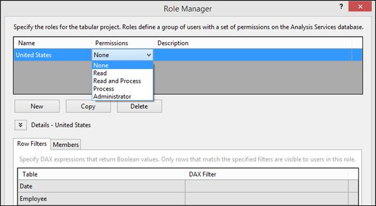

图 100:角色管理器中的权限选项

权限选项类似于多维模型中的选项。

| 许可 | 描述 | 使用 DAX 的行过滤器 |
| --- | --- | --- |
| 没有人 | 成员不能对模型数据库架构进行任何修改，也不能查询数据。 | 行筛选器不适用。该角色的用户看不到任何数据。 |
| 阅读 | 成员可以基于行筛选器查询数据，但不能查看 SSMS 的模型数据库，不能对模型数据库架构进行任何更改，也不能处理模型。 | 可以应用行筛选器。只有行筛选器 DAX 公式中指定的数据对用户可见。 |
| 阅读和处理 | 允许成员基于行级筛选器查询数据，并通过运行包含进程命令的脚本或包来运行进程操作，但不能对数据库进行任何更改。无法在 SQL Server 管理工作室中查看模型数据库。 | 可以应用行筛选器。只能查询行过滤器 DAX 公式中指定的数据。 |
| 过程 | 成员可以通过运行包含进程命令的脚本或包来运行进程操作。无法修改模型数据库架构。无法查询数据。无法在 SQL Server 管理工作室中查询模型数据库。 | 行筛选器不适用。在此角色中不能查询任何数据。 |
| 管理人员 | 成员可以对模型架构进行修改，并可以在模型设计器、报告客户端和 SQL Server Management Studio 中查询所有数据。 | 行筛选器不适用。在此角色中可以查询所有数据。 |

在我们的数据模型中，我们定义了角色的权限和描述，并添加了一个 DAX 过滤器，如下图所示。


图 101:定义角色

用于定义角色的 DAX 筛选器只不过是一个 DAX 表达式，它在行上下文中进行计算(类似于计算列)，并返回布尔值“真”或“假”。在前面的角色定义中，为 SalesTerritory 表的每一行评估 DAX 筛选器；对于国家为美国的行，它返回 True，而对于所有其他行，它返回 False。

要将 Windows 组或单个用户分配给该角色，请单击行筛选器选项卡旁边的**成员**选项卡，然后单击**添加**添加 Windows 用户或组。

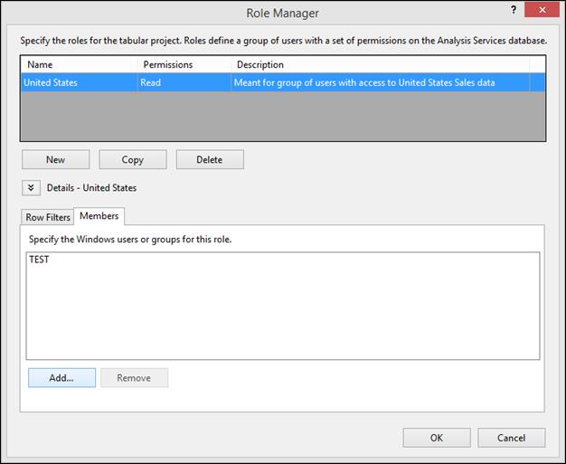

图 102:向角色添加成员

同样，我们需要确定每个国家的角色。为了加速开发，我们可以在角色管理器向导中单击**复制**按钮，这将创建我们之前定义的美国角色的副本。在副本中，我们可以将 DAX 筛选器修改为不同的国家/地区名称，并添加属于该角色的成员。

|  | 注意:如果一个成员是多个角色的一部分，他或她将继承两个角色的权限。如果成员是多个角色的一部分，并且一个角色拒绝权限，而另一个角色允许权限，则用户将被允许该权限。 |

要测试角色，点击工具栏中 Excel 中的**分析** **，使用 Excel 连接到数据模型，如下图所示。**

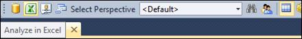

图 103:在 Excel 中分析

我们可以选择以当前窗口用户、其他窗口用户或角色定义用户的身份连接到模型。选择**角色**选项，从下拉列表中选择**美国**，如下图所示。


图 104:选择在 Excel 中分析时要使用的角色

如果我们使用数据透视表浏览数据模型，我们会看到表中的数据仅限于美国，如下图所示。


图 105:限于美国数据的数据模型

## 动态安全

动态安全性提供了一种基于当前登录用户的用户名或从连接字符串返回的 CustomData 属性来定义行级安全性的方法。为了实现动态安全性，您必须在模型中包含一个包含用户登录值(Windows 用户名)的表，以及一个可用于定义特定权限的字段；例如，一个包含每个员工的登录标识(域和用户名)以及国家/地区值的员工表。

要实现动态安全性，您可以使用以下函数作为 DAX 公式的一部分来返回当前登录用户的用户名，或者连接字符串中的 CustomData 属性:

| 功能 | 描述 |
| [用户名功能(DAX)](http://technet.microsoft.com/en-us/library/hh230954.aspx) | 返回当前登录用户的域和用户名。 |
| [自定义数据功能(DAX)](http://technet.microsoft.com/en-us/library/hh213140.aspx) | 返回连接字符串中的自定义数据属性。 |

我们可以使用 LOOKUPVALUE 函数为一列返回值，在该列中，Windows 用户名与 user name 函数返回的用户名或 CustomData 函数返回的字符串相同。然后，如果 LOOKUPVALUE 返回的值与同一表或相关表中的值匹配，就可以限制查询。例如:

```
    ='Sales Territory'[Country]=LOOKUPVALUE('Employee Security'[Country], 'Employee Security'[Login Id], USERNAME(), 'Employee Security'[Country], 'Sales Territory'[Country])

```

|  | 注意:此公式是为 AdventureWorksDW2012 数据库的自定义版本编写的，不会像 AdventureWorksDW2012 示例数据库那样工作。 |

有关设置动态安全性的更多信息，您可以参考 SQL 2012 版本期间 SSAS 团队的项目经理 Cathy Dumas 的以下白皮书:[http://msdn.microsoft.com/en-us/library/jj127437.aspx](http://msdn.microsoft.com/en-us/library/jj127437.aspx)。

## 定义分区

表格模型中的分区将表划分为逻辑分区对象。然后，每个分区都可以独立于其他分区进行处理。例如，一个表可能包含某些行集，这些行集包含很少变化的数据，但其他行集包含经常变化的数据。在这些情况下，当您只想处理一部分数据时，没有必要处理所有数据。分区使您能够将需要频繁处理的数据部分与不太频繁处理的数据部分分开。

有效的模型设计利用分区来消除分析服务服务器上不必要的处理和后续处理器负载，同时确保数据得到足够频繁的处理和刷新，以反映来自数据源的最新数据。在我们的数据模型中使用分区表的目标之一是加速模型中的数据刷新。

在我们的数据模型中，我们有经销商销售表，该表目前包含大约 65，000 条记录。这些可以很快得到处理，但是在数据模型的开发过程中，还必须考虑到数据仓库在未来几年的增长。在大多数数据模型中，事实表或事务表是很好的分区候选表，因为数据每天都在增长。但是，分区不限于事实表，也可以应用于维度表。

在大多数数据模型中，我们可能也更喜欢按日期或时间进行分区，因为在大多数情况下，在事务进入数据仓库之后，很少有机会更新或删除事务。因此，我们为前一年设计了年度分区，而今年我们可以设计月度分区，以最大限度地减少处理需求。

要定义分区，选择相关表格，点击工具栏中的**分区**按钮，如下图所示。

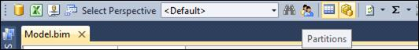

图 106:分区按钮

这将启动分区管理器窗口。


图 107:分区管理器

分区管理器显示经销商销售表的当前分区，这是一个包含所有记录的分区。

我们选择使用会计日历中的订单日期键来划分经销商销售表。我们的 FactResellerSales 表中可用的最小 orderedatekey 值是 20010701，而可用的最大 orderedatekey 值是 20040601。我们使用会计日历中的 OrderDateKey 将表分成五个分区，如下表所示。

| 分区名 | 分区逻辑 |
| --- | --- |
| 2001 财年销售额 | OrderDateKey < 20010701 |
| 2002 财年销售额 | 20010701 和 20020630 之间的订单日期 |
| 2003 财年销售额 | 20020701 和 20030630 之间的订单日期键 |
| 2004 财年销售额 | 20030701 和 20040630 之间的订单日期键 |
| 2005 财年销售额 | OrderDatekey > 20040630 |

为了定义第一个分区，将**分区名称**更改为**2001 财年**并切换到 SQL 查询视图，在这里我们将分区的查询定义为:

```
    SELECT [dbo].[FactResellerSales].* FROM [dbo].[FactResellerSales]
    Where OrderDateKey < 20010701

```


图 108:添加 2001 财年销售分区

接下来，单击**复制**创建另一个分区，我们将其命名为**2002 财年销售**，并将查询修改为:

```
    SELECT [dbo].[FactResellerSales].* FROM [dbo].[FactResellerSales]
    Where OrderDateKey between 20010701 and 20020630

```

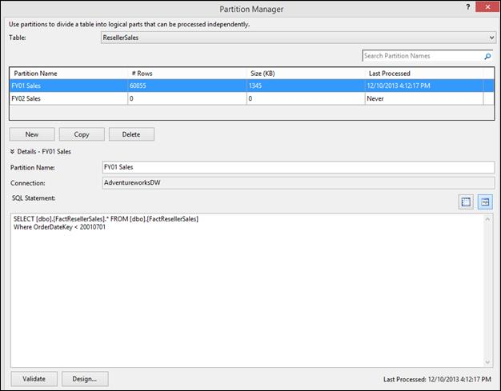

图 109:添加 2002 财年销售分区

同样，我们定义了分区 2003 财年销售额、2004 财年销售额和 2005 财年销售额。在定义分区时，我们需要确保分区之间没有重叠，并且没有遗漏事实表中的任何行；否则我们会得到不正确的计算结果。

一旦我们定义了所有分区，我们可以通过点击**进程表**一次处理所有分区，或者通过点击**进程分区**一次处理一个分区。

|  | 注意:“全部处理”选项处理整个数据模型，因此如果已经处理了其他表，我们可能不想使用该选项。 |


图 110:流程选项

在开发数据模型时，总是建议定义所有分区，但不要处理所有分区。当我们在 SSDT 开发数据模型时处理分区时，数据存储在工作区数据库中，这就像一个临时存储位置。处理分区还会增加内存使用，因为数据缓存在内存中。

作为开发过程中的最佳实践，我们应该定义所有分区，但处理最小的分区之一，并基于该分区数据定义计算。稍后，当分区被部署到 SSAS 表格实例时，我们可以使用 Management Studio 或脚本来处理数据模型，该脚本将填充数据仓库中的所有数据。

如果我们在部署后需要添加或删除分区，我们可以使用 SQL Server Management Studio 管理分区，并在以后处理分区。该功能确保分区管理不需要重新部署，甚至团队中的管理员也可以管理数据模型中的分区。

## 部署数据模型

一旦我们完成了表格数据模型的设计和开发，就该将模型部署到 SSAS 表格实例中了。

有几种方法可以用来部署表格模型项目。大多数可用于其他分析服务项目的部署方法(如多维方法)也可用于部署表格模型项目。

| 方法 | 描述 |
| --- | --- |
| SQL Server 数据工具中的部署命令 | deploy 命令提供了一种简单直观的方法，可以从 SQL Server 数据工具环境中部署表格模型项目。 |
| 分析管理对象(AMO)自动化 | AMO 为分析服务的完整命令集提供了编程接口，包括可用于解决方案部署的命令。作为一种解决方案部署方法，AMO 自动化是最灵活的，但它也需要一些编程工作。使用 AMO 的一个主要优势是，您可以将 SQL Server 代理与您的 AMO 应用程序一起使用，以便按照预设的计划运行部署。 |
| XMLA | 使用 SQL Server Management Studio 生成现有分析服务数据库元数据的 XMLA 脚本，然后在另一台服务器上运行该脚本以重新创建初始数据库。通过定义部署过程，然后将其编码并保存在 XMLA 脚本中，XMLA 脚本很容易在 SQL Server Management Studio 中形成。一旦在保存的文件中有了 XMLA 脚本，就可以根据计划轻松运行脚本，或者将脚本嵌入到直接连接到 Analysis Services 实例的应用程序中。您也可以使用 SQL Server 代理在预设的基础上运行 XMLA 脚本，但是 XMLA 脚本的灵活性不如 AMO。AMO 通过托管全部管理命令提供了更广泛的功能。 |
| 部署向导 | 使用部署向导使用分析服务项目生成的 XMLA 输出文件将项目的元数据部署到目标服务器。使用部署向导，您可以直接从分析服务文件进行部署，该文件由项目生成的输出目录创建。使用分析服务部署向导的主要优势是方便。正如您可以保存 XMLA 脚本以供以后在 SQL Server Management Studio 中使用一样，您也可以保存部署向导脚本。部署向导可以交互运行，也可以通过部署实用程序在命令提示符下运行。 |
| 部署实用程序 | 部署实用程序允许您从命令提示符启动分析服务部署引擎。 |
| 同步数据库向导 | 使用同步数据库向导来同步任意两个分析服务数据库之间的元数据和数据。
同步向导可用于将数据和元数据从源服务器复制到目标服务器。如果目标服务器没有要部署的数据库副本，则会将新数据库复制到目标服务器。如果目标服务器已经有同一个数据库的副本，目标服务器上的数据库将被更新以使用源数据库的元数据和数据。 |
| 备份和恢复 | 备份提供了传输分析服务数据库的最简单方法。在“备份”对话框中，您可以设置配置选项，然后从对话框本身运行备份。或者，您可以创建一个可以根据需要频繁保存和运行的脚本。备份和恢复不像其他部署方法那样频繁使用，但它是一种以最低的基础架构要求快速完成部署的方法。 |

在本章中，我们将使用第一种使用 SSDT 部署数据模型的方法。

**重要提示:**在部署数据模型之前，必须将数据模型的数据源连接更改为指向生产数据仓库。

为了部署数据模型，我们需要设置一些部署属性。在**解决方案浏览器**中右键单击项目名称，选择**属性**，如下图所示。


图 111:解决方案资源管理器中的数据模型

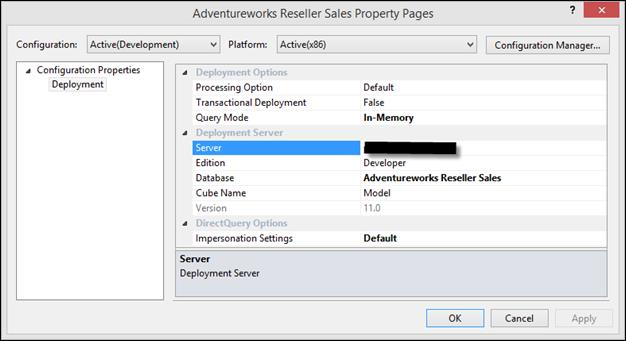

图 112:数据模型属性

当您部署数据模型时，将建立到在**服务器**属性中指定的分析服务实例的连接。然后在该实例上创建一个名为**数据库**属性中指定的新模型数据库(如果尚不存在的话)。模型项目的 Model.bim 文件中的元数据用于配置部署服务器上模型数据库中的对象。使用**处理**选项，您可以指定是否只部署模型元数据，从而创建模型数据库。如果指定了**默认**或**完全**，用于连接数据源的模拟凭证将在内存中从模型工作空间数据库传递到部署的模型数据库。然后，分析服务运行处理，将数据填充到部署的模型中。部署过程完成后，客户端应用程序可以使用数据连接或 SharePoint 中的. bism 连接文件连接到模型。

部署选项属性包括以下内容。

| 财产 | 默认设置 | 描述 |
| --- | --- | --- |
| 处理选项 | 默认 | 此属性指定部署对象更改时所需的处理类型。此属性具有以下选项:

*   默认值:分析服务将决定所需的处理类型。将处理未处理的对象，如果需要，将重新计算属性关系、属性层次结构、用户层次结构和计算列。此设置通常比使用“完全”处理选项导致更快的部署时间。
*   不处理:仅部署元数据。部署后，可能需要对已部署的模型运行流程操作来更新和重新计算数据。
*   完整:部署元数据并执行流程完整操作。这确保了部署的模型具有元数据和数据的最新更新。

 |
| 事务性部署 | 错误的 | 此属性指定部署是否为事务性的。默认情况下，所有对象或已更改对象的部署与这些已部署对象的处理不是事务性的。即使处理失败，部署也可以成功并持续下去。您可以对此进行更改，将部署和处理合并到单个事务中。 |
| 查询模式 | 内存中 | 此属性指定从中返回查询结果的源是在内存(缓存)模式下运行还是在直接查询模式下运行。此属性具有以下选项:

*   DirectQuery:指定对模型的所有查询应该只使用关系数据源。DirectQuery 模式要求设置模拟设置，以指定在连接到关系数据源时用于身份验证的凭据
*   内存中的直接查询:指定默认情况下，应该使用关系源来回答查询，除非在客户端的连接字符串中另有指定。
*   内存中:指定只应使用缓存来回答查询。
*   带有直接查询的内存中:指定默认情况下，应该使用缓存来回答查询，除非在客户端的连接字符串中另有指定。

 |

设置部署属性后，在解决方案资源管理器中再次右键单击项目，然后单击**部署**将数据模型部署到服务器属性中指定的 SSAS 表格实例。成功完成部署后，我们会看到下面的屏幕。

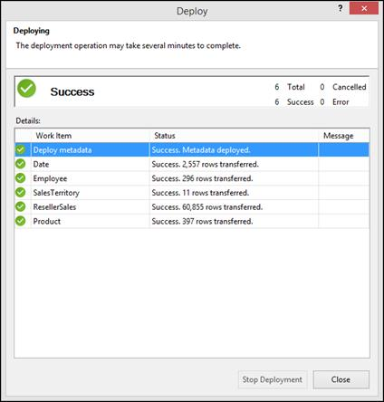

图 113:成功部署

我们可以通过登录目标服务器并使用 SSMS 连接到 SSAS 表格实例来进一步验证部署，如下图所示。


图 114:成功部署，如 SSMS 所示

## 部署后任务

部署数据模型后，我们需要完成某些部署后任务:

*   确保数据源指向生产数据仓库，而不是开发数据仓库，如果我们在部署前忘记更新数据源，这可能会发生。
*   如果模型是使用“不处理”选项部署的，则处理数据模型。
*   创建一个经常处理表或分区的处理计划和作业，以确保数据是最新的。
*   将 Windows 用户或组分配给适当的角色，以赋予他们对数据模型的正确访问和权限。
*   使用 Management Studio 创建分区或向表中添加分区，以最大限度地减少要处理的数据，并缩短数据刷新时间。

## 总结

在下一章中，我们将讨论如何使用 Power View 来探索数据模型并创建视觉上吸引人的报告，这可以帮助最终用户从他们的数据模型中获得有意义的信息。