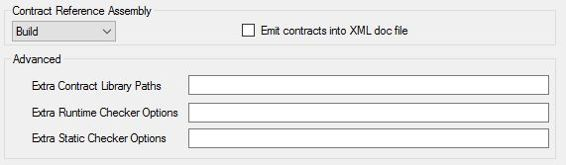
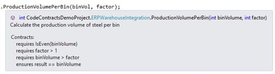
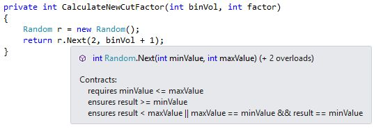

# 五、代码契约编辑器扩展

到目前为止，我们已经看到了许多代码契约可以做的事情。这里有一个关于如何让您创建的契约对使用您的类和方法的开发人员更有用的提示。使用代码契约编辑器扩展将允许您查看您正在调用的方法对该方法中定义的契约的要求。它可以做到这一点，而不需要您深入该方法并查看它实现了什么代码契约。


图 57:production volumes perbin quick info

当指针悬停在方法上时，我们在第 4 章中使用的方法会在快速信息窗口中显示您在该方法的 XML 注释中提供的注释。这是预期的行为，但是我从快速信息窗口不知道该方法实现了什么契约。代码契约编辑器扩展改变了这一点。要安装它，进入 Visual Studio 中的`Tools`菜单，点击`Extensions and Updates`。


图 58:扩展和更新

在`Extensions and Updates`窗口中，选择`Online`选项卡并搜索`Code Contracts Editor Extensions`。返回的结果应该相当有限。从这里，点击`Download`下载并安装扩展。


图 59:安装代码契约编辑器扩展

一旦安装了代码契约编辑器扩展，您将需要重新启动 Visual Studio。这个扩展的好处在于，您现在可以看到您创建的方法内部，这将显示该方法的契约。

在此之前，您需要确保在代码契约设置中将`Contract Reference Assembly`设置为`Build`。



图 60:合同参考组件

现在，如果您将鼠标悬停在`ProductionVolumePerBin()`方法上，您将会看到快速信息窗口中包含了大量关于它所实现的合同的信息。



图 61:契约增强的方法工具提示

这使我能够使用方法，而不必查看方法内部，并向它传递将成功验证的有效参数。我现在有了更多关于我正在调用的方法的信息。

使用代码契约编辑器扩展的另一个优点是能够看到基类实现了哪些代码契约。再来看看我们的`CalculateNewCutFactor()`法。

```cs
    /// <summary>
    /// Calculate a new cutting factor
    /// r.Next(1, 7); returns a random number between 1 and 6
    /// </summary>
    /// <param name="binVol">Upper range value of random (bin volume + 1)</param>
    /// <returns>
    /// A new cutting factor greater than 1 and equal to the bin volume
    /// </returns>
    private int CalculateNewCutFactor(int binVol)
    {
        Random r = new Random();
        return r.Next(2, binVol + 1);
    }

```

代码清单 68:随机()方法

悬停在`Next()`方法上，我们可以查看它需要的合同。代码契约编辑器扩展通过挖掘基类和显示实现的契约来实现这一点。



图 62:随机下一个方法契约

我们可以看到`Next()`方法实现的代码契约之一是`minValue`必须小于等于`maxValue`。对于我们的要求，我想保证`minValue`始终大于等于`2`。使用我们能够收集到的关于`Next()`方法实现的代码契约的信息，我们现在可以继续创建符合我们的代码契约要求的我们自己的`GetRandom()`方法。

```cs
    /// <summary>
    /// Calculate a new cutting factor
    /// r.Next(1, 7); returns a random number between 1 and 6
    /// </summary>
    /// <param name="binVol">Upper range value of random (bin volume + 1)</param>
    /// <returns>
    /// A new cutting factor greater than 1 and equal to the bin volume
    /// </returns>
    private int CalculateNewCutFactor(int binVol)
    {
        return GetRandom(2, binVol + 1);
    }

    /// <summary>
    /// Get a random number
    /// </summary>
    /// <param name="minValue">Value not less than 2</param>
    /// <param name="maxValue">Upper range value of the random number to generate</param>
    /// <returns>A random integer</returns>
    static int GetRandom(int minValue, int maxValue)
    {
        Contract.Requires(minValue >= 2,
            "minValue cannot be less than 2");
        Random r = new Random();
        return r.Next(minValue, maxValue);
    }

```

代码清单 69:自定义 GetRandom()方法

使用代码契约和代码契约编辑器扩展允许我们编写更健壮的代码，并微调我们的代码，以轻松地符合所需的业务规则。

|  | 提示:你需要记住随机类不是一个真正的随机数生成器。例如，当您调用 Next()时，Random 类使用一些内部状态来返回一个看起来是随机的数字。然后，它会改变其内部状态，以便下次调用 next()时，它会返回另一个看似随机的数字。生成真随机数超出了本书的范围；如果你需要真正的随机性，你需要做更多的研究。 |