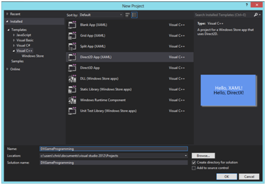
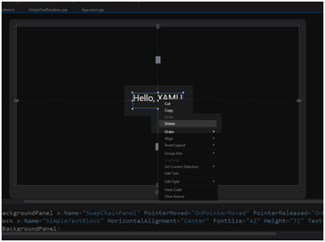

# 三、设置 Visual Studio 模板

本书中的代码基于 Direct2D App (XAML)模板。在我们开始之前，这个模板的大部分功能应该被删除，我将花一些时间解释删除什么来从这个模板中获得一个基本的 Direct2D/Direct3D 框架。本章中的代码更改旨在为任何 Direct2D 或 Direct3D 应用程序创建起点。

## 创建项目

**打开** Visual Studio 2012，新建 **Direct2D App (XAML)** 项目。我已经在截图中命名了我的项目 dxgamepidering(*图 3.1* )。请记住，如果您为项目使用不同的名称，您应该在代码中重命名对`DXGameProgramming`命名空间的所有引用。



图 3.1:启动新的 Direct2D 应用程序(XAML)项目

|  | 注意:我在这本书里的所有代码都是基于 Direct2D 应用(XAML)模板的。这个模板设置了一个同时使用二维和三维的应用程序。我们将主要关注 Direct3D，但是 Direct2D 在创建三维应用程序时也非常重要。Direct2D 用于渲染平视显示器(HUD)、玩家分数、各种其他精灵以及可能的背景。 |

### 对 DirectXPage.xaml 的更改

应用程序的主 XAML 页面有一些我们不需要的控件，这些可以删除。双击 DirectXPage。解决方案资源管理器中的 XAML 文件。这将在 Visual Studio 的 XAML 页面设计器中打开该页面。右键单击对象并从上下文菜单中选择删除，删除显示“你好，XAML”的文本控件(参见图 3.2)。



图 3.2:删除你好，XAML

选择`Page.BottomAppBar`的 XAML 代码并删除。DirectXPage.xaml 文件的代码如下所示。下面的代码表显示了`Page.BottomAppBar`被移除后的 XAML 代码。

```cpp
    <Page
    x:Class="DXGameProgramming.DirectXPage"

    xmlns:x="http://schemas.microsoft.com/winfx/2006/xaml"
    xmlns:local="using:DXGameProgramming"
    xmlns:d="http://schemas.microsoft.com/expression/blend/2008"
    xmlns:mc="http://schemas.openxmlformats.org/markup-compatibility/2006"
    mc:Ignorable="d">
    <SwapChainBackgroundPanel x:Name="SwapChainPanel" PointerMoved="OnPointerMoved" PointerReleased="OnPointerReleased"/>
    </Page>

```

DirectXPage.xaml.cpp 包含更改背景颜色和在屏幕上移动一些文本的功能；这些都可以去掉。需要对 DirectXPage.xaml.cpp 进行几处更改。为了方便起见，整个修改后的代码显示在下面的代码表中。清单中删除了`OnPreviousColorPressed`、`OnNextColorPressed`、`SaveInternalState`、`LoadInternalState`四种方法。所有引用`m_renderNeeded`变量、`m_lastPointValid`布尔和`m_lastPoint`点的行也被删除。这些变量用于在用户与应用程序交互之前阻止呈现。这对于实时游戏来说是没有用的，因为即使玩家什么都不做，实时游戏的非玩家角色和物理特性也会继续。这些变化将使我们的应用程序以每秒 60 帧的速度更新，而不是等待用户移动指针。我也删除了`OnPointerMoved`事件中的代码。进行这些更改后，项目将不会编译，因为我们删除了其他文件中引用的方法。

```cpp
    //
    // DirectXPage.xaml.cpp
    // Implementation of the DirectXPage.xaml class.
    //

    #include "pch.h"
    #include "DirectXPage.xaml.h"

    using namespace DXGameProgramming;

    using namespace Platform;
    using namespace Windows::Foundation;
    using namespace Windows::Foundation::Collections;
    using namespace Windows::Graphics::Display;
    using namespace Windows::UI::Input;
    using namespace Windows::UI::Core;
    using namespace Windows::UI::Xaml;
    using namespace Windows::UI::Xaml::Controls;
    using namespace Windows::UI::Xaml::Controls::Primitives;
    using namespace Windows::UI::Xaml::Data;
    using namespace Windows::UI::Xaml::Input;
    using namespace Windows::UI::Xaml::Media;
    using namespace Windows::UI::Xaml::Navigation;

    DirectXPage::DirectXPage()
    {
    InitializeComponent();

    m_renderer = ref new SimpleTextRenderer();

    m_renderer->Initialize(
    Window::Current->CoreWindow,
    SwapChainPanel,
    DisplayProperties::LogicalDpi
    );

    Window::Current->CoreWindow->SizeChanged +=
    ref new TypedEventHandler<CoreWindow^, WindowSizeChangedEventArgs^>(this, &DirectXPage::OnWindowSizeChanged);

    DisplayProperties::LogicalDpiChanged +=
    ref new DisplayPropertiesEventHandler(this, &DirectXPage::OnLogicalDpiChanged);

    DisplayProperties::OrientationChanged +=
    ref new DisplayPropertiesEventHandler(this, &DirectXPage::OnOrientationChanged);

    DisplayProperties::DisplayContentsInvalidated +=
    ref new DisplayPropertiesEventHandler(this, &DirectXPage::OnDisplayContentsInvalidated);

    m_eventToken = CompositionTarget::Rendering::add(ref new EventHandler<Object^>(this, &DirectXPage::OnRendering));

    m_timer = ref new BasicTimer();
    }

    void DirectXPage::OnPointerMoved(Object^ sender, PointerRoutedEventArgs^ args)
    {
    }

    void DirectXPage::OnPointerReleased(Object^ sender, PointerRoutedEventArgs^ args)
    {
    }

    void DirectXPage::OnWindowSizeChanged(CoreWindow^ sender, WindowSizeChangedEventArgs^ args)
    {
    m_renderer->UpdateForWindowSizeChange();
    }

    void DirectXPage::OnLogicalDpiChanged(Object^ sender)
    {
    m_renderer->SetDpi(DisplayProperties::LogicalDpi);
    }

    void DirectXPage::OnOrientationChanged(Object^ sender)
    {
    m_renderer->UpdateForWindowSizeChange();
    }

    void DirectXPage::OnDisplayContentsInvalidated(Object^ sender)
    {
    m_renderer->ValidateDevice();
    }

    void DirectXPage::OnRendering(Object^ sender, Object^ args)
    {
    m_timer->Update();
    m_renderer->Update(m_timer->Total, m_timer->Delta);
    m_renderer->Render();
    m_renderer->Present();
    }

```

下面的代码表显示了 DirectXPage.xaml.h 文件的更新代码。`OnPreviousColorPressed`、`OnNextColorPressed`、`SaveInternalState`和`LoadInternalState`方法的原型已被移除。`m_renderNeeded`、`m_lastPointValid`和`m_lastPoint`点的声明也被删除。项目此时仍不会编译。

```cpp
    //
    // BlankPage.xaml.h
    // Declaration of the BlankPage.xaml class.
    //

    #pragma once

    #include "DirectXPage.g.h"
    #include "SimpleTextRenderer.h"
    #include "BasicTimer.h"

    namespace DXGameProgramming
    {
    /// <summary>
    /// A DirectX page that can be used on its own. Note that it may not be used within a Frame.
    /// </summary>
    [Windows::Foundation::Metadata::WebHostHidden]
    public ref class DirectXPage sealed
    {
    public:
    DirectXPage();

    private:
    void OnPointerMoved(Platform::Object^ sender, Windows::UI::Xaml::Input::PointerRoutedEventArgs^ args);
    void OnPointerReleased(Platform::Object^ sender, Windows::UI::Xaml::Input::PointerRoutedEventArgs^ args);
    void OnWindowSizeChanged(Windows::UI::Core::CoreWindow^ sender, Windows::UI::Core::WindowSizeChangedEventArgs^ args);
    void OnLogicalDpiChanged(Platform::Object^ sender);
    void OnOrientationChanged(Platform::Object^ sender);
    void OnDisplayContentsInvalidated(Platform::Object^ sender);
    void OnRendering(Object^ sender, Object^ args);

    Windows::Foundation::EventRegistrationToken m_eventToken;

    SimpleTextRenderer^ m_renderer;

    BasicTimer^ m_timer;
    };
    }

```

### 对 App 的更改。XAML

打开 **App.xaml.cpp** 文件。删除对`LoadInternalState`方法和`OnSuspending`事件的引用。下面的代码表显示了该文件的代码。

```cpp
    //
    // App.xaml.cpp
    // Implementation of the App class.
    //

    #include "pch.h"
    #include "DirectXPage.xaml.h"

    using namespace DXGameProgramming;

    using namespace Platform;
    using namespace Windows::ApplicationModel;
    using namespace Windows::ApplicationModel::Activation;
    using namespace Windows::Foundation;
    using namespace Windows::Foundation::Collections;
    using namespace Windows::Storage;
    using namespace Windows::UI::Xaml;
    using namespace Windows::UI::Xaml::Controls;
    using namespace Windows::UI::Xaml::Controls::Primitives;
    using namespace Windows::UI::Xaml::Data;
    using namespace Windows::UI::Xaml::Input;
    using namespace Windows::UI::Xaml::Interop;
    using namespace Windows::UI::Xaml::Media;
    using namespace Windows::UI::Xaml::Navigation;

    /// <summary>
    /// Initializes the singleton application object. This is the first line of authored code
    /// executed, and as such is the logical equivalent of main() or WinMain().
    /// </summary>
    App::App()
    {
    InitializeComponent();
    }

    /// <summary>
    /// Invoked when the application is launched normally by the end user. Other entry points
    /// will be used when the application is launched to open a specific file, to display
    /// search results, and so forth.
    /// </summary>
    /// <param name="args">Details about the launch request and process.</param>
    void App::OnLaunched(LaunchActivatedEventArgs^ args)
    {
    m_directXPage = ref new DirectXPage();

    // Place the page in the current window and ensure that it is active.
    Window::Current->Content = m_directXPage;
    Window::Current->Activate();
    }

```

打开 **App.xaml.h** 文件，移除`OnSuspending`事件的原型。下面的代码表显示了该文件的更新代码。

```cpp
    //
    // App.xaml.h
    // Declaration of the App class.
    //

    #pragma once

    #include "App.g.h"
    #include "DirectXPage.xaml.h"

    namespace DXGameProgramming
    {
    /// <summary>
    /// Provides application-specific behavior to supplement the default
    /// Application class.
    /// </summary>
    ref class App sealed
    {
    public:
    App();
    virtual void OnLaunched(Windows::ApplicationModel::Activation::LaunchActivatedEventArgs^ args) override;

    private:
    DirectXPage^ m_directXPage;
    };
    }

```

此时，您应该能够编译和运行您的应用程序。当您运行程序时，您应该会看到屏幕被清除为浅蓝色，并显示“您好，DirectX”的文本。此文本不再像第一次打开模板时那样可移动。

### 对简单文本渲染器的更改

`SimpleTextRenderer`类将是我们应用程序的主要呈现器。它将不再呈现文本，并且名称可以更改为其他名称。为了简单起见，我在代码中将其保留为`SimpleTextRenderer`，但是通常要么更改这个类的名称，要么我们从头开始编写一个新的类来进行渲染。

打开 **SimpleTextRenderer.cpp** 文件。修改后的文件显示在下面的代码表中。我已经删除了所有引用`BackgroundColors`、`m_backgroundColorIndex`、`m_renderNeeded`、`m_textPosition`、`m_textFormat`、`m_blackBrush`和`m_textLayout`的行。我还删除了`UpdateTextPosition`、`BackgroundColorNext`、`BackgroundPrevious`、`SaveInteralState`和`LoadInternalState`方法的定义。在下面的代码中，屏幕仍然被清除为蓝色，但它不再引用 BackgroundColors 数组。相反，我使用了“m _ d2d context->Clear(ColorF(ColorF::矢车菊蓝))；”。

```cpp
    // SimpleTextRenderer.cpp
    #include "pch.h"
    #include "SimpleTextRenderer.h"

    using namespace D2D1;
    using namespace DirectX;
    using namespace Microsoft::WRL;
    using namespace Windows::Foundation;
    using namespace Windows::Foundation::Collections;
    using namespace Windows::UI::Core;

    SimpleTextRenderer::SimpleTextRenderer() { }

    void SimpleTextRenderer::CreateDeviceIndependentResources()
    {
    DirectXBase::CreateDeviceIndependentResources();
    }

    void SimpleTextRenderer::CreateDeviceResources()
    {
    DirectXBase::CreateDeviceResources();
    }

    void SimpleTextRenderer::CreateWindowSizeDependentResources()
    {
    DirectXBase::CreateWindowSizeDependentResources();
    }

    void SimpleTextRenderer::Update(float timeTotal, float timeDelta)
    {
    (void) timeTotal; // Unused parameter.
    (void) timeDelta; // Unused parameter.
    }

    void SimpleTextRenderer::Render()
    {
    m_d2dContext->BeginDraw();

    m_d2dContext->Clear(ColorF(ColorF::CornflowerBlue));

    // Ignore D2DERR_RECREATE_TARGET. This error indicates that the device
    // is lost. It will be handled during the next call to Present.
    HRESULT hr = m_d2dContext->EndDraw();
    if (hr != D2DERR_RECREATE_TARGET)
    {
    DX::ThrowIfFailed(hr);
    }
    }

```

打开 **SimpleTextRenderer.h** 文件。下面的代码表显示了该文件的修改代码。我已经删除了我们刚刚删除的方法的声明(`UpdateTextPosition`、`BackgroundColorNext`、`BackgroundPrevious`、`SaveInteralState`和`LoadInternalState`)。我还删除了成员变量`m_renderNeeded`、`m_textPosition`、`m_textFormat`、`m_blackBrush`和`m_textLayout`。

```cpp
    // SimpleTextRenderer.h
    #pragma once

    #include "DirectXBase.h"

    // This class renders simple text with a colored background.
    ref class SimpleTextRenderer sealed : public DirectXBase
    {
    public:
    SimpleTextRenderer();

    // DirectXBase methods.
    virtual void CreateDeviceIndependentResources() override;
    virtual void CreateDeviceResources() override;
    virtual void CreateWindowSizeDependentResources() override;
    virtual void Render() override;

    // Method for updating time-dependent objects.
    void Update(float timeTotal, float timeDelta);

    };

```

此时，您应该能够编译和运行您的应用程序。应用程序现在应该将屏幕清除到`CornFlowerBlue`而不打印说“你好，DirectX”的文本。

这个项目现在是一个非常基本的 Direct2D 和 Direct3D 框架，除了清除屏幕之外没有其他功能。如果您正在构建图形引擎，这是开始项目的一个非常好的地方。我们将在接下来的章节中开发未来的代码示例来添加到这个项目中。