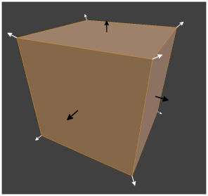
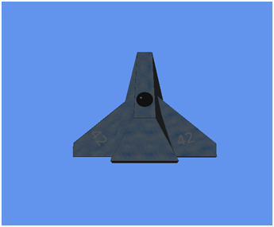

# 八、照明

光线非常复杂，就像我们模型的纹理。在三维图形编程中，我们使用技术来模拟光，而没有实际计算在现实世界中反弹的无数光线。在本章中，我们将研究一些简单但有效的模型照明技术。

本章中的照明方程式基于《CG 教程》的第 5 章，该教程可从 NVidia 网站获得:[http://http . developer . NVidia . com/CgTutorial/CG _ Tutorial _ Chapter 05 . html](http://http.developer.nvidia.com/CgTutorial/cg_tutorial_chapter05.html)

## 法线

在我们看灯光之前，我们需要看法线。法线是垂直于另一个向量或垂直于一个表面的向量。*图 8.1* 中的图像描绘了法线渲染为箭头的立方体。立方体有八个向量，其中一个在图像中不可见(最左下方的向量)。这些向量共同描述了立方体的六个面，其中只有三个是可见的。白色箭头是矢量法线；立方体中的每个向量都有一个，它们从立方体的中心指向角的方向。黑色箭头是表面法线；它们代表立方体的每个面所指向的方向。



图 8.1:具有矢量和表面法线的立方体

### 读取法线

在我们开始编程照明之前，我们应该将对象文件中的法线读入我们的`Model`。目前，这些都被`ModelReader`班忽略了。这包括改变顶点结构，以包括我们从文件中读取的矢量法线。打开 **Model.h** 文件，给顶点结构添加一个`float3`来保持顶点法线。这一变化在下面的代码表中突出显示。

```cpp
    // Definition of our vertex types
    struct Vertex
    {
    DirectX::XMFLOAT3 position;
    DirectX::XMFLOAT3 normal;
    DirectX::XMFLOAT2 uv;
    };

```

接下来，必须更改顶点着色器类的 D3D11_INPUT_ELEMENT_DESC，以包含新的法线。打开 VertexShader.cpp 文件，将法线添加到描述中。这一变化在下面的代码表中突出显示。

```cpp
    // VertexShader.cpp
    #include "pch.h"
    #include "VertexShader.h"

    void VertexShader::LoadFromFile(ID3D11Device *device,
    _In_ Platform::String^ filename)
    {
    // Read the file
    Platform::Array<unsigned char, 1U>^ fileDataVS =
    DX::ReadData(filename);

    // Crreate the vertex shader from the file's data
    DX::ThrowIfFailed(device->CreateVertexShader(fileDataVS->Data,
    fileDataVS->Length, nullptr, &m_vertexShader));

    // Describe the layout of the data
    const D3D11_INPUT_ELEMENT_DESC vertexDesc[] =
    {
    { "POSITION", 0, DXGI_FORMAT_R32G32B32_FLOAT, 0, 0,
    D3D11_INPUT_PER_VERTEX_DATA, 0 },
    { "NORMAL", 0, DXGI_FORMAT_R32G32B32_FLOAT, 0, 12,
    D3D11_INPUT_PER_VERTEX_DATA, 0 },
    { "TEXCOORD", 0, DXGI_FORMAT_R32G32_FLOAT, 0, 24,
    D3D11_INPUT_PER_VERTEX_DATA, 0 },
    };

    DX::ThrowIfFailed(device->CreateInputLayout(vertexDesc,
    ARRAYSIZE(vertexDesc), fileDataVS->Data, fileDataVS->Length,
    &m_inputLayout));
    }

```

在之前的代码表中，我已经将法线放置在`POSITION`和`TEXCOORD`之间。`TEXCOORD`规格中的`24`也必须更改；它以前是`12`。

接下来，我们可以改变`Model`类来从文件中加载法线，就像我们对顶点位置和纹理坐标所做的那样。打开 **ModelReader.cpp** 文件，用`ReadModel`方法添加代码读取法线。这些更改在下面的代码表中突出显示。

```cpp
    Model* ModelReader::ReadModel(ID3D11Device* device, char* filename)
    {
    // Read the file
    int filesize = 0;
    char* filedata = ReadFile(filename, filesize);

    // Parse the data into vertices and indices
    int startPos = 0;
    std::string line;

    // Vectors for vertex positions
    std::vector<float> vertices;
    std::vector<int> vertexIndices;
    // Vectors for texture coordinates
    std::vector<float> textureCoords;
    std::vector<int> textureIndices;
    // Vectors for normals
    std::vector<float> normals;
    std::vector<int> normalIndices;

    int index; // The index within the line we're reading

    while(startPos < filesize) {
    line = ReadLine(filedata, filesize, startPos);
    if(line.data()[0] == 'v' && line.data()[1] == ' ') {
    index = 2;
    // Add to vertex buffer
    vertices.push_back(ReadFloat(line, index)); // Read X
    vertices.push_back(ReadFloat(line, index)); // Read Y
    vertices.push_back(ReadFloat(line, index)); // Read Z
    // If there's a "W" it will be ignored
    }
    else if(line.data()[0] == 'f' && line.data()[1] == ' ') {
    index = 2;
    // Add triangle to index buffer
    for(int i = 0; i < 3; i++) {
    // Read position of vertex
    vertexIndices.push_back(ReadInt(line, index));
    // Read the texture coordinate
    textureIndices.push_back(ReadInt(line, index));

    // Ignore the normals
    //ReadInt(line, index );
    // Read the normal indices
    normalIndices.push_back(ReadInt(line, index));
    }
    }
    else if(line.data()[0]=='v'&& line.data()[1] == 't' && line.data()[2] == ' ')
    {
    index = 3;
    // Add to texture
    textureCoords.push_back(ReadFloat(line, index)); // Read U
    textureCoords.push_back(ReadFloat(line, index)); // Read V
    }
    else if(line.data()[0]=='v' && line.data()[1] == 'n' && line.data()[2] == ' ')
    {
    index = 3;
    // Add to normals
    normals.push_back(ReadFloat(line, index)); // Read X
    normals.push_back(ReadFloat(line, index)); // Read Y
    normals.push_back(ReadFloat(line, index)); // Read Z
    }
    }

    // Deallocate the file data
    delete[] filedata; // Deallocate the file data

    // Subtract one from the vertex indices to change from base 1
    // indexing to base 0:
    for(int i = 0; i < (int) vertexIndices.size(); i++) {
    vertexIndices[i]--;
    textureIndices[i]--;
    normalIndices[i]--;
    }

    // Create a collection of Vertex structures from the faces
    std::vector<Vertex> verts;
    int j = vertexIndices.size();
    int qq = vertices.size();
    for(int i = 0; i < (int) vertexIndices.size(); i++) {
    Vertex v;

    // Create a vertex from the referenced positions
    v.position = XMFLOAT3(
    vertices[vertexIndices[i]*3+0],
    vertices[vertexIndices[i]*3+1],
    vertices[vertexIndices[i]*3+2]);

    // Set the vertex's normals
    v.normal = XMFLOAT3(
    normals[normalIndices[i]*3+0],
    normals[normalIndices[i]*3+1],
    normals[normalIndices[i]*3+2]);

    // Set the vertex's texture coordinates
    v.uv = XMFLOAT2(
    textureCoords[textureIndices[i]*2+0],
    1.0f-textureCoords[textureIndices[i]*2+1] // Negate V
    );

    verts.push_back(v); // Push to the verts vector
    }

    // Create a an array from the verts vector.
    // While we're running through the array reverse
    // the winding order of the vertices.
    Vertex* vertexArray = new Vertex[verts.size()];
    for(int i = 0; i < (int) verts.size(); i+=3) {
    vertexArray[i] = verts[i+1];
    vertexArray[i+1] = verts[i];
    vertexArray[i+2] = verts[i+2];
    }

    // Construct the model
    Model* model = new Model(device, vertexArray, verts.size());

    // Clear the vectors
    vertices.clear();
    vertexIndices.clear();
    verts.clear();
    textureCoords.clear();
    textureIndices.clear();
    normalIndices.clear();
    normals.clear();

    // Delete the array/s
    delete[] vertexArray;

    return model; // Return the model
    }

```

现在，我们可以为着色器更改两个 HLSL 文件中的顶点规范。打开**顶点文件，向`VertexShaderInput`和`VertexShaderOutput`结构添加法线。在下面的代码表中，我将法线不变地传递给了像素着色器。**

```cpp
    // VertexShader.hlsl

    // The GPU version of the constant buffer
    cbuffer ModelViewProjectionConstantBuffer : register(b0)
    {
    matrix model;
    matrix view;
    matrix projection;
    };

    // The input vertices
    struct VertexShaderInput
    {
    float3 position : POSITION0;
    float3 normal : NORMAL0;
    float2 tex : TEXCOORD0;
    };

    // The output vertices as the pixel shader will get them
    struct VertexShaderOutput
    {
    float4 position : SV_POSITION0;
    float3 normal : NORMAL0;
    float2 tex : TEXCOORD0;
    };

    // This is the main entry point to the shader:
    VertexShaderOutput main(VertexShaderInput input)
    {
    VertexShaderOutput output;
    float4 pos = float4(input.position, 1.0f);

    // Use constant buffer matrices to position the vertices:
    pos = mul(pos, model); // Position the model in the world
    pos = mul(pos, view); // Position the world with respect to a camera
    pos = mul(pos, projection);// Project the vertices
    output.position = pos;

    // Pass the texture coordinates unchanged to pixel shader
    output.tex = input.tex;

    // Pass the normals unchanged to the pixel shader
    output.normal = input.normal;

    return output;
    }

```

同样，更改 PixelShader.hlsl 文件中的结构。像素着色器的更改代码如下代码表所示。

```cpp
    // PixelShader.hlsl

    Texture2D shaderTexture; // This is the texture
    SamplerState samplerState;

    // Input is exactly the same as
    // vertex shader output!
    struct PixelShaderInput
    {
    float4 pos : SV_POSITION0;
    float3 normal : NORMAL0;
    float2 tex : TEXCOORD0;
    };

    // Main entry point to the shader
    float4 main(PixelShaderInput input) : SV_TARGET
    {
    float4 textureColor =
    shaderTexture.Sample(samplerState, input.tex);

    // Return the color unchanged
    return textureColor;
    }

```

在这一点上，你应该能够运行应用程序，它会像以前一样出现，只是现在我们有顶点法线被传递给像素着色器。

### 发射照明

我们将把几种简单的照明技术加在一起；这将给我们一些灵活性。我们将实现的第一种类型的照明看起来像是一个很大的倒退，因为它将从我们的模型中移除纹理。发光照明是物体自身发出的光。在这个简单的模型中，我们的发光照明不会照亮场景中的其他对象。发光照明只需要一种颜色。打开 **PixelShader.hlsl** 文件，更改主方法。下面的代码表突出显示了这些变化。

```cpp
    // Main entry point to the shader
    float4 main(PixelShaderInput input) : SV_TARGET
    {
    //float4 textureColor =
    // shaderTexture.Sample(samplerState, input.tex);

    // Return the color unchanged
    // return textureColor;

    float4 emissive = float4(0.2f, 0.2f, 0.2f, 1.0f);

    float4 finalColor = emissive;

    finalColor = normalize(finalColor);

    return finalColor;
    }

```

在前面的码表中，我们已经说过模型中的所有像素都是深灰色的，`(0.2f, 0.2f, 0.2f, 1.0f)`。这意味着即使没有任何照明，我们的模型也会发出暗淡的灰色。我从`float4 finalColor`开始强调的那条线目前还没有什么意义，但是我们会在创建它们的时候给它添加更多的灯光。还要注意对`normalize`的调用，我们颜色中的 RGBA 值应该是 0.0f 到 1.0f

### 环境照明

我们将添加的下一种照明类型称为环境照明。在现实世界中，当物体没有被光源直接照亮时，它们通常仍然可见，因为光线会从其他物体上反射回来。例如，如果你在光线充足的房间里看桌子下面，你会清楚地看到下面，尽管事实上光源并没有明显地在桌子下面发光。实际上，环境照明极其复杂。在编程时，我们可以通过给我们的模型一个环境反射来总结效果，环境反射是模型的材质反射的环境光的量，并且通过给场景中的环境光一种颜色来总结效果。下面的代码表突出显示了这些变化，我还删除了前面代码表中注释掉的行。

```cpp
    // Main entry point to the shader
    float4 main(PixelShaderInput input) : SV_TARGET
    {
    float4 emissive = float4(0.2f, 0.2f, 0.2f, 1.0f);

    float materialReflection = 1.0f;
    float4 ambientLightColor = float4(0.1f, 0.1f, 0.1f, 1.0f);
    float4 ambient = ambientLightColor * materialReflection;

    float4 finalColor = emissive + ambient;

    finalColor = normalize(finalColor);

    return finalColor;
    }

```

在之前的代码表中，我已经将`materialReflection`设置为 100%，将`ambientLightColor`设置为深灰色`(0.1f, 0.1f, 0.1f, 1.0f)`。这两个值(`materialReflection`和`ambientLightColor`)相乘在一起，计算出我们的光方程中的`ambient`分量，然后将其加到`emissive`分量中，形成最终的颜色。

### 漫射照明

漫射光是照射到我们的材料上的光，并在所有方向上均匀反射。它需要具有位置和颜色、材料颜色和表面法线的光源。它不考虑材料的高光、反射或光泽，只考虑它的一般颜色。漫射照明对于没有光泽的哑光材料非常有用，例如未抛光的木材、地毯和石膏。

我们从纹理文件中读取的值不一定与材质被照亮时的颜色完全相同，因为必须应用阴影来指示照明。如果绿光照在我们的模型上，看起来会更绿；同样，红灯会使材料看起来更红。关键是，我们纹理中的值是白光直接照射到材料上时应该出现的颜色。

下面的代码表突出显示了对像素着色器读取纹理的主要方法的更改，以及添加我们的照明效果。

```cpp
    // Main entry point to the shader
    float4 main(PixelShaderInput input) : SV_TARGET
    {
    float4 emissive = float4(0.1f, 0.1f, 0.1f, 1.0f);

    float materialReflection = 1.0f;
    float4 ambientLightColor = float4(0.1f, 0.1f, 0.1f, 1.0f);
    float4 ambient = ambientLightColor * materialReflection;

    float diffuseIntensity = 1.0f;
    float4 diffuseLightColor = float4(1.0f, 1.0f, 1.0f, 1.0f);
    float4 diffuseLightDirection = float4(1.0f, -1.0f, 1.0f, 1.0f);
    float4 materialColor = shaderTexture.Sample(samplerState, input.tex);
    float4 diffuse = diffuseIntensity * diffuseLightColor *
    saturate(dot(-diffuseLightDirection, input.normal));
    diffuse = diffuse * materialColor;

    float4 finalColor = emissive + ambient + diffuse;

    finalColor = normalize(finalColor);

    return finalColor;
    }

```

运行应用程序时，应该又看到了飞船，只是现在它有了简单的漫反射灯光明暗效果(*图 8.2* )。



图 8.2:带漫射照明的宇宙飞船

|  | 注意:我已经对灯光的变量进行了硬编码。更常见的是将这些放入`cbuffer`中，以便中央处理器可以更新和更改这些值。根据项目被访问的频率将它们分组到不同的`cbuffers`中是很常见的。例如，您可能有`perobject`、`perframe`、`pergame`、`cbuffers`，它们分别保存游戏中每个对象、每帧或仅一次必须更新的数据。我使用了单个 cbuffer，因为我们所做的不是处理器密集型的。 |

上述漫射照明方程的基础相当简单；如果面的法线正对着光，则表面被描绘为纹理的颜色。如果面的法线不面向漫射光源，则表面呈现为发射色和环境色。

上述漫射照明的公式和代码改编自 RasterTek 教程 6，可从[http://www.rastertek.com/dx11tut06.html](http://www.rastertek.com/dx11tut06.html)在线获得。