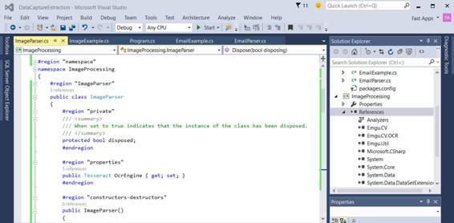

# 二、从屏幕截图提取数据

像电子邮件一样，包含文本的截图也充满了有价值的信息。例如，一些截屏包含重要的材料，可以提取这些材料来自动化诸如打字和数据输入等过程。随着公司和个人的内部流程越来越自动化，从截图中提取信息(避免手动输入数据和打字)在商业世界中变得越来越重要。

阅读截图并提取有价值信息的过程通常称为捕获或提取。提取屏幕截图中包含的单词、数字或文本称为光学字符识别(OCR)。

阅读本章后，您应该能够在 C# 程序中安装 EmguCV，以便通过从便携式网络图形(PNG)或标记图像格式(TIFF)格式的屏幕截图中提取文本形式的数据来执行光学字符识别。

当截图需要转换成数字图像时，可以使用几种不同的格式保存。保存截图最常用的格式是 TIFF、PNG 或联合图像专家组(JPEG)。TIFF 格式最适合执行光学字符识别，大多数光学字符识别引擎更喜欢使用 TIFF 作为提取文本的预定义格式。

根据维基百科，JPEG 算法最适合使用色调和颜色柔和变化的图片和绘图，这种格式在互联网上广泛流行。JPEG 也是数码相机保存图片最常用的格式之一。然而，JPEG 可能不太适合线条画和其他文本或图标图形(即文本)，主要是由于相邻像素之间的鲜明对比。

TIFF 格式通过提供特殊的无损压缩算法(如 CCITT 第四组)，比 JPEG 或 PNG 压缩算法更好地压缩二值图像(如传真或黑白文本)，从而提供了比其他格式更大的优势。

执行光学字符识别时，首选格式是带有 CCITT 第四组压缩的 TIFF。巴布亚新几内亚是第二常见的选择。

如果你想更多地了解图像格式之间的差异，你可以在维基百科参考中找到有价值的信息，用于“[图形文件格式的比较](https://en.wikipedia.org/wiki/Comparison_of_graphics_file_formats)”

开源计算机视觉(OpenCV)是一个 C++跨平台库，设计用于实现计算机视觉解决方案(人脸检测、图像中模式的识别等)。).你可以在[开放简历维基百科条目](https://en.wikipedia.org/wiki/OpenCV)和[开放简历网站](http://opencv.org/)了解更多信息。

因为 OpenCV 是一个原生(非管理)C++库，所以有一个名为 [EmguCV](http://www.emgu.com/wiki/index.php/Main_Page) 的. NET 跨平台包装器，我们将使用它与 Tesseract 进行交互，并使用 CCITT Group IV 压缩截图对 TIFF 执行数据提取和 OCR。

EmguCV 允许从本机调用 OpenCV 函数。NET 用 C#、VB、VC++，甚至 IronPython 编写的代码。EmguCV 还兼容来自 [Xamarin](http://xamarin.com) 的 [Mono](http://www.mono-project.com/) ，可以在 Windows、Mac OS X、Linux、iOS 和 Android 上运行。

您可以使用 Visual Studio 将 EmguCV 作为 NuGet 包安装。因为 NuGet 上有几种实现，所以我们将使用 EmguCV.221.x64。如果您在 32 位操作系统上开发，您可以安装 EmguCV.221.x86。


*图 4:用 Visual Studio 2015* 将 EmguCV 作为 NuGet 包安装

安装 EmguCV 后，几个依赖项会自动添加到 Visual Studio 项目中。对我们来说，最重要的将是 Emgu。CV，Emgu。光学字符识别和肌电图

请务必注意，当您安装 EmguCV NuGet 包时，您不会得到 Emgu。CV.OCR 命名空间，这对于使用宇宙魔方是必不可少的。这意味着我们需要进入宇宙魔方引擎。为了访问必要的文件 Emgu.CV.OCR.dll，我们必须下载并安装完整的 EmguCV 设置，可以在这里找到:

[https://SourceForge . net/projects/EMG ucv/files/EMG ucv/3 . 0 . 0/libemucv-windows-universal-3 . 0 . 0 . 2157 . zip/download？使用 _mirror=freefr & r= &使用 _mirror=freefr](https://sourceforge.net/projects/emgucv/files/emgucv/3.0.0/libemgucv-windows-universal-3.0.0.2157.zip/download?use_mirror=freefr&r=&use_mirror=freefr)

因此，为了获得文件 Emgu.CV.OCR.dll，有必要下载并安装完整的 EmguCV 设置，可以在这里找到:

[https://SourceForge . net/projects/EMG ucv/files/EMG ucv/3 . 0 . 0/libemucv-windows-universal-3 . 0 . 0 . 2157 . zip/download？使用 _mirror=freefr & r= &使用 _mirror=freefr](https://sourceforge.net/projects/emgucv/files/emgucv/3.0.0/libemgucv-windows-universal-3.0.0.2157.zip/download?use_mirror=freefr&r=&use_mirror=freefr)

如果我们不需要执行光学字符识别，我们可以简单地使用 NuGet 安装的东西，以及下面的 Emgu 通用设置。简历就没必要了。


*图 5:EmguCV*通用窗口设置

安装后，可以在 Windows 中的“*C:\ Emgu \ EmguCV-Windows-universal 3 . 0 . 0 . 2157”*下找到完整的 EmguCV 库。请记住，版本号将来可能会改变，因此文件夹路径可能会略有不同(即路径末尾的数字)。

请务必添加这些 DLL 标签作为参考:Emgu.CV.dll、Emgu.CV.OCR.dll 和 Emgu.Util.dll。

图 6 描述了添加这些 dll 后，Visual Studio 项目引用应该是什么样子。



*图 6:带有 EmguCV DLLs 的 Visual Studio 项目*

现在我们已经连接了 EmguCV，让我们看看如何对屏幕截图进行光学字符识别，从中提取文本和单词。

EmguCV 是 OpenCV 的包装器。为了让它正常运行，需要将 OpenCV 运行时复制到 Visual Studio 项目的“输出”文件夹中(调试或发布文件夹)。这些 OpenCV 运行时需要复制:cvextern.dll、msvcp120.dll、msvcr120.dll 和 opencv_ffmpeg300.dll。

如果输出文件夹中没有这些文件，运行时将产生异常。有了这些，让我们看看如何用代码来实现。

代码清单 9:使用 EmguCV 对屏幕截图执行光学字符识别

```cs

  using Emgu.CV;
  using Emgu.Util;
  using Emgu.CV.Structure;
  using Emgu.CV.OCR;
  namespace ImageProcessing {

  public class ImageParser: IDisposable {
          public Tesseract OcrEngine { get; set; }
          public string[] Words { get; set;
  }
          public void
  Dispose() { }

  public ImageParser(string dataPath, string
  lang) 

  {

  OcrEngine = new Tesseract(dataPath, lang, 

  OcrEngineMode.TesseractCubeCombined);

  }

  public string OcrImage(string img)

  {

  string res = String.Empty;

  List<string> wrds = new List<string>();

  if (File.Exists(img))

  {

       using (Image<Bgr, byte>
  i = new Image<Bgr, 

  byte>(img)) {

  if (OcrEngine != null)

  {

  OcrEngine.Recognize(i);

  res = OcrEngine.GetText().TrimEnd();

  wrds.AddRange(res.Split(new string[] { "
  ", 

      "\r", "\n" },

   StringSplitOptions.

  RemoveEmptyEntries).ToList());

                      this.Words = wrds?.ToArray();

  }

  }

  }

  return res;

  }
     }
  }

```

代码清单 9 中的第一步描述了在 ImageParser 类的构造函数中创建一个 Tesseract 对象的实例。

两个非常重要的参数被传递给宇宙魔方构造函数。首先，参数 dataPath 指示 Tessdata 文件夹的路径，该文件夹包含 Tesseract 数据定义(位于“C:\ Emgu \ emgucv-windows-universal 3 . 0 . 0 . 2157 \ bin \ Tessdata”下)。其次，参数 lang 表示光学字符识别引擎试图识别的语言。

一旦创建了宇宙魔方实例，对截图执行光学字符识别就是我们的下一步。我们在 OcrImage 方法中这样做。一辆 Emgu。必须创建 CV.Image <tcolor depth="">实例，以便加载 OCR 将对其执行的实际屏幕截图文件。下一个 Emgu。CV.Image 实例作为参数传递给宇宙魔方实例的识别方法。一旦识别完成，就可以调用 GetText 方法，该方法返回屏幕截图上的所有单词和字符的字符串。</tcolor>

我们可以通过将 GetText 的字符串结果转换为分配给 ImageParser 类的 words 属性的字符串数组来清理。

如您所见，对屏幕截图执行光学字符识别并从中提取文本可能是一个相对简单的操作。设置 EmguCV 并确保运行时文件到位，使用正确的引用，实际上比 OCR 更耗时。

标准开发实践要求我们在请求主程序调用包装类之前，让一个包装类调用 ImageParser。同样的原则在第 1 章的邮件套件中得到应用。

让我们看看如何做到这一点。

代码清单 10:使用包装类调用 ImageParser 对屏幕截图进行光学字符识别。

```cs

  //
  ImageExample: A wrapper class around ImageParser.

  using System;
  using System.Collections.Generic;
  using System.Linq;
  using System.Text;
  using System.Threading.Tasks;

  namespace ImageProcessing
  {

  public class ImageExample

  {

  public static string[] GetImageWords()

  {

  List<string> w = new List<string>();

  using (ImageParser ip = new ImageParser(

  @"C:\Emgu\emgucv-windows-universal 3.0.0.2157

  \bin\tessdata", "eng"))

  {

  if (ip.OcrImage(

  @"C:\temp\screen_shot.tif")

              != string.Empty)

  w.AddRange(ip?.Words.ToList<string>());

  }

  return w.ToArray();

  }

  }
  }

  //
  Main Program that invokes ImageExample.

  using System;
  using System.Collections.Generic;
  using System.Linq;
  using System.Text;
  using System.Threading.Tasks;

  using ImageProcessing;

  namespace DataCaptureExtraction
  {

  class Program

  { 

  static void
  Main(string[] args)

  {

  ImageExample.GetImageWords();

  }

  }
  }

```

主程序调用 GetImageWords，这是 ImageExample 类中的一个静态方法。在 GetImageWords 中，通过传递宇宙魔方数据文件夹的位置和宇宙魔方引擎使用的语言来创建 ImageParser 类的实例。接下来，调用 OcrImage 方法，返回的结果是在 ImageParser 实例的单词字符串数组属性中找到的刺痛和单词。

从编程的角度来看，使用 OpenCV 和。NET EmguCV 包装器从截图中提取单词相对容易。我们必须确保 EmguCV 的安装使得运行时到位，并且不会产生运行时异常。

与其他库一样，OpenCV 和 EmguCV 可以用于比 OCR 截图和文本和单词提取多得多的功能。我们只是触及了这些库提供的表面，所以我邀请您进一步探索它们中的每一个，并发现它们除了光学字符识别之外还能提供什么。我还建议您探索市场上可用的商业光学字符识别和图像处理平台。

代码清单 11 包含了我们使用 EmguCV 解决的每个例子的全部源代码。

代码清单 10:完整的 EmguCV 演示程序源代码

```cs

  //
  ImageParser: OCR text extraction using EmguCV.

  using System;
  using System.Collections.Generic;
  using System.Linq;
  using System.Text;
  using System.Threading.Tasks;

  using Emgu.CV;
  using Emgu.Util;
  using Emgu.CV.Structure;
  using Emgu.CV.OCR;
  using System.IO;

  namespace ImageProcessing
  {

  public class ImageParser: IDisposable

  {

  protected bool
  disposed;

  public Tesseract OcrEngine { get; set; }

  public string[] Words { get; set;
  }

  public ImageParser()

  {

  OcrEngine = null;

  }

  public ImageParser(string dataPath, string
  lang)

  {

  OcrEngine = new Tesseract(dataPath, lang, 

  OcrEngineMode.TesseractCubeCombined);

  }

  ~ImageParser()

  {

  this.Dispose(false);

  }

  public string OcrImage(string img)

  {

  string res = String.Empty;

  List<string> wrds = new List<string>();

  if (File.Exists(img))

  {

  using (Image<Bgr, byte>
  i = new Image<Bgr, 

  byte>(img))

  {

  if (OcrEngine != null)

  {

  OcrEngine.Recognize(i);

                 res = OcrEngine.GetText().TrimEnd();

  wrds.AddRange(res.Split(new string[] { "
  ", 

  "\r", "\n" },StringSplitOptions.

                              RemoveEmptyEntries).ToList());

  this.Words = wrds?.ToArray();

  }

  }

  }

    return res;

  }

  public virtual void Dispose(bool disposing)

  {

  if (!this.disposed)

  {

  if (disposing)

  {

  if (OcrEngine != null)

  {

                 OcrEngine.Dispose();

  OcrEngine = null;

  }

  }

  }

  this.disposed = true;

  }

  public void
  Dispose()

  {

  this.Dispose(true);

         GC.SuppressFinalize(this);

  }

  }
  }

  //
  ImageExample: A wrapper class around ImageParser.

  using System;
  using System.Collections.Generic;
  using System.Linq;

  namespace ImageProcessing
  {

  public class ImageExample

  {

  public static string[] GetImageWords()

  {

  List<string> w = new List<string>();

  using (ImageParser ip = new 

  ImageParser(@"C:\Emgu\emgucv-windows-universal

                              3.0.0.2157\bin\tessdata", "eng"))

  {

  if (ip.OcrImage(

  @" C:\temp\screen_shot.tif
  ")

  != string.Empty)

  w.AddRange(ip?.Words.ToList<string>());

  }

  return w.ToArray();

  }

  }
  }

  //
  Main Program that invokes ImageExample.

  using System;
  using System.Collections.Generic;
  using System.Linq;
  using System.Text;
  using System.Threading.Tasks;

  using ImageProcessing;

  namespace DataCaptureExtraction
  {

  class Program

  { 

  static void
  Main(string[] args)

  {

  ImageExample.GetImageWords();

  Console.ReadLine();

  }

  }
  }

```

完整的 Visual Studio 项目源代码可以从以下网址下载:

[https://bit bucket . org/syncfusiontech/data-capture-and-extraction-with-c-简洁地](https://bitbucket.org/syncfusiontech/data-capture-and-extraction-with-c-succinctly)