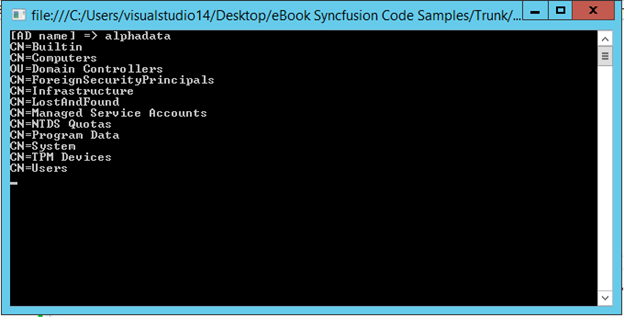
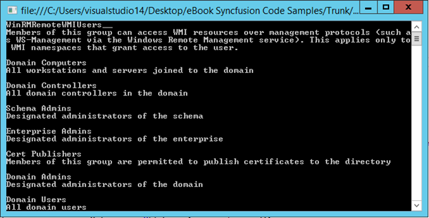
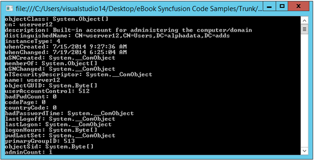
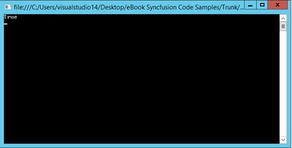
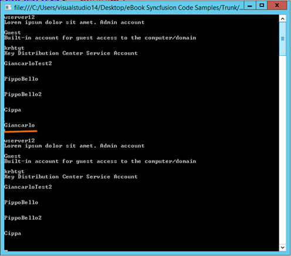

# 六、代码示例

既然我们已经广泛地进入了系统的所有理论方面。目录服务的名称空间，是时候看一些代码示例来展示如何完成一些管理任务了。

## 连接到 ADSI 服务

在开始之前，我们首先需要连接到我们的广告服务。下面的代码展示了如何做到这一点:

```cs
          private static void Connection()
          {
              DirectoryEntry conn = new DirectoryEntry("LDAP://"+ IP_PORT +"/DC=alphadata, DC=adds", "user", "pass");
              Console.WriteLine("[DC name] => " + conn.Properties["dc"].Value);
              foreach (DirectoryEntry item in conn.Children)
                  Console.WriteLine(item.Name); // We print all the children we have in our root
          }

```



图 3:连接成功，我们输出根中的子列表

## 管理用户和组

### 列出用户和组

我们将要描述的第一个也是最简单的管理任务是当我们需要创建一个对象列表时(可能需要某种过滤或排序)。这些对象可能是计算机、用户，甚至是打印机。对于公司来说，在广告树中添加这种设备/实体是非常常见的，因为这简化了他们的网络分配。

```cs
          private static void ListObjects(Boolean users = true)
          {
              DirectoryEntry userConn = new DirectoryEntry("LDAP://" + IP_PORT + "/CN=Users,DC=alphadata, DC=adds", "user", "pass");

              // We will use "crawler" to search inside our AD with a given filter,
              // we also specify the properties we are interested in.
              // We use a flag to indicate if we want to search for users or groups.
              DirectorySearcher crawler = new DirectorySearcher(userConn);
              crawler.Filter = users ? "(objectCategory=user)" : "(objectCategory=group)";
              crawler.PropertiesToLoad.AddRange(new string[] { "cn", "description" });
              SearchResultCollection result = crawler.FindAll();

              // We now print the username and the account description for the object we have found.
              foreach (SearchResult item in result)
              {
                  Console.WriteLine(item.GetDirectoryEntry().Properties["cn"].Value);
                  Console.WriteLine(item.GetDirectoryEntry().Properties["description"].Value);
                  Console.WriteLine();
              }
          }

```

前面的代码非常简单。首先我们创建一个直接指向我们的用户 OU 的目录尝试对象，然后我们实例化一个目录射手对象，指定我们只想要返回用户类型的对象(如果变量 Users 设置为 true)。然后我们调用方法 FindAll()，由于它返回的集合，通过 for 循环，我们可以迭代结果。下面是程序输出的截图；在我们的例子中，我们在屏幕上打印用户显示名称和描述。

|  | 注意:为了显示 CN 和描述，必须将这些属性添加到。属性加载集合，如图所示。 |


图 4:我们广告中的用户列表

正如我们通过布尔参数**用户**所看到的，我们可以很容易地改变查询的类型，以便获得包含在我们的用户组织单元中的组列表。



图 5:我们广告中的群组列表

### 编辑对象属性

当然，仅仅列出实体是一个无用的任务，最重要的是，它不是驱使我们需要一个支持目录的应用程序的原因。一个更真实、更有用的场景是编辑对象的属性。我们将考虑想要更新用户帐户描述的情况。

```cs
          private static void EditProperty()
          {
              DirectoryEntry userConn = new DirectoryEntry("LDAP://"+IP_PORT+"/CN=Users,DC=alphadata, DC=adds", "user", "pwd");
              DirectoryEntry user = userConn.Children.Find("cn=wserver12");
              user.Properties["description"].Value = "Lorem ipsum dolor sit amet. Admin account";
              user.CommitChanges();
          }

```

上面的代码片段几乎与我们之前讨论的代码片段相同，当时我们只需要列出广告实体，但是这次我们设法获得了单个广告实体的引用，更准确地说是一个用户。一旦我们做到了这一点，编辑它的属性就很简单了，我们只需要在 Property 集合中使用正确的索引(在这种情况下，索引由文字字符串表示)并设置我们想要的值。

|  | 提示:记得在应用任何一致有效的修改后提交您的更改。 |

你可能认为困难的部分是“我如何知道我正在使用一个有效的属性索引器？”答案是你需要了解他们。一份相当详尽的清单如下:然而，它们还有几十种，但这些是更常用的:

*   sAMAccountName—创建的帐户的用户标识。
*   名称—与 sAMAccountName 属性相同的值。
*   给定名称—用户的名字。
*   序列号—用户的姓氏。
*   显示名称—通常与名称和 sAMAccountName 相同。
*   useprincipalname—与名称相同，sAMAccountName。
*   共同国家。
*   邮件—单个电子邮件地址值。
*   电话号码—用户的电话号码。
*   描述—帐户的描述。
*   用户帐户控制—用于管理用户帐户的枚举属性。
*   wwwhomeepage—用户的默认主页(可选)。
*   父对象—父所有者对象。
*   cn-Canonical，或 Common Name，通常是 givenName + sn 的组合(注意:如果您已经从另一个系统(如 NT4)迁移到 AD 2000，默认情况下，该值与名称、sAMAccountName 和 displayName 相同，并且不能更改)。

但是，如果您想获得对象所有可用属性的列表，可以使用这段代码:

```cs
          private static void ListAllProps()
          {
              DirectoryEntry userConn = new DirectoryEntry("LDAP://"+IP_PORT+"/CN=Users,DC=alphadata, DC=adds", "user", "pwd");
              DirectoryEntry user = userConn.Children.Find("cn=wserver12");
              foreach (PropertyValueCollection item in user.Properties)
                  Console.WriteLine(item.PropertyName + ": " + item.Value);
          }

```



图 6:目录对象的所有属性

上图显示了用户对象的所有属性，这些属性代表了我当前在机器上使用的帐户。输出的格式如下:

|  | 提示： 属性名称 ： 属性值 |

通过使用前面指出的代码，我们现在可以编辑帐户的描述。这里有一张证明我们手术成功完成的图片。


图 7:我们已经成功编辑了一个属性

### 检查对象的存在

检查对象的存在始终是一项有用的任务，因为它避免了由于重复对象而可能发生的冲突问题。

```cs
          private static Boolean CheckIfUserExist(String cnName)
          {
              DirectoryEntry userConn = new DirectoryEntry("LDAP://" + IP_PORT + "/CN=Users,DC=alphadata, DC=adds", "user", "pwd");
              return userConn.Children.Find(cnName) != null;
          }

```

上面的代码片段与我们的服务器建立了直接指向用户 OU 的连接。然后使用 Find()方法，我们使用作为输入传递的参数来确定用户是否存在。您可以通过以下方式调用方法:

```cs
          static void Main(string[] args)
          {
              Console.WriteLine(CheckIfUserExist("cn=wserver12"));
              Console.ReadLine();
          }

```

我们得到这个输出(其中 true 当然意味着对象存在，在这个例子中是一个同名的用户):



图 8:用户存在

### 创建对象

当在真实环境中操作时，有可能在公司存在的过程中必须通过创建新对象或移除现有对象来修改林，以更好地适应公司 AD 的真实状态。当然，`System.DirectoryServices`的名称空间涵盖了这种情况，提供了一组允许开发人员在广告中务实地创建对象的应用编程接口。创建用户是一项非常简单的任务，可以通过以下代码来实现:

```cs
          private static void CreateUser(String userName)
          {
              try
              {
                  DirectoryEntry dirEntry = new DirectoryEntry("LDAP://" + IP_PORT + "/CN=Users,DC=alphadata, DC=adds", "user", "pass");
                  DirectoryEntry newUser = dirEntry.Children.Add("CN=" + userName, "user");
                  newUser.Properties["samAccountName"].Value = userName;
                  newUser.CommitChanges();

                  String pwd = "G14ncarlo";
                  Console.WriteLine("User pwd: " + pwd);
                  newUser.Invoke("SetPassword", new object[] { pwd });
                  newUser.CommitChanges();
                  dirEntry.Close();
                  newUser.Close();
              }
              catch (Exception ex)
              {
              Console.WriteLine(ex.InnerException);
              }}

```

用户作为子级存储在我们的 AD 根目录中，因此在创建对象时，您可以向类型为**目录**的用户集合中添加一个新项目(注意我们如何指定参数*用户*)。将它添加到子集合后，我们可以指定其他属性来更好地描述我们的对象。因为我们谈论的是用户，所以在编辑用户的对象时使用相同的属性命名约定。

### 删除对象

删除一个对象，就像许多其他危险的动作一样，非常容易。为了删除 AD 对象，必须首先获取对要删除的实体的引用，然后必须调用子集合公开的 Remove()方法。在下面的代码片段中，我们使用由 Children 集合公开的 Find()方法来获取要删除的实体的实例。

```cs
          private static void DeleteObject(String username)
          {
              DirectoryEntry dirEntry = new DirectoryEntry("LDAP://" + IP_PORT + "/CN=Users,DC=alphadata, DC=adds", "user", "pwd");
              DirectoryEntry user = dirEntry.Children.Find(username);
              if (user != null)
                  dirEntry.Children.Remove(user);
          }

```

在本例中，我们以这种方式调用了方法:

```cs
          static void Main(string[] args)
          {
              ListObjects();
              DeleteObject("cn=Giancarlo");
              ListObjects();
              Console.ReadLine();
          }

```

这就是我们得到的输出:



图 9:创建的新用户

### 管理用户密码

与大多数活动目录和用户管理任务(我们通过 LDAP 对活动目录对象和属性进行简单操作来执行)不同，管理密码要复杂一些。密码更改需要由服务器强制执行的非常特殊的语义，开发人员需要理解这些语义，密码管理应用程序才能成功。为了尽量方便密码管理过程，ADSI 在 **IADsUser** 界面公开了两种方法:**设置密码**和**更改密码**。

SetPassword 用于执行用户密码的管理重置，通常由管理员执行。不需要知道以前的密码。ChangePassword 仅用于将密码从一个值更改为另一个值，通常仅由目录对象所代表的用户执行。它确实需要知道以前的密码，因此它以旧密码和新密码作为参数。由于 DirectoryEntry 对象不直接公开 **IADsUser** ADSI 接口，因此这是我们必须使用 DirectoryEntry 的一种情况。通过后期绑定反射调用方法来调用这些 ADSI 方法。

在处理用户密码和密码边界时，有一些细节需要了解，例如强制用户在下次登录时更改密码，拒绝用户更改自己密码的权利，将密码设置为永不过期和何时过期；这些任务可以使用 **UserAccountControl 完成。**下面是一个包含所有可用标志的表格。

| 常数名称 | 十六进制值 |
| --- | --- |
| 脚本 | 0x0001 |
| ACCOUNTDISABLE | 0x0002 |
| HOMEDIR_REQUIRED | 0x0008 |
| 停工 | 0x0010 |
| passwd _ 我们的 EQD | 0x0020 |
| 密码 _ 铁路超高 _ 变更 | 0x0040 |
| 加密文本 PWD 允许 | 0x0080 |
| 临时 _ 重复 _ 帐户 | 0x0100 |
| 正常账户 | 0x0200 |
| 域间信任账户 | 0x0800 |
| 工作站 _ 信任 _ 帐户 | 0x1000 |
| SERVER_TRUST_ACCOUNT | 0x2000 |
| 其中 _EXPIRE_PASSWORD | 0x10000 |
| MNS _ 登录 _ 帐户 | 0x20000 |
| 智能卡 _REQUIRED | 0x40000 |
| 可信的委托 | 0x80000 |
| 未委托 | 0x100000 |
| 仅使用密钥 | 0x200000 |
| 其中 _REQ_PREAUTH | 0x400000 |
| 密码 _ 过期 | 0x800000 |
| 可信的授权 | 0x1000000 |

在上一段中，我们已经看到了如何设置用户密码以及如何创建用户。事实上，如果您查看代码片段的第 11 行，这些代码行确切地显示了如何设置用户密码。

但是，我们没有谈到重置用户密码的情况；下面是展示我们如何做到这一点的代码。

```cs
          private static void ResetPassword(string password)
          {
              DirectoryEntry uEntry = new DirectoryEntry("LDAP://" + IP_PORT + "/CN=TestUser, CN=Users, DC=alphadata, DC=adds", "user", "password");
              uEntry.Invoke("SetPassword", new object[] { password });
              uEntry.Properties["LockOutTime"].Value = 0; //unlock account
              uEntry.CommitChanges();
              uEntry.Close();
          }

```

首先，我们得到我们感兴趣的用户的 DirectoryEntry 对象。在实际场景中，用户的 CN 名称可能作为参数传递，并检查用户的存在。获取 DirectoryEntry 对象后，调用作为参数指定的 SetPassword 方法，这是我们作为输入接收的新密码。由于我们正在重置用户密码，用户可能已经输入了几次，导致广告封锁了他的帐户。为了解除锁定并给用户重新登录的可能性，我们通过将 **LockOutTime** 属性设置为零来解锁他的帐户。可以肯定的是，我们承诺我们的改变，我们已经完成了。

### 将用户添加到组

```cs
          private static void AddToGroup(DirectoryEntry user, string groupConnectionString)
          {
              try
              {
              DirectoryEntry dirEntry = new DirectoryEntry("LDAP://" + groupConnectionString);
                  dirEntry.Properties["member"].Add(user);
                  dirEntry.CommitChanges();
                  dirEntry.Close();
              }
              catch (System.DirectoryServices.DirectoryServicesCOMException ex)
              {
                  throw ex;
              }
          }

```

### 从组中删除用户

```cs
          private void RemoveUserFromGroup(DirectoryEntry userDn, string groupConnectionString)
          {
              try
              {
                  DirectoryEntry dirEntry = new DirectoryEntry("LDAP://" + groupConnectionString);
                  dirEntry.Properties["member"].Remove(userDn);
                  dirEntry.CommitChanges();
                  dirEntry.Close();
              }
              catch (System.DirectoryServices.DirectoryServicesCOMException ex)
              {
                  throw ex;
              }
          }

```

在这种情况下，我们省略了对组内用户存在的检查，但这应该始终执行。

### 枚举目录条目设置

2.0 类的优点之一是能够为您的 directoryEntry 对象获取和设置配置对象。

```cs
          private static void DirectoryEntryConfigurationSettings()
          {
              DirectoryEntry entry = new DirectoryEntry("LDAP://" + IP_PORT + "/DC=alphadata, DC=adds", "user", "pwd");
              DirectoryEntryConfiguration entryConfiguration = entry.Options;

              Console.WriteLine("Server: " +
                          entryConfiguration.GetCurrentServerName());
              Console.WriteLine("Page Size: " +
                          entryConfiguration.PageSize.ToString());
              Console.WriteLine("Password Encoding: " +
                          entryConfiguration.PasswordEncoding.ToString());
              Console.WriteLine("Password Port: " +
                          entryConfiguration.PasswordPort.ToString());
              Console.WriteLine("Referral: " +
                          entryConfiguration.Referral.ToString());
              Console.WriteLine("Security Masks: " +
                          entryConfiguration.SecurityMasks.ToString());
              Console.WriteLine("Is Mutually Authenticated: " +
                          entryConfiguration.IsMutuallyAuthenticated().ToString());
          }

```

### 使用中的调用方法进行错误处理。网

这两种方法的错误处理当然是相关的；它是一个更大的。NET 主题，该主题影响通过 Invoke 方法使用反射的任何代码。当使用 Invoke 方法调用任何 ADSI 接口方法时，目标方法抛出的任何异常，包括通过 COM 互操作触发的 COM 错误，都将被包装在**系统中。反射。目标调用异常**异常，实际异常在**内部异常**属性中。因此，我们需要在 Invoke 方法中使用这样的模式。

```cs
          private static void DangerousCode(String userName)
          {
              try
              {
                  DirectoryEntry dirEntry = new DirectoryEntry("LDAP://" + IP_PORT + "/CN=Users,DC=alphadata, DC=adds", "wserver12", "@Wserver12@");
                  DirectoryEntry newUser = dirEntry.Children.Add("CN=" + userName, "user");
                  newUser.Properties["samAccountName"].Value = userName;
                  newUser.CommitChanges();
                  dirEntry.Close();
                  newUser.Close();
              }
              catch (Exception ex)
              {
                  Console.WriteLine(ex.InnerException);
                  throw ex;
              }}

```

|  | 注意:上面的例子是用于创建用户对象的稍加修改的版本。 |

显然，我们可能希望做一些不同于简单地打印和重新抛出 InnerException 的事情。这里的重点是 InnerException 包含我们感兴趣的信息。这里的另一个问题是，从 ADSI 回来的例外从模糊的有益的到真正令人困惑的。我们不会试图列出所有这些，但这里有一些提示。

*   系统。UnauthorizedAccessException 总是指示权限问题。
*   一个系统。运行时. InteropServices.COMException 异常，出现**错误代码 0x80072035** “不愿意执行”通常意味着由于密码策略问题，修改 LDAP 密码失败。
*   一个系统。来自一个网络应用编程接口的异常通常非常具体地说明了问题是什么。

## 办理账户到期

在许多公司网络中，甚至在小公司网络中，账户到期是一种常见的政策。当然，帐户过期是驻留在广告中的东西，因此它可以由系统管理。目录服务命名空间。为了做到这一点，我们要做的第一件事是描述特定用户的特征，正如我们之前讨论的，这可以通过几行代码轻松完成。但是，过期呢？

### 设置用户账户到期

设置用户帐户到期是通过使用 Invoke()方法完成的，因此这次我们将使用反射。然而，这一次传递给 Invoke()方法的参数不像在前面的例子中那样简单。下面是一个展示如何为用户设置帐户到期的方法。

```cs
          private static void UserExpiration()
          {
              DirectoryEntry usr = new DirectoryEntry("LDAP://" + IP_PORT + "/CN=TestUser, CN=Users, DC=alphadata, DC=adds", "user", "pwd");

              // Get the native object.
              Type type = usr.NativeObject.GetType();
              Object adsNative = usr.NativeObject;

              // Use the Type.InvokeMember method to invoke the
              // AccountExpirationDate property setter.
              type.InvokeMember(
                  "AccountExpirationDate",
                  BindingFlags.SetProperty, // using System.Reflection
                  null,
                  adsNative,
                  new object[] { "12/29/20015" });

              usr.CommitChanges(); // Commit the changes.
          }

```

这是一段复杂的代码。它使用反射并直接对本机对象进行操作，以便调用最终将设置到期日期的本机方法。当然，这段代码非常容易出错，下面给出了一个不使用反射的更简单的解决方案。

```cs
          private static void UserExpiration()
          {
              DirectoryEntry usr = new DirectoryEntry("LDAP://" + IP_PORT + "/CN=TestUser, CN=Users, DC=alphadata, DC=adds", "user", "pwd");
              // Use the DirectoryEntry.InvokeSet method to invoke the
              // AccountExpirationDate property setter.
              usr.InvokeSet(
          "AccountExpirationDate",
          new object[] { new DateTime(2015, 12, 29) });

              // Commit the changes.
              usr.CommitChanges();
          }

```

在第二个片段中，第一个参数是我们想要修改的属性。之后，我们有一个包含 **DateTime** 的对象数组，表示账户何时到期。与往常一样，为了将更改传播到广告树，我们必须调用由我们正在处理的本机对象(在本例中是用户)公开的 CommitChanges()方法。

### 安全描述符管理

不幸的是，并不是所有的操作都可以通过修改对象的属性来完成；事实上，有时有必要修改对象的安全描述符，以便允许某种操作。这些操作是通过向所需对象的自由访问控制列表(DACL)添加访问控制条目(ACE)来完成的。

|  | 注意:在的 1.0 和 1.1 版本中。NET 框架，不支持修改活动目录对象的安全描述符。活动目录对象的安全描述符可以通过调用 ADSI 并使用 IADsSecurityDescriptor 和相关接口来操作。英寸 NET Framework 2.0，这已经改变了，因为命名空间包含几个类，允许在不调用 ADSI 的情况下操作安全描述符。 |

与活动目录对象安全描述符一起使用的主要类是**活动目录安全**；它具有允许读取和修改对象的自由访问控制列表和辅助访问控制列表的方法和属性。自由访问控制列表中的访问控制条目被称为访问规则。代表访问规则的主要类是**活动目录访问规则**类。

系统访问控制列表中的访问控制条目被称为审核规则，由 **ActiveDirectoryAuditRule** 类表示。设置访问规则可能是一项非常重复的任务，尤其是如果我们决定为我们拥有的每个对象手动设置每个审核规则。在这种情况下，最佳做法是直接编辑容器对象的 DACL，并让所有的审核规则被继承。这也确保了添加到该容器的所有其他对象都将继承该规则。**活动目录访问规则**类被用作基类来定义一系列子类，这些子类以更精确的方式描述了一种访问规则。下面是这些子类的标签列表。

| 班级 | 使用 |
| --- | --- |
| CreateChildAccessRule | 表示用于允许或拒绝广告对象创建子对象的权限的访问规则。 |
| 删除儿童访问规则 | 表示用于允许或拒绝广告对象删除子对象的权限的访问规则。 |
| 删除树访问规则 | 表示用于允许或拒绝广告对象删除所有子对象的权限的访问规则。 |
| ExtendedRightAccessRule | 表示用于允许或拒绝广告对象扩展权限的访问规则。 |
| ListChildrenAccessRule | 表示用于允许或拒绝广告对象列出子对象的权限的访问规则。 |
| PropertyAccessRule | 表示用于允许或拒绝访问广告属性的访问规则。 |
| PropertySetAccessRule | 表示用于允许或拒绝访问广告属性集的访问规则。 |

下面的代码显示了如何为用户设置安全描述符，以便可以编辑电话号码属性；此策略应用于用户容器，因此它会传播到其子容器。

```cs
          private static void SecurityDescriptor()
          {
              try
              {
                  DirectoryEntry container = new DirectoryEntry("LDAP://" + IP_PORT + "/CN=Users, DC=alphadata, DC=adds", "user", "pwd");

                  // Get the ActiveDirectorySecurity for the container.
                  ActiveDirectorySecurity containerSecurity = container.ObjectSecurity;

                  // using System.Security.Principal
                  // Create a SecurityIdentifier object for "self".
                      SecurityIdentifier selfSid =
                      new SecurityIdentifier(WellKnownSidType.SelfSid, null);

                  // Get the schema for the currently logged on user.
                  // using System.DirectoryServices.ActiveDirectory
                  ActiveDirectorySchema schema = ActiveDirectorySchema.GetCurrentSchema();

                  // Get the telephoneNumber schema property object.
                  ActiveDirectorySchemaProperty phoneProperty = schema.FindProperty("telephoneNumber");

                  // Get the user schema class object.
                  ActiveDirectorySchemaClass userClass = schema.FindClass("user");

                  // Create a property access rule to allow a user to write to their own telephoneNumber property.
              PropertyAccessRule allowWritePhoneRule =
                      new PropertyAccessRule(
                          selfSid,
                          AccessControlType.Allow, // using System.Security.AccessControl
                          PropertyAccess.Write,
                          phoneProperty.SchemaGuid,
                          ActiveDirectorySecurityInheritance.Descendents,
                          userClass.SchemaGuid);

                  // Add the access rule to the DACL.
                  container.ObjectSecurity.AddAccessRule(allowWritePhoneRule);

                  // Commit the changes.
                  container.CommitChanges();
              }
              catch (ActiveDirectoryObjectNotFoundException)
              { // The schema class or property could not be found.
              }
          }

```