# 七、实现单点登录

## 简介

随着信息技术对业务流程的支持越来越多，用户和系统管理员面临着越来越复杂的任务:以协调的方式管理和维护用户的帐户，以保持安全策略实现的完整性。另一方面，用户通常必须登录多个系统，这就需要相同数量的登录对话，每个对话可能涉及不同的用户名和身份验证信息。


图 10:多个独立用户帐户管理器的经典模式

一般来说，分布式系统总是由充当独立安全域的组件组装而成。这些组件充当独立的域，也就是说，终端用户必须向他希望与之交互的每个域独立地标识和认证自己。

这个场景如图 10 所示。最终用户最初与主域交互，以建立与该域的会话。这是通过上图中的主域登录完成的，要求最终用户提供一组适用于主域的用户凭据，例如用户名和密码。

主域会话通常由在环境中最终用户工作站上执行的操作系统会话外壳表示。通过这个主域会话外壳，用户能够调用其他域的服务，例如平台或应用程序。

要调用辅助域的服务，终端用户需要执行辅助域登录。这要求最终用户提供适用于该辅助域的另一组用户凭据。终端用户必须与终端用户需要使用的每个辅助域进行单独的登录对话。

从管理的角度来看，传统方法需要独立管理每个域，并使用多个用户帐户管理界面。可用性和安全性都需要协调，并且在可能的情况下，需要集成企业中多个不同领域的用户登录功能和用户帐户管理功能。提供这种协调和集成的服务可以通过以下方式为企业带来真正的成本效益:

*   **减少**用户对单个域进行登录操作所花费的时间，包括减少此类登录操作失败的可能性。
*   **通过减少用户处理和记住多组认证信息的需要，提高了安全性**。
*   **通过系统管理员在系统中添加和删除用户或修改他们的访问权限，减少了**花费的时间，并提高了响应速度。
*   **通过增强系统管理员维护用户帐户配置完整性的能力，包括以协调一致的方式禁止或删除单个用户访问所有系统资源的能力，提高了安全性**。

这类服务被命名为**单点登录**，以终端用户对服务的感知为准。然而，服务的最终用户和管理方面同样重要。在单点登录方法中，系统需要收集支持身份验证所需的所有标识和用户凭据信息，作为主要登录的一部分。这意味着必须在此处收集认证用户可能与之交互的每个辅助域所需的所有信息。然后，单点登录服务使用该信息来支持最终用户对用户实际请求与之交互的每个辅助域的身份验证。

作为主域登录过程的一部分，最终用户提供的信息可以通过多种方式用于支持辅助域登录:

*   **直接**:用户提供的信息作为二次登录的一部分传递给二次域。
*   **间接**:用户提供的信息用于检索单点登录管理信息库中存储的其他用户标识和用户凭证信息。然后，检索到的信息被用作二级域登录操作的基础。
*   **立即**:作为初始会话建立的一部分，与二级域建立会话。这意味着应用程序客户端会在主要登录操作时自动调用并建立通信。
*   **临时:**存储或缓存，并在最终用户请求二级域服务时使用。

从管理的角度来看，单一登录模型提供了单一帐户管理界面，通过该界面可以以协调和同步的方式管理所有组件域。单点登录模型的重要安全方面如下。

辅助域必须信任主域:

*   正确声明最终用户的身份和身份验证凭据。
*   保护用于验证辅助域最终用户身份的身份验证凭据，防止未经授权的使用。

在主域和辅助域之间传输身份验证凭据时，必须防止被拦截。


图 11:利用单点登录的现代场景

## 单点登录的更简单定义

单点登录是使用相同凭据访问不同控件和多个系统的能力；它可以被视为系统的一个属性，允许用户在每次尝试访问公司资源或门户时登录，而不会被提示输入凭据。这可以使用轻量级目录访问协议(LDAP)和存储在服务器上的 LDAP 数据库来实现。使用 cookies 可以实现简单版本的单点登录，但前提是站点位于同一域中。另一方面，单点登录是一种特性，通过这种特性，单点登录可以终止对多个软件系统的访问。

## 总结单点登录的优势和安全问题

单点登录(以及网络访问管理)的优势适用于许多领域，例如:

*   **用户体验**:最明显的好处就是用户可以安全不间断地在服务之间移动，而无需每次都指定自己的凭据。单点登录有效地将这些单独的服务加入到门户中，并消除了服务边界——从一个应用程序切换到下一个应用程序对用户来说似乎是无缝的。
*   **安全**:用户的凭证是直接提供给中心 SSO 服务器的，而不是用户试图访问的实际服务；因此，服务无法缓存凭据。中央身份验证点—单点登录服务—限制了网络钓鱼的可能性。
*   **资源节约** : IT 管理员可以利用中央 web 访问管理服务节省时间和资源。应用程序和 web 开发人员获得了一个完整的身份验证和授权框架，他们可以使用该框架来构建安全的用户定制服务。

然而，一些安全问题也可能出现。一旦用户通过初始身份验证，单一登录就提供了对许多资源的访问。这增加了证书被其他人获得和滥用的负面影响。因此，单点登录需要更加注重对用户凭据的保护，理想情况下应该与智能卡和一次性密码令牌等强身份验证方法相结合。单点登录也使得认证系统变得非常关键；它们可用性的丧失会导致拒绝访问在单点登录下统一的所有系统。

## 区分不同类型的单点登录

企业在实现登录时有几个选择。他们可以选择**“完全登录”**系统，在该系统中，用户认证进入一个系统一次，然后就可以访问所有关联的系统，而无需再次输入他们的凭证(除非有不活动超时)。

另一个带来较少安全风险的选择是“**简化登录**”系统。企业内的用户将能够使用相同的用户名和密码访问他们的所有系统。这与“**全面登录**”系统的区别在于，用户将必须为每个系统输入他们的凭据。这样做的好处是增加了安全级别；然而，用户将不得不多次输入他们的凭证。此外，系统必须到位，以确保用户的凭据在他们有权访问的各种系统之间复制。如果这些系统出现故障，用户可能无法访问他们需要的系统，这可能会导致向服务台打更多的电话。

实现单点登录的另一种方法称为“**联合登录**”。从用户的角度来看，联合登录类似于完全登录系统。但是，在后端，有一些很大的区别。对于传统的单点登录系统，每个不同的系统都有自己的身份验证系统。

## 用微软 Azure AD 实现单点登录

本书这一部分的目标是指导您完成将本地活动目录(阿尔法数据)集成到网络应用程序中所需的步骤，从而让所有阿尔法数据员工使用登录工作站时使用的用户名和密码登录公司门户。使用 Windows Azure 活动目录可以轻松完成这项任务。Azure AD 使您能够通过互联网提供企业业务线(LOB)应用程序。

### 推出 Azure 活动目录

Azure AD 提供了云上的活动目录功能，可以与内部 AD 环境集成或协同工作。Azure 活动目录(Azure AD)是一项通过 Azure 提供的服务，用于基于云的身份管理。当您使用 Azure AD 时，微软有责任保持活动目录在云中以高规模、高可用性和集成的灾难恢复运行，同时充分尊重您对组织信息隐私和安全的要求。Azure AD 的主要功能有:

*   它与内部活动目录集成。
*   它支持使用您的应用程序进行单点登录。
*   它支持目录同步
*   支持 [SAML](http://en.wikipedia.org/wiki/SAML_2.0) 、 [WS-Fed](http://en.wikipedia.org/wiki/WS-Federation) 、 [OAuth 2.0](http://oauth.net/2/) 等开放标准。
*   支持企业[图形 REST API](http://msdn.microsoft.com/en-us/library/hh974476.aspx) 。

Azure AD 可以完全独立于您的内部活动目录；你可以将任何你想要的人放入其中，并在互联网应用程序中对他们进行身份验证。

### 创造天蓝色的公元

创建 Azure 广告比在 Windows Server 上创建普通广告要容易得多。我们可以通过向导从菜单**新建** > **应用服务** > **活动目录** > **目录** > **自定义创建**来创建 Azure 广告。


图 12:在 Azure 中创建广告的向导

为了充分实现和利用 Azure AD 提供的 SSO 功能，我们选择创建一个与现有目录关联的 Azure AD。这个目录有一个相关的 Office 365 订阅，因此在现实世界中，它将包含我们公司的所有用户，以及他们访问在线资源的凭据。


图 13:一个对话框，我们可以在其中选择如何创建我们的 Azure 广告

一旦我们的 Azure 广告被创建，你就可以在里面导航了。在顶部栏中，您应该会看到所有可用的配置选项，如用户、组和自定义域。

如下图所示，Azure 自动将我的 Microsoft 帐户和 Office 365 管理员帐户添加到用户列表中，这两个帐户都具有全局管理员权限。然而，在我们的案例中，我们最感兴趣的是**目录集成**选项卡。

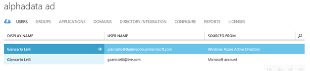

图 14:我们的 Azure 广告中的用户

|  | 注:出于测试目的，我们 Office 365 订阅的域名与我们公司的名称不匹配；在真实场景中，它们应该匹配以避免混淆。但是，这种差异加剧了不同公司资源拥有多组凭据的问题。在这种情况下，我们的场景可以描述如下:一个本地活动目录用作本地资源的帐户管理器，加上一个连接到用于在线资源的 Office 365 订阅的 Azure AD。我们的目标是同步或合并这两个环境。 |

### 在 Azure AD 中创建新的测试用户

在我们继续集成之前，让我们看看如何通过门户在我们的 Azure 广告中创建一个新用户。该用户将在以后的配置过程中使用。如图 15 所示，我们有三个不同的选项来创建用户。我们可以使用现有的微软帐户创建一个，添加一个已经是另一个 AD 命名空间一部分的用户，或者从头开始创建一个。我们现在将从头开始创建一个新用户，并授予他全局管理员权限。


图 15:用户的来源或类型

创建一个用户是一个简单的操作——我们所要做的就是按照向导的指示，如下图所示。首先我们点击屏幕下方的**添加用户**；这将会出现一个弹出窗口，要求我们填写一个表格(分多个步骤),指定新用户的所有基本信息。图 16 和 17 显示了我是如何填写表单以创建全局管理员用户的。


图 16:给我们的用户一个组织电子邮件地址

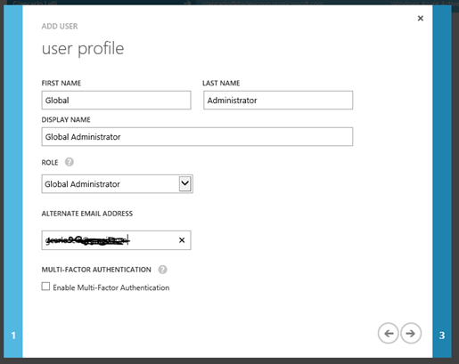

图 17:关于用户的一些一般信息

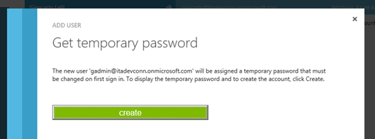

图 18: Azure 使用临时密码创建用户

现在我们的用户已经创建，我们可以继续下一步，将我们的内部广告与这个新的 Azure 活动目录集成在一起。

|  | 提示:请确保至少与该新用户登录一次。这将为我们的用户提供一个有效的最终密码。 |

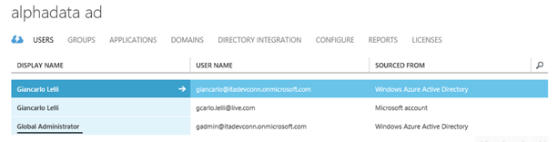

图 19:用户创建的

为了验证该操作的成功，我们可以简单地从我们的 Office 365 管理门户登录来查看整个可用用户集。

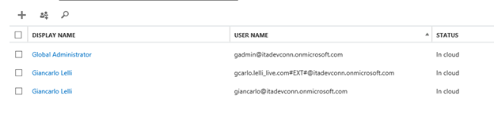

图 20:我们的新用户也可以在 Office 365 环境中使用

### 在 Azure AD 中集成我们的内部活动目录用户

正如我们之前所说，我们的 Azure AD 的目标是在我们的内部 AD 之间建立某种桥梁，让我们的员工或用户有机会在我们公司的网络应用程序中利用单点登录功能和优势。在本书的后面，我们还将看到这种集成如何有助于保护网络应用编程接口端点。

现在让我们进入 Azure AD 管理门户内的**目录集成**选项卡。首先要做的是将目录集成开关从**停用**改为**激活**，然后选择**保存**。

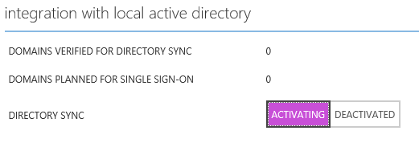

图 21:激活目录同步功能的开关

|  | 注意:确保阅读并记住单击保存时 Azure 显示的警告提示。 |

一旦操作完成，我们应该会看到类似于图 22 的屏幕。现在我们准备下载**目录同步工具**并在我们的内部 ad 服务器上运行。


图 22:目录同步功能处于活动状态

编写时，目录同步工具可用[此处为](https://go.microsoft.com/fwLink/?LinkID=278924)，需要。NET Framework 3.5 和 4.5 安装在您的服务器上。如果您使用的是 Windows Server 2012 或更高版本，则需要手动安装 3.5 版，因为默认情况下不会安装。一旦完成安装，大约需要 10 分钟。我们现在准备进行集成。

|  | 提示:在继续此操作之前，请重新启动电脑；我经历过很多配置不重启就失败的情况。 |

第一步需要我们在我们的在线租户中输入一个全局管理员帐户的凭据。


图 23:插入我们之前创建的用户的凭证

一旦工具接受了我们的凭据，系统会提示我们输入另一组凭据，这一次是我们的内部活动目录租户。

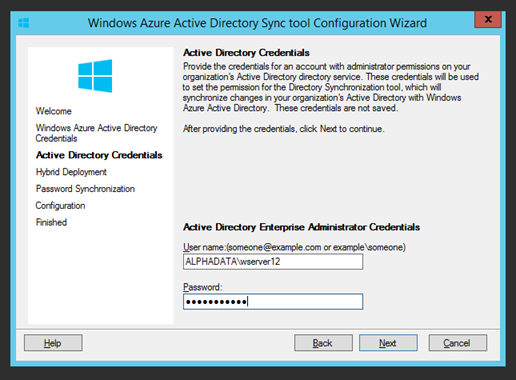

图 24:我们输入具有管理员权限的本地用户的凭据

实际同步过程开始前的最后两个步骤是选择是否启用混合部署和密码同步功能。混合部署功能允许我们的 Azure 广告将数据写回我们的内部广告。基本上，这一步将本地租户内部的写访问权限授予了云租户。混合部署不会在我们的广告中创建新对象，而只会修改那些已经存在的对象。

在我们的案例中，我们选择启用混合部署功能。

启用/放弃**混合部署**功能后，系统会提示我们选择是否启用**密码同步**。从名称可以清楚地理解，该功能将允许用户使用访问其内部资源时使用的相同用户名/密码集访问所有微软在线服务。我们选择启用密码同步，因为我们希望将可能的密码更改传播到我们的云广告。

|  | 注:如果您想了解更多关于混合部署的信息，请参考此链接:[http://technet.microsoft.com/en-us/library/hh967642.aspx](http://technet.microsoft.com/en-us/library/hh967642.aspx) |


图 25:混合部署屏幕


图 26:启用密码同步

完成这些步骤后，同步工具将开始配置过程。大约需要十分钟。之后我们只需点击**完成**就可以强制第一次同步过程。


图 27:向导完成后立即运行第一次同步

这个过程开始后，可能需要 3 个小时；完成后，我们的 Azure AD 目录中的用户列表应该如图 28 所示。

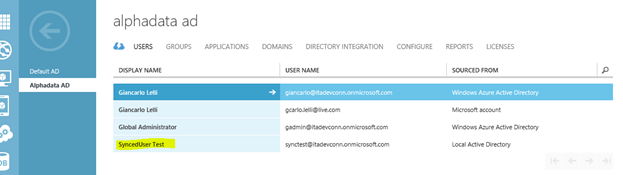

图 28:目录已经成功同步了我们的用户

这是我们内部活动目录中可用的用户列表。


图 29:用户即使在本地环境中也存在的证明

最后，我们的 Office 365 租户中的用户列表如下。

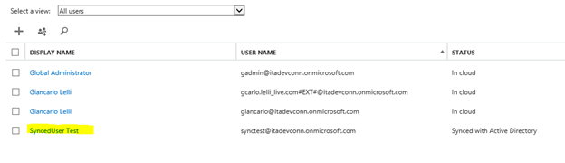

图 30:它也存在于我们的 Office 365 租户中

### 关于同步的重要注意事项

为了在向本地活动目录添加新用户时实现同步，我们必须调整我们的租户，并在受支持的 upn 列表中添加名称“**itadevconn.onmicrosoft.com**”原因是目录同步将只同步在您的 Windows Azure 活动目录上作为已验证域可用的 DNS 后缀。当我们查看验证过程时，它向我们显示，无论是使用 TXT 还是 MX，我们都需要向该域的公共可用 DNS 添加一条记录。在我们的场景中，我们使用的是不可公开路由的域名后缀，如“ **alphadata.adds** ，这是一个问题。最简单的解决方案是在您的活动目录上注册一个或多个新的 UPN 后缀。这可以通过**服务器管理器** > **工具** > **活动目录域和信任来完成。**


图 31:单击活动目录域和信任”

右键单击**活动目录域和信任**，选择**属性**。现在在文本框中输入我们的 Azure AD 使用的 UPN 后缀，然后点击**添加**。

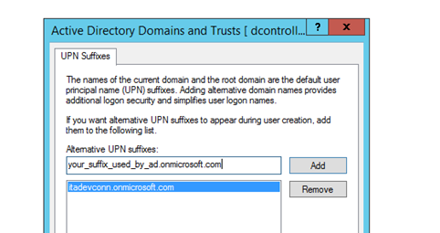

图 32:添加一个新的 UPN 前缀

现在我们已经做到了这一点，当我们试图创建一个新用户时，我们将有能力选择一个不同的后缀。但是，如果我们现在在 Azure 上的同步过程中选择旧的，它将被新的替换。

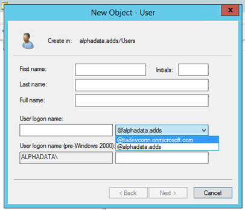

图 33:当创建一个新的用户对象时，新的前缀现在是可用的

|  | 注意:如果要测试此功能，可以创建一个测试用户(使用新的或旧的 UPN 后缀)，然后通过在 PowerShell 控制台中键入以下命令手动启动同步过程:

*   导入-模块目录同步
*   开始-在线共存同步-完全同步

现在前提和云 AD 都和谐了；我们现在可以开始构建利用单点登录功能的网络应用程序。 |

## 在网络应用中利用单点登录功能

在这本书的这一部分，我们将看到创建一个利用单点登录功能的网络应用程序是多么容易。此外，我们将看到如何通过使网络应用编程接口端点仅可由我们公司的员工(广告用户)访问来保护它。所有这些操作都需要一个初始配置过程，但是 Visual Studio(2013 版及更高版本)负责所有的低级工作。

### 一个针对我们的广告进行认证的 MVC 应用

我们将创建一个支持单点登录的基本 ASP.NET MVC 5 应用程序。为此，打开 Visual Studio(我的情况是专业版 2014 CTP2)，点击**文件**、**新项目**，然后选择**ASP.NET Web 应用；**此时，该弹出窗口应出现:

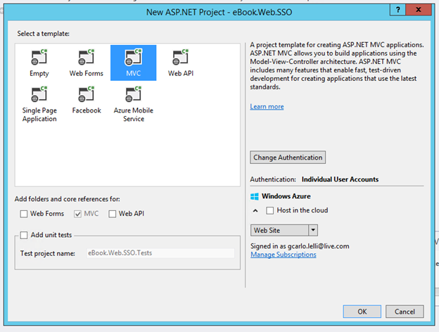

图 34:选择一个 MVC 项目模板

当然，我们现在选择 MVC 模板，但是在单击 ok 之前，有几件事值得强调。首先是能够(由最新版本的 Azure SDK 提供)在 Azure 网站上的云中托管我们的项目，其次是能够更改身份验证的类型；这是我们现在应该关注的地方。点击**更改认证**。该弹出窗口应该出现:


图 35:三种不同类型的访问级别

点击标有**组织账户**的单选按钮，用与我们的 Azure AD 相关联的域填充**域**字段。出于测试的目的，我使用了 Azure 给我的默认域，但是在实际场景中，您也可以使用自己的自定义域。

谈论**访问级别**，我们有三种不同的可能性。我们应该选择最适合我们需要的。然而，这些建议可能会帮助你做出这个决定。

*   **单点登录**选项:您的应用程序将能够使用您的 AD 凭据登录，使您能够访问关于用户的非常有限的一组信息，例如名字、姓氏和全名。如果您试图联系您的广告进行查询，应用程序将收到的令牌将无效(您的应用程序将被拒绝)。
*   **单点登录，读取目录数据**选项:您将能够登录，您的应用程序将获得的令牌将对查询目录有效。
*   **单点登录，读写目录数据**选项:你可以完全控制你的活动目录。

读取和写入操作都是通过图形应用编程接口完成的，这是一个基于 REST 的编程接口，旨在让任何具有 HTTP 栈的平台上的应用程序获得对目录的委托访问。

关于第一个“组合框”，它让我们选择我们要瞄准的广告类型和我们要瞄准的组织数量，这个决定相当容易。

*   **云—单一组织:**只有贵公司的员工才会使用您正在开发的应用程序。
*   **云—多组织:**您正在开发一个 SaaS(软件即服务)平台，并计划将其销售给各种客户，每个客户都有自己的 AD/域。
*   **前提:**你的公司“内部”有一个 AD 租户，负责处理登录流程；在这种情况下，您只需要指定元数据文档的 URL。


图 36:我们的 web 应用程序的不同场景

**更多选项**选择是我们可以忽略的，因为它由 Visual Studio 自动生成的一组参数组成；然而，为了完整起见，我们也将简要地讨论它们。

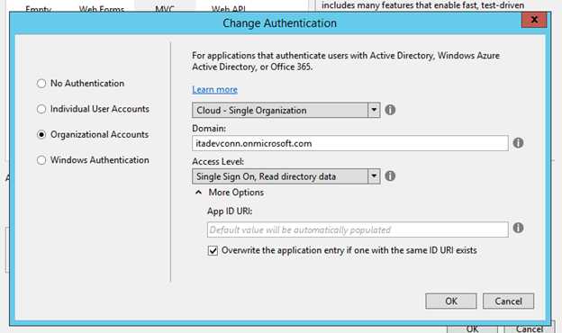

图 37:更多选项菜单

**应用程序 ID URI** 是一个唯一的标识符，它在允许连接/认证/查询我们的 AD 的所有可信应用程序列表中区分了我们的应用程序。此值由 Visual Studio 自动生成，如果发生复制，旧条目将被更新的条目覆盖(您可以通过图片中的复选框进行预测)。

您可能会想，组织帐户和 Windows 身份验证有什么区别？它存在于我们正在开发的应用程序中。支持 windows 身份验证的 web 应用程序将通过我们的内部网托管和提供；因此，它将使用 NTLM 作为身份验证协议，而不是我们在案例中使用的 WS-Federation。

我们现在准备创建我们的项目。在我们的案例中，我们选择了一个具有**单点登录和读取目录数据权限**的**单一组织**。我们一点击，就会出现一个对话框要求我们登录；这个对话框正在接触我们的 Azure AD，以便获得一个令牌，在我们的 Azure AD 的白名单应用程序列表中写入一个条目。我们现在登录到一个全局管理员。

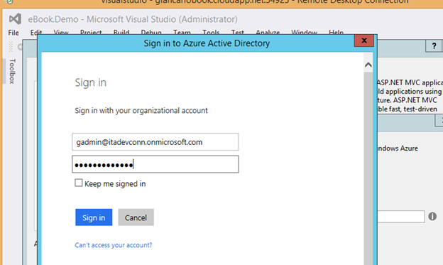

图 38:登录以验证应用程序

一旦该过程结束，我们现在应该看到我们的应用程序是可信的:


图 39:成功认证

点击**确定**，Visual Studio 将开始创建我们的项目。让我们花点时间分析一下我们的 **Web.config** 文件的变化。我们注意到的第一件事是，Visual Studio 在项目设置期间向我们的配置文件添加了一些键和值。

```cs
            <appSettings>
              <add key="ida:FederationMetadataLocation" value="https://login.windows.net/itadevconn.onmicrosoft.com/FederationMetadata/2007-06/FederationMetadata.xml" />
              <add key="ida:Realm" value="https://itadevconn.onmicrosoft.com/eBook.Web.SSO" />
              <add key="ida:AudienceUri" value="https://itadevconn.onmicrosoft.com/eBook.Web.SSO" />
              <add key="ida:ClientID" value="9797a190-91ca-4dde-b430-509c20549154" />
              <add key="ida:Password" value="Nu0CLukD1xHTgxfpvjBfoyMi6n7H5UECVD33Ef9QU5w=" />
            </appSettings>

```

正如我们所看到的，这些值代表了 Azure AD 在用户登录过程中用来识别我们的应用程序的标识符。

如果我们滚动到文件的末尾，我们还会看到一些其他的变化，这些变化代表了我们在身份验证过程中传递给 WS-Federation 协议的参数。

```cs
            <system.identityModel.services>
              <federationConfiguration>
                <cookieHandler requireSsl="true" />
                <wsFederation passiveRedirectEnabled="true"
                              issuer="https://login.windows.net/itadevconn.onmicrosoft.com/wsfed"
                              realm="https://itadevconn.onmicrosoft.com/eBook.Web.SSO"
                              requireHttps="true" />
              </federationConfiguration>
            </system.identityModel.services>

```

这基本上是客户端发生的所有事情。然而，这个配置过程的服务器端原因是什么(在我们的 Azure AD 设置中)？让我们来看看:如果我们导航到 Azure 管理门户，然后进入我们的 Azure AD (AlphaData AD)应用程序选项卡，我们应该会看到如下内容:

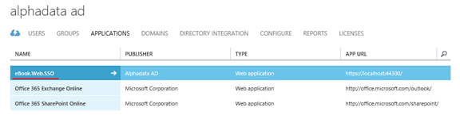

图 40:我们的 Azure AD 提供的可信应用列表

列出了我们的应用程序(仍在开发中)。Azure 管理门户让我们能够通过点击页面底部的**添加**按钮，在该列表中手动创建一个条目。但是，只有当您计划“信任”一个您不拥有的或正在用不同的 IDE 开发的应用程序时，才需要这样做。否则，您只需要给它一个应用程序标识并指定它的端点。如果我们浏览这个应用程序的细节，我们可以看到更多关于我们的应用程序的设置和信息。

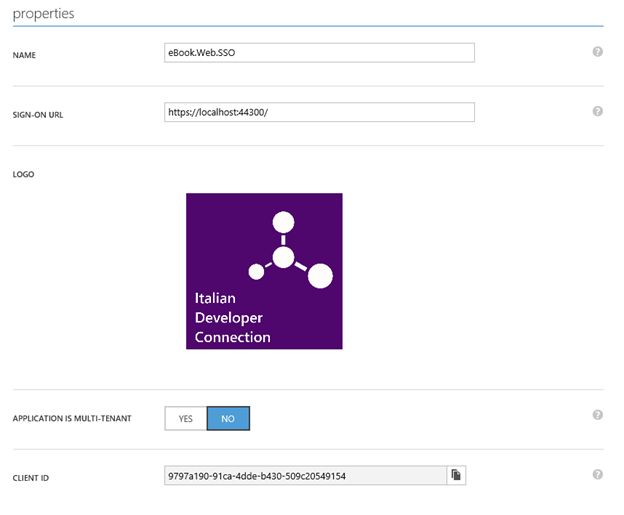

图 41:配置页面

进入**配置**选项卡，我们有各种子部分。**属性**部分报告了由 Visual Studio 自动填充并存储在 web.config 文件中的所有字段。本页面所有其他信息都是关于单点登录参数的，如**回复网址**，用于在登录过程完成后重定向用户；然后，我们简要回顾一下应用程序权限以及应用程序密钥。然而，正如我前面所说的，Visual Studio 负责整个配置，因此我们不需要深入细节。

既然我们已经描述了应用程序的客户端和服务器端，如果我们在本地运行，一旦 IIS 准备好了，那么我们应该被要求使用我们公司的凭据登录。在一点魔法之后(我们的应用程序延伸到我们的 Azure AD)，我们可以在下图中看到，我们应该以公司用户的身份登录:


图 42:这就是魔法发生的地方

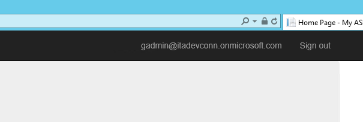

图 43:我们登录了

但是，该用户并未真正与我们的内部 AD 同步，因此我们现在将尝试使用已同步的用户登录，例如**同步用户测试**。


图 44:我们使用同步帐户成功登录

就这样，我们现在已经成功地在我们的 MVC 应用程序中实现了单点登录。让我们进入默认用户配置文件页面，看看目前有哪些信息。

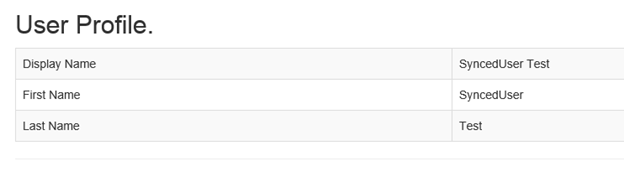

图 45:关于我们用户的一些基本信息

组织登录的默认 MVC 模板提供了现成可用信息的快速浏览；在这种情况下(以及在每个新项目中)，我们能够看到显示、名字和姓氏。但是，如果我们查看查询 AD 后可用的 JSON，我们会看到我们只显示了这些信息，因为这些是唯一被正确反序列化的字段。您可以在图 46 中找到完整的 JSON:


图 Azure 图对 JSON 的响应

那是一个巨大的数据量，不是吗？在本书的后面，我们将详细介绍这种对广告的查询是如何实现的，以及 Visual Studio 提供了哪些工具支持。

### 构建安全的网络应用编程接口端点

如今，以 RESTful 方式公开数据变得越来越方便，因为它允许每个支持或拥有 HTTP 栈的设备与我们的 web 端点进行对话并使用我们的数据。但是，向客户公开提供公司敏感信息的 web 端点，而不设计某种安全级别来阻止未经授权的客户，可能会导致一些严重的安全问题。在本书的这一部分中，我们将构建一个基本的 ASP.NET 网络应用编程接口项目，该项目使用我们在云上的组织目录作为安全层，以便只允许经过身份验证的客户端使用我们的服务。

随着 Visual Studio 2013 的发布，您可以将这一切抛在脑后。这个版本从微软开放网络接口引入了创新的 ASP.NET 工具和安全中间件。NET (OWIN)组件，使保护您的网络应用编程接口变得简单。新的 ASP.NET 工具和模板允许您配置一个网络应用编程接口项目，将身份验证直接外包给 Windows Azure 活动目录(AD)，在本地项目和 Windows Azure AD 中的相应条目中发出必要的代码。

构建一个安全的网络应用编程接口端点非常容易；事实上，我们所要做的就是重复我们在谈论一个普通的 MVC 应用程序时所做的几乎每一步。然而，在这种情况下，有一点不同。首先我们选择网络应用编程接口作为项目类型:


图 47:选择网络应用编程接口模板

将身份验证类型更改为**组织帐户**，并为您的案例选择最佳选项。和以前一样，我选择了**单一组织**和**单一登录，读取目录数据**。

|  | 注意:在撰写本文时，Web API 项目模板尚不支持多租户授权。 |

完成初步步骤后，您可以通过在 Azure 门户中检查您新创建的网络应用程序是否列在**应用程序**选项卡中来进行验证。


图 48:新的网络应用程序现在被我们的广告所信任

我们现在有了一个完全配置和安全的网络应用编程接口端点；让我们仔细看看 Visual Studio 中的项目。如果打开文件 *Startup.cs，*会看到一个叫*ConfigureAuth(iapbuilder)*的方法；该方法在*启动文件中定义。Auth.cs* ，包含在 *App_Start* 文件夹中。让我们分析一下这个方法的实现。

```cs
          public void ConfigureAuth(IAppBuilder app)
          {
              app.UseWindowsAzureActiveDirectoryBearerAuthentication(
                  new WindowsAzureActiveDirectoryBearerAuthenticationOptions
                  {
                      Audience = ConfigurationManager.AppSettings["ida:Audience"],
                      Tenant = ConfigurationManager.AppSettings["ida:Tenant"]
                  });
          }

```

**应用。使用*** 命名约定建议该方法向 OWIN 管道添加中间件实现。在这种情况下，添加的中间件检查传入的请求，以查看 HTTP 头授权是否包含安全令牌。如果它找到一个令牌，它将通过许多标准检查进行验证。如果令牌看起来不错，中间件将其内容投影到主体中，将主体分配给当前用户，并将控制权让给管道中的下一个元素。如果令牌没有通过检查，中间件会发回适当的错误代码。如果没有令牌，中间件只是让调用通过，而不创建主体。

传递给中间件的单个参数**windowsazureativedirectorybearerauthenticationoptions**提供了确定令牌有效性的设置。它在项目创建期间捕获原始值，并将它们存储在**网络配置**文件中。**受众值**是 Windows Azure AD 知道网络 API 的标识符。任何携带不同受众的令牌都是为了另一种资源，应该被拒绝。租户属性表示用于外包身份验证的 Windows Azure AD 租户。中间件使用这些信息来访问租户，并读取决定令牌有效性的所有其他属性，例如应该使用哪个密钥来验证令牌的签名。

这几行自动生成的代码是用 Windows Azure AD 验证调用方所需的全部内容。默认情况下，**值**控制器用**【授权】**属性修饰；它在请求中将需要一个**授权**头，否则它将返回一个错误。

```cs
          [Authorize]
          public class ValuesController : ApiController
          {
              // GET api/values
              public string Get()
              {
                  return "Greetings from a secure Web API";
              }

              // GET api/values/5
              public string Get(int id)
              {
                  return "value";
              }
          }

```

我们唯一要做的就是测试我们的网络应用编程接口，以确保它是安全的；为此，我们需要创建一个本地应用程序。

#### 向 Azure 活动目录添加本机应用程序

为了测试我们的网络应用编程接口，我们需要一个客户端向我们的端点发出请求；在这种情况下，一个 WinForms 应用程序可以正常工作。让我们在阿尔法数据广告中添加本机应用程序。

首先要做的是登录 Azure 管理门户，然后一路向下导航到 AlphaData AD 的**应用**选项卡。之后，点击页面底部栏中的**添加**，然后选择**添加一个我的机构正在开发的 app**；之后，您应该会看到一个如图 49 所示的对话框:


图 49:我们的原生应用程序的名称

继续第二步，用你喜欢的网址填充文本框；如果是假的网址也没关系。由于它是一个本机应用程序，这个网址将仅作为警告，通知我们的本机应用程序关闭出现的登录对话框(该对话框看起来像一个 IE 窗口)。点击**完成**，现在我们在应用列表中有了一个新条目。

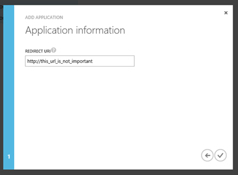

图 50:一个假的回调网址

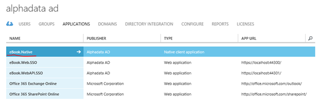

图 51:我们的原生应用程序被创建

#### 向我们的本地应用程序公开网络应用编程接口

不幸的是，我们的本地应用程序还没有准备好与我们的网络应用编程接口进行通信，因为我们还没有授予这样做的任何权限。通过配置应用程序清单，可以使用您的网络应用编程接口，应用程序清单是一个表示应用程序身份配置的 JSON 文件。您可以通过在 Azure 管理门户中导航到您的应用程序并单击命令栏上的**应用程序清单**按钮来公开您的权限范围。下载清单文件后，打开它并用以下 JSON 片段替换**应用权限**节点。这个片段只是一个例子；确保您为自己的应用程序更改了文本和值。完成后，将编辑后的清单上传到 Azure。

|  | 注意:“权限标识”值必须是通过使用 GUID 生成工具或以编程方式创建的新生成的 GUID。它表示由网络应用编程接口公开的权限的唯一标识符。一旦您的客户端被适当地配置为请求访问您的网络应用编程接口并调用网络应用编程接口，它将呈现一个 OAuth 2.0 JWT 令牌，其范围声明被设置为上面的“声明值”，在本例中为“用户模拟”您可以在以后根据需要公开其他权限范围。 |

```cs
          "appPermissions": [
          {
              "claimValue": "user_impersonation",
              "description": "Access company's Web API endpoints on user's behalf",
              "directAccessGrantTypes": [],
              "displayName": "Grant access to our Web API endpoint",
              "impersonationAccessGrantTypes": [
              {
                  "impersonated": "User",
                  "impersonator": "Application"
              }
              ],
              "isDisabled": false,
              "origin": "Application",
              "permissionId": "b69ee3c9-c40d-4f2a-ac80-961cd1534e40",
              "resourceScopeType": "Personal",
              "userConsentDescription": "Allow the application full access company's Web API",
              "userConsentDisplayName": "Grant access to our Web API endpoint"}]

```

现在，我们的本机应用程序“看到”了我们的网络应用程序接口应用程序，并且可以添加所需的权限。

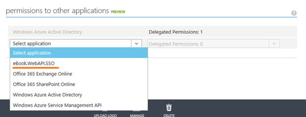

图 52:向我们的原生应用程序添加权限。

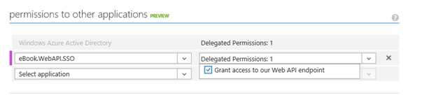

图 53:添加权限

我们现在可以看到一些代码了。在本书的下一部分，我们不仅将看到我们是否设法保护了我们的网络应用编程接口，而且我们还将介绍**活动目录身份验证库** (ADAL)，该库之前在 MVC 应用程序中查询了我们的租户。

## ADAL 简介(活动目录认证库)

|  | 提示:以下代码示例将要求您在 Windows 桌面项目中安装以下 NuGet 包:Microsoft HTTP 客户端库和 Active Directory 身份验证库(ADAL)。 |

MSDN 对 ADAL 的定义如下:

"的 Azure 活动目录身份验证库(ADAL)。NET 使客户端应用程序开发人员能够轻松地向云或内部活动目录(AD)验证用户，然后获取访问令牌来保护 API 调用。ADAL。NET 目前支持三种授权:Azure AD、Windows Server 2012 R2 版的 Windows Server 活动目录联合服务(ADFS)和 Azure 访问控制服务(ACS)。通过处理大部分复杂性，ADAL 可以帮助开发人员专注于应用程序中的业务逻辑，并轻松保护资源，而无需成为安全专家。”

ADAL。NET 提供了以下功能:

*   **令牌获取** : ADAL 为。NET 通过使用各种身份提供程序、协议和凭据类型，简化了从 Azure AD、适用于 r 2 的 Windows Server 2012 的 Windows Server ADFS 和 Azure ACS 获取令牌的过程。ADAL 只需几行代码就可以管理整个令牌获取过程，包括身份验证用户体验。或者，您可以提供代表您的用户或应用程序的原始凭据，ADAL 将设法为您获取令牌。
*   **持久令牌缓存** : ADAL 为。NET 默认情况下将所有访问令牌存储在持久令牌缓存中，但是您也可以编写自己的缓存实现或完全禁用它。
*   **自动令牌刷新**:除了持久令牌缓存外，ADAL 还支持令牌过期时自动刷新。ADAL 将查询令牌缓存以检查令牌是否已过期，然后尝试使用存储的凭据获取新令牌。

不知不觉中，我们已经使用了 ADAL；它作为一个 NuGet 包安装在每个使用组织帐户的 ASP.NET MVC/Web API 项目中。下面列出了在 MVC 应用程序中实现用户魔法的代码:

```cs
          [Authorize]
          public async Task<ActionResult> UserProfile()
          {
              string tenantId = ClaimsPrincipal.Current.FindFirst(TenantIdClaimType).Value;

              // Get a token for calling the Windows Azure Active Directory Graph
              AuthenticationContext authContext = new AuthenticationContext(String.Format(CultureInfo.InvariantCulture, LoginUrl, tenantId));
              ClientCredential credential = new ClientCredential(AppPrincipalId, AppKey);
              AuthenticationResult assertionCredential = authContext.AcquireToken(GraphUrl, credential);
              string authHeader = assertionCredential.CreateAuthorizationHeader();
              string requestUrl = String.Format(
                  CultureInfo.InvariantCulture,
                  GraphUserUrl,
                  HttpUtility.UrlEncode(tenantId),
                  HttpUtility.UrlEncode(User.Identity.Name));

              HttpClient client = new HttpClient();
              HttpRequestMessage request = new HttpRequestMessage(HttpMethod.Get, requestUrl);
              request.Headers.TryAddWithoutValidation("Authorization", authHeader);
              HttpResponseMessage response = await client.SendAsync(request);
              string responseString = await response.Content.ReadAsStringAsync();
              UserProfile profile = JsonConvert.DeserializeObject<UserProfile>(responseString);

              return View(profile);
          }

```

这段代码所做的事情很容易理解，但是首先让我们看看文件顶部声明的所有变量的列表，如下所示(否则理解这段代码就不会这么简单了)。

```cs
          private const string TenantIdClaimType = "http://schemas.microsoft.com/identity/claims/tenantid";
          private const string LoginUrl = "https://login.windows.net/{0}";
          private const string GraphUrl = "https://graph.windows.net";
          private const string GraphUserUrl = "https://graph.windows.net/{0}/users/{1}?api-version=2013-04-05";
          private static readonly string AppPrincipalId = ConfigurationManager.AppSettings["ida:ClientID"];
          private static readonly string AppKey = ConfigurationManager.AppSettings["ida:Password"];

```

第一行代码获取我们的租户标识，它由我们的广告中唯一的标识符组成，形式为 GUID 字符串。然后我们构建**身份验证上下文**，它将包含我们想要用来进行身份验证的资源的地址。然后构建**客户端凭证**对象；我们将使用它为我们的应用程序赋予一个“身份”，以便 AD 可以识别它。用。AcquireToken()方法我们为 Graph API 获取了一个 OAuth 令牌，我们将使用这个图来获取一个用户的实际信息。剩下的几行代码非常简单明了:它们创建了一个字符串，代表我们要“查询”的 web 资源的完整地址。当然，在发出实际请求之前，我们需要附加请求对象(系统的一个实例。Net.HttpClient)，**授权**头，带有适当的 OAuth 2.0 授权头。最后，我们执行请求并反序列化 Azure Graph 返回的 JSON。

|  | 注:如果您想了解更多关于 Azure Graph API 的信息，请参考以下网址:[http://msdn.microsoft.com/en-us/library/azure/hh974476.aspx](http://msdn.microsoft.com/en-us/library/azure/hh974476.aspx) |

既然我们已经讨论了之前在我们的 MVC 应用程序中发生的事情，那么让我们来谈谈我们的原生应用程序。这是将为我们施展所有魔法的代码。

```cs
          private async void DoTheMagic(object sender, EventArgs e)
          {
              // Get token
              AuthenticationContext ac = new AuthenticationContext("https://login.windows.net/itadevconn.onmicrosoft.com");
              AuthenticationResult ar  =  ac.AcquireToken("https://itadevconn.onmicrosoft.com/eBook.WebAPI.SSO",
                          "5913d32b-1865-4d6f-8452-695dac3119d6",
                          new Uri("http://this_url_is_not_important"));

              // Call Web API
              string authHeader = ar.CreateAuthorizationHeader();
              HttpClient client = new HttpClient();
              HttpRequestMessage request = new HttpRequestMessage(HttpMethod.Get, "https://localhost:44301/api/Values");
              request.Headers.TryAddWithoutValidation("Authorization", authHeader);
              HttpResponseMessage response = await client.SendAsync(request);
              string responseString = await response.Content.ReadAsStringAsync();
              MessageBox.Show(responseString);
          }

```

第一行初始化一个新的**身份验证上下文**。在应用程序的代码中，一个**身份验证上下文**实例代表工作的权限。在这种情况下，授权方是我们的 Windows Azure AD 租户，由 URI“**https://log in . Windows . net/【my domain】**代表。

第二行向**认证上下文**请求令牌。有许多方法可以创建令牌请求——每个场景和应用程序类型都需要不同的参数。在这种情况下，我们希望指定我想要令牌的资源是我的网络应用编程接口。然后传递它的 Windows Azure AD 条目的标识符。这与网络应用编程接口项目中的受众使用的值相同。然后，因为是本地客户端请求令牌，我们需要传递客户端 ID，并从我在浏览器中打开的应用程序配置页面重定向我的客户端的 URI。这就是我们获得代币所需要做的。代码的其余部分根据 OAuth 2.0 规范将该令牌放在正确的 HTTP 头中，并执行实际的调用。

如果我们运行这段代码并调用 **DoTheMagic** 方法(在我的例子中，当我点击一个按钮时，它被调用)，将出现一个对话框，要求我们用我们的组织帐户登录。登录后，如果您正确设置了所有权限，这就是您应该看到的。图 54 显示了一个成功的请求，图 55 显示了一个被拒绝的请求。

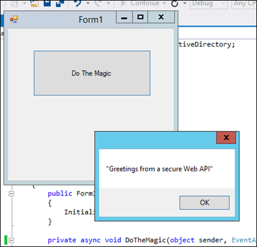

图 54:授权请求


图 55:未经授权的请求

未授权的案例可以通过注释我们添加“**授权**”标题的行来测试: