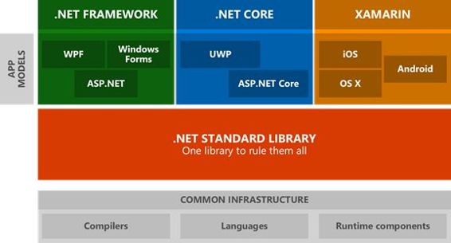
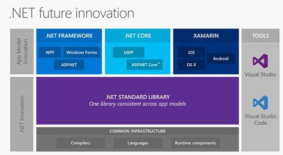

# 零、前言

在深入挖掘这本书的内容之前，我认为我们应该首先分析为什么在这个时间点上，这样的书被认为是有用和需要的。起初，这可能听起来像是一个自命不凡的目标，但在这本电子书的过程中，以及在这一介绍性章节的大部分时间里，我们会明白，在一天结束时，它是相当清楚的，而且不知何故是显而易见的。

我相信技术的目的是帮助个人实现他们的目标，不管他们是否有意识地使用它。我的工作，也可能是你的工作，因为你正在阅读这篇文章，是关于利用技术来构建最终将赋予某人权力的东西。随着移动技术、平台和设备的不可阻挡的增长，我们每天都在见证这一势头。设备发布后，它们的计算能力每年都在增长(如果不是每六个月一次的话)，我们，首先作为消费者，然后作为开发人员，面临着选择构建什么、如何构建以及为谁构建的永无止境的挑战。我认为，这其中最敏感的一点是，这三种选择中的任何一种都不可避免地要付出代价……而很多时候，我们都是用最宝贵的货币——时间来支付的。既然时间是有限的资源，没有办法赚取时间，我们一定不要浪费它。换句话说，这是一种更具技术性的方式，我们必须以最好的方式评估我们以前的投资。

然而，直到最近几天，这并不是一项容易的任务。让我们分析一下过去会发生什么，以及我们作为微软开发人员习惯面对什么。第一部上映已经 12 年了。NET 框架，我们已经习惯了。NET，适合不同的平台。从。NET Compact Framework 到 Silverlight、Windows Phone 和 Windows Store 应用程序，每次微软都拿。NET 到一个新的平台，所谓的“公共”语言运行时已经以一个不同的子集结束。每一次，都有不同的运行时、框架和应用程序模型，每一层都有不同的开发，API 可以追溯到公共代码库，但并不总是通用的。回想当年，微软无休止地试图让我们安心，谈论共同的技能和重用我们已经知道的东西，但现实是一个:碎片化(和许多令人头痛的问题)。

微软试图通过引入可移植类库、共享项目以及最终的通用应用程序来解决这个问题。前两种方法的核心概念是契约的思想，或者换句话说，是一种抽象应用编程接口的方式，这样您就可以像对每个平台一样使用它们。这些方法最终成为现代应用程序开发中事实上的标准，一旦 Xamarin 出现，它允许我们在其他平台上重用我们的代码，比如 iOS、安卓和 Mac OS X。这是对跨平台. NET 的一种瞥。不幸的是，在每种情况下，这些 API 的实现都是不同的。在这一点上，你可能认为我们困境的解决方案已经接近，但不幸的是，它不是……或者至少不是一个完整的解决方案。可移植类库设法拉近了平台之间的距离，但是却无法实现。NET 框架更加模块化。

另一个关键点是框架不同版本之间的向后兼容性，即使是在同一个平台上。比方说，给一个方法添加一个接口或者一个重载不仅仅是写几行代码和发布一个新版本的框架。更重要的是要确保这一改变不会给现有的应用程序带来任何麻烦。不用说，这种恐惧足以冻结任何新功能的设计。

为了找到克服这些限制(模块化和向后兼容性)的方法，微软开始将。NET 框架作为 NuGet(不可变集合库)上的独立包，允许人们使用它并提供反馈。这最终获得了巨大的成功；一旦 API 达到最终版本，它最终会有一个更好的设计。由于 NuGet 向后兼容，它是开箱即用的，因为 NuGet 允许您安装每个包的特定版本。

然而，如何所有这些考虑适合这本书的领域，或者更具体地说，在。NET Core？我们将在接下来的章节中看到。NET Core 是一个新微软的产品，一个拥抱开放并把美国开发者或客户放在首位的微软。那么，为什么我相信所有这些考虑会导致一个明显的答案呢？答案很简单，我相信这取决于什么应该被认为是的定义。NET Core:的云优化、跨平台和开源端口。NET Framework…基本上是一个所谓的现代框架在 2016 年应该是什么样子。

多亏了前一章的序言，我们可能已经意识到为什么了。需要网络核心，以及如何需要。NET Core 位于更大的范围内。二话没说，我们现在准备谈谈。NET 核心。

图 1:2016.NET 全景

如图 1 所示。NET panorama 拥有丰富的应用模型，这些模型聚集在一个特定的技术堆栈中。不考虑 Xamarin(它本身需要另一本书)，我们只剩下两大类:完整的。NET 框架和。NET 核心。

他们都坐在最上面。NET 标准库，并共享一个公共基础设施，该基础设施包括为编译器、语言和运行时组件提供动力的所有技术。ASP.NET 本身就存在于这两个集群中；然而，这两者之间有很大的区别——的版本，或者可能是类型。运行时使用的. NET 框架。

ASP.NET 核心使用跨平台版本的。NET 框架，这是本书的主题，而 ASP.NET 使用了完整的。NET 框架。如果你想了解更多，那么 [StackOverflow](http://stackoverflow.com/a/37684644) 是一个不错的起点。现在让我们分析一下涉及公共基础设施的部分。

的运行时实现。NET Core 被称为 CoreCLR。CoreCLR 是一个独特的术语，它将所有对运行时至关重要的技术组合在一起，例如 RyuJIT。NET 垃圾收集器、本机互操作和许多其他组件。CoreCLR 是跨平台的，有多个操作系统和中央处理器端口正在进行中。既然是开源的，你可以在这里找到官方回购[。](https://github.com/dotnet/coreclr)

我们发现自己处于一个我们可以(实际上)拥有无限计算能力和资源的时代。不久前，内存相对较贵，这在某种程度上是好的，因为 x86 架构正处于黄金时期。然而，随着时间的推移，内存的价格已经下降，允许大多数计算机(近年来，也包括智能手机和物联网板)采用 x64 位架构。由于它的长地址，x64 架构可以索引可能无限量的内存。x64 架构的快速发展在某种程度上是一个优势。不用说，这个微小的细节对。NET 框架。事实上。NET x64 Jitter 最初是为了在服务器进程的长期运行中产生非常高效的代码而设计的。NET x86 JIT 进行了优化，以快速生成代码，从而使程序快速启动。客户机和服务器之间的界限变得有点模糊，JIT 的当前实现需要稍微调整一下。

但是为什么我们需要一个 JIT 编译器呢？为什么它需要高效？我们需要一个 JIT 编译器，因为在我们可以运行任何微软中间语言(MSIL)程序集之前，我们必须首先根据公共语言运行库将其编译为目标机器架构的本机代码。这个编译过程越高效，我们的程序集就越快，越优化。

有了这个想法。NET 代码生成团队真的很努力，最终想出了下一代 x64 编译器，代号为 RyuJIT。

RyuJIT 是. NET 的下一代准时制(JIT)编译器，它采用高性能的 JIT 架构，专注于高吞吐量、JIT 编译。它比过去 10 年使用的现有 JIT64 64 位 JIT(2005 年引入)快得多。. NET 2.0 版本)。32 位和 64 位 JITs 之间的吞吐量总是有很大的差距。RyuJIT 同样集成到。NET 核心作为 64 位 JIT。这种新的 JIT 速度是以前的两倍，这意味着用 RyuJIT 编译的应用程序启动速度提高了 30%。RyuJIT 基于与 x86 JIT 相同的代码库，在未来，它将成为微软所有 JIT 的基础:x86、ARM、MDIL 以及任何其他出现的东西。拥有一个单一的代码库意味着。NET 程序在架构之间更加一致，引入新特性也容易得多。

从一开始，我们就认为编译器是黑盒，只是将代码转换成可以执行的东西的工具链的一部分(希望它能如预期那样工作)。这种描绘编译器的方式在过去很好，但现在已经不适合了。如果您是. NET 开发人员，您可能知道 Visual Studio 的一些功能，如转到定义、智能重命名等。这些都是强大的重构和代码分析工具，每天都在帮助我们提高代码质量。随着这些工具变得越来越智能，它们需要获得越来越多只有编译器才拥有的深层代码知识。

感谢罗斯林(新的代号。NET 编译器平台)，我们可以以“即服务”的方式利用一组能够与编译器直接通信的 API，允许工具和最终用户共享编译器拥有的关于我们代码的丰富信息。向编译器作为平台的过渡极大地降低了创建以代码为中心的工具和应用程序的门槛。

罗斯林由两个主要的 API 层组成:编译器 API 和工作区 API。编译器层包含与编译器管道每个阶段公开的信息相对应的对象模型，包括语法和语义。编译器层还包含编译器单次调用的不可变快照，包括程序集引用、编译器选项和源代码文件。工作区层包含工作区应用编程接口，这是对整个解决方案进行代码分析和重构的起点。该层不依赖于 Visual Studio 组件。事实上，即使是 Visual Studio Code 这种免费且类似 X-Platform Visual Studio 的 IDE，也使用 Roslyn 为 C#开发人员提供了丰富的开发体验。

|  | 注意:如果你想了解更多关于 Visual Studio Code 的知识，可以访问[官方网站](https://code.visualstudio.com/)。也可以从 Syncfusion 的简洁系列下载[关于 Visual Studio Code 的免费电子书](https://www.syncfusion.com/resources/techportal/details/ebooks/Visual_Studio_Code_Succinctly)。 |

。NET Native 是一种预编译技术，用于在 Visual Studio 2015 中构建现代应用程序。那个。NET 原生工具链将把托管的 IL 二进制文件编译成原生二进制文件。每个托管(C#或 VB)的通用 Windows 应用程序都将利用这项新技术。

对于您的应用程序的用户。NET Native 提供了这些优势:

*   快速执行时间
*   持续快速的启动时间
*   部署和更新成本低
*   优化应用程序内存使用

。NET Native 能够将 C++的性能优势带给托管代码开发人员，因为它在幕后使用了与 C++相同或相似的工具。

。NET Core 1.0 是一个新的运行时，它是模块化的，并且丰富了。NET 框架。我们在 Windows 上有一个功能齐全的产品，而在其他平台(Linux 和 OSX)上，仍有一些功能在开发中。。NET Core 1.0 可以分为两个主要部分:一个叫做 CoreFX，它由一小组库组成，另一个叫做 CoreCLR，以及一个小的优化的运行时。

NET Core 是微软公司管理的项目之一。NET Foundation，意味着它是开源的，我们都可以为它做贡献，跟踪它的进展。在本书的后面，我们将深入探讨如果我们想为项目做贡献，我们必须满足的要求。

为了追求模块化，微软选择在 NuGet 上分发 CoreCLR 运行时和 CoreFX 库，将它们分解为单独的 NuGet 包。这些包以它们的名称空间命名，以便于在搜索过程中发现它们。

的主要好处之一。NET Core 是它的可移植性。您可以在应用程序中打包和部署 CoreCLR，消除应用程序对已安装的. NET 版本的依赖。您可以使用不同版本的 CoreCLR 并行托管多个应用程序，并单独升级它们，而不是被迫同时升级所有应用程序。CoreFX 已经被构建为一组组件化的库，每个库都需要最少的库依赖集。这种方法使得 CoreFX 库(只包括您需要的库)在一个应用程序中与 CoreCLR 一起最小化。

|  | 注:。NET Core 不打算小于。NET Framework，但是由于这种以模块为中心的模型，它允许应用程序只依赖于它们需要的库，因此允许更小的内存占用。 |

图 2:总结的图表。净核心

图 2 扩展了我们之前看到的一个，添加了一个列，列出了我们作为开发人员可以使用的工具来使用不同的框架。关于。NET Core，我们可以看到除了 ASP.NET Core 之外，还包括另一个工作负载，通用 Windows 平台。之前我提到过。NET 标准库，但我基本上跳过了对它到底是什么的任何澄清。这是一个很难总结和简化的重要话题。如果您想了解更多信息，请前往 GitHub 上的[官方文档。](https://github.com/dotnet/corefx/blob/master/Documentation/architecture/net-platform-standard.md)

如果你已经读了这么多，而且你和我一样有点偏执，你肯定会想，“完整的会在哪里。NET Framework 在所有这些*NuGet-跨模块的奢华*之后结束了吗？”恐惧 not—the.NET 框架仍然是构建丰富桌面应用程序的首选平台。NET Core 并没有改变这一点。

但是，现在 Visual Studio 2015 已经推出。NET Core 的版本会比完整的框架更快，这意味着有时一些功能只能在上使用。基于核心的平台。完整的框架仍将不断更新，尽可能引入的创新概念和功能。NET 核心。

当然，团队的目标将是最小化两者之间的 API 和行为差异，但也不破坏与现有的兼容性。NET 框架应用程序。也有专门为。NET 框架，比如团队在 [WPF 路线图](http://blogs.msdn.com/b/dotnet/archive/2014/11/12/the-roadmap-for-wpf.aspx)中公布的工作。

对于那些不了解 Mono 的人来说，它本质上是对。NET 框架。因此，它与。NET 框架，但它也有一些共同的问题，特别是围绕实现保理。另一种看待它的方式是。NET Framework 本质上有两个分叉。一个分叉是由微软提供的，并且仅限于 Windows。另一个分叉是 Mono，可以在 Linux 和 Mac 上使用。

在这本书的过程中，Mono 不会被详细讨论，但是只要有可能，我会试着给你指出一些有用的资源，可能会帮助你了解更多。