开始玩之前。NET Core，我们必须安装它。最简单的方法就是访问[https://www.microsoft.com/net/core](https://www.microsoft.com/net/core)下载官方 MSI 安装程序。

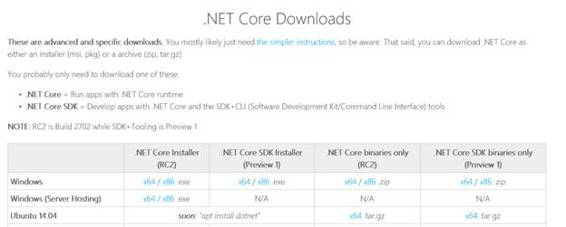

图 3:安装。网络核心-第 1 步

安装过程很简单，一旦完成，我们应该可以启动 PowerShell，键入``dotnet --info`` ，并获得以下输出:

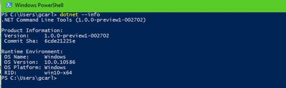

图 4:成功。网络核心安装

命令行界面附带一系列常见命令:

`Common options (passed before the command)`

表 1:命令行界面的常见选项

| `Command Syntax` | `Description` |
| --- | --- |
| -v &#124; -详细 | 启用详细输出 |
| -版本 | 显示。命令行界面版本信息 |

`Common commands`

表 2:命令行界面的常用命令

| 命令语法 | 描述 |
| --- | --- |
| 新的 | 初始化一个基本。NET 项目 |
| 恢复 | 中指定的依赖项。NET 项目 |
| 建设 | 构建一个. NET 项目 |
| 出版 | 发布. NET 项目进行部署(包括运行时) |
| 奔跑 | 编译并立即执行. NET 项目 |
| 试验 | 使用项目中指定的测试运行程序运行单元测试 |
| 包装 | 创建 NuGet 包 |

|  | 提示:[本网站](https://dotnet.github.io/getting-started/)自动检测你的 OS 版本，为你选择合适的设置选项。 |

正如我们在上一段中看到的，由于命令行界面，创建了一个新的。NET Core 应用程序似乎很容易。其实很容易。为了尝试一下并开始玩一会儿。NET Core，让我们打开 PowerShell 或命令提示符，导航到您选择的文件夹。在我的例子中，我只是在我的用户文件夹中创建了一个名为`dotnetcore`的文件夹。

一旦你觉得你准备好了，输入以下命令:`dotnet new`。您应该会收到类似如下的输出。

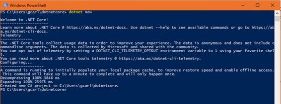

图 5:通过命令行界面成功创建项目

如果这是您第一次运行`dotnet new` 命令，命令行界面将填充您的本地包文件夹，以便恢复 NuGet 包的操作更快。命令行界面还警告您，由于工具仍处于预览状态，因此会收集大量遥测数据。如果你对此不满意，你可以关闭遥测。你可以在[https://aka.ms/dotnet-cli-telemetry](https://aka.ms/dotnet-cli-telemetry)找到更多关于遥测的信息。

这个简单的命令在当前目录中创建了三个文件。如果你碰巧在玩 ASP.NET 核心 1.0，你可能对名为`project.json`的那个很熟悉。如果没有，不要担心——我们现在将解释每一个的目的。

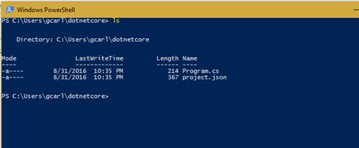

图 6:由新命令创建的文件列表

`Project.json`

Project.json 文件用于每个使用 NuGet 3.0 的项目中，它同时作为 NuGet 和 Visual Studio 的配置文件。在其中，我们可以指定我们的依赖项、引用框架、自定义命令和编译选项。从 Visual Studio 2015 开始，一些项目类型正在利用这项技术，例如:

*   通用视窗平台管理的应用程序(UWP)
*   可移植类库
*   ASP.NET 核心应用

关于这个文件的更多信息可以在官方的 [NuGet 文档](http://docs.nuget.org/consume/ProjectJson-Intro)或[ASP.NET 核心 1.0 文档](https://github.com/aspnet/Home/wiki/Project.json-file)中找到(可在 GitHub 上获得)。下面是。NET 命令行界面:

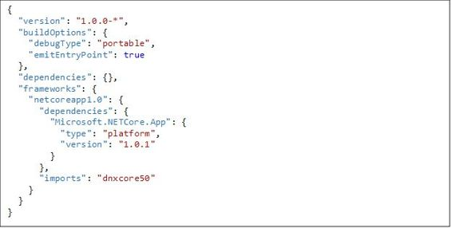

如您所见，我们正在针对。NET 核心框架(由 TFM `netcoreapp1.0`标识)，我们只有一个依赖项`Microsoft.NETCore.App`。项目. json 文件的完整模式可以在[这里](http://json.schemastore.org/nuget-project-3.3.0)找到。

|  | 注意:在撰写本文时。NET 团队宣布了对 project.json 概念的一些更改。你可以在这里了解更多。 |

`Program.cs`

这是最容易理解的文件；这是一个基本的 C#文件，其中有一个“`Hello World`”代码片段。

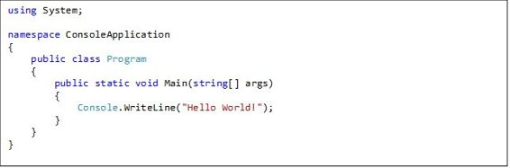

在开始使用命令行界面并编译和运行我们的。NET Core 控制台应用程序，我们必须首先确保我们的环境配置正确。为了做到这一点，我们必须检查`DNVM` (的缩写。NET 版本管理器)，并且我们已经安装了运行时的最新(在我们的例子中是不稳定的)版本，并将其设置为活动的。

顾名思义，DNVM 提供配置所需的功能。NET 运行时。我们可以使用 DNVM 来指定 DNX 的哪个版本。NET 执行环境)在进程、用户或机器级别使用。

那个。NET 执行环境(DNX)是一个软件开发工具包(SDK)和运行时环境，它拥有构建和运行所需的一切。NET 应用程序。它提供了主机进程、CLR 托管逻辑和托管入口点发现。DNX 是为运行跨平台的 ASP.NET 网络应用程序而构建的，但它也可以运行其他类型的。NET 应用程序，如跨平台控制台应用程序。

`Checking where the DNVM utility is installed`

当。NET 团队发布了 RC1 版本的。网芯和 ASP.NET 芯，他们也公布了 DNX 工装。然而，随着 RC2，他们过渡到新引进的。NET 核心命令行界面。他们有他们的理由，一个是这个工具集的一组特性被 CLI 变得多余。

当转变发生时，斯科特·汉斯曼写了一篇惊人的博文。阅读它可能会帮助你更好地理解这个复杂的决定。

对于那些完全陌生的人来说，这套工具的存在(DNX、DNVM 和 DNU)，也许只是因为你刚刚开始使用。NET Core，你只需要知道 DNX 是一个运行时和一个用来构建的工具集。NET 核心和 ASP.NET 核心应用。它分为三个主要部分:

*   DNVM (Dotnet 版本管理器):用于下载和管理机器中的运行时
*   DNX (Dotnet 执行运行时):执行代码的运行时
*   DNU (Dotnet 开发者工具):用于打包和发布应用程序以及管理依赖关系

现在。NET Core 是一个 RTM 版本，工具，还在预览中，我们有可用的 CLI 界面和 Visual Studio 或 Visual Studio 代码。那个。NET CLI 有两种风格:它可以是特定于您正在使用的开发平台的安装程序，也可以是安装脚本，对于持续集成服务器等场景非常有用。

这两个工具集之间的一个区别是，现在，为了针对框架的特定版本，您需要添加特定版本的包，而对于 DNX 工具集，它免费提供了 DNVM 的运行时选择功能。

随着工具集中的更改，一些命令被重新映射，一些被删除。基本上，所有命令现在都以`dotnet` 开始，而不是`dnx` 或`dnu.` 如果您已经了解了某个特定命令的位置，那么您现在只需将其替换为`dotnet.`即可。表 3 包含了在 CLI 中删除的命令的完整列表。

表 3:命令行界面中未实现的命令

| DNX 司令部 | 命令行界面命令 | 描述 |
| Dnx [cmd-name] | 不适用的 | 在 DNX，运行 project.json 中定义的命令 |
| Dnu 安装 | 不适用的 | 在 DNX，安装软件包作为依赖项。 |
| 内包装 | 不适用的 | 在 DNX，用 csproj 包装 project.json。 |
| Dnu 命令 | 不适用的 | 在 DNX，管理全球安装的命令。 |

那个。NET 团队有充分的理由决定不支持 CLI 中的这些命令。然而，由于这种转换并不总是无痛的，所以有一些变通办法，以防您仍然需要在工具的最新版本中利用这些机制。

`Global Commands` 不再受支持，因为它们本质上是一个打包成 NuGet 包的控制台应用程序，然后被 DNX 调用。命令行界面不熟悉这个概念。但是，您仍然可以使用`dotnet <command>` 语法来达到相同的结果。

使用命令行界面，不需要`install` 命令。为了安装依赖项，需要编辑 project.json 文件并运行`dotnet restore`。最后，为了运行您的代码，您可以从之前执行`dotnet new` 的相同目录中使用`dotnet run` 命令，或者您可以将编译后的程序集的路径指定给`dotnet` 命令，例如`dotnet assembly/debug/compiled.dll`

从 DNX 工具集到 CLI 的过渡也对项目的结构方式产生了影响。出于这个原因，团队建立了一个很好的操作方法来演示将 DNX 项目迁移到 CLI 项目。你可以在[https://docs . Microsoft . com/en-us/dotnet/articles/core/migrating-from-dnx # migrating-your-dnx-project-to-net-core-CLI](https://docs.microsoft.com/en-us/dotnet/articles/core/migrating-from-dnx#migrating-your-dnx-project-to-net-core-cli)上了解更多。

为了编译然后运行我们的基本控制台应用程序，我们必须首先恢复我们之前描述的依赖关系。为了做到这一点，我们只需要输入命令``dotnet restore``和。NET 命令行界面应该开始恢复我们的包。我建议您使用``-v`` 标志来启用详细日志记录。

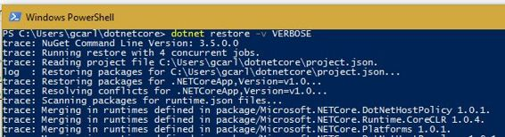

图 dotnet 恢复命令的输出

一旦恢复过程完成，您应该在项目的根目录中有一个名为`project.lock.json`的新文件。您不需要知道这个文件的所有内部内容；然而，我们将很快更多地讨论这个文件。

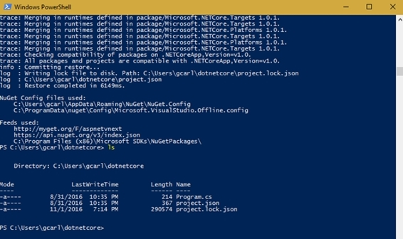

图 dnu 恢复命令后的文件夹结构

现在我们准备使用命令行界面的``build`` 选项编译我们的程序。

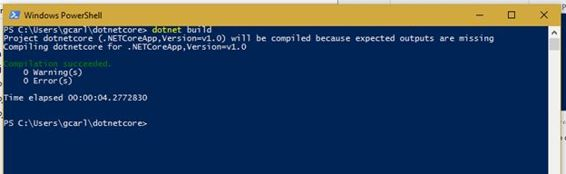

图 9:成功编译的输出

如果我们想运行我们的应用程序，我们只需要输入``dotnet run``，如果我们做的一切都正确，您得到的输出应该如下所示:

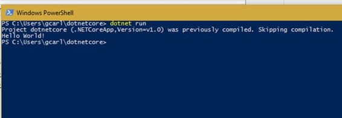

图 10:来自的 Hello World 消息。净核心

当然，在一个现实的例子中，我们会用一些更高级的代码(可能是一个 HTTP 请求)编辑`Program.cs` 文件，但这是一个很好的起点。在本书的过程中，我们将构建一个更高级的控制台应用程序，它将利用我们将获得的关于。NET 命令行界面。

project.lock.json 文件现在可以被视为解决方案级别的包文件夹。它基本上告诉我们应用程序应该在编译时使用哪组包。这是一种在`%userprofile%.dnx\packages`中定义包列表范围的方法，这样项目运行时只考虑与项目相关的包。锁文件的第二个目的是存储文件列表以及编译和运行时的相关内容，这样运行时只需要读取一个文件，而不是许多文件。nuspec 文件。在 Azure 上的 ASP.NET 核心工作负载中，这将启动时间缩短了一半。下面的代码是我们的应用程序锁文件的一部分。

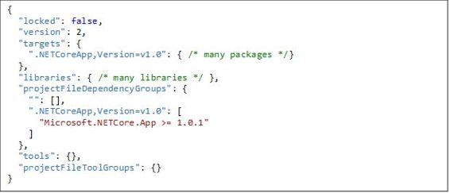

一如既往，该结构是使用 JSON 模式定义的。让我们分析每个节点。文件的顶部是一个“锁定”属性。“锁定”属性是一个布尔值，因此支持两个学派。但是，我们需要先了解“目标”节点，然后才能看到锁定属性的效果。

`target` 节点保存应用程序正在使用的所有包的列表。需要注意的一点是，它与“未锁定”的 project.json 文件中的列表有什么不同。在每个包节点下，我们都有一个它所有依赖项的列表，以及引用程序集和运行时程序集的路径。

与 project.json 的另一个区别是，这里我们不能使用通配符，也不能对版本控制含糊其辞。这个小而重要的区别是为了支持关于将依赖项签入源代码控制的两种不同的思想流派。首先是锁定依赖项，将``locked`` 属性设置为``true`` ，以避免由于 API 更改而导致的任何编译中断。第二种思想是不锁定锁定文件，将``locked`` 属性设置为``false`` ，这样恢复过程可以选择依赖关系的最新版本(以 project.json 文件中定义的版本作为上限)。如果你发现自己处于在它们之间做出决定的位置，只要知道如果你使用默认的 Visual Studio。GitHub 上的 gitignore 文件今天，project.lock.json 被指定不提交给源代码管理。

`Side note on reference assemblies`

引用 C#编译器开发人员贾里德·帕森斯的话:“引用程序集是实现程序集的精简版本，它包含 API 表面，但没有真实代码。程序可以在编译时引用这些程序集，但不能对它们运行。相反，在部署时，程序与原始实现程序集配对。将程序集分解成引用和实现对是创建目标 API 表面的有用工具。”你可以在贾里德的[博客](http://blog.paranoidcoding.com/)中读到更多关于他的冒险经历。

您可能已经注意到，在上一段中，在包恢复步骤中，我们指定了一个``-v`` 参数来启用更详细的日志记录。这应该足以引发一系列不太合理的问题:还有其他类似的选择吗？如果有，有哪些命令可用？他们是做什么的？我如何使用它们？

幸运的是，发现这些选项非常容易；你只需要在选项名称后追加``-h`` 标志即可。这里有一个例子:

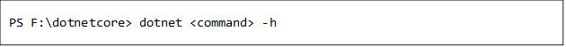

下表显示了每个命令的所有可用标志。当一个命令被省略时，它只是意味着它没有任何可用的标志。

`Command options for: dotnet restore`

| [计]选项 | 描述 |
| --- | --- |
| -力量-英语-输出 | 强制应用程序使用基于英语的不变区域性运行 |
| -s <source> | 指定了要在还原过程中使用的 nuget 包源 |
| -包装 | 要在其中安装软件包的目录 |
| -禁用-并行 | 已禁用并行恢复多个项目 |
| -f | 用作后备的包源列表 |
| --配置文件 | 要使用的 NuGet 配置文件 |
| -无缓存 | 不要缓存包和 HTTP 请求 |
| 推断运行时 | 允许 NuGet 推断遗留存储库的 rid 的临时选项 |
| -v | 要使用的详细日志记录。允许的值:调试、详细、信息、警告、错误 |
| -忽略-失败-来源 | 如果存在满足版本要求的包，则仅警告失败的源 |

`Command options for: dotnet build`

| [计]选项 | 描述 |
| --- | --- |
| -o | 放置输出的目录 |
| -b | 放置临时输出的目录 |
| -f<framework></framework> | 编译一个特定的框架 |
| -r<runtime_identification></runtime_identification> | 要发布的目标运行时 |
| -c<configuration></configuration> | 要构建的配置 |
| -版本-后缀 | 定义在 project.json 的版本字段中应该替换什么* |
| -构建-配置文件 | 设置此标志以打印防止增量编译的增量安全检查 |
| -不-增量 | 设置此标志以关闭增量生成 |
| -无依赖性 | 将此标志设置为忽略项目到项目的引用，并且只生成根项目 |

`Command options for: dotnet publish`

| [计]选项 | 描述 |
| --- | --- |
| -f<framework></framework> | 要编译的目标框架 |
| -r | 要发布的目标运行时 |
| -b | 放置临时输出的目录 |
| -o<output_path></output_path> | 发布应用程序的路径 |
| -c<configuration></configuration> | 要构建的配置 |
| -native-子目录 | 在输出中包含依赖包的本地资产的子目录的临时机制 |
| -版本-后缀 | 定义在 project.json 的版本字段中应该替换什么* |
| -不-建造 | 发布前不要构建项目 |

`Command options for: dotnet run`

| [计]选项 | 描述 |
| --- | --- |
| -f | 编译一个特定的框架 |
| -c | 要构建的配置 |
| -p | 要运行的项目的路径(默认为当前目录)。可以是 project.json 的路径，也可以是项目目录 |
|  | 要传递给可执行文件或脚本的参数 |

`Command options for: dotnet pack`

| [计]选项 | 描述 |
| --- | --- |
| -b | 放置临时生成输出的目录 |
| -o | 放置输出的目录 |
| -c<configuration></configuration> | 要构建的配置 |
| -版本-后缀 | 定义在 project.json 的“版本”字段中应该用什么替换* |
| -不-建造 | 打包前不要构建项目 |
| -s &#124; -可维修 | 在包装中设置可维修标志 |

`Command options for: dotnet test`

| [计]选项 | 描述 |
| --- | --- |
| - parentProcessId | 由 IDEs 用来指定它们的进程标识。如果父进程退出，测试将退出。 |
| 港口 | 由 IDEs 用来指定监听连接的端口号 |
| -c<configuration></configuration> | 要构建的配置 |
| -o | 在其中查找要运行的二进制文件的目录 |
| -b | 在其中查找临时输出的目录 |
| -f<framework></framework> | 寻找特定框架的测试二进制文件 |
| -r | 为指定的运行时查找的测试二进制文件 |
| -不-建造 | 测试前不要构建项目 |

既然我们已经在命令中看到了丰富的选项，让我们尝试一个。我们现在将构建我们的控制台应用程序，在``compile`` 命令上指定``-n`` 标志。这将提示。NET 命令行界面来运行编译。NET 原生工具链。那个。弹出的. exe 文件更大，但它只是一个文件。

|  | 提示:此选项在 RC2 不再可用。但是，如果您下载任何版本的。在 RC2 之前，你应该可以跟随。你可以在 [GitHub](https://github.com/dotnet/cli/issues/2803) 上找到更多这方面的信息。 |

为了使用``--native`` 标志成功编译，我们必须从`VS2015 x64 Native Command Tools Command Prompt.` 运行编译

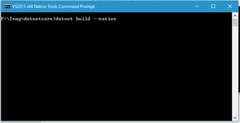

图 11:VS2015 x64 本机命令行

如果点击`Enter`，应该会得到这个输出(忽略警告):

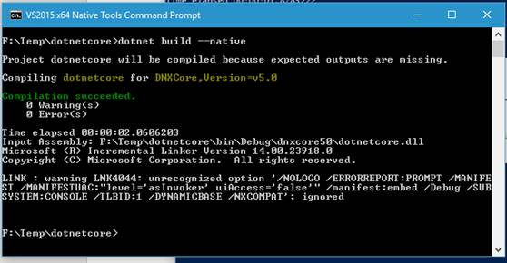

图 12:本机编译的控制台输出

当然，如果我们查看输出文件夹`F:\dotnetcore\bin\Debug\dnxcore50\native`，我们应该只有一个文件，我们的可执行文件(请注意，由于本机编译，文件大小略高)。

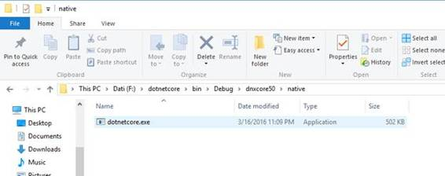

图 13:我们的本地可执行文件