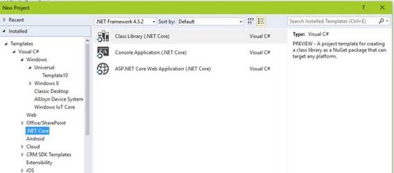
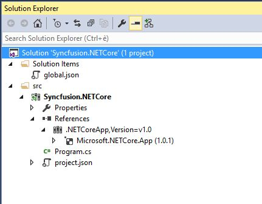
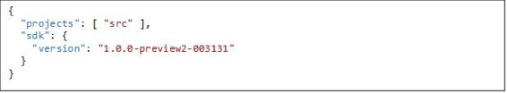
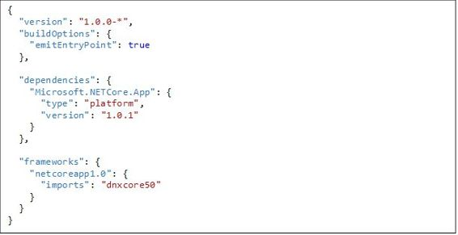
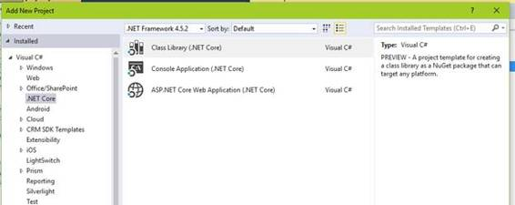
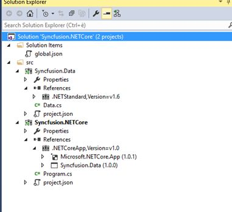
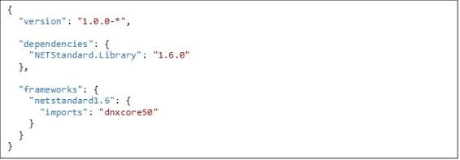
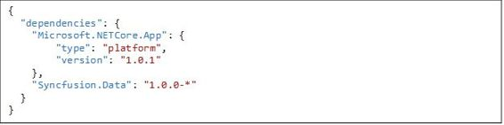

# 四、使用 VisualStudio 构建 .NET Core 应用

即使使用命令行对您来说听起来很有趣，但这并不是编写代码的最佳方式，尤其是当我们需要编写复杂的应用程序时。这部分是由于我们没有合适的集成开发环境来编码，但是，我敢说你不同意，我们被剥夺了 Visual Studio 提供的所有令人敬畏的功能，例如:智能感知、调试器、即时窗口等。

幸运的是，我们有办法解决这个问题。如果你之前安装了新的 RC2 工具，那么你可能已经注意到，在你每天在 Visual Studio 的地牢中战斗的时候，在`.NET Core`节点下你有了新的项目模板。

图 14:。NET 核心项目模板

它们分别允许您创建一个可以在。NET 框架和。NET Core，以及一个可以针对任何框架的类库。让我们创建一个新的`Console Application (.NET Core)` ，看看我们能从那里走到哪里。

创建新项目的过程不会改变；毕竟，我们正在使用 Visual Studio。一旦创建了项目，并且 Visual Studio 完成了加载，下面就是我们的解决方案:

图 15:Visual Studio 解决方案的结构

正如我们所看到的，解决方案的结构与我们习惯看到的略有不同。我们首先注意到的是我们使用了新的*特殊*文件`global.json` 和`project.json`。`project.json` 文件包含命令行界面运行项目所需的所有信息。`global.json`文件用于配置一个目录内的所有项目。它只包括两个默认部分:项目部分和 SDK 部分。``projects`` 属性指定哪些文件夹包含解决方案的源代码。默认情况下，项目结构将源文件放置在`src`文件夹中。

SDK。Version 属性指定我们的目标框架版本。

如果您希望了解更多关于全局 json 文件的模式，请使用这里提供的官方模式存储。

如果我们移到`project.json, `上，我们可以看到它的结构有点不同。我的`project.json`是这样的:

我的例子是一个非常基本的例子，但是即使在这种情况下，也有一些事情需要澄清。第一部分旨在为我们的应用程序配置一些通用元数据。``compilationOption.emitEntryPoint`` 指定这个应用程序最终会有一个入口点(一个 Main 函数)，执行应该从那里开始。

您可以使用 project.json 文件的依赖项部分来管理应用程序的依赖项。依赖项由名称和版本定义，运行时加载器决定应该加载什么。在我们的情况下，我们只依靠`Microsoft.NETCore.App`。使用`frameworks` 部分，您还可以添加特定框架的依赖项。

现在我们已经对. NET 核心项目(以前是 dnx 项目)做了一个总体概述，让我们看看如何向我们的项目添加一个自定义引用(类库)。当然，由于我们仍在使用 Visual Studio，我假设您知道如何向项目添加引用。然而，值得注意的是我们需要包括的项目类型。转到`File` > `New Project`，在对话框中选择`.NET Core` 部分下的`Class Library` 模板。

图 16:要选择的类库模板

一旦项目加载，这应该是我们解决方案的新结构。

图 17:解决方案资源管理器结构

我已经更改了 Portable Library 项目. json 中的引用，以匹配我们在控制台应用程序中使用的引用，并且我添加了指向我们新类库的控制台应用程序的项目引用。我们类库的 project.json 文件如下所示。

如您所见，它甚至比控制台应用程序中使用的更简单。现在，您可能想知道我们的控制台应用程序的 project.json 内部是否发生了变化。答案是肯定的。以下是我们添加该引用后`dependencies` 的外观:

如果您跟随示例，您可能已经注意到我们正在使用的不同寻常的版本模式。这种版本化组件的方式叫做`SemVer` (简称`Semantic Versioning`)。一般来说，SemVer 的工作原理如下:

给定一个版本号 MAJOR。MINOR.PATCH，递增:

*   进行不兼容的应用编程接口更改时的主要版本；
*   以向后兼容的方式添加功能时的 MINOR 版本，以及
*   进行向后兼容的错误修复时的补丁版本。

预发布和构建元数据的附加标签可作为 MAJOR 的扩展。MINOR.PATCH 格式。你可以在这里了解更多关于语义版本化[的内容。](http://semver.org/)