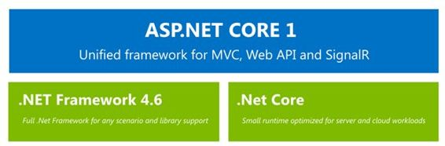

# 五、.NET 主要工作流

全场。NET 框架和。NET Core 彼此独立存在，但从一开始，它们就是这些技术之上的一个或多个工作负载的构建块。两个主要工作负载是 ASP.NET 核心 1.0 和通用视窗平台应用程序。让我们简要地探讨一下每一个细节。

2015 年将被微软开发者铭记为创新之年。事实上，2015 年，微软凭借其全新操作系统 Windows 10 上市。Windows 10 代表了第一个能够通过一个公共平台统一桌面、平板电脑和移动应用程序以及物联网和全息设备应用程序的意识形态截然不同的世界的操作系统。如果没有微软对生态系统理念的不可思议的投资，这一切都是不可能的，微软一直保持着这种理念，并且近年来仍在这样做。通用视窗平台不仅可以被视为一套应用编程接口，也可以被视为一段从视窗手机 7 开始，一直延续到视窗 8.1 和视窗手机 8.1 的旅程。

通用视窗平台涉及。NET Core，因为它使用它作为它的运行时。NET Native 作为它的默认工具链。

通用视窗平台是一组通用的应用编程接口，在视窗系列的每台设备上都是一致的。这一组独特的应用编程接口允许开发人员编译他们的应用程序的单个二进制文件(根据处理器的架构给出适当的区别)，以在每个 Windows 10 设备上运行。UWP 是继承自 Windows 8 的现有 Windows 运行时的扩展和组件化的结果。一组应用编程接口，或者更一般地说，专用于特定任务的应用编程接口的逻辑子集，被称为契约。

将 UWP 拆分成一系列合同代表着我们开发人员使用平台的方式向前迈出了一大步。事实上，合同代表了对操作系统如何公开特定功能的保证。这种机制也是微软向平台分发增量更新的一种强大方式，而不会破坏对早期版本运行时的支持。利用这种机制，微软还可以更快地向其操作系统分发更新和补丁。这里需要记住的重要一点是，我们是根据通用视窗平台而不是视窗 10 本身来构建应用程序的。通用平台独立于窗口。在我看来，这才是这个“Windows 即服务”故事的真正精髓。

ASP.NET 核心 1.0 是一个运行在两者之上的单一框架。NET Core 1.0 或更高版本。NET 框架。ASP.NET 核心是第一个采用的工作负载。NET 核心。ASP.NET 核心的一个关键价值是，你可以在同一台机器上运行不同的应用程序，针对不同版本的运行时，让两个应用程序完全相互隔离。由于 ASP.NET 核心是模块化的，您可以获得应用程序内存占用更小的好处，以及一些重要的性能优势，即使您的目标是完全。NET 框架。

以下是如何运行 ASP.NET Core 应用程序的高级视图:

图 18:ASP.NET 核心 1.0 高层堆栈

当您在上面运行 ASP.NET 核心应用程序时。NET Core 1.0 框架，您将获得针对服务器云工作负载优化的端到端堆栈，这意味着高吞吐量和非常小的内存占用。您还可以并行执行。NET Core 框架版本与您的应用程序相关，无论其他版本的。NET 可能安装在同一台服务器或机器上。从那以后。NET Core 是跨平台的，这些好处甚至适用于 Mac 和 Linux。另一方面，当您在完整的基础上运行 ASP.NET 核心应用程序时。NET 框架，您将获得与现有的最高级别的兼容性。NET 库，并且比在。NET 核心。