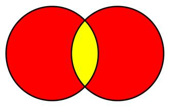

# 六、集合

`Set`是实现基本代数集算法的集合类型，包括并、交、差和对称差。这些算法中的每一个将在它们各自的章节中详细解释。

从概念上讲，集合是对象的集合，这些对象通常具有一些共性。例如，我们可能有一个包含偶数正整数的集合:

`[2, 4, 6, 8, 10, ...]`

和包含正奇数的集合:

`[1, 3, 5, 7, 9, ...]`

这两个集合没有任何共同的值。现在考虑第三组，即数字 100 的所有因素:

`[1, 2, 4, 5, 10, 20, 25, 50, 100]`

给定这些集合，我们现在可以回答“100 的哪些因子是奇数？”通过查看奇数集和 100 的因子集，并查看这两组中存在哪些值。但是我们也可以回答诸如“哪些奇数不是 100 的因子？”或者，“哪些正数，偶数或奇数，不是 100 的因子？”

这可能看起来不太有用，但那是因为这个例子有些做作。想象一下，如果场景是一家公司的每个员工和每个完成了强制性年度培训的员工。

`[All Employees]`

`[Employees Who Are Trained]`

我们很容易回答“哪些员工没有完成强制性培训？”

我们可以继续添加额外的集合，并开始回答非常复杂的问题，例如“销售团队中哪些获得公司信用卡的全职员工没有参加新费用报告流程的强制培训？”

## 设置类

`Set`类实现了`IEnumerable`接口，并接受了一个应该是`IComparable`类型的泛型参数(测试等式对于集合算法的运行是必要的)。

集合的成员将包含在. NET `List`类中，但实际上，集合通常包含在树结构中，例如[二叉搜索树](5.html#_Binary_Search_Tree)。底层容器的这种选择会影响各种算法的复杂性。例如，使用`List`，`Contains`的复杂度为 *O* ( *n* )，而使用一棵树平均会产生 *O* (log *n* )。

除了我们将要实现的方法之外，`Set`还包括一个默认构造函数和一个接受要填充集合的项的`IEnumerable`的构造函数。

```cs
    public class Set<T> : IEnumerable<T>
        where T: IComparable<T>
    {
        private readonly List<T> _items = new List<T>();

        public Set()
        {
        }

        public Set(IEnumerable<T> items)
        {
            AddRange(items);
        }

        public void Add(T item);

        public void AddRange(IEnumerable<T> items);

        public bool Remove(T item);

        public bool Contains(T item);

        public int Count
        {
            get;
        }

        public Set<T> Union(Set<T> other);

        public Set<T> Intersection(Set<T> other);

        public Set<T> Difference(Set<T> other);

        public Set<T> SymmetricDifference(Set<T> other);

        public IEnumerator<T> GetEnumerator();

        System.Collections.IEnumerator System.Collections.IEnumerable.GetEnumerator();
    }

```

## 插入

### 添加

| 行为 | 将项目添加到集合中。如果集合中已经存在该项目，则抛出`InvalidOperationException`。 |
| 表演 | *O* ( *n* ) |

在实现`Add`算法时，需要做一个决定:集合是否允许重复项？例如，给定以下集合:

`[1, 2, 3, 4]`

如果呼叫者尝试将值 3 相加，该集是否会变成:

`[1, 2, 3, 3, 4]`

虽然这在某些情况下可能是可以接受的，但这不是我们要实现的行为。想象一个集合，包含当地大学的所有学生。允许同一个学生被添加到集合中两次是不符合逻辑的。事实上，尝试这样做很可能是一个错误(在这个实现中将被这样对待)。

注:`Add`采用 [`Contains`](#_Contains_1) 法。

```cs
    public void Add(T item)
    {
        if (Contains(item))
        {
            throw new InvalidOperationException("Item already exists in Set");
        }

        _items.Add(item);
    }

```

### AddRange

| 行为 | 向集合中添加多个项目。如果集合中存在输入枚举器的任何成员，或者输入枚举器中有重复项，将抛出`InvalidOperationException`。 |
| 表演 | *O* ( *mn* )，其中 *m* 为输入枚举中的项数， *n* 为当前集合中的项数。 |

```cs
    public void AddRange(IEnumerable<T> items)
    {
        foreach (T item in items)
        {
            Add(item);
        }
    }

```

## 移除

| 行为 | 如果找到，从集合中删除指定值，返回`true`。如果集合不包含指定值，则返回`false`。 |
| 表演 | *O* ( *n* ) |

```cs
    public bool Remove(T item)
    {
        return _items.Remove(item);
    }

```

## 包含

| 行为 | 如果集合包含指定值，返回`true`。否则返回`false`。 |
| 表演 | *O* ( *n* ) |

```cs
    public bool Contains(T item)
    {
        return _items.Contains(item);
    }

```

## 计数

| 行为 | 返回集合中的项目数，如果集合为空，则返回`0`。 |
| 表演 | *O* (1) |

```cs
    public int Count
    {
        get
        {
            return _items.Count;
        }
    }

```

## 获取分子

| 行为 | 返回集合中所有项的枚举数。 |
| 表演 | *O* (1)返回枚举器。枚举所有项目有一种复杂的 *O* ( *n* )。 |

```cs
    public IEnumerator<T> GetEnumerator()
    {
        return _items.GetEnumerator();
    }

    System.Collections.IEnumerator System.Collections.IEnumerable.GetEnumerator()
    {
        return _items.GetEnumerator();
    }

```

## 算法

### 工会

| 行为 | 返回一个新的集合，该集合是当前集合和输入集合的并集操作的结果。 |
| 表演 | *O* ( *mn* )，其中 *m* 和 *n* 分别是提供的和当前集合中的项目数。 |

两个集合的并集是包含两个集合中存在的所有不同项的集合。

例如，给定两组(每组用红色表示):


图 31:联合操作之前的两个输入集

当执行联合操作时，输出集包含两个集中的所有项目。如果两个集中都存在任何项目，则每个项目只有一个副本被添加到输出集中。


图 32:联合操作后的输出集(返回的项目是黄色的)

当我们将多组整数结合在一起时，可以看到一个更具体的例子:

`[1, 2, 3, 4] union [3, 4, 5, 6] = [1, 2, 3, 4, 5, 6]`

```cs
    public Set<T> Union(Set<T> other)
    {
        Set<T> result = new Set<T>(_items);

        foreach (T item in other._items)
        {
            if (!Contains(item))
            {
                result.Add(item);
            }
        }

        return result;
    }

```

### 路口

| 行为 | 返回一个新的集合，该集合是当前集合和输入集合的交集运算的结果。 |
| 表演 | *O* ( *mn* )，其中 *m* 和 *n* 分别是提供的和当前集合中的项目数。 |

交集是两个集合“相交”的点，即它们的公共成员。使用联合示例中的维恩图，这里显示了两个集合的交集:



图 33:两个输入集的交集显示为黄色

或者，使用整数集:

`[1, 2, 3, 4] intersect [3, 4, 5, 6] = [3, 4]`

```cs
    public Set<T> Intersection(Set<T> other)
    {
        Set<T> result = new Set<T>();

        foreach (T item in _items)
        {
            if (other._items.Contains(item))
            {
                result.Add(item);
            }
        }

        return result;
    }

```

### 差异

| 行为 | 返回一个新的集合，该集合是当前集合和输入集合的差运算的结果。 |
| 表演 | *O* ( *mn* )，其中 *m* 和 *n* 分别是提供的和当前集合中的项目数。 |

两个集合之间的差异或集合差异是存在于第一个集合(调用`Difference`方法的集合)中，但不存在于第二个集合(方法的参数)中的项目。此处显示了该方法的维恩图，返回的集合为黄色:


图 34:两组之间的设置差异

或者，使用整数集:

`[1, 2, 3, 4] difference [3, 4, 5, 6] = [1, 2]`

```cs
    public Set<T> Difference(Set<T> other)
    {
        Set<T> result = new Set<T>(_items);

        foreach (T item in other._items)
        {
            result.Remove(item);
        }

        return result;
    }

```

### 对称差

| 行为 | 返回一个新集合，该集合是当前集合和输入集合的对称差运算的结果。 |
| 表演 | *O* ( *mn* )，其中 *m* 和 *n* 分别是提供的和当前集合中的项目数。 |

两个集合的对称差是这样一个集合，它的成员是那些只存在于其中一个集合中的项。此处显示了该方法的维恩图，返回的集合为黄色:


图 35:两组对称差

或者，使用整数集:

`[1, 2, 3, 4] symmetric difference [3, 4, 5, 6] = [1, 2, 5, 6]`

您可能已经注意到，这与交叉操作完全相反。考虑到这一点，让我们看看仅使用我们已经看过的集合算法来找到对称差需要什么。

让我们走完我们想要的。

我们想要一个包含两个集合中所有项目的集合，除了存在于两个集合中的项目。或者换一种方式说，我们想要两个集合的并集，除了两个集合的交集。我们想要两个集合的并集和交集之间的集合差。

一步一步，看起来是这样的:

`[1, 2, 3, 4] union [3, 4, 5, 6] = **[1, 2, 3, 4, 5, 6]**`

`[1, 2, 3, 4] intersection [3, 4, 5, 6] = **[3, 4]**`

`[1, 2, 3, 4, 5, 6]` `set difference **[3, 4]** = [1, 2, 5, 6]`

这产生了我们想要的结果集:(`[1, 2, 5, 6]`)。

```cs
    public Set<T> SymmetricDifference(Set<T> other)
    {
        Set<T> union = Union(other);
        Set<T> intersection = Intersection(other);

        return union.Difference(intersection);
    }

```

### ISSS sub

你可能想知道为什么我没有增加一个`IsSubset`方法。这种方法通常用于确定一个集合是否完全包含在另一个集合中。例如，我们可能想知道:

`[1, 2, 3] is subset [0, 1, 2, 3, 4, 5] = true`

然而

`[1, 2, 3] is subset [0, 1, 2] = false`

我没有详细说明`IsSubset`方法的原因是，它可以使用现有的手段来执行。例如:

`[1, 2, 3] difference [0, 1, 2, 3, 4, 5] = []`

一个空的结果集表明整个第一个集合包含在第二个集合中，所以我们知道第一个集合是第二个集合的完整子集。

另一个例子，使用交集:

`[1, 2, 3] intersection [0, 1, 2, 3, 4, 5] = [1, 2, 3]`

如果输出集与输入集具有相同数量的元素，我们就知道输入集是第二个集的子集。

在通用`Set`类中，拥有一个`IsSubset`方法可能是有用的(并且可以更优化地实现)；然而，我想指出，这不一定是一种新的行为，而只是对现有运营的另一种思考方式。