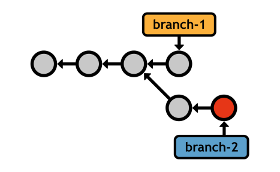
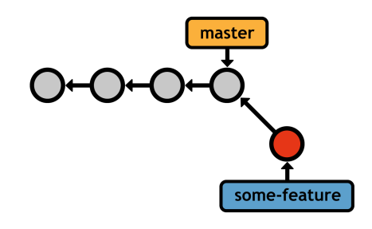
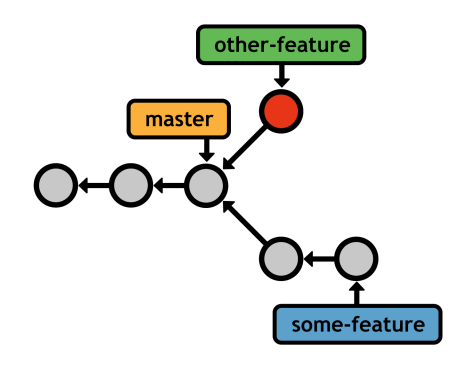
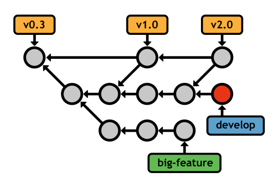

# 五、分支

分支通过允许用户分叉他们的历史来增加提交提供的基本功能。创建一个新的分支类似于请求一个新的开发环境，包括一个独立的工作目录、临时区域和项目历史。



图 18:基本分支开发

这给了你与提交项目的“安全”副本同样的安心，但是你现在有额外的能力同时处理多个版本。分支支持**非线性工作流**—并行开发不相关特征的能力。正如我们将在 [*【远程存储库】*](6.html#heading_id_54) 中发现的那样，非线性工作流是 Git 协作模型分布式本质的重要前身。

与 SVN 或 CVS 不同，Git 的分支实现非常高效。SVN 通过将整个项目复制到一个新文件夹中来启用分支，就像您在没有任何修订控制软件的情况下所做的那样。这使得合并变得笨拙、容易出错和缓慢。相反，Git 分支只是一个指向提交的指针。因为它们在提交级别工作，而不是直接在文件级别工作，所以 Git 分支使得合并不同的历史更加容易。这对分支工作流有着巨大的影响。

## 操纵分支

Git 将分支功能分成几个不同的命令。`git branch`命令用于列出、创建或删除分支。

### 上市分行

首先，您需要能够查看现有分支机构:

```
    git branch

```

这将输出您当前的所有分支，以及当前“签出”的分支旁边的星号(稍后将详细介绍):

```
    * master
    some-feature
    quick-bug-fix

```

`master`分支是 Git 的默认分支，它是在任何存储库中第一次提交时创建的。许多开发人员使用这个分支作为项目的“主要”历史——一个包含它所经历的每一个主要变化的永久分支。

### 创建分支

您可以通过将分支名称传递给相同的`git branch`命令来创建新的分支:

```
    git branch <name>

```

这会创建一个指向当前`HEAD`的指针，但是*不会*切换到新的分支吗(你需要`git checkout`来实现)。在请求一个新的分支之后，您的存储库将看起来如下所示。


图 19:创建一个新分支

您当前的分支(`master`)和新的分支(`some-feature`)都引用同一个提交，但是您记录的任何新提交都将被当前分支独占。同样，这让您可以并行处理不相关的特性，同时仍然保持合理的历史记录。例如，如果您当前的分支是`some-feature`，提交快照后，您的历史将如下所示。



图 20:在`some-feature`分支上提交

新的`HEAD`(由突出显示的提交表示)只存在于`some-feature`分支中。它不会显示在`master`的日志输出中，也不会在您签出`master`后其更改出现在工作目录中。

打开文件`.git/refs/heads/<name>`，实际上可以在内部数据库中看到新的分支。该文件包含被引用提交的标识，并且它是 Git 分支的唯一定义。这就是分支机构如此轻便且易于管理的原因。

### 删除分支

最后，您可以通过`-d`标志删除分支:

```
    git branch -d <name>

```

但是，Git 致力于永远不会丢失您的工作，这阻止了它移除具有未合并提交的分支。要强制删除，请使用`-D`标志:

```
    git branch -D <name>

```

未合并的改动会丢失，所以 ***用这个命令要非常小心*** 。

## 检查分支机构

当然，没有在分支之间切换的能力，创建分支是没有用的。Git 称这种“检查”为分支:

```
    git checkout <branch>

```

签出指定的分支后，您的工作目录会更新以匹配指定分支的提交。此外，`HEAD`被更新为指向新的分支，所有新的提交都将存储在新的分支上。您可以将检出分支视为切换到新的项目文件夹，只不过将更改拉回到项目中要容易得多。


图 21:检查不同的分支

考虑到这一点，在签出分支机构之前，最好先清理一下**工作目录。当没有未提交的更改时，存在干净的目录。如果不是这样，`git checkout`有可能覆盖您的修改。**

 **与提交“安全”修订一样，您可以自由地在新的分支上进行实验，而不用担心破坏现有的功能。但是，您现在有一个专门的历史来使用，所以您可以使用本书前面完全相同的`git add`和`git commit`命令来记录实验的进度。



图 22:并行开发多个特性

一旦我们学会如何将不同的历史合并回“主”分支(例如`master`)，这个功能将变得更加强大。我们稍后会谈到这一点，但首先，有一个重要的`git checkout`用例必须考虑…

### 分离`HEAD` s

Git 还可以让你用标签和提交 id 来使用`git checkout`，但是这样做会让你处于一个**分离的 HEAD 状态**。这意味着您不再处于分支上，而是直接查看提交。


图 23:检查一个旧的提交

您可以像往常一样四处查看并添加新的提交，但是由于没有指向添加的分支，一旦切换回真正的分支，您将丢失所有的工作。幸运的是，在分离的`HEAD`状态下创建一个新的分支足够容易:

```
    git checkout -b <new-branch-name>

```

这是`git branch <new-branch-name>`后跟`git checkout <new-branch-name>`的捷径。在这之后，你会有一个闪亮的新的分支引用以前分离的`HEAD`。这是一个非常方便的从旧版本中分出实验的过程。

## 合并分支

合并是将提交从一个分支拉到另一个分支的过程。分支组合的方式有很多，但目标始终是分支之间的信息共享。这使得合并成为 Git 最重要的特性之一。两种最常见的合并方法是:

*   “快进”合并
*   “三向”合并

它们都使用相同的命令`git merge`，但是方法是根据您的历史结构自动确定的。在每种情况下，*您想要合并到的分支必须被*检出，并且目标分支将保持不变。接下来的两个部分介绍了以下命令的两种可能的合并方案:

```
    git checkout master
    git merge some-feature

```

同样，这会将`some-feature`分支合并到`master`分支中，而不影响前者。一旦您完成了一个特性，并且想要将它集成到稳定的项目中，您通常会运行这些命令。

### 快进合并

第一个场景如下所示:


图 24:快进合并之前

我们创建了一个分支来开发一些新特性，添加了两个提交，现在它可以集成到主代码库中了。Git 可以“快进”分支的指针以匹配`some-feature`的位置，而不是重写`master`中缺失的两个提交。


图 25:快进合并后

合并后，`master`分支包含所有想要的历史，特征分支可以删除(除非你想继续在它上面开发)。这是最简单的合并类型。

当然，我们可以直接在`master`分支上进行两次提交；然而，使用一个专用的特性分支给了我们一个安全的环境来试验新的代码。如果结果不太正确，我们可以简单地删除分支(与重置/恢复相反)。或者，如果我们添加了一堆包含坏代码的中间提交，我们可以在将其合并到`master`之前对其进行清理(参见 [*重新排序*](#heading_id_51) )。随着项目变得越来越复杂，并获得了更多的合作者，这种分支开发使 Git 成为一个出色的组织工具。

### 三向合并

但是，对于快进提交来说，并非所有情况都足够简单。请记住，分支的主要优势是能够同时探索许多独立的开发线。因此，您经常会遇到类似以下的情况:


图 26:在三方合并之前

这开始就像一个快进合并，但是当我们还在开发`some-feature`的时候，我们添加了一个提交到`master`分支。例如，我们可以停止对该特性的工作来修复一个时间敏感的错误。当然，bug 修复应该尽快添加到主存储库中，所以我们最终会看到上面显示的场景。

在这种情况下，将特征分支合并到`master`会导致“3 向”合并。这是使用与上一节中的快进合并完全相同的命令来完成的。


图 27:三方合并后

Git 不能在不回溯的情况下将`master`指针快进到`some-feature`。相反，它生成一个新的**合并提交**，代表两个分支的合并快照。请注意，这个新的提交有两个父提交(T5 ),使其可以访问两个历史记录(实际上，在三路合并后运行的`git log`显示了来自两个分支的提交)。

此合并算法的名称源于用于创建合并提交的内部方法。Git 查看*三个*提交以生成合并的最终状态。

### 合并冲突

如果您试图将对同一部分代码进行不同更改的两个分支结合起来，Git 将不知道使用哪个版本。这叫做**合并冲突**。显然，这在快进合并过程中永远不会发生。当 Git 遇到合并冲突时，您将看到以下消息:

```
    Auto-merging index.html
    CONFLICT (content): Merge conflict in <file>
    Automatic merge failed; fix conflicts and then commit the result.

```

Git 没有自动添加合并提交，而是停下来问你该怎么做。在这种情况下运行`git status`将返回如下内容:

```
    # On branch master
    # Unmerged paths:
    #
    #       both modified:      <file>

```

每个有冲突的文件都存储在“未合并路径”部分。Git 对这些文件进行了注释，向您展示了这两个版本的内容:

```
    <<<<<<< HEAD
      This content is from the current branch.
    =======
        This is a conflicting change from another branch.
    >>>>>>> some-feature

```

`=======`之前的部分来自`master`分支，其余部分来自你要整合的分支。

要解决冲突，请删除`<<<<<<`、`=======`和`>>>>>>>`符号，并将代码更改为您想要保留的任何代码。然后，告诉 Git 您已经用`git add`命令解决了冲突:

```
    git add <file>

```

没错；你所要做的就是将冲突的文件标记为已解决。最后，通过生成合并提交来完成 3 向合并:

```
    git commit

```

日志消息内置了一个合并通知，以及一个“冲突”列表，这在试图找出项目中哪里出错时特别有用。

这就是 Git 合并的全部内容。现在我们已经了解了 Git 分支背后的机制，我们可以深入了解一下资深 Git 用户如何在日常工作流程中利用分支。

## 分支工作流

本节介绍的工作流是基于 Git 的修订控制的标志。Git 分支实现的轻量级、易于合并的特性使它们成为软件开发武库中最高效的工具之一。

所有分支工作流都围绕本章前面介绍的`git branch`、`git checkout`和`git merge`命令。

### 分支机构类型

为了组织一个项目，给不同的分支赋予特殊的意义通常是有用的。本节介绍了最常见的分支类型，但请记住，这些区别纯粹是表面的——对 Git 来说，分支就是分支。

所有分支可以分为**永久**T4 分支或**主题分支**。前者包含项目的主要历史(如`master`)，后者是用于实现特定*主题*的临时分支，然后丢弃(如`some-feature`)。

### 永久分支机构

永久分支是任何存储库的生命线。它们包含软件项目的每个主要航路点。大多数开发人员专门使用`master`来获得稳定的代码。在这些工作流中，您*从不*直接在`master`上提交—它只是在专用主题分支中构建的已完成特性的集成分支。

此外，许多用户在另一个集成分支中添加了第二层抽象(通常称为`develop`，尽管任何名称都可以)。这释放了`master`分支用于*真正的*稳定代码(例如，公共提交)，并使用`develop`作为内部集成分支来准备公共发布。例如，下图显示了几个功能被集成到`develop`中，然后单个最终合并到`master`中，这象征着公开发布。


图 28:将`master`分支专门用于公共发布

### 主题分支

主题分支通常分为两类:**功能分支**和**修复分支**。特性分支是封装新特性或重构的临时分支，保护主项目免受未测试代码的影响。它们通常源于另一个特性分支或集成分支，但不是“超稳定”分支。



图 29:在一个孤立的分支中开发一个特性

修复分支本质上是相似的，但它们源于公共发布分支(例如`master`)。它们不是开发新功能，而是为了快速修补开发主线。通常，这意味着 bug 修复和其他重要更新不能等到下一个主要版本。


图 30:用修复分支修补`master`

同样，分配给这些分支的含义纯粹是传统的——Git 看不出`master`、`develop`、特性和修补程序之间有什么区别。记住这一点，不要害怕让它们适应你自己的目的。Git 的美在于它的灵活性。当你理解了 Git 分支背后的机制，就很容易设计出适合你的项目和个性的新颖工作流程。

## 重铺

换基是将一个分支转移到新的*基地*的过程。Git 的基础功能允许用户手动组织分支，从而使分支更加灵活。与合并一样，`git rebase`要求分支被检出，并以新的基数作为参数:

```
    git checkout some-feature
    git rebase master

```

这会将整个`some-feature`分支移动到`master`的顶端:


图 31:将`some-feature`重新放置到`master`分支上

在重基准之后，特征分支是`master`的*线性延伸*，这是一种更干净的方式来整合从一个分支到另一个分支的变化。将此线性历史与`master`合并到`some-feature`进行比较，这将在最终快照中产生完全相同的代码库:


图 32:通过三路合并将`master`集成到`some-feature`中

由于历史已经偏离，Git 不得不使用额外的合并提交来合并分支。在开发长期运行的特性的过程中多次这样做可能会导致非常混乱的历史。

这些额外的合并提交是多余的——它们的存在只是为了将变更从`master`拉进`some-feature`。通常，你会希望你的合并提交到*意味着*什么的，比如一个新特性的完成。这就是为什么许多开发人员选择用`git rebase`引入变更，因为它会在特性分支中产生一个完全线性的历史。

### 交互式重定基础

交互式重定基础更进一步，允许你在移动他们到新基地时改变承诺。您可以使用`-i`标志指定一个交互式基础:

```
    git rebase –i master

```

这将在文本编辑器中填充特征分支中每个提交的摘要，以及一个决定如何将其转移到新基础的命令*。例如，如果在一个要素分支上有两次提交，则可以指定如下所示的交互式基础:*

```
    pick 58dec2a First commit for new feature
    squash 6ac8a9f Second commit for new feature

```

默认的`pick`命令将第一次提交移动到新的基础上，就像正常的`git rebase`一样，但是之后`squash`命令告诉 Git 将第二次提交与前一次合并，因此您最终得到一个包含所有更改的提交:


图 33:交互式重定`some-feature`分支的基础

Git 提供了几个交互式的重定基础命令，每个命令都在配置列表的注释部分进行了总结。关键是交互式重定根让你完全地把一个分支的历史重写到你的精确规格。这意味着您可以根据需要向特性分支添加尽可能多的中间提交，然后返回并在事后将它们修复成有意义的进展。

其他开发人员会认为你是一个出色的程序员，并且知道如何一次性实现整个功能。这种组织对于确保大型项目具有可导航的历史非常重要。

### 重写历史

重定基准是一个强大的工具，但是你必须明智地重写历史。这两种重排序实际上都不会移动现有的提交，它们会创建全新的提交(在上图中用星号表示)。如果您检查受到重定基准的提交，您会注意到它们有不同的标识，即使它们表示相同的内容。这意味着重新设定*会破坏*在“移动”它们的过程中存在的承诺。

正如您可能想象的那样，这对协作工作流产生了巨大的影响。销毁一个公共提交(例如`master`分支上的任何东西)就像是撕掉其他人的工作基础。Git 不会知道如何结合每个人的变化，你会有很多道歉要做。在我们学习了如何与远程存储库通信之后，我们将更深入地研究这个场景。

就目前而言，只要遵守退换货的黄金法则: ***永远不要退换已经推送到公共存储库的分支*** 。***