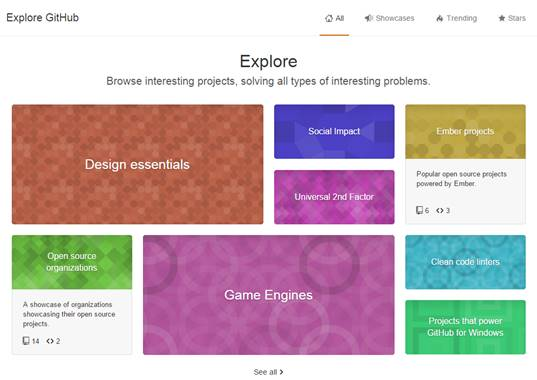
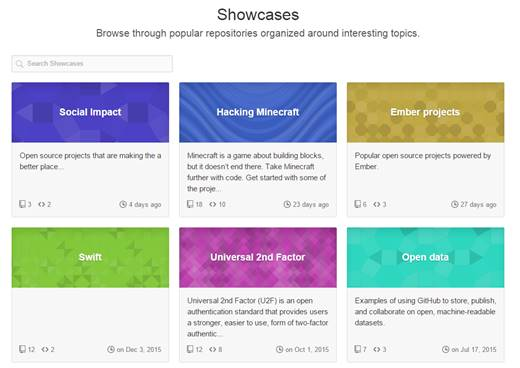
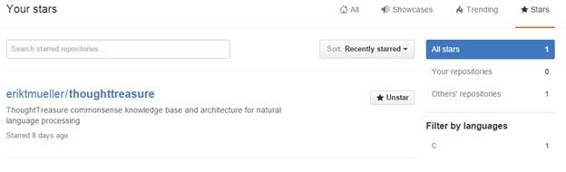

# 七、浏览 Github

虽然搜索是 GitHub 的一个强大功能，但您也可以探索许多有趣的项目，并看到最新的趋势。在您的帐户图标下，下拉菜单并选择**浏览**。您将看到类似于以下内容的屏幕:

图 29: GitHub 探索主题

您可以点击任何一个框来查看不同类别中最具星级的存储库。类别列表可能会根据 GitHub 的最新趋势和活动而变化。

在类别下面，你会发现趋势知识库(基于一周的活动)。

图 30:趋势知识库

下一个菜单选项“展示”显示了各种感兴趣的主题，并允许您探索其中的各种存储库。

图 31:展示

您可以单击任何框来查看其中的存储库。例如，当您选择“打开数据”框时，会出现以下屏幕。

图 32:开放数据仓库

有时，您可能只想探索 GitHub，看看其他开发人员正在积极研究什么。或者你可能不太知道搜索词是什么，但是查看类别可以帮助你找到一个有用的存储库。展示和趋势存储库可以是一个很好的替代关键字搜索。

“星”菜单选项将显示您已加星的任何存储库的列表:

图 33:星形存储库

探索 GitHub 可能是一个有趣的练习，你永远不知道你可能会发现什么好东西，包括那些你可能从未想过要搜索的东西。