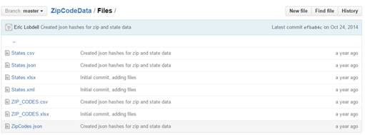
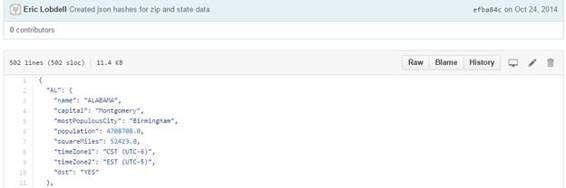
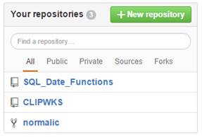

# 十、获取代码

您已经搜索了 GitHub，查看了所有结果，并找到了一个应该有所帮助的存储库。下一步是下载代码。如果您只是计划使用代码，而没有协作和贡献来使代码变得更好，您可以将代码下载到您的本地机器上。

抓取整个存储库最简单的方法就是点击菜单栏上的**下载 ZIP** 按钮。使用这种方法，您将只下载源文件和其他文件(没有存储库历史或详细信息)。

图 71:下载压缩文件

需要注意的一点是，ZIP 将包含所有文件，包括 **readme.md** 文件。该文件可能包含嵌入的标记代码，因此在文本编辑器中可能不容易阅读。

您也可以通过单击文件名来下载单个文件。GitHub 在决定如何显示文件内容方面非常聪明，尤其是文本或编程语言文件。二进制文件一般不显示，但你可以点击下载。举个例子，让我们看看 ZipCodeData。假设您需要邮政编码和州信息，您的搜索会引导您找到这个存储库。当您单击“文件”子文件夹时，您会看到以下结果。

图 72:邮政编码文件文件夹

但是，您不需要整个解决方案和其他数据文件；您只对 JSON 格式的数据感兴趣。当您点击文件名时，文件会显示在 GitHub 窗口中。

图 73:邮政编码 JSON 数据

当你点击 **Raw** 标签时，GitHub 打开的文件周围没有任何装饰。然后，您可以使用浏览器上下文菜单，将内容保存到本地驱动器。

“责备”选项卡(不管它的名字是什么)是一种识别谁对文件进行了更改的简便方法，并提供了更改原因的简要描述。

虽然您可以很容易地下载文件和代码，但是如果一个项目激起了您的兴趣，您应该考虑创建一个分叉，并可能通过查看一些未解决的问题来对项目做出贡献。开源软件的本质是协作，大多数存储库所有者会欢迎对他们的项目的帮助。

如果你决定要做一个项目，你可以点击仓库顶部的**分叉**图标。

图 74:分叉一个项目

一旦您分叉了项目，您的存储库列表现在将显示分叉的存储库，由分叉图标指示。

图 75:显示分叉的存储库

现在，您已经有了一个存储库的副本，可以开始检查问题，看看您是否想要做出贡献。在图 75 中，normalic 是一个用于解析美国地址数据的便利库，但是是用 Ruby 编写的。我在 fork 中的目标是创建一个供我自己使用的 C#版本，然后把它放回 GitHub 上(也信任原始的存储库)。

您可以简单地将 GitHub 用作一个大型的源代码和数据库，毫无疑问，您会发现许多有用的存储库。然而，本着开源软件的精神，你可能会发现自己在合作中帮助改进其他作品，以生产一些更好的软件。