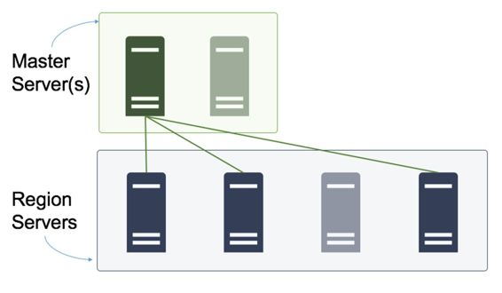
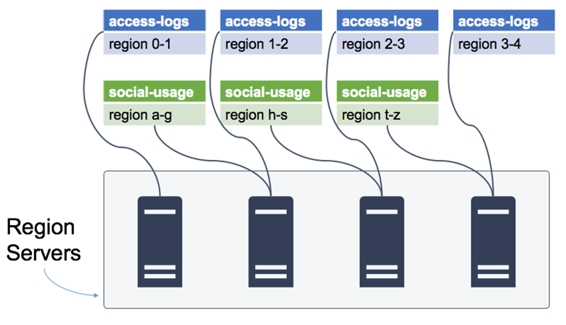
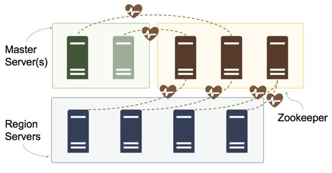
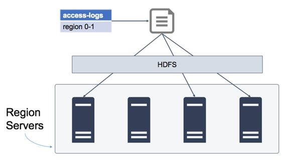

# 七、HBase 的架构

在 HBase 的分布式部署中，体系结构有四个组件，它们共同构成了 HBase 服务器:

区域服务器–托管区域并提供数据访问的计算节点

主服务器–协调区域服务器并运行后台作业

zookeeper–包含共享配置，并向主机通知服务器故障

Hadoop 分布式文件系统(HDFS)–存储层，物理托管在主服务器和区域服务器之间

图 5 显示了分布式安装的 HBase 中组件之间的关系，其中组件运行在多台服务器上:

 5:分布式糖化血红蛋白酶簇

在多台服务器上托管每个组件可以在生产环境中提供弹性和性能。作为首选的最低要求，集群应该有两个主服务器、三个 Zookeeper 节点和四个区域服务器。

注意:HBase 群集中的每个节点都应该有一个专用角色。不要试图在区域服务器上运行 Zookeeper 整个集群的性能和可靠性会下降。每个节点都应该位于单独的物理或虚拟机上，并且都在同一个物理或虚拟网络中。

在生产环境中运行 HBase 不一定需要您委托 9 台服务器在内部运行。您可以在云中加速托管的 HBase 集群，并且只在需要时支付计算能力。

主服务器(也称为“主机”)是系统的管理员。它拥有元数据，所以它是进行表更改的地方，它还管理区域服务器。

当您在 HBase 中进行任何管理更改(如创建或更改表)时，都是通过主服务器完成的。HBase Shell 使用主界面的功能，这就是为什么您不能远程运行 Shell(尽管您可以从其他远程界面调用 HBase 函数)。

主服务器监听 Zookeeper 发出的任何区域服务器连接状态变化的通知。如果一个区域服务器关闭，主服务器会将其服务的所有区域重新分配给其他区域服务器，如图 6 所示:

 6:重新分配区域

当区域服务器联机时(丢失的服务器重新加入，或者集群中的新服务器)，它不会服务任何区域，直到它们被分配给它。您可以手动在服务器之间分配区域，但是主服务器会定期运行负载平衡器作业，在活动的区域服务器之间尽可能平均地分配区域。

群集中只有一个活动的主服务器。如果有额外的服务器来提高可靠性，它们会以主动-被动模式运行。被动服务器监听来自 Zookeeper 的关于主动主机状态的通知，如果它关闭，另一个服务器将接管新主机。

集群中不需要几个主服务器。通常，两台服务器就足够了。

客户端连接不依赖于主服务器的工作。如果所有主服务器都关闭，客户端仍然可以连接到区域服务器并访问数据，但系统将处于不安全状态，无法对区域服务器的任何故障做出反应。

区域服务器托管区域，并使它们可供客户端访问。客户端可以从区域服务器执行读写请求，但不能执行任何元数据更改或管理功能。

单个区域服务器可以托管来自相同或不同表的许多区域，如图 7 所示，区域服务器是 HBase 中的水平比例单位。为了获得更高的性能，您可以添加更多的区域服务器，并确保在服务器之间均衡地划分区域。

 7:跨区域服务器分布的区域

表的每个区域都由单个区域服务器托管，与其他区域服务器的客户端连接将无法访问该区域的数据。

为了找到正确的区域服务器，客户端查询 HBase 元数据表(称为 hbase:meta)，其中包含一个表、区域和已分配区域服务器的列表。分配区域时，主服务器保持元数据表最新。

正如我们所看到的，查询 HBase 元数据以找到区域服务器通常是在客户端代码中抽象出来的，因此消费者使用更高级的概念，如表和行，而客户端库负责找到正确的区域服务器并建立连接。

区域服务器通常是 HDFS 数据节点，在健康的 HBase 环境中，每个区域服务器都将在其服务的所有区域的本地磁盘上托管数据。这是 100%的数据局部性，这意味着对于每个客户端请求，区域服务器需要做的最多的事情就是从本地磁盘读取。

当区域在服务器之间移动时，数据局部性会降低，并且会有区域服务器不在本地保存其区域的数据，而是需要通过网络从另一个数据节点请求数据。数据局部性差意味着整体性能差，但是有一些功能可以解决这个问题，我们将在第 10 章“监控和管理 HBase”中讨论 HBase 管理。

Zookeeper 用于集中配置，以及集群中的服务器脱机或联机时的通知。HBase 主要在 Zookeeper 中使用短暂的节点，存储用于组件间协调的状态数据；它不被用作 HBase 数据的存储。

所有主服务器和区域服务器都使用 Zookeeper。每个服务器都有一个节点，用于表示其心跳，如图 8 所示。如果服务器失去与 Zookeeper 的连接，心跳停止，一段时间后，服务器被认为不可用。

 8:与动物园管理员的心跳连接

主动主服务器在所有区域服务器心跳节点上都有一个监视器，因此它可以对脱机或联机的服务器做出反应，被动主服务器在主动主服务器的心跳节点上有一个监视器，因此它可以对脱机的主服务器做出反应。

尽管 Zookeeper 没有被用作永久数据存储，但它的可用性对于 HBase 集群的健康性能至关重要。因此，Zookeeper 集成应该跨多台服务器运行，当出现故障时，奇数可以保持多数(三节点集成可以在失去一台服务器的情况下存活；五节点系综可以承受两个节点的损失)。

生产 HBase 群集是一个 Hadoop 群集，其中 HDFS 名称节点在主服务器上运行，数据节点在区域服务器上运行。

包含区域和柱族数据的文件存储在 HDFS。你不需要彻底了解 HDFS，就能知道它与糖化血红蛋白的契合点。可以说，HDFS 的数据在数据节点之间被复制了三次，如图 9 所示。如果一个节点出现故障，其他节点的数据仍然可用。

9:HDFS 存储的糖化血红蛋白数据

HBase 依赖于 HDFS 的数据完整性，因此区域服务器的存储部分在概念上非常简单。当区域服务器提交对磁盘的更改时，它假定来自 HDFS 的数据是可靠的，当它从磁盘获取数据时，它假定它是可用的。

在这一章中，我们介绍了一个分布式 HBase 部署的体系结构。客户端通常与区域服务器交互，区域服务器提供对表区域的访问，并使用 HDFS 在集群上存储数据。扩展 HBase 以提高性能通常意味着添加更多区域服务器并确保它们之间的负载平衡。

区域服务器由主服务器管理，如果服务器脱机或联机，主服务器会在活动服务器之间分配区域。主服务器还拥有所有表更改的数据库元数据。通常，HBase 主机部署在两台服务器上，以主动-被动形式运行。

最后还有 Zookeeper，它用于协调其他服务器之间的共享状态，并在服务器停机时发出通知，以便集群能够自我修复。为了保证可靠性，Zookeeper 应该在奇数个服务器上运行，最少三个。

在下一章中，我们将进入区域服务器，这是在 HBase 中完成大部分工作的地方。