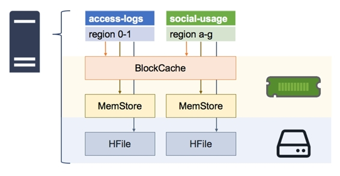
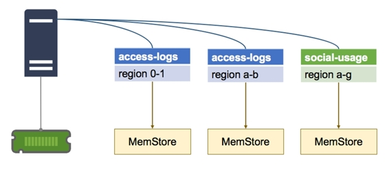
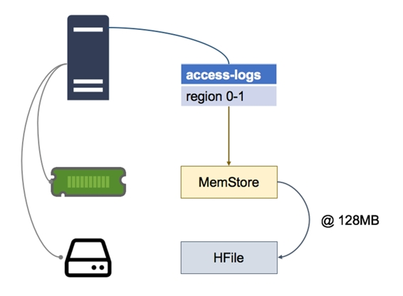
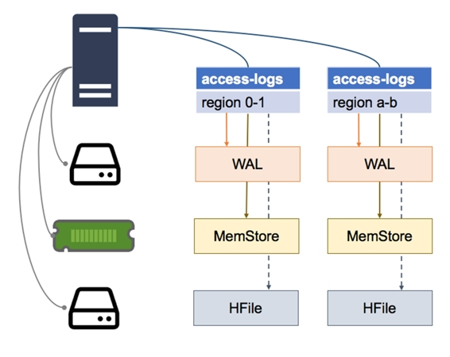
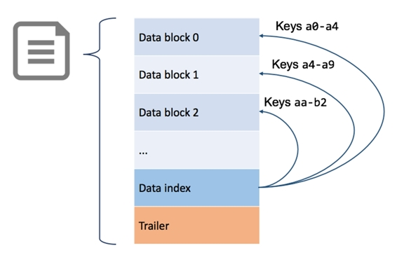
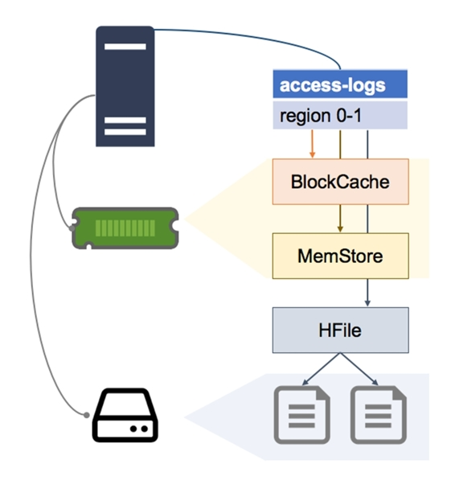

# 八、区域服务器内部

尽管区域服务器利用了 HDFS，因此它与存储层之间的接口清晰明了，但要提供最佳性能，还需要增加复杂性。区域服务器最大限度地减少了与 HDFS 的交互次数，并将热数据保存在缓存中，这样就可以在没有缓慢磁盘读取的情况下提供服务。

每个区域服务器中有两种类型的缓存，如图 10 所示:

 10:区域服务器中的缓存

块缓存是一种读缓存，它将最近提取的数据保存在内存中；MemStore 是一个写缓存，将最近写入的数据保存在内存中；最后，还有 HFile，它包含磁盘上的数据。

了解这些部分如何组合在一起很重要，因为它们会影响性能，并将反馈到您的表设计和性能调整中。

HBase 对最近提取的数据使用内存缓存。每个区域服务器都有一个块缓存，在服务器托管的所有区域之间共享，如图 11 所示:

 11:每台服务器一个块缓存

默认情况下，分配给块缓存的内存是 Java 虚拟机堆的 25%。该大小受到服务器中物理内存的限制，这也是区域数量过多会影响性能的原因之一—所有区域都将争夺有限的内存空间。

当区域服务器收到读取请求时，它会检查块缓存以查看数据是否在内存中。如果是这样，它将返回，读取将非常快。如果没有，则服务器检查该区域的 MemStore，以查看数据最近是否被写入。如果不是，则服务器从磁盘上的相关文件中读取数据。

块缓存使用最近最少使用的回收策略，因此重复访问的数据项会保留在缓存中，不经常使用的数据项会被自动删除(尽管缓存对于高性能至关重要，但 HBase 允许您调整块缓存并使用不同的缓存策略算法)。

MemStore 是一个独立的内存缓存，用于存储最近写入的数据，区域服务器为它托管的每个区域维护一个 MemStore，如图 12 所示:

 12:每个区域一个记忆库

MemStore 有两个用途——第一个是作为缓存，所以最近写入的数据可以在被访问时从内存中取出，这减少了磁盘读取。

MemStore 的第二个更重要的作用是作为写缓冲区。对某个区域的写入不会在收到后立即保存到磁盘上，而是缓冲在内存存储中，一旦缓冲区中的数据达到配置的大小，就会刷新到磁盘上。

默认情况下，当写入缓冲区达到 128 兆字节时，会被刷新，如图 13 所示:

 13:刷新记忆库

MemStore 中的数据在内存中是按行键排序的，因此当它被刷新时，HBase 只需对 HDFS 进行一系列快速、连续的读取来保存数据，这已经是正确的顺序了。

磁盘上的数据称为 HFile，逻辑上，单个 HFile 包含一个表的一个区域中一个列族的所有数据。由于内存存储和缓冲区刷新模式，文件可以由许多物理文件组成，称为存储文件，每个文件包含一次内存存储刷新的数据。

一个 HFile 有多个存储文件会影响读取性能，因为从区域服务器获取可能需要读取磁盘上的许多文件，因此 HBase 会定期压缩存储文件，将小文件合并成一个大文件。

您也可以手动强制压缩(我们将在第 10 章“监控和管理 HBase”中介绍)。在主要压缩之后，每个 hf 文件将包含在磁盘上的单个存储文件中，这对于读取性能来说是最佳的。

在写入数据时对其进行缓冲，并定期将其刷新到磁盘，可以优化区域服务器的写入性能，但也有可能造成数据丢失。如果区域服务器关闭，任何缓冲在内存存储中的写入都将丢失，因为它们不会被保存到磁盘上。

该场景由提前写日志(WAL)覆盖，作为每个地区的单独物理文件存储在 HDFS。数据更新被缓存在 MemStore 中，但是数据更新的请求首先被保存在 WAL 中，所以 WAL 会记录所有缓存在 MemStore 中的更新，如图 14 所示:

 14:预写日志文件

如果一个区域服务器关闭，当该区域被分配给另一个服务器时，它会在使该区域联机之前检查 WAL。如果有更新记录在 WAL 中，新的区域服务器会读取它们，并在区域可用之前将它们全部保存到 HFile 中。

区域服务器在更新提交给 WAL 之前不会确认写请求，并且新的区域服务器在区域联机时不会接受任何请求(包括将 WAL 刷新到磁盘)。

在服务器出现故障的情况下，当其托管区域的数据不可用时，将会有一段时间的停机时间，但数据不会丢失。

HFile 的结构旨在最大限度地减少区域服务器获取数据所需的磁盘读取量。一个 HFile 只包含一个区域中一个列族的数据，因此区域服务器将只访问包含所需数据的文件。

HFiles 中的数据以块的形式存储，并按行键排序。每个 HFile 包含一个索引，其中包含从行键到数据块的指针，如图 15 所示:

15:HFile 的结构

区域服务器将它们所服务的所有区域的 HFile 索引保存在内存中，因此当必须从磁盘读取数据时，读取可以针对包含数据的特定块。

随着时间的推移，一个区域的数据可能会分散到多个来源，这给区域服务器带来了额外的工作，并降低了性能，这称为读取放大。

对于具有密集读写访问的表，区域中的数据可能分散在区域服务器中的所有数据存储中。最近提取的数据将在块缓存中；MemStore 中最近写入的数据；和 hf 文件中的旧数据。

HFile 也可以由多个存储文件组成，对于单个行，我们可以在这些位置中的每一个都有部分数据，如图 16 所示，同一行的不同列分布在四个存储中:

 16:读数放大

对该行的整个列族的读取请求将要求区域服务器从所有这些存储中读取，并合并响应的列。

每个文件有多个存储文件，这意味着一个读取请求可以扩展到多个磁盘读取。在最坏的情况下，当区域被新分配给区域服务器时，文件可能不在本地，这意味着在远程服务器上有多个网络调用和多个磁盘读取。

您可以通过手动运行主要的压缩来修复这种情况下的性能下降，这将在最后一章中介绍。

在本章中，我们查看了区域服务器内部，以了解数据实际上是如何存储在 HBase 中的，以及区域服务器如何处理读写数据的请求。

我们看到，每个区域服务器都有一个读缓存，每个区域都有一个写缓冲区来提高性能，如果服务器出现故障，还有一个提前写日志来确保数据完整性。

最终，数据以 HFiles 存储在磁盘上，其中一个 HFile 逻辑上包含一个表的一个区域中一个列族的所有数据。但是缓冲模式意味着一个逻辑文件可能会被分割成多个存储文件，这会损害读取性能。

在下一章中，我们将研究通过 HMaster Web UI 和 HBase Shell 监控和管理 HBase，包括发现和修复这些性能问题。