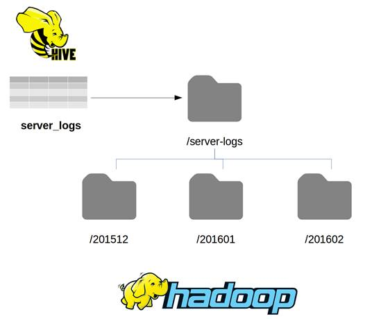

# 四、HDFS 上的外部表

Hive 允许我们编写查询，就好像我们通过在 HDFS 的各种格式上应用固定的模式来访问一致的、结构化的数据存储一样。HiveQL 提供了一个熟悉的、简单的入口点，允许用户运行复杂的查询，而不必理解 Java 或 map/reduce API。

使用 Hive，我们可以将丰富的模型应用于数据，这将简化查询，因为用户使用更高级别的结构，如表和视图，而不需要理解底层数据文件中的属性。

Hive 对大数据问题中的所有主要文件格式都有本地支持——CSV、TSV 和 JSON(以及更奇特的格式，如 ORC 和 Parquet)。与 Hadoop 生态系统中的其他工具一样，Hive 也使用本机支持进行压缩，因此，如果原始数据使用 GZip、BZip2 或 Finder 进行压缩，Hive 无需定制即可访问。

因为 Hive 表和视图描述本质上是在标准的 SQL 中，Hive 元数据充当了 Hadoop 文件的活文档，映射清楚地定义了数据的预期内容。

当您使用 HDFS 作为 Hive 表的后备存储时，实际上是将该表映射到 HDFS 的一个文件夹。因此，如果您使用基于时间的结构将事件驱动的数据附加到文件中，如图 5 所示，您可以在结构中的根文件夹处定义 Hive 表。



 5:映射蜂巢中的 HDFS 文件夹

在这种情况下，可以使用/server/logs 文件夹作为根位置来定义 server_logs 表，当我们查询该表时，所有嵌套文件夹下的所有文件都随时可用。Hive 表定义只指定根文件夹位置，Hive 不会列出文件并构造映射作业来读取它们，直到您提交查询。

服务器日志表已经在配置单元简洁的 Docker 映像中配置好了。这些文件位于 HDFS 文件系统根目录下的数据目录中，并且以 CSV 格式存储。代码清单 23 显示了使用 hdfs dfs -cat 命令的一个文件中的一些示例行。

 23:来自 HDFS 文件的样本行

```
  root@hive:/# hdfs
  dfs -cat /server-logs/server-logs_SCSVR1.csv | head -n SCSVR1,1439546226,W,9c1224a9-294b-40a3-afbb-d7ef99c9b1f49c1224a9-294b-40a3-afbb-d7ef99c9b1f4

  SCSVR1,1427072670,E,99eb03d9-110a-4923-b58e-971656c2046299eb03d9-110a-4923-b58e-971656c20462
  SCSVR1,1448727463,D,44610125-4bdb-4046-b363-aa7a0cd28bde44610125-4bdb-4046-b363-aa7a0cd28bde

```

服务器日志文件的每个日志条目都有一行，条目具有相同的字段，顺序如下:

*   时间戳—日志条目的 UNIX 时间戳。
*   主机名—写入日志的服务器的名称。
*   级别—日志级别，使用标准的 Apache log4*级别(例如，D =调试，W =警告，E =错误)。
*   消息—日志消息。

为了映射 Hive 中的数据，我们需要使用 create external table 语句，该语句指定了字段映射、数据格式和文件位置。代码清单 24 显示了一个创建表的有效语句。

 24:将 HDFS 文件映射为外部表

```
  create external table server_logs 
  (serverid string, loggedat bigint, loglevel
  string, message string)
   row format delimited
   fields terminated by ','
   stored as textfile
   location
  '/server-logs';

```

列是使用位置映射定义的，因此表中的第一列将映射到每行的第一个字段，最后一列将映射到最后一个字段。我们使用的是我们已经看到的一些简单的数据类型——BIGINT 和 STRING——我们将在本章后面处理更复杂的数据类型。

内部表可用的相同文件格式也可以用于外部表。柱状格式(如 ORC 和 Avro)的文件结构是众所周知的——除非您指定存储为 ORC 或 Avro，否则不需要在 Hive 中自定义表。

但是，文本文件可能有任何结构，而 Hive 默认的用换行符分隔行和用\001 分隔字段并不总是合适的。create external table 语句支持告诉 Hive 如何将从 HDFS 获得的数据反序列化为行和列的子句。

代码清单 25 显示了如何映射一个格式不同的文件。这适用于文本文件中的数据，其中行由新行字符分隔，字段由竖线制表符分隔(ASCII 字符 011)，特殊字符用颚化符转义。

 25:为外部表指定分隔符

```
  create external table server_metrics
  (serverId string, recordedAt timestamp, cpuPc
  decimal(3,1), 
   memoryPc decimal(3,1), storagePc decimal(3,1))
  row format delimited
  fields terminated by '\011'
  escaped by '~'
  lines terminated by '\n'
  stored as textfile
  location
  '/server-metrics';

```

Hive 将采用这种不同寻常的格式，并将其映射成可用的行和列。代码清单 26 显示了 HDFS 原始数据的第一行，后面是映射为 Hive 中一行的相同数据。

 26:映射异常文件格式

```
  root@hive:/hive-setup# hdfs dfs
  -cat /server-metrics/server_metrics.txt | head -n 1                                             
  SCSVR1~     LON   2016-01-28
  18:05:01     32.6  64.1  12.2
  > select * from
  server_metrics limit 1;
  +--------------------------+----------------------------+--------------------|
  server_metrics.serverid  | server_metrics.recordedat  | server_metrics.cpupc 
  | server_metrics.memorypc  | server_metrics.storagepc  |
  +--------------------------+----------------------------+-------------------
  | SCSVR1    LON               | 2016-01-28
  18:05:01.0      | 32.6                  | 64.1                     |
  12.2                      |
  +--------------------------+----------------------------+--------------------

```

以下是用于定义外部 HDFS 源结构的条款:

*   ROW FORMAT——对于平面文件为“DECLARED”，对于复杂格式为“SERDE”，带有自定义序列化器/反序列化器(与 JSON 一样，我们将在本章后面看到)。
*   行终止于—数据行之间的分隔符，映射到配置单元表中的行。目前只允许新行(' \n ')字符。
*   字段终止于—数据字段之间的分隔符，映射到配置单元行中的列。
*   转义符—用于转义字段分隔符的字符，例如，如果您的文件是 CSV 文件，您可以用反斜杠转义字段中的逗号，这样“\，”表示字符串字段中的逗号，而不是新字段的开头。

除了 ROW FORMAT 之外的所有子句都采用单个字符，并且对于不可打印的字符，您可以在 ASCII 值中使用反斜杠符号，例如，对于竖排制表符，' \011 '。同样的子句也适用于存储为文本文件的内部文件，如果您希望 Hive 拥有数据，这将非常有用，但是您需要一种可以与其他工具一起使用的自定义格式。

当运行 create external table 语句时，该语句运行时不会进行数据验证。如果 HDFS 文件夹不存在，Hive 将创建该文件夹，但是如果该文件夹存在，Hive 不会检查那里的任何文件，也不会查看文件内容是否具有预期的字段数量。当您查询表时，映射在运行时执行。

在每一行中，Hive 尝试在字段级别映射 HDFS 数据。如果某行缺少字段，则从该字段映射的列将作为该行的 null 返回。如果某行的字段包含 Hive 无法转换为指定列类型的数据，该列将作为该行的空值返回。

在简洁的 Docker 映像中，已经创建了表服务器日志，并且位置文件夹中有几个文件。大多数数据文件都有与外部表定义匹配的有效数据，因此 Hive 可以为这些文件加载所有行中的所有列。

该位置的一个文件格式不正确，消息字段丢失。还要注意，时间戳和服务器名称字段的顺序是错误的。Hive 仍然会尝试从该文件中读取数据，但是，如代码清单 27 所示，一些映射会失败。

 27:映射错误数据

```
  > select * from server_logs;
  +-----------------------+-----------------------+-----------------------+---
  | server_logs.serverid  | server_logs.loggedat 
  | server_logs.loglevel  | server_logs.message  |
  +-----------------------+-----------------------+-----------------------+---
  | 1453562878000         | NULL                 
  | W                     | NULL                 |
  | 1453562879000         | NULL                 
  | F                     | NULL                 |

```

因为 Hive 可以将数值转换为字符串，所以会返回 serverId 列，但是 loggedAt 时间戳为空—Hive 无法将字符串数据转换为长值。而且因为 Hive 即使在发现错误时也继续处理该行，所以 logLevel 字段被映射，但是消息列(CSV 文件中缺少)为空。

如果源的格式不正确，例如，如果一个位置在 Hive 中被映射为 ORC，但数据实际上在文本文件中，Hive 无法读取数据并返回一个错误，如代码清单 28 所示。

 28:映射错误的文件类型

```
  > select * from
  server_logs_orc;

  Error: java.io.IOException:
  java.io.IOException: Malformed ORC file
  file:/server-logs/server_logs_bad.csv. Invalid postscript. (state=,code=0)

```

|  | 提示:如果您试图更改 Hive 中存在的表的文件格式，就会发生这种情况——在 metastore 中预期的格式会被更改，但是现有的文件不会被转换。您可以通过恢复到原始格式来恢复数据。 |

除了基本数据类型(如 INT、STRING 和 DATE，如第 3 章内部配置单元表中所见)之外，配置单元还支持三种复杂的数据类型，可用于表示数据集合:

*   ARRAY—所有元素都具有相同数据类型的有序集合。
*   映射——键值对的无序集合。键必须都具有相同的数据类型(基元类型)，值必须具有相同的数据类型=可以是任何类型。
*   STRUCT—应用了固定结构的元素集合。

从 HDFS 文件映射集合类型时，create external table 语句中的映射必须指定集合元素的分隔符。代码清单 29 显示了包含服务器详细信息的 CSV 文件的内容。

 29:服务器详细信息 CSV

```
  root@hive:/# hdfs
  dfs -cat /servers/servers.csv
  SCSVR1,192.168.2.1:192.168.2.2,8:32:1500,country=gbr:dc=london
  SCSVR2,192.168.20.1:192.168.20.2,4:16:500,country=gbr:dc=london
  SCSVR3,192.168.100.3:192.168.100.4,16:32:500,country=roi:dc=dublin

```

在此文件中，字段用逗号分隔，但在第一个字段之后，每个字段都包含集合。字段 2 包含服务器的 IP 地址，用冒号分隔。字段 3 包含硬件细节，同样用冒号分隔。字段 4 包含作为键值对的服务器位置。

我们可以使用一个 IP 地址数组、一个硬件结构和一个位置映射将这些映射到 Hive 中的相关集合类型。代码清单 30 显示了在创建表时如何指定这些映射。

 30:映射集合列

```
  create external
  table servers
   (name string,
  ipAddresses array<string>, 
    hardware
  struct<cores:int, ram:int, disk:int>, 
    site
  map<string, string>)
  row format
  delimited
  fields terminated
  by ','
  collection items
  terminated by ':'
  map keys
  terminated by '='
  lines terminated
  by '\n'
  stored as textfile
  location
  '/servers';

```

为了识别集合中的分隔符，我们为 Hive 指定了三个子句:

*   字段终止于—字段分隔符，本例中为逗号。
*   COLLECTION ITEMS TERMINATED BY—集合元素的分隔符，在本例中为冒号。
*   映射键终止于-键值对的分隔符，在本例中为等号。

代码清单 31 显示了当我们获取行时，Hive 如何表示集合列。

 31:读取带有集合列的行

```
  > select * from servers limit
  2;
  +---------------+----------------------------------+-------------------------
  | servers.name  |      
  servers.ipaddresses        |         servers.hardware          |          
  servers.site           |
  +---------------+----------------------------------+-------------------------
  | SCSVR1        |
  ["192.168.2.1","192.168.2.2"]    |
  {"cores":8,"ram":32,"disk":1500}  |
  {"country":"gbr","dc":"london"}  |
  | SCSVR2        |
  ["192.168.20.1","192.168.20.2"]  |
  {"cores":4,"ram":16,"disk":500}   |
  {"country":"gbr","dc":"london"}  |
  +---------------+----------------------------------+-------------------------

```

|  | 注意:终止于子句只指定一次，并应用于整个表，这意味着您的分隔符字段在源文件中必须一致。如果您的源有多个复杂类型，它们都必须使用相同的分隔符-在同一个表中，不能用分号分隔数组，也不能用下划线分隔结构。 |

Hive 使用可插拔的序列化/反序列化框架(称为“SerDe”)来读写文本文件。对于所有本机数据类型，Hive 应该使用的 SerDe 将使用存储为子句隐式指定。使用自定义数据类型，您可以提供自己的 SerDe，并在 create table 语句中对其进行配置。

几个开源的 SerDe 组件可以在 Hive 中提供 JSON 文件支持，其中一个最好的允许读写 JSON 的组件来自 [GitHub](https://github.com/rcongiu/Hive-JSON-Serde) 上的 Roberto Congiu。你可以从[罗伯特的网站](http://www.congiu.net/hive-json-serde)下载最新的 Java 档案(JAR)文件。

为了使用定制的 SerDe，您需要向 Hive 注册 JAR 文件，并且您必须从 JSON 格式映射，通常将 JSON 对象表示为嵌套结构。代码清单 32 显示了这些步骤。

 32:使用 JSON SerDe 创建表

```
  > add jar
  /tmp/json-serde-1.3.7-jar-with-dependencies.jar;
  INFO  : Added [/tmp/json-serde-1.3.7-jar-with-dependencies.jar]
  to class path
  INFO  : Added resources:
  [/tmp/json-serde-1.3.7-jar-with-dependencies.jar]
  > create external table devices
  > (device struct<deviceClass:string,
  codeName:string, 
  > firmwareVersions: array<string>,
  cpu:struct<speed:int, cores:int>>)
  > row format serde
  'org.openx.data.jsonserde.JsonSerDe'
  > location '/devices';

```

row format 子句指定了 SerDe 实现(org . openx . data . jsonserde . jsonserde)的类名，像往常一样，location 子句指定了根文件夹。

您可以用不同的方式将源 JSON 数据映射到 Hive 中可用的复杂数据类型，这允许您选择最合适的格式来访问数据。代码清单 33 显示了我的设备表的一个示例 JSON 对象。

33:JSON 源数据示例

```
  {
        "device":
  {
              "deviceClass":
  "tablet",
              "codeName":
  "jericho",
              "firmwareVersions":
  ["1.0.0", "1.0.1"],
              "cpu":
  {
                    "speed":
  900,
                    "cores":
  2
              }
        }
  }

```

根级 JSON 对象的属性可以直接反序列化为基元列，简单集合可以反序列化为数组。您还可以选择将对象反序列化为映射，以便每个属性都呈现为键值对或结构，其中每个值都是已知结构的命名部分。

如何映射列取决于如何使用数据。在这个例子中，我对设备和 cpu 对象使用嵌套结构，对 firmwareVersions 属性使用数组。我们可以从 Hive 中获取整个 JSON 对象，或者我们可以查询属性——如代码清单 34 所示。

 34:查询 JSON

```
  > select * from devices;
  +--------------------------------------------------------------------------|
  {"deviceclass":"tablet","codename":"jericho","firmwareversions":["1.0.0","1.0.1"],"cpu":{"speed":900,"cores":2}} 
  |
  |
  {"deviceclass":"phone","codename":"discus","firmwareversions":["1.4.1","1.5.2"],"cpu":{"speed":1300,"cores":4}}  
  |
  +--------------------------------------------------------------------------
  > select * from devices where device.cpu.speed > 1000;
  +--------------------------------------------------------------------------
  |
  {"deviceclass":"phone","codename":"discus","firmwareversions":["1.4.1","1.5.2"],"cpu":{"speed":1300,"cores":4}} 
  |
  +--------------------------------------------------------------------------

```

|  | 注意:对于带有自定义 SerDe 的文件，不需要存储为和终止于子句，因为 SerDe 需要已知的格式。在这种情况下，JSON SerDe 期望文本文件每行有一个 JSON 对象，这是一种常见的 Hadoop 格式。 |

在 HDFS，在非结构化数据上呈现类似于 SQL 的界面是 Hive 的关键特性之一。在本章中，我们已经看到了如何在 Hive 中定义一个外部表，其中底层数据存在于 HDFS 的一个文件夹中。该文件夹可以包含分割成数千个文件的万亿字节数据，Hive 的批处理特性将允许您查询所有文件。

Hive 支持多种文件格式，包括标准文本文件和更高效的柱状文件类型，如 Parquet 和 ORC。当我们定义外部表时，我们指定如何映射行和列，并且在运行时 Hive 使用相关的反序列化程序来读取数据。插件 SerDe 框架支持自定义序列化。

Hive 中定义的表有一个固定的模式，该模式具有已知的固定数据类型的列。我们可能在关系数据库中找到的常见的原始数据类型是受支持的，但是 Hive 也提供集合数据类型。Hive 中的列可以包含数组、结构或映射，这允许我们在 Hive 中显示复杂的数据，并使用典型的 SQL 语法进行查询。

表结构和读写数据的底层存储处理程序之间的分离意味着，无论 Hive 查询是在内部 Hive 表还是外部 HDFS 文件上运行，它们看起来都是一样的。在下一章中，我们将介绍另一个支持 HBase 的外部表选项。