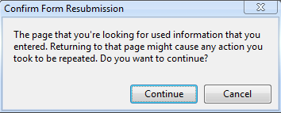

# 二、信息

在本章中，我们将查看 HTTP 事务中交换的消息。我们将学习消息类型、HTTP 头和状态代码。理解 HTTP 消息中的内容对于在网络上工作的开发人员来说至关重要。您不仅可以通过正确的消息类型来构建更好的应用，还可以在 web 应用不工作时发现问题并进行调试。

## 请求和响应

想象一下，在机场走到一个陌生人面前，问:“你知道现在几点了吗？”为了让陌生人在正确的时间做出回应，必须做好几件事。首先，陌生人必须理解你的问题，因为如果他或她不懂英语，他或她可能无法做出任何回应。其次，陌生人需要使用手表或其他计时设备。

这个机场类比类似于 HTTP 的工作原理。作为客户，您需要来自其他方的资源(该资源是关于一天中时间的信息)。所以，你用一种你希望对方能理解的语言和词汇向对方提出要求。如果对方理解你的请求，并且有资源，可以回复。如果它理解请求但没有资源，它仍然可以响应并告诉你它不知道。如果对方不明白你在说什么，你可能得不到任何回应。

HTTP 是一种请求和响应协议。客户端使用服务器能够理解的精心格式化的消息向服务器发送 **HTTP 请求**。服务器通过发送客户端能够理解的 **HTTP 响应**进行响应。请求和响应是**两种不同的** **消息类型**，它们在**单个 HTTP 事务**中交换。HTTP 标准定义了这些请求和响应消息中包含的内容，以便每个说“HTTP”的人都能相互理解并能够交换资源(或者当资源不存在时，服务器仍然可以回复并让您知道)。

## 原始请求和响应

网络浏览器知道如何通过打开与服务器的网络连接并以文本形式发送 HTTP 消息来发送 HTTP 请求。这个请求没有什么神奇的——它只是一个纯 ASCII 文本的命令，并根据 HTTP 规范进行了格式化。任何可以通过网络发送数据的应用都可以发出 HTTP 请求。您甚至可以使用像 Telnet 这样的应用从命令行发出手动请求。正常的远程登录会话通过端口 23 连接，但是正如我们在第一章中所了解的，HTTP 的默认网络端口是端口 80。

下图是一个远程登录会话的屏幕截图，该会话通过端口 80 连接到 odetocode.com，发出一个 HTTP 请求，并接收一个 HTTP 响应。


图 2:发出一个 HTTP 请求

远程登录会话通过键入以下内容开始:

```cs
  telnet www.odetocode.com 80

```

请注意，默认情况下，远程登录客户端不会安装在 Windows 7、Windows Server 2008 R2、Windows Vista 或 Windows Server 2008 上。您可以按照[http://TechNet . Microsoft . com/en-us/library/cc 771275(v = ws . 10)中列出的步骤安装客户端。aspx](http://technet.microsoft.com/en-us/library/cc771275(v=ws.10).aspx) 。

该命令告诉操作系统启动远程登录应用，并告诉远程登录应用通过端口 80 连接到 www.odetocode.com。

一旦远程登录连接，我们可以键入一个 HTTP 请求消息。第一行是通过键入以下文本，然后按**进入**创建的:

```cs
  GET / HTTP/1.1

```

这些信息将告诉服务器我们想要检索位于“/”的资源(即根资源或主页)，我们将使用 HTTP 1.1 特性。我们键入的下一行是:

```cs
  host:www.odetocode.com

```

该主机信息是 HTTP 1.1 请求消息中必需的信息。这样做的技术原因是帮助支持多个网站的服务器，即 www.odetocode.com 和 www.odetofood.com 都可以托管在同一个服务器上，消息中的主机信息将帮助 web 服务器将请求定向到适当的 web 应用。

输入前两行后，我们可以按**进入**两次，将消息发送到服务器。您接下来在远程登录窗口中看到的是来自网络服务器的 HTTP 响应。我们将在后面详细讨论，但是回复说我们想要的资源(www.odetocode.com 的默认主页)已经移动了。它已经搬到了 odetocode.com。现在该由客户端来解析这个响应消息，并向 odetocode.com 而不是 www.odetocode.com 发送请求，如果它想要检索主页的话。任何网络浏览器都会自动转到新位置。

这些类型的“重定向”是常见的，在这种情况下，原因是为了确保所有来自 OdeToCode 的资源请求都通过 odetocode.com，而不是 www.odetocode.com(这是一种搜索引擎优化，称为 URL 规范化)。

现在，我们已经看到了一个原始的 HTTP 请求和响应，让我们深入研究一下具体的片段。

## HTTP 请求方法

输入到远程登录会话中的`GET`字是主要的 **HTTP 方法**之一。每个请求消息必须包含一个 HTTP 方法，该方法告诉服务器请求想要做什么。一个 HTTP `GET`想要获取、提取和检索一个资源。您可以`GET`图像(`GET /logo.png`)或`GET`PDF 文件(`GET /documents/report.pdf`)或服务器可能保存的任何其他可检索资源。下表列出了常见的 HTTP 操作符。

| **方法** | **描述** |
| 得到 | 检索资源 |
| 放 | 存储资源 |
| 删除 | 移除资源 |
| 邮政 | 更新资源 |
| 头 | 检索资源的标题 |

在这五种方法中，只有两种是网络的主要主力:`GET`和`POST`。当网络浏览器想要检索一个资源，比如一个页面，一个图像，一个视频或者一个文档时，它会发出一个`GET`请求。`GET`请求是最常见的请求类型。

当网络浏览器有数据要发送到服务器时，它会发送`POST`请求。例如，在像 Amazon.com 这样的网站上点击“添加到购物车”会向亚马逊提供我们想要购买的信息。`POST`请求通常是由网页上的`<form>`生成的，就像你用`<input>`元素填写的地址和信用卡信息表格一样。

## GET 与安全

HTTP 规范中有一部分谈到了“安全”的 HTTP 方法。**安全方法**顾名思义，不要做任何“不安全”的事情，比如破坏资源、提交信用卡交易或注销账户。`GET`方法是安全的方法之一，因为它应该只检索资源，而不改变资源的状态。发送对 JPG 图像的`GET`请求不会改变图像，只会获取图像进行显示。简而言之，T2 的请求永远不会有副作用。

一个 HTTP `POST`不是一个安全的方法。一个`POST`通常会改变服务器上的一些东西——它更新一个账户，提交一个订单，或者做一些其他的特殊操作。网络浏览器通常对`GET`和`POST`区别对待，因为`GET`是安全的，`POST`是不安全的。刷新由`GET`请求检索的网页是可以的——网络浏览器将重新发出最后一个`GET`请求，并呈现服务器发回的任何内容。然而，如果我们在浏览器中查看的页面是对 HTTP `POST`请求的响应，如果我们尝试刷新页面，浏览器会警告我们。也许你已经在你的网络浏览器中看到过这些类型的警告。



图 3:刷新开机自检请求

由于类似这样的警告，许多网络应用总是试图让客户端查看`GET`请求的结果。当用户点击按钮将`POST`信息发送到服务器(比如提交订单)后，服务器将处理该信息，并通过一个 HTTP 重定向(比如我们在远程登录窗口中看到的重定向)做出响应，告诉浏览器到`GET`其他资源。浏览器会发出`GET`请求，服务器会回复一个“谢谢订单”资源，然后用户可以随意多次安全刷新或打印页面。这是一种常见的网页设计模式，称为`**POST**`**/重定向/** `**GET**`模式。

既然我们对`POST`和`GET`有了更多的了解，那么我们就来谈谈一些常见的场景，看看什么时候使用不同的方法。

## 常见场景—获取

假设您有一个页面，希望用户单击一个链接来查看本系列的第一篇文章。在这种情况下，您只需要一个简单的超链接。

```cs
  <a href="http://odetocode.com/Articles/741.aspx">Part I</a>

```

当用户点击浏览器中的超链接时，浏览器向锚标签的`href`属性中指定的网址发出`GET`请求。该请求如下所示:

```cs
  GET http://odetocode.com/Articles/741.aspx HTTP/1.1
  Host: odetocode.com

```

## 场景—开机自检

现在假设您有一个页面，用户必须填写信息才能创建帐户。填写信息需要`<input>`标签，我们将这些输入嵌套在一个`<form>`标签中，告诉浏览器在哪里提交信息。

```cs
  <form action="/account/create" method="POST">

      <label for="firstName">First name</label>
      <input id="firstName" name="firstName" type="text" />

      <label for="lastName">Last name</label>
      <input id="lastName" name="lastName" type="text" />

      <input type="submit" value="Sign up!"/>

  </form>

```

当用户单击提交按钮时，浏览器意识到该按钮位于表单内部。表单告诉浏览器使用的 HTTP 方法是`POST`，到`POST`的路径是`/account/create`。浏览器发出的实际 HTTP 请求看起来像这样。

```cs
  POST http://localhost:1060/account/create HTTP/1.1
  Host: server.com
  firstName=Scott&lastName=Allen

```

请注意，表单输入包含在 HTTP 消息中。这与我们在[第 1 章](1.html#heading_id_13)中看到的参数在 URL 中的出现方式非常相似。接收这个请求的 web 应用解析这些值并创建用户帐户。然后，应用可以通过多种方式做出响应，但是有三种常见的响应:

1.  用超文本标记语言回应，告诉用户帐户已经创建。这样做将让用户查看`POST`请求的结果，如果他或她刷新页面，这可能会导致问题——它可能会尝试再次注册它们！
2.  像我们之前看到的那样，使用重定向指令进行响应，让浏览器发出一个安全的`GET`页面请求，告知用户帐户已经创建。
3.  回应错误，或重定向到错误页面。我们将在本书的稍后部分研究错误场景。

## 表单和获取请求

第三个场景是搜索场景。在搜索场景中，用户需要一个`<input>`来输入搜索词。它可能如下所示。

```cs
  <form action="/search" method="GET">

       <label for="term">Search:</label>
       <input id="term" name="term" type="text" />
       <input type="submit" value="Sign up!"/>

  </form>

```

注意这个表格上的方法是`GET`，不是`POST`。这是因为搜索是一种安全的检索操作，不像创建账户或预订飞往比利时的航班。浏览器将收集表单中的输入，并向服务器发出`GET`请求:

```cs
  GET http://localhost:1060/search?term=love HTTP/1.1
  Host: searchengine.com

```

请注意，不是将输入值放入消息正文，而是将输入放入 URL 的查询字符串部分。浏览器正在发送`/search?term=love`的`GET`请求。由于搜索词在网址中，用户可以将网址标记为书签，或者复制链接并通过电子邮件发送。用户还可以根据自己的意愿多次刷新页面，这也是因为搜索结果的`GET`操作是安全的，不会破坏或更改数据。

## 方法和资源一词

我们已经谈了很多关于资源作为服务器文件系统上的物理资源的问题。很多时候，像 PDF 文件、视频文件、图像文件和脚本文件*这样的资源确实作为物理文件存在于服务器上。然而，许多现代网络应用内部指向的网址并不真正指向文件。像 ASP.NET 和 Ruby on Rails 这样的技术会拦截对资源的请求，并以它们认为合适的方式做出响应。他们可能会从数据库中读取一个文件，并在 HTTP 响应中返回内容，使其看起来好像资源真的存在于服务器本身上。*

一个很好的例子是我们之前使用的`POST`例子，它导致了对`/account/create`的请求。很可能在“帐户”目录中没有名为“创建”的真实文件。相反，web 服务器上的某个东西接收这个请求，读取并验证用户信息，并在数据库中创建一条记录。`/account/create`资源是虚拟的，不存在。但是，您越是能够将虚拟资源视为真实资源，您的应用架构和设计就越能坚持 HTTP 的优势。

## HTTP 请求头

到目前为止，我们已经看到了一个原始的 HTTP 请求，并讨论了两种流行的 HTTP 方法— `GET`和`POST`。但是正如远程登录输出所示，HTTP 请求消息不仅仅是 HTTP 方法。完整的 HTTP 请求消息由以下部分组成:

```cs
  [method] [URL] [version]
  [headers]

  [body]

```

消息始终是 ASCII 文本，开始行始终包含方法、URL 和 HTTP 版本(最常见的是 1.1，自 1999 年以来一直存在)。最后一部分，主体部分，可以包含像我们前面看到的帐户登录参数这样的数据。上传文件时，正文部分可能会很大。

中间部分，我们看到`Host: odetocode.com`的部分，包含一个或多个 **HTTP 头**(记住，在 HTTP 1.1 中`host`是必选的头)。标头包含有助于服务器处理请求的有用信息。例如，在[第 1 章](1.html#heading_id_18)中，我们讨论了资源表示以及客户机和服务器如何协商资源的最佳表示(内容协商)。例如，如果客户端想要查看法语资源，它可以包括请求法语内容的标题条目(T2 标题)。

```cs
  GET http://odetocode.com/Articles/741.aspx HTTP/1.1
  Host: odetocode.com
  Accept-Language: fr-FR

```

HTTP 规范定义了许多头。有些标头是通用标头，可以出现在请求或响应消息中。一个例子是`Date`表头。客户端或服务器可以包含一个`Date`头，指示它何时创建消息。

```cs
  GET http://odetocode.com/Articles/741.aspx HTTP/1.1
  Host: odetocode.com
  Accept-Language: fr-FR
  Date: Fri, 9 Aug 2002 21:12:00 GMT

```

除了主机头之外的所有东西都是可选的，但是当一个头出现时，它必须遵守标准。例如，HTTP 规范规定日期头的值必须是 RFC822 格式的日期。

下表显示了一些比较流行的请求头。

| **表头** | **描述** |
| 参照(r) | 当用户点击一个链接时，客户端可以在这个标题中发送引用页面的网址。 |
| 用户代理 | 发出请求的用户代理(软件)的相关信息。许多应用使用这个标题中的信息(如果有的话)来找出是哪个浏览器发出的请求(Internet Explorer 6 对 Internet Explorer 9 对 Chrome 等)。). |
| 接受 | 描述用户代理愿意接受的媒体类型。该报头用于内容协商。 |
| 接受-语言 | 描述用户代理喜欢的语言。 |
| 饼干 | 包含 cookie 信息，我们将在后面的章节中讨论。Cookie 信息通常有助于服务器跟踪或识别用户。 |
| 如果-修改-自 | 将包含用户代理上次检索(和缓存)资源的日期。如果从那时起资源被修改过，服务器只需要发回整个资源。 |

完整的 HTTP 请求可能如下所示。

```cs
  GET http://odetocode.com/ HTTP/1.1
  Host: odetocode.com
  Connection: keep-alive
  User-Agent: Mozilla/5.0 (Windows NT 6.1; WOW64) Chrome/16.0.912.75 Safari/535.7
  Accept: text/html,application/xhtml+xml,application/xml;q=0.9,*/*;q=0.8
  Referer: http://www.google.com/url?&q=odetocode
  Accept-Encoding: gzip,deflate,sdch
  Accept-Language: en-US,en;q=0.8
  Accept-Charset: ISO-8859-1,utf-8;q=0.7,*;q=0.3

```

可以看到，有些表头包含多个值，比如`Accept`表头。`Accept`头部是列出了它喜欢看的 MIME 类型，包括 HTML、XHTML、XML，最后是*/*(意思是我最喜欢 HTML，但是你可以发任何东西给我(*/*)，我会努力弄清楚的)。

还要注意一些标题中“`q`”的出现。`q`值始终是一个从 0 到 1 的数字，代表特定值的**质量值**或“相对偏好程度”。默认值为 1.0，数字越大表示偏好越高。

## 反应

HTTP 响应的结构类似于 HTTP 请求。回应的部分包括:

```cs
  [version] [status] [reason]
  [headers]

  [body]

```

对我们列出的最后一个完整请求的完整 HTTP 响应可能如下所示(为了简洁起见，省略了大部分 HTML)。

```cs
  HTTP/1.1 200 OK
  Cache-Control: private
  Content-Type: text/html; charset=utf-8
  Server: Microsoft-IIS/7.0
  X-AspNet-Version: 2.0.50727
  X-Powered-By: ASP.NET
  Date: Sat, 14 Jan 2012 04:00:08 GMT
  Connection: close
  Content-Length: 17151

  <html>
  <head>
      <title>.NET-related Articles, Code and Resources</title>
  </head>
  <body>
   ... content ...
  </body>
  </html>

```

请求的第一行从 HTTP 版本开始，然后是最重要的状态代码和原因。

## 响应状态代码

状态代码是由 HTTP 规范定义的一个数字，所有的数字都属于五个类别之一。

| **范围** | **类别** |
| 100–199 | 报告的 |
| 200–299 | 成功的 |
| 300–399 | 重寄 |
| 400–499 | 客户端错误 |
| 500–599 | 服务器错误 |

虽然我们不会详细说明所有可能的 HTTP 状态代码，但下表将详细说明最常见的代码。

| **代码** | **原因** | **描述** |
| Two hundred | 好 | 每个人都想看到的状态代码。回复中的 200 个代码意味着一切正常！ |
| Three hundred and one | 永久移动 | 资源已经移动到`Location`头中指定的网址，客户端再也不需要检查这个网址了。
我们之前看到过一个这样的例子，我们使用 Telnet，服务器将我们从 www.odetocode.com 重定向到 odetocode.com，给搜索引擎一个规范的 URL。 |
| Three hundred and two | 暂时移动 | 资源已移动到`Location`标题中指定的网址。将来，客户端仍然可以请求网址，因为这是一个临时的移动。
这种类型的响应代码通常在`POST`操作之后使用，将客户端移动到它可以通过`GET`(我们前面谈到的`POST`/重定向/ `GET`模式)检索的资源。 |
| Three hundred and four | 未修改 | 这是服务器告诉客户机，自从客户机上次检索资源以来，资源没有改变，因此它可以只使用本地缓存的副本。 |
| four hundred | 错误的请求 | 服务器无法理解该请求。请求可能使用了不正确的语法。 |
| Four hundred and three | 被禁止的 | 服务器拒绝访问资源。 |
| Four hundred and four | 未发现 | 一个流行的代码表示找不到资源。 |
| Five hundred | 内部服务器错误 | 服务器在处理请求时遇到错误。通常是因为 web 应用中的编程错误。 |
| Five hundred and three | 服务不可用 | 服务器当前不会处理该请求。当服务器因负载过重而限制请求时，可能会出现此状态代码。 |

响应状态代码是 HTTP 消息中非常重要的一部分，因为它们告诉客户端发生了什么(或者在重定向的情况下，下一步该去哪里)。

## HTTP 状态代码与您的应用

请记住，HTTP 状态代码是指示在 HTTP 级别发生了什么的代码。它不一定反映应用内部发生的事情。例如，假设用户向服务器提交了一个登录表单，但没有填写姓氏字段。如果您的应用需要姓氏，它将无法为用户创建帐户。这并不意味着您必须返回一个指示失败的 HTTP 错误代码。您可能希望发生完全相反的情况——您希望用 200(正常)状态代码成功地向客户端返回一些内容。内容将告诉用户没有提供姓氏。从应用的角度来看，该请求是失败的，但从 HTTP 的角度来看，该请求已成功处理。这在 web 应用中是正常的。

## 响应标题

响应包括头部信息，该信息为客户端提供了可用于处理响应的元数据。例如，内容类型将被指定为 MIME 类型，如我们在[第 1 章](1.html#C1MIME)中所述。在下面的响应中，我们可以看到内容类型是 HTML，用于编码类型的字符集是 UTF-8。标题还可以包含关于服务器的信息，如软件的名称和版本。

```cs
  HTTP/1.1 200 OK
  Cache-Control: private
  Content-Type: text/html; charset=utf-8
  Server: Microsoft-IIS/7.0
  X-AspNet-Version: 2.0.50727
  X-Powered-By: ASP.NET
  Date: Sat, 14 Jan 2012 04:00:08 GMT
  Connection: close
  Content-Length: 17151

  <html>
  <head>
      <title>.NET-related Articles, Code and Resources</title>
  </head>
  <body>
   ... content ...
  </body>
  </html>

```

出现的响应头通常取决于响应的类型。例如，重定向响应需要包含一个`Location`头，告诉客户端下一步要去哪里。

有许多头部专门用于缓存和性能优化。`ETag`、`Expires`和`Last-Modified`都提供了关于响应的可缓存性的信息。一个`ETag`是一个标识符，当底层资源改变时它会改变，所以比较`ETag`是一个知道是否有东西需要更新的有效方法。一个`Expires`头告诉客户端缓存一个特定资源需要多长时间。稍后我们将返回并更详细地研究缓存。

## 我们在哪里？

在本章中，我们了解到 HTTP 消息总是成对出现。首先是请求，然后是响应。这些消息中的信息都是可读的文本，有很多工具可以用来检查机器上发出的 HTTP 请求。如果你正在运行 Windows([http://fiddler2.com](http://fiddler2.com))，提琴手就是这样一个工具。它很容易使用，您可以看到原始的 HTTP 请求，包括所有的头。

消息就是要确保交易双方都明白他们收到了什么。HTTP 消息的第一行总是明确表达其意图。在请求消息中，URL 和 HTTP 方法首先出现，以标识特定资源应该发生什么。在响应中，状态代码将指示请求是如何处理的。我们也有双向移动的头，提供更多关于请求和响应的信息。在下一章中，我们将进一步了解这些消息是如何在网络中传播的。