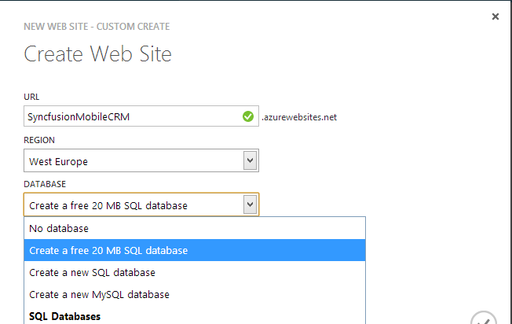
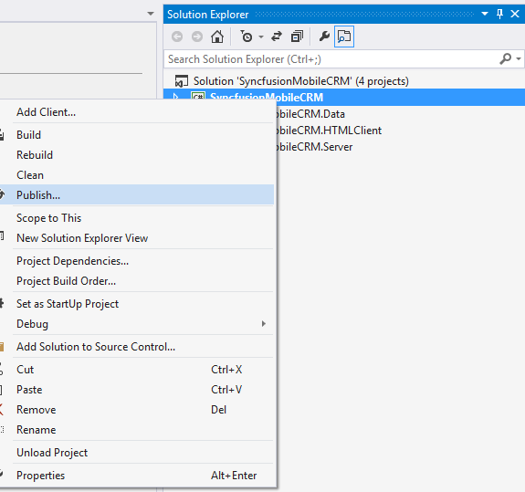

# 七、发布

## 可用的托管选项

软件能够向最终用户交付额外价值的唯一方式是以可交付、可运行的特性的形式。我还没有遇到一个对 sln 文件(一个 Visual Studio 解决方案)感到兴奋的最终用户，所以让我们探索如何将 LightSwitch 项目部署到生产环境中。

LightSwitch 提供了各种现成的受支持的托管环境，无论是内部还是云中。除非您选择连接到现有数据库，否则您的内部数据库(基于您的实体自动创建的数据库)可以部署到 SQL 2008、2012、2013 或 SQL Azure 服务器，并且您的 HTML 项目和中间层可以托管在 IIS、Azure 云服务或 Azure 网站(如果您需要较少的配置)上。

或者，LightSwitch 也允许您创建云业务应用。这允许应用由 Sharepoint 2013 服务器自动托管，无论是在本地还是在外部提供商(如 Office 365)上。

目前，您将坚持使用最简单的解决方案:将应用部署为免费的 Azure 网站。

## 创建蔚蓝网站

要创建一个 Azure 网站，请在[https://manage.windowsazure.com/](https://manage.windowsazure.com/#Workspaces/All/dashboard)登录您的 Azure 帐户仪表板。

从左侧的概述面板中选择网站，然后单击底部的新建。从出现的菜单中，选择自定义创建新网站。

图 95: Azure 仪表板菜单

将出现一个模式对话框，用于配置有关新网站的附加信息，如影响网站 URL 的名称、您选择的数据中心区域(离最终用户越近越好)以及创建新数据库的选项。

图 96:创建网站对话框

在第二步中，您将被要求命名数据库并为其选择一个区域。选择与以前相同的数据中心。短暂的停顿之后，你的网站就准备好了。

## 发布申请

有了支持 Azure 的基础设施，您应该不到一分钟就能准备好展示您的第一个移动业务应用。

将您的构建配置从调试更改为发布，然后在解决方案资源管理器中右键单击 LightSwitch 项目。从上下文菜单中选择发布。

图 97:发布 LightSwitch 应用。

这将打开 LightSwitch 发布应用向导，指导您完成整个过程。

该向导允许您将应用作为一个整体发布，或者仅将中间层部署为 OData 服务。第二个选项卡，应用服务器配置，允许您选择本地安装到 IIS 或部署到 Azure，这当然是您想要选择的选项。如果您没有安装 Azure SDK，Visual Studio 现在将指导您完成所需的安装。

第三个标签，订阅，可能是最节省时间的。

图 98:订阅选项卡

此选项卡允许您从 Visual Studio 中连接到您的 Azure 帐户，以下载有关您的 Azure 帐户的技术信息，而不必手动配置所有内容。首先，单击登录下载设置。这将打开您的浏览器，并在您确认您的 Azure 凭据后，开始为您下载设置文件。从向导中，您现在可以单击导入选项卡来选择该设置文件。

有了这些，向导的其余部分就很简单了。您为网站指定的名称可以从“服务配置”选项卡中选择，并且您创建的数据库的连接将已经填充在“数据连接”选项卡中。

查看摘要页面的潜在错误后，单击发布。Visual Studio 将构建、打包、上传和部署您的应用。数据库项目中的后期部署脚本也将被执行，为您提供相同的示例数据。