# 三、实体设计师

## 创建具有简单和计算属性的任务实体

在**解决方案浏览器**中，右键点击**应用数据**，选择**添加新表**。

我们的第二个实体将被称为*任务*，它将有几个属性。


图 8:实体设计器中的任务实体

对于每个属性，实体设计器显示三列:属性的名称、类型和指示是否需要值的复选框。

当您选择特定属性时，可以在**属性**窗口中编辑其他扩展属性，在该窗口中，您可以更精细地控制实体或其属性的可视化、存储和验证等方式。

例如，我删除了**描述**属性的最大长度，如下图所示。


图 9:清除最大长度

在这里指定描述字段的最大长度是“不要重复你自己”(DRY)原则的一个很好的例子，我在前言中暗示了这一点。在整个应用中，只有一个控制**描述**属性可以有多长的真实来源。这些信息将用于正确创建实际的数据库字段，还将用于在服务器和客户端上实现验证。

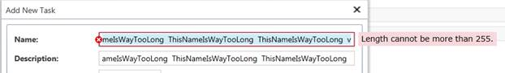

图 10:名称属性的长度验证仍然有效

同样，我将 **PercentageComplete** 属性的值限制在 0 到 100 之间(包括 0 和 100)。

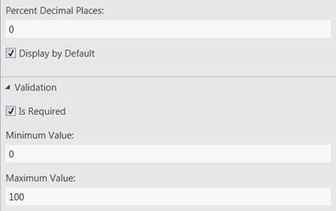

图 11:限制 PercentageComplete 属性的范围

除了验证之外，这些扩展属性还可以用来控制默认情况下该属性在客户端中的可视化方式。**优先级**属性存储为整数，但是通过点击**属性**窗口中的**选择列表**选项，用户可以更直观地看到该属性。


图 12:单击扩展属性面板中的选择列表链接

这将打开一个弹出窗口，您可以在其中定义可用选项及其显示名称。


图 13:限制优先级属性的允许选择

您可能会注意到一些属性的名称旁边有一个图标。看起来像键的图标很简单:它表示一个将在数据库中用作主键列的字段。然而，这个看起来像计算器的图标需要一些额外的解释。

LightSwitch 支持计算属性。这些属性不存储在数据库中，而是在运行时在访问它们的层(客户端或服务器)上计算。通过选择简单属性，然后选择**属性**窗口中的**是计算的**复选框，可以将简单属性转换为计算属性。


图 14:使状态和概要属性成为计算属性

单击**编辑方法**链接访问代码编辑器，在这里您可以实现如何计算该属性的业务逻辑。在下面的代码示例中，我用期望的业务逻辑填充了 LightSwitch 为我创建的空白`State_Compute`方法。

```cs
    namespace LightSwitchApplication
    {
        public partial class Task
        {
            partial void State_Compute(ref string result)
            {
                if(this.PercentageComplete == 100){
                    result = "Complete";
                }
                else
                    if (this.DueDate > DateTime.Today) {
                        if (this.PercentageComplete == 0){
                            result = "Pending...";
                        }
                        else {
                            result = "Started";
                        }
                    }
                    else {
                        result = "Overdue!";
                    }
            }

            partial void Summary_Compute(ref string result)
            {
                result = this.Name + "(" +  this.State + ")";
            }
        }
    }

```

**状态**属性是基于**百分比完成**和**到期日**属性的简单标签。对于任务，我决定计算一个**总结**属性，以帮助将实体表示为字符串。默认情况下，如果实体需要表示为一条线，LightSwitch 会显示第一个`string`属性的值。可以通过选择实体本身并在**属性**窗口中为**摘要属性**选项选择所需的实体属性来覆盖该约定。

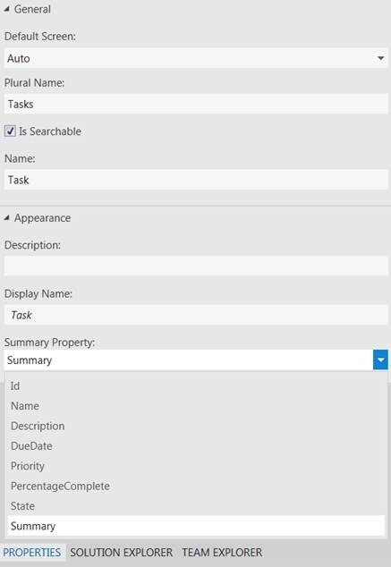

图 15:对于每个实体，您可以选择 Summary 属性

乍一看，实体设计器看起来像一个数据库设计器，但是您真的应该试着把它看作一个域对象设计器，因为这里所做的选择将影响整个应用，而不仅仅是数据库层。这在我们的第三个实体中变得更加明显:人。

## 通过巧妙重用现有业务类型来创建人员实体

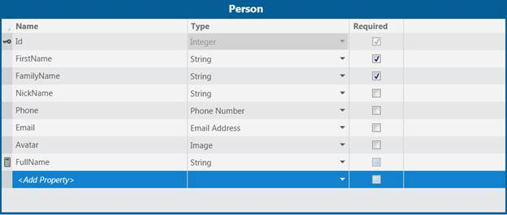

图 16:个人实体的实体设计器

在这个实体中，我们将偏离之前使用的简单属性类型(**布尔**、**日期**、**日期时间**、**小数**、**双**、 **Guid** 、**整数**、**长整数**、**短整数**和**字符串**)并遇到一些您通常在中找不到的类型属性在 LightSwitch 实体设计器中，一个属性类型是**业务类型**。除了已经列出的简单属性类型，LightSwitch 还了解百分比、电子邮件地址、电话号码、金钱的概念、图像是什么以及网址是如何工作的。业务类型带有特定的验证规则，默认情况下通常使用定制的控件来可视化该属性。


图 17: LightSwitch 已经理解了一些特殊的业务类型

如果有一个业务类型是您的业务需要的，但没有包含在 Visual Studio LightSwitch 中，您可以使用扩展性工具包轻松创建自定义业务类型。

## 完全控制

另外，请记住，通过使用**编写代码**按钮，您可以控制应用的任何部分。这个扩展点允许您快速添加逻辑来控制特定属性的计算方式，如前所示，允许您实现业务规则、自定义验证、屏幕级或应用级可视化等等。稍后我将把这个称为*一级扩展性*。

我们可以添加到应用中的这种可扩展性的一个例子是每次创建**项目**时添加一个新任务。通过点击**项目**实体的实体设计器中的**编写代码**按钮，并简单添加以下代码，即可添加该代码:

```cs
    namespace LightSwitchApplication
    {
        public partial class Project
        {

                partial void Project_Created()
                {
                    var firstTask = this.Tasks.AddNew();
                    firstTask.Description = "A first task for every project!";
                    //Fill in other required properties here.
                }

        }
    }

```

当最终用户创建一个新的**项目**时，无论他们是从 UI、后面的代码还是直接用另一个客户端连接到服务器，都会执行这段代码。我们稍后将讨论最后一种情况。

## 别忘了设计关系

在完成对实体设计器的简单介绍并探索我们刚刚构建的应用之前，我们需要定义**项目**、**任务**和**人员**之间的关系。这是通过点击实体设计器工具栏中的**添加关系**按钮来完成的。


图 18:使用实体设计器工具栏定义关系

在打开的**添加新关系**对话框中，可以定义所选实体和任何其他实体之间的新关系。我们现在使用实体设计器来建模我们自己的实体，为这些实体生成表。然而，正如稍后将要描述的，您也可以在数据库或其他已经存在的数据源上对 LightSwitch 实体进行建模。这些可能是没有定义正确关系的旧数据库，不在您的控制之下，无法修改。通过使用 LightSwitch 关系设计器，您仍然可以设计这些实体之间的关系，甚至来自不同数据源的相关实体之间的关系！

在**人**和**任务**之间建立新的关系，这样一个人可以有多个任务，但是一个任务只能分配给一个人。下图显示了如何定义这种关系。

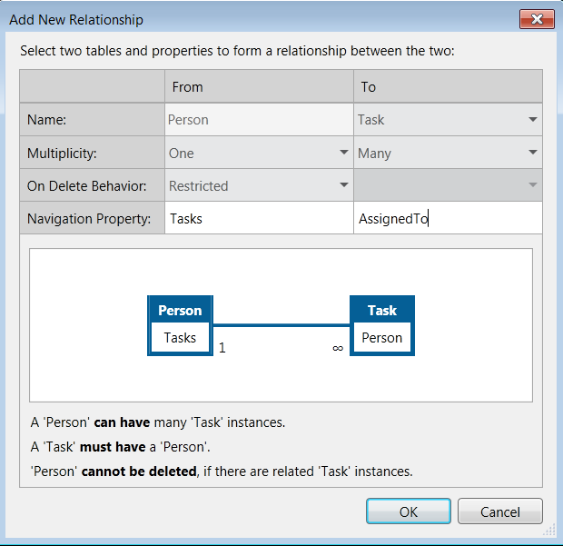

图 19:定义任务和人之间的关系

同样，让我们在**任务**和**项目**之间建立新的关系。因为有些任务被组合在一起，而有些只是小任务，所以**任务**和**项目**之间的关系被定义为“零或一对多”的关系。


图 20:定义任务和项目之间的关系

在定义关系时，您会注意到 LightSwitch 中不直接支持某些关系类型，如“零或一对零或一”、“一对一”和“多对多”，但它们通常可以通过使用链接表和利用一级可扩展性来实现。

为了玩转我们到目前为止设计的应用(我有意使用术语“设计”而不是“编码”)，按照第 2 章[中关于创建屏幕的说明，为各个实体添加两个名为**所有人**和**所有任务**的**列表和详细信息**屏幕。](2.html#heading_id_8)

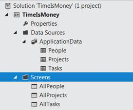

图 21:具有三个实体和相应屏幕的应用

恭喜你，你现在有了一个全面运行的应用来帮助你重新控制你的时间！如下图所示，我在应用中添加了两个任务:*创建一些实体*和*洗碗*。请随意创建您自己的测试数据和任务。

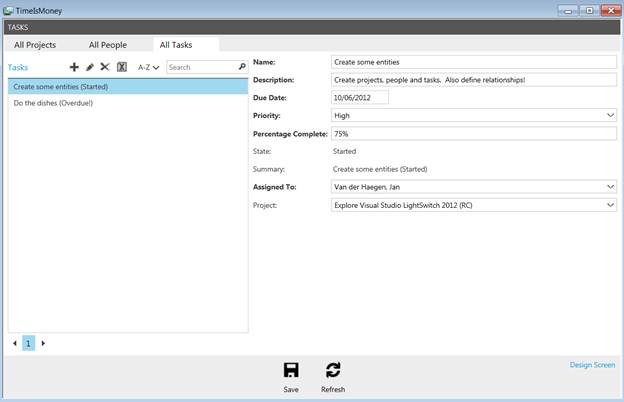

图 22:我们的第一个应用

在继续之前，我想强调的是，实体设计器应该被视为业务实体(域模型)设计器，而不是数据库设计器。

在实体设计器中设计的业务实体、它们的属性、它们的属性的业务类型及其扩展属性(包括验证)由 LightSwitch 在数据层、服务器和客户端的整个应用中使用。

## 数据输入

一个应用中的数据必须可以在另一个应用中访问，这是常见的情况。LightSwitch 应用远离孤立的数据孤岛，IDE 对数据输入和数据输出场景都有现成的支持。

要探索前者，请记住我们方便地单击了 LightSwitch 主屏幕上的**创建新表**链接，并开始设计我们的第一个实体。

默认情况下，这些实体将存储在名为**应用数据**的内部数据源中。

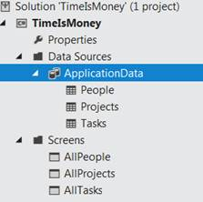

图 23:一个 LightSwitch 项目中可以有许多数据源

如果您想使用 LightSwitch 处理现有数据，请使用 LightSwitch 主屏幕上的第二个链接— **连接到外部数据源**。这将启动一个向导，帮助您连接到以下来源之一:

*   现有数据库。
*   一个 SharePoint 网站。
*   OData 端点。
*   WCF 放射免疫服务。


图 24:数据源向导帮助您连接到外部数据源

**附加数据源向导**将向您的应用添加一个非内部数据源，并允许您在数据上设计业务实体，但有一些验证限制(选项，如“是否需要属性”、“最大长度”，以及属性的兼容业务类型取决于源数据类型)。

## 去 OData 还是不去 OData

Visual Studio LightSwitch 2012 保留了在 LightSwitch 1.0 中连接到 OData 服务的选项。


图 25:开放数据协议

OData 是开放数据协议的缩写，是一个行业标准，在过去几年中迅速兴起，现在被广泛采用作为网络数据交换的标准方式。从技术上讲，它是微软定义的一个协议，定义了一个 REST 实现。在 OData 网页上，你可以找到一个不断增长的 OData 生产者[列表](http://www.odata.org/ecosystem#liveservices)，包括 SSRS(SQL Server Reporting Services)、微软 Dynamics CRM 2011、Windows Azure 表存储和著名的 Northwind 数据库。

如果要测试这个数据输入场景，在**附加数据源向导**中选择 **OData 服务**选项，然后点击**下一步**。

在**连接信息**中，使用以下 OData 端点作为您的 **OData 源地址**:[http://services.odata.org/Northwind/Northwind.svc/](http://services.odata.org/Northwind/Northwind.svc/)。这个端点不需要认证，所以选择**无**作为选择的**登录信息**，然后点击**下一步**。

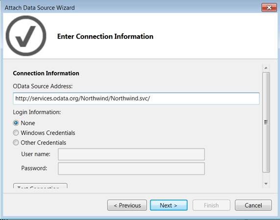

图 26:连接到外部 OData 服务

一旦成功建立连接，LightSwitch 就会调查数据源的元数据，并允许您将一个或多个数据实体作为业务实体导入。

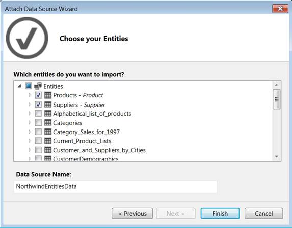

图 27:定义要导入的实体

选中**供应商**复选框；**产品**也会因为二者的关系自动导入，然后点击**下一步**完成向导。

请注意，虽然**供应商**实体的**电话**属性的数据类型是**字符串**，但是您可以使用**实体设计器**将其重新映射到**电话号码**业务类型。


图 28:将数据类型重新映射到业务类型

## 数据输出

另一个现成的特性是支持的数据输出场景。对于您的每一个数据源，无论是内在的还是非内在的，LightSwitch 都会生成并托管一个 OData 端点，该端点公开您的业务实体。

端点可以在 http:// <urltotheapplication>/ <datasourcename>找到。</datasourcename></urltotheapplication>


图 29:浏览到 OData 端点

如果生成的 Silverlight 应用不符合您的业务需求，您可以通过许多其他客户端技术来访问这些 OData 端点，包括(但不限于):

*   Excel PowerPivot: [创建和使用 LightSwitch OData 服务](http://blogs.msdn.com/b/bethmassi/archive/2012/03/09/creating-and-consuming-lightswitch-odata-services.aspx)
*   Windows 8: [在 Windows 8 Metro 风格的应用中使用 LightSwitch OData 服务](http://blogs.msdn.com/b/lightswitch/archive/2012/03/13/using-lightswitch-odata-services-in-a-windows-8-metro-style-application-elizabeth-maher.aspx)
*   Windows Phone: [从 Windows Phone 应用中使用 LightSwitch OData 服务](http://msdn.microsoft.com/en-us/magazine/hh875176.aspx)
*   一个完整的 CRUD Data.js 和淘汰赛。仅使用 HTML 页面的 Js LightSwitch 示例
*   jQuery Mobile: [一款全 CRUD LightSwitch jQuery 移动应用](http://lightswitchhelpwebsite.com/Blog/tabid/61/EntryId/126/A-Full-CRUD-LightSwitch-JQuery-Mobile-Application.aspx)
*   安卓:[使用安卓 App Inventor 与 LightSwitch 通信](http://lightswitchhelpwebsite.com/Blog/tabid/61/EntryId/125/Communicating-With-LightSwitch-Using-Android-App-Inventor.aspx)
*   Unity 3D: [使用 Visual Studio LightSwitch 编排 Unity 3D 游戏](http://lightswitchhelpwebsite.com/Blog/tabid/61/EntryId/134/Using-Visual-Studio-LightSwitch-To-Orchestrate-A-Unity-3D-Game.aspx)

关于这些 OData 端点，需要注意的一点是，它们并不只是公开您的数据，而是公开您的业务实体的业务逻辑、安全设置以及默认或编码的验证规则。

## 混合数据输入和数据输出

使用 LightSwitch 的一个强大方法是将其与其他技术结合使用，将数据输入和数据输出场景结合起来。由于可以选择在 LightSwitch 中间层使用 OData，LightSwitch 不仅可以用来创建简单的 CRUD 应用，还可以用来完成复杂的数据生态系统。

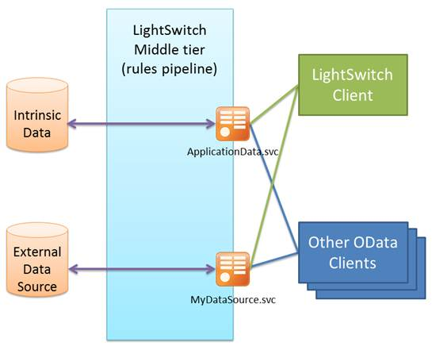

图 30:数据输入和数据输出场景之间的 LightSwitch 混搭

使用 LightSwitch 的另一个强大方法是仅将其用于数据输入和数据输出功能。这使得将旧的 WCF RIA 服务或 SQL 数据库转换为 OData 服务变得容易，或者向外部方提供内部 SharePoint 网站的有限视图。

上面的图片和链接都是贝丝·马西收集的(见[第 7 章](7.html#heading_id_49))。