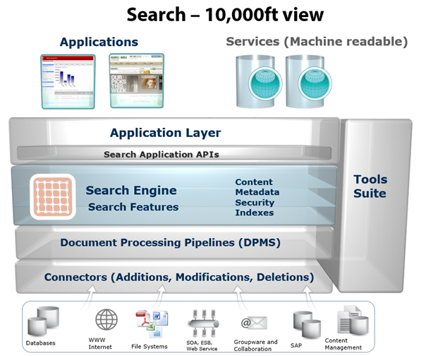
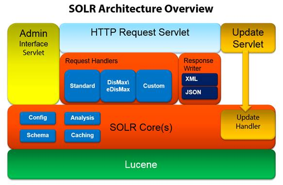

# 二、企业搜索应用的架构

## 地点和方式

从架构的角度来看，有两个不同的领域需要讨论。第一个是**搜索引擎适合你的解决方案，第二个是索尔架构的**如何**。**

 **### 放置搜索引擎

让我们看看下图，我喜欢称之为 10，000 英尺视图的搜索应用程序。

图 3:应用程序架构

很明显，应用程序架构可能会有很大的不同，但是让我们在这里做一些假设，并从图表的顶部开始，在某种程度上概括一些最常见的用例。

我们可以假设我们的应用程序将有一个用户界面，它可以用 ASP.NET 网络表单、MVC、AngularJS、PHP 或许多其他用户界面框架来构建。我们的应用程序还有一个应用编程接口，可以用于连接其他应用程序，如 iOS 或安卓移动应用程序。

最终我们得到了申请，这可能是你的主要收入来源，你为此感到非常自豪。如果你像我发现 Solr 之前一样，你可能有一些非常好的东西，但是那些技术元素就是感觉不太对劲。你甚至可能提供了一个不太好的用户体验，让一些甚至几千名用户感到沮丧。

这是搜索的切入点。您通过搜索应用编程接口连接到搜索引擎。Solr 为您的需求提供了一个创新的 RESTful 界面，或者您可以选择像 SolrNet 或 SolrJ 这样的客户端。这意味着您的应用程序可以运行一两个查询，细化并向用户提供精确的结果**内容**的**索引**，并通过使用**元数据**以适当的**安全等级**检索所需的结果。

让我们先来看看图表的底部，了解一下可以为您的搜索引擎提供数据的多个数据源。大多数应用程序从数据库中获取数据，如 SQL Server 或 MySQL。但是，在许多情况下，他们也可能从 NoSQL 数据库、内容源、其他应用程序(如内容管理系统)或文件系统中获取信息。

有多种方法可以检索我们将要添加到搜索引擎中的数据。其中之一就是所谓的连接器，它从存储中检索数据，并将其提供给文档处理管道。

文档处理管道，也称为 DPMS，从数据源获取内容，执行任何必要的转换，并准备将数据提供给搜索引擎。

### 搜索引擎内部

Solr 托管在应用程序容器中，可以是 [Jetty](http://eclipse.org/jetty/) 或 [Tomcat](http://tomcat.apache.org/) 。对于那些对 Jetty 或 Tomcat 几乎没有经验的人来说，它们就像[互联网信息服务](http://www.iis.net/) (IIS)或 [nginx](http://nginx.org/) 一样是网络服务器。

出于开发目的，Solr 提供了 Jetty 开箱即用的一个非常易于使用的单行启动命令。然而，如果你想在 Tomcat 中托管，你需要 Solr.war。战争代表网络应用档案。

现在让我们从底部开始，看看架构。

图 4: Solr 架构

第一点也是最重要的一点是，Lucene，一个免费的开源信息检索软件库，是为 Solr 提供动力的实际搜索引擎。这是如此重要的一点；Solr 实际上已经成为更大的 Apache Lucene 项目的一部分。

当我第一次在 [Lucene](http://lucene.apache.org/solr/) 内发现 Solr 时，它真的引起了我的注意，以至于我不得不进一步调查它，我很高兴我选择这样做。Lucene 是用 Java 编写的，最初是由 Doug Cutting 在 1999 年创建的，此后被移植到多种其他语言中。然而，Solr 继续使用 Java 版本。

还有许多其他项目扩展和构建了 Lucene 的功能。其中之一就是 ElasticSearch，它甚至是一个很好的 Solr 竞争者(尽管论点被接受)。

在 Lucene 之上，我们有 Solr 核心，它运行 Lucene 索引的一个实例，并记录所有 Solr 配置文件。查询按照 Lucene 预期的方式进行格式化和扩展，这意味着您不需要手动进行(这可能既繁琐又复杂)。这些查询是在文件 *schema.xml* 和 *solrconfig.xml* 中配置和管理的(以及如何扩展它们和配置模式细节)。在更简单的部署中，您通常可以只修改这两个文件。以下是对每一个目的的简短解释:

*   Schema.xml 包含所有关于文档可以包含哪些字段以及在向索引添加文档或查询这些字段时应该如何访问这些字段的详细信息。
*   Solrconfig.xml 是包含用于配置 Solr 本身的大部分参数的文件。

如果您查看图 4 中 Solr 架构图中的 Solr 核心，您可以看到分析和缓存所在的位置。分析负责在查询或索引期间处理字段。缓存可以提高性能。

最初，Solr 只支持单核，但最近的版本可以支持多核，每个内核的所有组件在架构图中都以橙色显示。Solr 也经常使用“收藏”这个词；在 Solr-speak 中，集合是可以分布在多个服务器上的单个索引。当您下载并启动 Solr 时，它附带了一个名为 collection1 的示例索引，您也可以将其称为 core。

为了清楚起见，让我们定义一些常见的 Solr 命名法:

*   核心:物理搜索索引。
*   集合:可以由多个核心组成的逻辑搜索索引。

当您引入 SolrCloud 复制并开始谈论碎片、领导者、副本、节点、集群和 ZooKeeper 时，事情变得有点复杂；然而，这些都是属于第二本关于这个主题的书的高级概念。

请求处理程序负责定义为 Solr 接收的任何请求执行的逻辑。这包括查询和索引更新。

一旦收到查询，查询解析器就会对其进行处理。有许多可用的解析器，例如最常用的标准查询解析器、DisMax 和 eDisMax。但是，如果您愿意，您可以创建自己的自定义解析器。

在 Solr 1.3 和更早版本中，创建自定义解析器是唯一的出路。从 1.3 版本开始，DisMax 成为了默认的查询解析器，同时仍然保持了在需要时定制东西的能力。

响应编写器负责准备以多种格式发送回客户端的数据，例如，JSON 或基于 XML 的数据。

HTTP 请求 servlet 是您连接到 Solr 的地方，更新 servlet 用于通过更新处理程序修改您的数据。

|  | 注意:如果“servlet”这个词很奇怪，不用担心。将 servlet 视为 web 服务器上的端点。Servlets 是 Java 世界特有的，类似于其他 web 技术中的控制器。 |

最终，我们到达了管理界面 servlet，它提供了 Solr 的默认管理用户界面，一旦您部署了搜索引擎，您将会依赖它。

我们可以轻松地一层又一层地剥离，进入越来越复杂和高级的功能。然而，这不是本书的目的，所以我们将把细节保持在一个合理的简单水平。**