# 第三章 Solr 配置

## 获得 Solr

获得 Solr 工作安装的第一步是实际下载，可以在这里进行。你也可以通过在你最喜欢的网络搜索引擎中键入“下载 Solr”来找到它。

图 5: Solr 主页

单击**下载**，这样您将被重定向到适当的镜像站点，以下载 Solr 的最新版本。在这种情况下，由于我正在运行 Windows，我将下载 zip 文件， **solr-4.10.2.zip** 。源代码也可以在 **solr-4.10.2-src.tgz** 下载，如果你需要老版本的 Apache Solr，可以去 Apache 档案馆。

由于文件大小为 150 MB，下载该文件可能需要一些时间。当你等待的时候，现在是开始检查你的先决条件的好时机，主要是 Java。在旧版本中，您可以在 Java 1.6 上运行，但是在 Solr 4.8 和更高版本中，您需要 Java 7(希望更新 55 或更高版本，因为在以前的版本中有已知的错误)。在撰写本书时，4.10.2 是 Solr 的最新版本。

要确认您安装了正确的 Java，请打开 Windows 命令行，这可以通过 Windows 键 **+ R** 或在开始菜单或运行屏幕中键入 **`cmd`** 来完成。现在，在命令行中，请键入`java –version`。响应将告诉您正在运行哪个版本的 Java。A **`‘`** `java’ is not recognized as an internal or external command`响应表示 Java 没有正确安装。请回到 Java 的安装说明，确保环境变量 PATH 正确指向 Java 目录。正确的安装将显示以下内容:

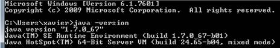

图 6:运行“java 版本”应该看到的输出

我有 Java 1.6 更新 67，这意味着我可以走了。

下载完成后，将所有内容提取到硬盘根目录下名为*c:\ Solr-简洁地说就是*的文件夹中。

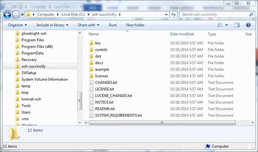

图 7:解压后的 Solr

在**Solr-简洁地说**目录中，你会找到几个文件夹和文件。首先，有几个文本文件，包括更改、许可证、通知、自述文件和系统要求。

在**示例**文件夹中，您会发现一个完全独立的 Solr 安装。它配有一个示例配置、要索引的文档和一个名为 Jetty 的网络应用服务器，用于直接运行开箱即用的 Solr。请记住，如果您是. NET 开发人员，Jetty 将相当于 IIS。

这个发行版提供的 Jetty 应用程序网络服务器是为了开发目的。但是，当您达到那个点时，有相同软件的完整发行版可供生产使用。

在 **dist** 文件夹中，应该会找到一个名为 **Solr.war** 的文件；这是您部署到应用服务器上的主要 Solr 应用程序，以便运行 Apache Solr。这个文件夹还包含许多有用的 JAR 文件。澄清一下，JAR (Java Archive)是一种包文件格式，通常用于聚合许多 Java 类文件以及相关的元数据和资源(如文本、图像等)。)整合到一个文件中，以在 Java 平台上分发应用软件或库。

在 **contrib** 文件夹中，应该可以找到 Solr 的投稿模块。与许多开源项目一样，您将在这里发现对 Solr 的扩展。这些 contrib 模块的可运行 Java 文件实际上在**区**文件夹中。

在**文档**文件夹中，你会发现 HTML 文件和资产，这将增加你对 Solr 的理解。你会发现一个好的、快速的教程，当然还有 Solr 的核心 API 文档。

我见过一些人只复制**示例**文件夹来启动 Solr，尤其是在开发的本地部署期间。它是可行的，但是会给你带来很多问题，因为你几乎肯定需要依赖它来使事情正确运行。最好总是复制下载的 zip 文件的全部内容。然而，路径是相对的，这意味着您可以很容易地将**示例**重命名为更有意义的东西，而不会引起任何重大问题。

为了我在本书中的目的，我将简单地给我克隆的文件夹**重新命名为**。

## 起动 Solr

现在我们有了索尔，让我们点燃它，让聚会开始吧！

在这一点上，你可能会期待一个 solrinstaller.exe。事情不是这样的。有点不一样，虽然一点也不复杂。

我们现在准备使用包含的应用程序 web 服务器 Jetty 运行 Solr 开发环境。一句忠告:Jetty 包含在 Solr 中，但它不是唯一的选择。我也将 Tomcat 用于生产目的，还有其他替代方法。捆绑 Jetty 只是让快速入门变得简单了很多。

我现在使用的是 Windows，但是其他操作系统的过程非常相似。

步骤非常简单:

1.  打开命令行，在 Windows Run 对话框中输入 **`cmd`** 即可。运行对话框可以用窗口键+显示
2.  将文件夹更改为您之前创建的文件夹，在那里您提取了 Solr。然后，简洁地进入**文件夹，这是你最近从**示例**中克隆的。**
***   现在运行`java -jar start.jar`。如果一切按预期进行，控制台将开始加载。初始化步骤将显示在命令行中；请期待显示大量文本。这很正常。**

 **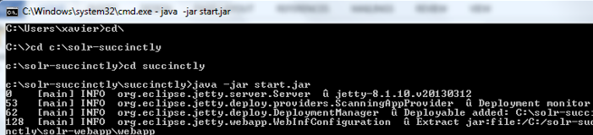

图 8:启动 Solr

4.  最后，设置最重要的部分:打开浏览器，导航至[http://localhost:8983/Solr](http://localhost:8983/solr)。如果您看到以下内容，您应该会微笑，因为您正在运行 Apache Solr:

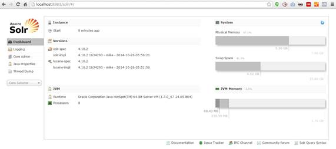

图 9: Solr 启动并运行

如果您在浏览器中没有看到图 9 中的屏幕，或者如果 Solr 没有加载，请查看控制台中的文本输出。异常在消息中是可见的——尽管有时很难找到。Solr 不加载的最可能的情况是配置文件中有错误，这很可能是由于在实验过程中所做的更改。

## 在不同的端口配置 Solr

现在是时候学习如何对 Solr 进行配置更改了。对于我们的第一个示例，我们将执行一个非常简单的更改，从不同的网络端口运行它。这种变化是一种常见的情况，通常是公司防火墙规则之类的东西所需要的。以下步骤将指导您完成此过程:

1.  使用视窗浏览器导航至**等**文件夹。
2.  用您选择的文本编辑器打开 **jetty.xml** 配置文件。记事本++是很好的推荐。
3.  查找单词*端口*，在节点`<New class="org.eclipse.jetty.server.bio.SocketConnector">`内，您将看到一个默认端口为 8983 的子节点。请确保您更换的是正确的，而不是注释掉的。
4.  换成 8984。
5.  回到管理界面，修改你的网址指向新的端口，并刷新。

图 10:另一个端口中的 Solr

如您所见，新端口还没有像预期的那样工作。你需要重启 Solr。这是**而不是**的热交换变化！

要停止当前的 Solr 实例，您需要切换到启动 Solr 的窗口，然后按下 **Ctrl + C** ，这样服务就会关闭。然后使用与之前相同的命令`java-jar start.jar`重新启动。Solr 将开始。现在，如果你刷新你的浏览器，你会再次看到 Apache Solr，就这么简单。

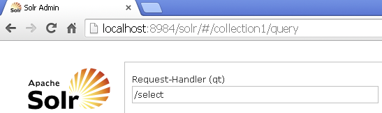

图 11:重新启动 Solr

此时，我将恢复使用默认端口 8983，并重新启动 Solr。这些步骤仅适用于将 Jetty 用作应用程序 web 容器的情况。如果您使用 Tomcat 或其他容器，您将需要使用不同的配置说明。

## 索尔的管理界面

Solr 具有网络界面，管理员和程序员可以轻松查看 Solr 配置详细信息、运行查询、分析文档字段、微调 Solr 实例，以及访问在线文档和帮助。如图 12 所示，管理部分由仪表板、日志记录、核心管理、Java 属性和线程转储组成。还有具有多种不同功能的核心选择器(下拉列表)，以及菜单右侧的主工作窗格。

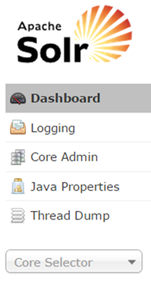

图 12-Solr 菜单

如果您已经将浏览器指向[http://localhost:8983/Solr](http://localhost:8983/solr)，那么您就可以依次查看每个部分了。

### 获得帮助

在主工作窗格下面，你会看到一个小的图标驱动的菜单。

该菜单的主要目的是让您快速访问 Solr 用户可用的各种帮助和协助资源。它由文档组成，托管在[这里](http://lucene.apache.org/solr/)，并且有指向位于 JIRA 网络上的官方问题跟踪器的链接。还有到 Solr IRC 频道、社区论坛和 Solr 查询语法指南的链接，所有这些都将非常有用。

图 13: Solr 的工作窗格菜单

### 仪表盘

仪表板是导航到管理用户界面时加载的默认部分。它显示它在实例、系统和 Java 虚拟机(JVM)上收集的信息。根据您的配置，已观察到当 Windows 虚拟内存设置为自动时，或者当系统配置为不使用交换内存时，内存图可能不会显示信息。

### 测井

日志部分显示来自 Solr 日志文件的消息。当你启动 Solr 时，你只有一个内核，但是如果你有多个内核，那么所有的消息都会显示出来。

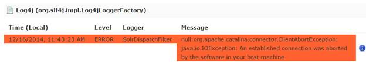

图 14: Solr 日志

在日志菜单项下，您可以看到实例的类映射和类名的层次结构。单击右侧的列，从全部、跟踪、调试、信息、警告、错误、致命、关闭和取消设置中选择日志记录级别，如图 15 所示。

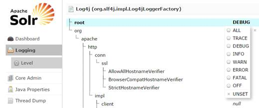

图 15: Solr 日志层次结构

### 核心管理员

您可能还记得上一节，我们提到了 Lucene 内核。核心是 Lucene 索引的完整副本，它有自己的模式和配置。

您可以在核心管理部分管理您的核心。顶部的按钮允许您添加内核、卸载一个现有内核、重命名内核、交换内核、使用自上次重新加载以来所做的任何更改重新加载内核，以及优化内核。

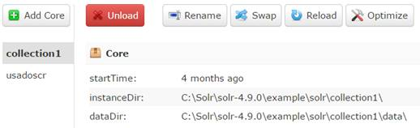

图 16:核心管理

|  | 提示:当您单击重新加载按钮时，您必须等待按钮变绿，否则您的更改将不会生效。这里的命令与核心管理处理程序提供的命令相同，但是它们以一种易于使用的方式提供。如果加载核心时出现问题，您将在日志中看到异常，或者如果您从控制台启动，命令也将显示在那里。重启 Solr 也会加载所有内核，包括新的内核。 |

### Java 属性

“Java 属性”屏幕允许以只读方式轻松访问顶级 Solr 系统中最重要的组件之一。它允许您查看运行 Solr 的 JVM 的所有属性，包括类路径、文件编码、JVM 内存设置、操作系统等等。

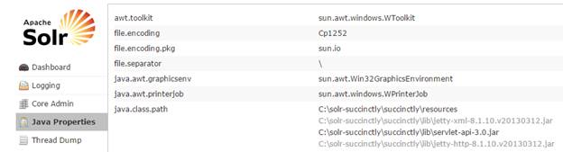

图 17: Java 属性线程转储

“线程转储”屏幕允许您检查服务器中当前活动的线程。列出了每个线程，并且在适用的情况下可以访问堆栈跟踪。还有一个指示状态的图标；例如，绿色复选标记表示可运行状态。可用状态有新的、可运行的、锁定的、等待的、时间等待的和终止的。

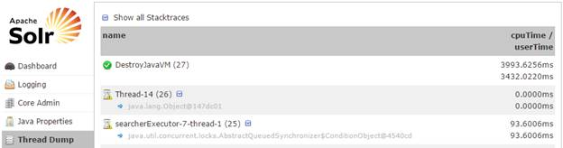

图 18:线程转储

### 核心选择器

核心选择器允许您选择或查找特定的核心。点击**核心选择器**，出现下拉菜单。您可以开始键入内核的名称，这在您有许多内核时会很方便，或者您可以单击所需内核的名称。一旦你选择了你的核心，你将能够执行核心特定的功能。当您单击核心时，它将首先显示概述以及该特定核心的统计信息。

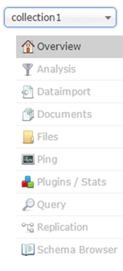

图 19:核心下拉菜单

#### 分析

“分析”屏幕允许您根据 schema.xml 中的字段、字段类型和动态角色配置，检查在索引或查询期间如何处理数据。理想情况下，您希望内容得到一致的处理，并且该屏幕允许您在字段类型或字段分析链中验证它们。

出于调试目的选择分析仪时，该屏幕对于开发也非常有用。分析器将在本书后面提到。

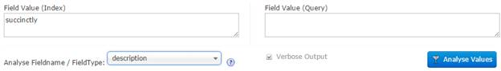

图 20:分析

#### 数据导入

一些最常见的数据源包括 XML 文件和关系数据库。因此，我们需要一种简单的方法将数据库和 XML 文件导入到 Solr 中。这是使用 DIH 或数据导入处理程序实现的。它提供了一种配置驱动的方式，可以在完整构建和增量增量导入中将数据导入 Solr。管理界面中的 DIH 向您显示了有关数据导入处理程序当前状态的信息。

在当前实例中，没有配置数据导入处理程序，本书也不会涉及它们。但是，如果您想学习如何配置和使用数据导入处理程序，您当前的 Solr 下载附带了一个预定义的示例，很容易启动和测试。请到**C:\ Solr-简洁\example\** 中的**示例-DIH** 文件夹，打开 **Readme.txt** 。按照您在那里找到的说明开始。

#### 文档

“文档”屏幕允许您直接从浏览器执行多种格式的 Solr 索引命令。它允许您复制或上传文档、JSON、CSV 和 XML，并将它们提交给索引。您也可以通过选择字段和字段值来构造文档。您应该总是通过在*请求处理程序(qt)* 文本框中键入处理程序的名称来定义要使用的请求处理程序。默认情况下，将定义*/更新*。

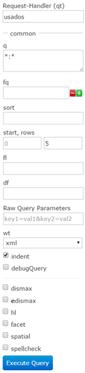

图 21:请求处理器

#### 文件

“文件”屏幕用于浏览和查看特定核心的各种配置文件(例如，solrconfig.xml 和 schema.xml)。它是只读的，这是一种无需登录机器就能访问文件的好方法。

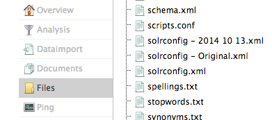

图 22:文件屏幕

#### 砰

您可以 ping 通特定的核心，并确定它是否处于活动状态。使用起来非常简单；只需点击这个选项，它就会告诉你它需要多少毫秒来响应。

#### 插件和统计

插件和统计信息显示显示了统计信息，如缓存、搜索的状态和性能，以及搜索和请求处理程序的处理程序配置。加载页面时会拍摄快照，您可以通过单击标记的菜单项来观察更改或刷新值。

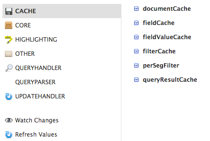

图 23:插件和统计

#### 询问

查询部分可能是管理用户界面最重要的部分之一。这是您提交结构化查询并分析结果的地方。管理用户界面包括一组用于多个可用参数的选项，以简化用户的生活，包括:

*   **请求处理程序(qt):** 指定要使用的请求处理程序；如果没有指定，它将使用标准。
*   **q:** 查询，对于该查询，返回的结果将从最相关到最不相关进行排序。
*   **fq:** 过滤查询，基本用于缩小结果集。与 q 的区别在于 fq 不影响排名。
*   **排序:**告诉 Solr 您希望对哪个字段应用排序，升序还是降序。
*   **开始，行:**控制应该返回多少结果和从哪里开始。主要用于分页。
*   **fl:** 指定应该在响应中返回哪些字段。如果未指定，则返回所有。在 Solr 4 和更高版本中，您可以指定函数(一个更高级的主题)。
*   **df:** 默认字段；只有在没有定义 qf(查询字段)的情况下才会生效。
*   **wt:** 响应编写器，指示如何格式化响应；例如，XML 或 JSON。
*   **缩进:**使其可读性更强。
*   **调试查询:**用于显示调试信息
*   **dismax:** 勾选此复选框显示 dismax 查询解析器参数。DisMax 已经是 Solr 较新版本中的默认查询解析器。
*   **edismax:** 显示扩展 dismax 参数，这是一个扩展的查询解析器，用来克服 Dismax 的限制。
*   **hl:** 启用结果高亮显示。
*   **刻面:**显示刻面参数选项。
*   **空间:**显示空间或地理空间搜索的选项。
*   **拼写检查:**启用结果拼写检查。

如果一个选项在管理用户界面中不可用，总会有“原始查询参数”，它基本上只是将指定的参数一字不差地传递给 Solr。

我刚才提到的选项将在第 8 章中详细介绍。

当您在管理用户界面中执行查询时，结果将加载到最右侧的面板中。这使得运行查询、查看结果、调整和再次运行查询变得非常简单。

根据您的浏览器和配置，我为您提供的一个技巧是在浏览器中打开结果，并使用 XML 而不是 JSON。我通常使用谷歌 Chrome，浏览器以这样一种方式呈现 XML，以便您可以扩展和收缩每个部分，从而轻松查看所有结果。只需单击结果上方带有链接的框，如图 24 所示:

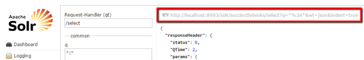

图 24:点击打开查询

现在，让我们快速看一下响应，它由几个部分组成，可以包括以下内容:

*   **响应头:**包括状态、查询时间和参数。
*   **结果:**包括从搜索引擎返回的与文档子部分中的查询相匹配的文档。
*   **方面:**项目或搜索结果分组到类别中，允许用户在特定的搜索结果中细化或向下钻取。每个方面还显示搜索中匹配每个特定类别的点击次数。

我鼓励你玩一玩，尝试一下查询部分；这是你了解 Solr 最多的地方。

下图显示了典型响应的外观:

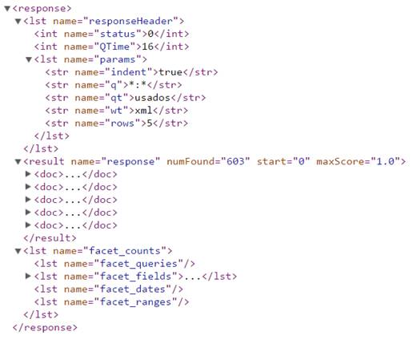

图 25:Solr 响应示例

#### 分身术

使用主节点和从节点的复制是 Solr 中的旧扩展方法。复制屏幕允许您启用或禁用复制。它还向您显示当前的复制状态；在 Solr 中，复制仅用于索引。

复制已被 SolrCloud 取代，后者提供了扩展 Solr 解决方案所需的功能。但是，如果您仍在使用索引复制，可以使用此屏幕查看复制状态。

#### 模式浏览器

模式浏览器显示模式数据。当从分析窗口打开时，它会加载特定的字段，或者，如果直接打开，您可以选择一个字段或字段类型。如果您单击加载术语信息，它将显示该字段索引中的顶端术语。如果您单击某个术语，您将进入查询屏幕，查看该字段中该术语的查询结果。

如果某个特定字段有术语，您可以加载该字段的术语信息。直方图将显示该字段中给定频率的项数。这在开始时可能有点混乱，但在以后会非常有用。

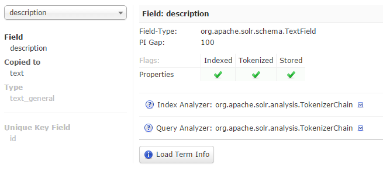

图 26:模式浏览器

### 总结

我们已经完成了管理界面的快速浏览。目的是向您提供管理用户界面的许多不同组件的概述，并解释它们的用途。

这个旅程的下一步是了解我们如何根据 Solr 的需求对数据建模，为此，我们将使用提供的样本数据。**