# 四、你的第一个索引

## 索尔的样本数据

此时，您应该有一个正在运行的 Solr 实例，并且对管理用户界面中可用的工具有很好的理解。现在，是时候让 Solr 为我们工作了。

首先打开命令提示符，导航到位于**内的`exampledocs`文件夹。**如果你关闭了你的 Solr，用`java -jar start.jar` `.`再次启动它，但是确保你在不同的命令提示符下这样做，因为你需要在 Solr 运行时输入第一个命令。

在`exampledocs`中，有几个带有样本数据的 CSV 和 XML 文件准备进行索引，该分发包括一个简单的命令行工具，用于将数据发布到 Solr，称为 *post.jar* 。有关用法的说明和示例，请使用以下命令:

```
      Java -jar post.jar -help

```

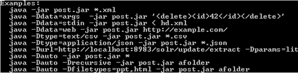

图 27:post . jar 的帮助

在开始索引任何文档之前，让我们首先确认索引中没有任何文档。一种方法是导航到管理界面，从核心选择器中选择`collection1`，然后点击**查询**。然后，在该部分的底部，单击**执行查询**或单击任何非多行文本框，并按回车键。

总而言之，这是相当多的步骤——然而，有一个更快的方法。通过其 RESTful 界面直接导航到 Solr，查询所有文档。这不会使用管理用户界面；它将只运行查询。网址如下所示:

```
      http://localhost:8983/solr/collection1/select?q=*%3A*&wt=json&indent=true

```

正如您在结果中看到的，我们的索引中没有文档。

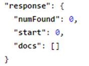

图 28:索引中没有文档

上传样本数据的时间。在命令提示符下的`exampledocs`中，键入:

```
      Java -jar post.jar *.xml

```

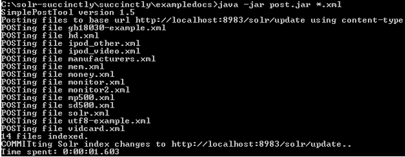

图 29:开机自检示例文件

所有提供的 XML 文件都已直接发布到我的索引中并已提交；这一切都是由 POST 工具自动完成的。还值得注意的是，许多人犯的一个简单错误是他们将数据发布到索引中，但忘记提交。只有当您记得执行提交时，数据才可用于搜索；但是，由于 post 工具会自动为您执行此操作，因此这是一个您通常不会犯的错误。

Post.jar 只是索引文档的一种方式。另一种机制是数据导入处理程序，它允许连接到数据库，并以完全或增量爬网方式导入数据。您还可以通过管理界面中的文档部分添加 XML、JSON、CSV 或其他类型的文件。此外，您可以使用一个客户端库，如 SolrNet 或 SolrJ，并且有多个内容处理工具可以将文档发布到 Solr 索引。我看到一直在使用的是搜索技术公司的 ASPIRE，它有一个 PostToSolr 功能。

切换回浏览器，再次运行默认查询。您现在应该在索引中看到 32 个文档。下图显示了您现在应该获得的输出，让您熟悉 Solr 响应。

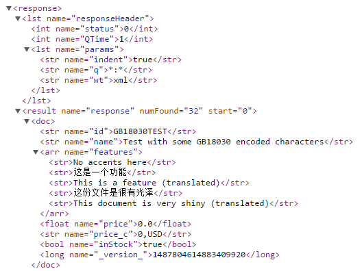

图 30:索引文档示例

此时，您已经运行了几个查询，这相当于要求您的搜索引擎执行一个基本查询。您可以通过两种方式做到这一点:首先是使用管理用户界面中的查询部分，其次是使用 Solr 的 RESTful 界面。


图 31: Solr 查询

## 查询和响应的简单剖析

### 查询

如果你选择了一个核心，点击**查询**，按**进入**，你会看到一个查询和一个回复。在本节中，我们将通过使用刚刚上传到`collection1`中的样本数据，开始真正了解实际发生的事情。

|  | 提示:如果您的浏览器支持 XML 格式(就像谷歌 Chrome 一样)，您可以进行快速更改以提高可读性。请在浏览器中打开响应，在 URL 中查找 wt=json 参数，然后更改为 wt=xml。wt 是响应编写器，它告诉 Solr 如何格式化响应。试试看。 |

正如我们到目前为止所看到的，Solr 使用了一个相当标准的 RESTful 接口，它允许您轻松地看到用于进行查询的 URL 像任何标准的 URL 一样，它由主机名、端口号和应用程序名组成。

查询的请求处理程序(在这种情况下，我们使用 select)是默认的请求处理程序，是“Hello World”的 Solr 等价物示例文档的默认查询由以下网址参数组成:

| 统一资源定位器 | 描述 |
| --- | --- |
| 页:1 | 这是托管 Solr 的网址。 |
| /collection1 | 网址的第二部分表示您当前正在处理的集合。假设在一个服务器中可以有多个集合，您需要指定要使用哪个集合。信不信由你，在某个时候，Solr 只能托管一个集合。 |
| /select？ | 下一个网址部分指出您正在使用哪个请求处理程序。Select 是用于搜索的默认处理程序。当您想要修改数据而不是查询时，也可以使用/update。可以根据自己的需要来打造自己的。 |
| q=*%3A*&wt=json&indent=true | *之后的一切？*是查询参数。像任何网址文本一样，它需要使用正确的网址编码规则进行正确的转义。 |

和任何技术一样，学习和理解的最好方法就是玩它；想象一下，Solr 的默认安装就是你的大数据和企业搜索训练轮。打开管理用户界面，更改参数，并查看您的结果是如何修改的，以及您的更改对搜索有何影响。一旦你尝试了一些查询并对它们的工作原理有了感觉，你就可以继续前进了。

### 回应

运行查询时，您得到的响应将包含两个完整的部分:

*   应答标题
*   反应

您可以在下图中看到一个示例:

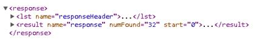

图 32: Solr 响应

`ResponseHeader`包含响应本身的信息。状态告诉你结果；`0`代表 *OK* 。如果您查询一个不存在的请求处理程序，您会得到一个 404 响应代码作为 HTTP 响应。

ResponseHeader 还包括 QTime，这是查询执行时间和参数的回显。

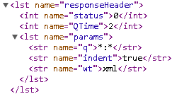

图 33:响应头

响应部分包括在*文档*子部分或节点中匹配您的查询的那些文档的结果。它包括一个指示有多少文档与您的查询匹配的`numFound`，以及用于分页的 *start、*。

#### 其他回应部分

*   **突出显示:**允许在响应中显示与用户查询相匹配的文档片段。
*   **facet_counts:** 显示为结果列表构建的面，包括填充每个字段的面字段和面值(带计数)。
*   **拼写检查:**将包括对用户查询中可能的拼写错误的建议。
*   **调试:**用于开发调试。仅当指定为查询的一部分时才包括。在其子部分中，它包括`explain`以了解每个文档如何根据相关性排序算法进行评分，以及`timing`以了解每个组件处理所需的时间。在`parsedquery`中，它显示查询字符串是如何提交给查询解析器的。

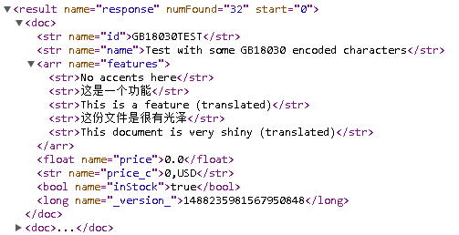

图 34:Solr 文档

#### 文档和数据建模

此时，您可能想知道我们如何在 Solr 中建模数据。这就是主要配置文件之一发挥作用的地方——您对数据建模，并向 Solr 指定如何在 Schema.xml 文件中处理它。下图显示了一个示例。

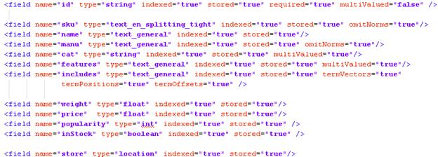

图 35:示例文档模式

每个文档都有一组字段，每个字段可以是不同的类型。在我们刚刚上传的文档的这个具体示例中，我们可以看到我们有`id`、`sku`、`name`、`manu`、`cat`、`features`、`includes`、`weight`、`price`、`popularity`、`inStock`和`store`。

该模式还包括一系列通用元数据字段，这些字段的名称是专门为匹配 Solr Cell 元数据而命名的。

|  | 注意:Solr Cell 是一种功能，它允许将丰富的文档(如 Word 或 PDF 文档)直接发送到 Solr 进行解析、提取和索引以进行搜索。我们不会在这本书里讨论索尔。 |

打个比方:如果你熟悉数据库，那么一个文档对应一行。名称将是列名，类型也是一样的——它指示将在该特定字段中存储什么类型的信息。必选表示它是否是强制的，就像在结构化查询语言中指定*不为空*一样。

在这种特殊情况下，标识就像主键一样，是文档的唯一标识。不是绝对要求，但强烈推荐。您可以在 *<* `uniquekey` *>* 中指定哪个字段是模式中的主键。


图 36:唯一的密钥标识

现在我们来看一些细节:

*   Indexed="true|false "用于指定该特定字段是可搜索的。必须将其添加到索引中才能进行搜索。
*   Stored="true|false "刚开始可能难以下咽。如果指定不存储字段，则无论何时运行查询，都不会返回该字段的原始值。然而，有一点非常重要。您可以将字段设置为 stored =“false”和 indexed =“true”，这意味着您可以对数据进行索引，但该字段的数据本身不会保存在 Solr 中，因此您不能将其提取为结果的一部分。

|  | 注意:虽然这看起来有点违背直觉，但实际上有一个非常简单的原因。让我们假设您有一些非常大的字段，并且您不关心检索全文；例如找到哪些文档包含搜索到的特定术语。这为您提供了一个内存占用非常少的快速搜索解决方案，允许客户端自行检索大量数据。 |

*   多值=“true | false”表示是否要在同一个字段中保存多个字段。例如，如果一本书有多个作者，那么所有作者都将存储在一个字段中。

Solr 支持许多不同的数据类型，这些数据类型包含在 Solr 运行时包中。如果你想获得非常技术性的东西，它们位于 **org.apache.solr.schema 包**中。

以下是根据 Solr 的 wiki 提供的列表:

| *   【bcdintffield】*   【bcdlongfield】*   【bcdstrfield】*   【二进制字段】*   【布尔菲尔德】*   Byte field | 

*   Furong Tian
*   【ICU 小吃场】
*   【国际机场】
*   【latlontype】
*   【长字段】
*   【点型】

 | 

*   [Output long field]
*   【 spatial recursive prefix tree field type 】
*   【字符串字段】
*   【textfield】
*   【tridatefield】
*   【tridatefield】

 |

值得一提的是，有一种叫做无模式的东西，它允许您添加数据而不需要对其建模，以及动态字段。我们不会在这本书里讨论它们。

### 玩弄索尔

对于我们的第一个 Solr“Hello World”查询，我们只需查找*:*，这意味着所有字段的所有值，这将返回所有 32 个文档。让我们把赌注提高一点，玩一些查询，改变不同的参数。我们不会变得太复杂；我们将只展示几个例子来帮助您理解 Solr 的一些基本功能。

#### 一个带有方面的“真实”查询

在本例中，我们将运行 **:** 的特定查询，并要求包含方面。

使用管理界面中的核心下拉菜单，选择**收藏 1** 核心，在 **q** 字段中键入**视频**，检查**方面**，并选择 **xml** 作为响应编写器(`wt`)。输入`manu`作为方面字段，使用**执行查询**按钮执行查询。

应该是这样的:

| 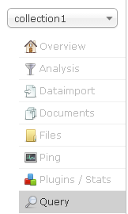 | 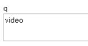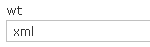 | 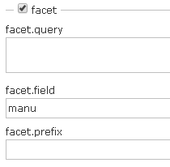 |

图 37:运行查询

有两件事肯定会在回应中脱颖而出。首先，你只会看到相关的结果；在这种情况下，匹配了三个文档，而不是 32 个。


图 38:找到了三个文档

更重要的是，你现在可以看到`manu`的刻面。稍后我们将详细讨论方面，但现在请查看`facet_fields`中名为`manu`的列表，其中包含所有制造商的列表，从最高发生率到最低发生率排序。它包括名字和计数。方面也称为导航器，它们允许深入特定的结果集。在这个例子中，考虑到列表很长，我加入了一个省略号(…)，表示还有很多结果，主要是`0`值；你可以在下图中看到这一点。

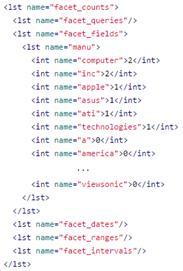

图 39:面

#### 菲尔茨

目前，我们正在返回所有字段，这可能有意义，也可能没有意义，这取决于您的具体需求。如果需要将所有字段提供回应用程序，那么就不需要使用`fl`(字段)输入。如果您希望较小的响应有助于提高性能，尤其是在使用大型文档时，只需包含您希望在 fl 中返回的字段列表。只需用空格或逗号分隔输入即可。这也有助于测试查询时的可读性。

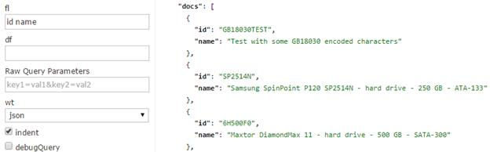

图 40:返回特定字段

一个非常简洁有用的技巧是将*评分*作为一个字段，它将告诉您结果集中的评分(或文档的相关性)。尝试将查询添加到以前的搜索中；我会添加`q=drive`，包含`score`字段，执行并分析结果，如下图 fl 字段所示。

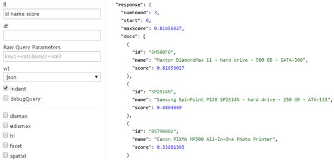

图 41:包含分数作为字段

结果按得分从高到低排序，或从最相关到最不相关。当然，如果没有应用其他排序的话。

#### 整理

为了利用选择显示哪些字段的能力，让我们尝试排序。对查询进行排序是一个非常简单的过程——只需输入要排序的字段，然后选择`asc`(升序)或`desc`(降序)，如下图所示。

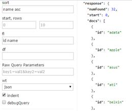

图 42:升序排序

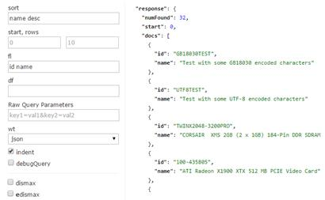

图 43:降序排序

您也可以一次对多个字段进行排序。为此，只需指定字段名、排序方向，然后用逗号分隔这些组。例如:`name desc, id asc.`

分页:开始和行

您可以使用“开始”和“行”向应用程序添加分页。Start 是您要返回的第一条记录的偏移量。例如，如果运行查询，默认情况下会返回 10 个结果。您知道您想要第二页，所以您运行了相同的查询，但是 start=11，rows = 10，因此生成的第二页也包含 10 个结果。[****【1】****](10.html#_ftn1)

了解查询(q)和过滤查询(fq)之间的区别

我已经提到了 q 是如何根据相关性计算结果的，fq 只是用来向下钻取的。我还提到 fq 在性能方面非常高效；这样做的原因是过滤器查询缓存结果并且只存储 id，使得访问非常快。既然我们已经学会了如何为我们的结果打分，我们就可以证明事实确实如此。

做到这一点的步骤非常简单:

1.  打开两个窗口，在每个窗口中，在管理用户界面中导航到集合 1 的查询部分。您将在两个窗口中运行。记下驱动器，并在`fl`部分包括以下四个字段:id 名称 cat score。为了可读性，如果你的浏览器支持很好的 XML 格式，请将`wt`改为`xml`。

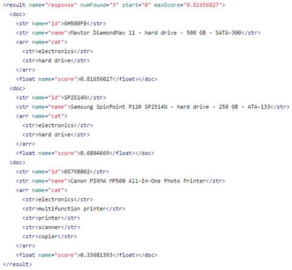

图 44:查询驱动器

2.  当您执行查询时，您将获得三个结果，其中两个结果属于“硬盘”类别

我们刚刚使用 q 字段运行了一个查询。现在让我们使用 fq 来运行一个新的查询。目的是证明 q 和 fq 如何以不同的方式影响查询。底线是 q 影响排名，而 fq 不影响。理解这种差异是极其重要的，因为错误地使用它们会带来不符合实际的结果。

询问

请在两个窗口中重新加载管理用户界面，以便我们可以从干净的查询页面开始。

在其中一个窗口中，在 q 输入框中添加以下查询:drive AND cat:“硬盘”。注意大写，记住在 fl 部分包括以下四个字段:id 名称 cat score。您的查询应该如下所示。

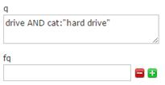

图 45:没有过滤器查询

您的结果应该如下所示:

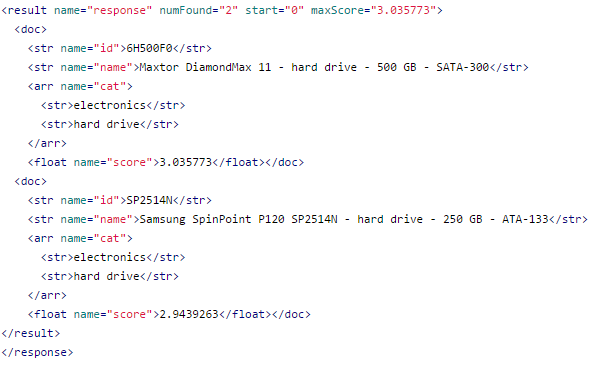

图 46:没有过滤器查询响应

过滤查询

在另一个窗口中，设置 q=drive，并在 fq 中添加 cat:“硬盘”。像以前一样，在 fl 部分包括四个字段:id 名称 cat score。您的查询应符合以下条件:

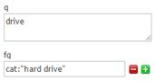

图 47:查询和过滤查询

您将获得以下结果:

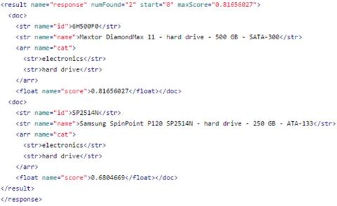

图 48:查询和过滤查询响应

看反应结果，使用`'fq'`不影响评分。第一次跑的时间最长，第二次跑的更快。使用`'fq'`的第三次运行没有任何变化，显示 Solr 刚刚返回了之前查询已经缓存的结果。

| 元素/分数 | q =驱动 | q=drive& fq=cat=“硬盘” | q =驱动器和卡特彼勒=“硬盘” |
| 6H500F0 | **0.81656027** | **0.81656027** | 3.035773 |
| SP2514N | **0.6804669** | **0.6804669** | 2.9439263 |
| 0579B002 | 0.33681393 | - | - |

### 总结

在本章中，您已经学习了如何加载 Solr 的示例文档以及如何运行一些简单的查询。我们已经讨论了简单查询和响应的剖析，最后，证明了 q 和 fq 在排名方面的区别。在下一章中，我们将继续学习如何为自己的文档创建一个模式。